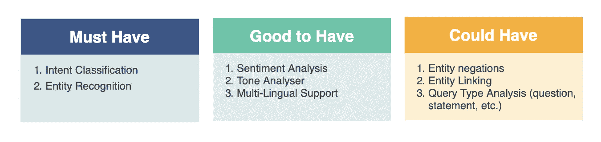

# 揭秘聊天机器人 NLU(聊天机器人时代)

> 原文：<https://medium.com/analytics-vidhya/demystify-chatbot-nlu-era-of-chatbots-cee020e92f8f?source=collection_archive---------14----------------------->

近年来，聊天机器人或数字助理受到了极大的炒作，在后大流行时代，数字助理可能会成为一种新常态。在这篇博客中，我将试着解释聊天机器人的主要组件是什么，以及这些组件如何共同用于各种推理任务。

# **理解对话**

聊天机器人的第一步也是最重要的一步是理解对话。为了更好地理解一个查询，我们首先需要确定，“**用户在问什么？**“，”**用户提供了哪些信息？**、**语境是什么？**"、**用户的语气或情绪是什么？**”

其中最重要的是“**用户在问什么？”、**或**意图(用户的意图)。**

## **什么是“意图”？**

意图是机器人用户的意图。它用于理解用户想要做什么。

假设您正在为银行领域构建一个 bot，bot 用户需要**检查他们的帐户余额**或**查找最近的分行**，这些可以分别表示为类似于“**检查余额”**或“**查找分行”**的意图。这些意图连同提取的其他**实体**或**特征**(给出更多上下文)，被推理引擎用来采取适当的行动。

有许多方法可以识别查询的意图，

**基于规则的方法**:使用基于各种语言特征(如 POS 标签、词条)或正则表达式模式的模板或规则。

**机器学习方法**:使用机器学习技术，如 SVM、NB、逻辑回归或任何高级神经网络方法，以及**嵌入**来捕捉更多的上下文或机器人用户的含义。

意图可用于采取不同的行动，如信息检索、工作流执行、闲聊(闲聊)。

聊天机器人的 NLU

**参考文献**

 [## 意图检测和槽填充

### 意图检测和槽填充是通过提取意图和槽填充来解释用户命令/查询的任务

nlpprogress.com](http://nlpprogress.com/english/intent_detection_slot_filling.html) 

## **什么是“实体”？**

实体是机器人用户查询中的关键信息，检测这些关键信息并将其分组为预定义类别的过程称为**命名实体识别(NER)。**

电脑:斯帕西 NER 演示

这些实体为查询的意图提供了更多的上下文，例如，类似于**“寻找一家供应中国**【菜肴】**食品的餐馆”、**的查询，这里的意图将是“寻找餐馆”，而实体将是“菜肴”是“中国”。一旦我们知道了意图和菜系，这个信息就可以被推理机用来检索**餐馆**供应**中国**菜系。

有多种方法可以提取实体，如基于序列的 Regex 实体(使用 [**BILOU**](https://lingpipe-blog.com/2009/10/14/coding-chunkers-as-taggers-io-bio-bmewo-and-bmewo/) **，**或 [**IBO**](https://en.wikipedia.org/wiki/Inside%E2%80%93outside%E2%80%93beginning_(tagging)) 技术)。在多个域中有许多预定义的实体，可以使用多种语言，如名称、组织、位置等。

**参考文献**

 [## 将组块编码为标签:IO、BIO、BMEWO 和 BMEWO+

### 我已经完成了一阶线性链 CRF 标记器的实现和一系列相关的归纳…

lingpipe-blog.com](https://lingpipe-blog.com/2009/10/14/coding-chunkers-as-taggers-io-bio-bmewo-and-bmewo/)  [## 命名实体识别

### 命名实体识别(NER)的任务是用相应的类型标记文本中的实体。方法…

nlpprogress.com](http://nlpprogress.com/english/named_entity_recognition.html)  [## 实体链接

### 实体链接(EL)的任务是识别(参见命名实体识别)和消除歧义(命名实体…

nlpprogress.com](http://nlpprogress.com/english/entity_linking.html) 

## 语境是什么？

与基于搜索的检索不同，对话通常在多个对话中进行，因此跟踪和理解当前对话当前所处的上下文非常重要。

上下文管理在机器人的用户体验和智能方面起着至关重要的作用。

假设您一直在查询您的汽车保险，而机器人需要许多细节，如汽车细节、注册号等。为了完成一个动作，需要填充哪些实体或者 bot 术语中的槽位。这些槽通常是在机器人用户和机器人之间的对话中提取的，机器人需要维护这些槽以及上下文中的汽车保险主题，以便机器人可以采取必要的行动。

在上下文中理解和响应并不是上下文管理的唯一重要部分。它还需要管理用户的**上下文切换**或突然**脱离上下文**对话框。就像机器人应该如何对来自用户的意外(脱离上下文)响应做出反应，如果它应该向用户澄清上下文或改变上下文，并提示用户他之前丢失了上下文以及他是否想恢复它。这可能会使机器人用户体验更具吸引力。

## **用户的语气或情绪是什么？**

总是分析用户的情绪和语气是很重要的，比如用户是积极的还是消极的，以及用户是生气、高兴、悲伤等等。因此，如果用户感到沮丧或用户无法在机器人中获得他想要的东西，机器人可以控制对话。

查询“我讨厌你的客户支持”的语气分析。PC:cogn-wide NLP API

如果机器人可以跟踪这些特征，那么对话管理器可以被配置为采取必要的步骤来控制机器人的动作，或者给机器人用户更多的感同身受的响应。

**参考文献**

 [## 情感分析

### 情感分析是对给定文本的极性进行分类的任务。IMDb 数据集是一个二元情感…

nlpprogress.com](http://nlpprogress.com/english/sentiment_analysis.html) 

## **结论**

这是聊天机器人中各种语言理解组件的非技术性概述。专家系统共同使用上述所有组件，以更像人类和更有同理心的方式做出响应。

**查看一些在聊天机器人中实现 NLU 的参考资料**

**一些工具和框架** : [抱脸](https://huggingface.co)，[空间](https://spacy.io)， [NLTK](https://www.nltk.org) ，[门](https://gate.ac.uk)， [scikit-learn](https://scikit-learn.org/stable/) ，[张量流](https://www.tensorflow.org)， [PyTorch](https://pytorch.org/tutorials/beginner/deep_learning_nlp_tutorial.html)

**有趣的博客和频道** : [TrevTutor](https://trevtutor.com/linguistics/) (语言学) [StatQuest](https://statquest.org/) (统计学) [3blue1brown](https://www.3blue1brown.com/) ， [nlp-progress](http://nlpprogress.com/)

**数据集和笔记本** : [大坏 NLP 数据库](https://datasets.quantumstat.com/)， [Kaggle](https://www.kaggle.com/datasets)

**聊天机器人平台:** RASA，Kore AI，Google Dialog Flow，CogniAssist，IBM Watson，Wit ai

## 下面是其他一些主要特性，我们将在后面讨论。

1:推动对话(对话和上下文管理)

2:信息检索

3:知识管理(领域信息和文档)

4:推理机/专家系统

5:渠道支持和社交媒体存在

6:语言支持和跨语言理解