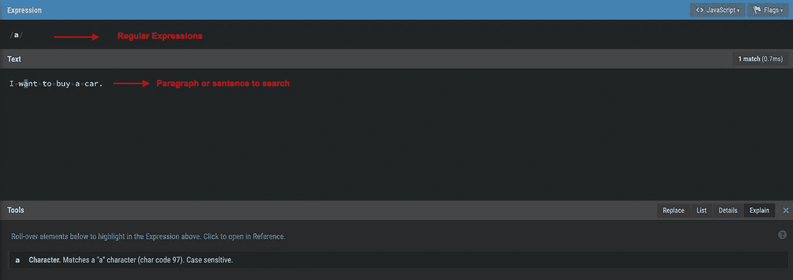
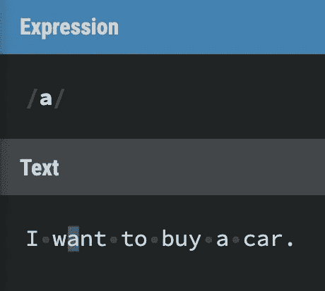
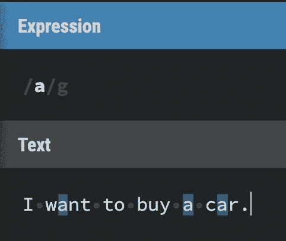
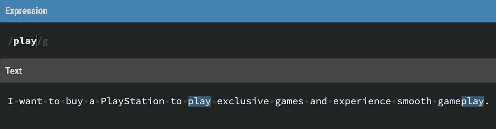
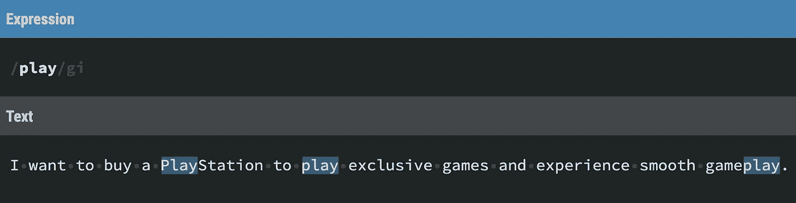
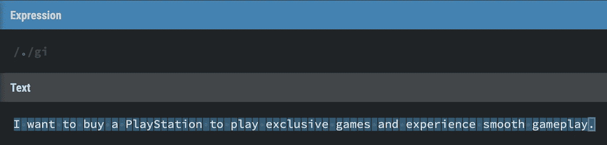

# 揭开正则表达式的神秘面纱第 1 部分

> 原文：<https://medium.com/analytics-vidhya/demystify-regular-expressions-part-1-89236b1501f7?source=collection_archive---------12----------------------->

## 正则表达式的实用方法

曾经想要在一个很长的段落中搜索不同的电子邮件地址，只有一个特殊的字符串或以元音或 URL 开头的单词？如果你很聪明，那么你的答案肯定是**是**。但下一个问题是，如何用一个字符串搜索不同类型的电子邮件地址或 URL？正则表达式来帮忙了。

正则表达式是任何开发人员或计算机程序员都必须掌握的技能。它们允许您定义可用于各种任务的文本模式。您可以验证用户提交的数据，您的代码可以从较长的字符串中提取部分内容，您可以使用它们将数据转换为新的格式。它们甚至使搜索您自己的代码变得更加容易。

由[马库斯·斯皮斯克](https://unsplash.com/@markusspiske?utm_source=medium&utm_medium=referral)在 [Unsplash](https://unsplash.com?utm_source=medium&utm_medium=referral) 上拍摄的照片

# 目标

这是系列文章的第一部分。本系列的目的是让您了解正则表达式是如何工作的，并在本系列结束时帮助您减少输入，使您的搜索查询更加健壮。在这一部分中，您将学习正则表达式的基本概念，并处理一个小问题。在整个系列中，您将使用站点 [RegExr](https://regexr.com/) 来验证和测试您创建的所有正则表达式。

regexr.com

# 目录

1.  元字符
2.  通配符元字符
3.  转义元字符
4.  特殊字符
5.  挑战

# 元字符

在我谈论元字符之前，我们将从最简单的匹配开始学习正则表达式的语法，一个文字字符。如果您想在一个句子中搜索字符 **"a"** ，您只需在 [RegExr](https://regexr.com/) 站点的表达式部分中写下 **"a"** ，并在文本区域中写下该句子。您应该会看到以下输出:

这里 **/a/(** forward 和反斜杠是 Javascript 中一个正则表达式的开始和结束)是一个正则表达式，匹配字符串**“want”**中的字符**“a”**。但是同一个字符又出现了两次，所以不匹配。如果您想进行全局搜索并找到正则表达式的所有出现，您需要从右上角的下拉菜单中打开**全局**标志。打开标志后，您将看到以下输出:

全球旗帜打开

让我们试试另一个，写一个正则表达式，在句子中搜索单词**“play”**:

> 想买个 PlayStation 玩独占游戏，体验流畅的游戏玩法。

结果如下:

你在上面的搜索结果中注意到什么了吗？regex 未能匹配单词PlayStation 中的**【Play】**。正则表达式区分大小写，要改变这一点，您需要从右边的下拉菜单中打开不区分大小写标志。现在，您将获得如下结果:

我不敏感

现在我们来谈谈元字符，一个有特殊含义的字符就是元字符。元字符可用于将文字字符转换成强大的表达式。您只需要学习几个元字符。让我们用例子来了解其中的一些。

# 通配符元字符

这个元字符在正则表达式中最常用。用**表示。**(点号)符号。它匹配除新行之外的任何字符。来试试吧，放个**。在 RegExr 站点的表达式部分中输入“T13”(点)符号，并在文本部分中输入任何内容。您将看到以下结果:**

通配符元字符

正如你在上面看到的，它匹配句子中的所有字符。现在写一个匹配 **get，got** 和 **git 的正则表达式。**现在，为了解决这样一个问题，让我们将解决方案分成几个步骤:

1.  打开 RegExr，在文本部分写下这三个词。
2.  搜索每个单词中的常用字符有哪些？常见的字符有 **g** 和**t。**先把那些字符写在表达式部分。
3.  如您所知，通配符元字符匹配任何单个字符。放在表达式部分的 **g** 和 **t** 中间。现在这三个字都突出显示了。

## 试验

将单词 **great** 添加到文本部分，看看它是否被高亮显示？不，不是因为通配符只匹配一个字符，这是需要记住的重要事情。如果要匹配单词 **great，**需要使用 **/g…t/** 作为正则表达式。在接下来的系列文章中，您将了解重复以及如何避免为单词中的每个字符重复添加通配符元字符。

## 通配符的一个常见错误

这可能是最常用的元字符，也是人们最常犯的错误。打开 regexr，在文本部分写入 **109** 、 **159** 和 **1.9** 。现在，写一个只匹配 **1.9** 的正则表达式**。**

这很简单，你很可能会把 **/1.9/** 写成正则表达式。但是你注意到了吗，它匹配了 1.1 包括 109 和 159。你知道为什么吗？这里**。**(点)是通配符元字符，匹配 1 到 9 之间的任何字符。解决这个问题，你就躲过了**。**(点)使其行为像文字字符而不是通配符元字符。我们将在后面的章节中更多地讨论转义字符。现在在**前面加一个反斜杠(元字符)。**(正则表达式中的点号)。现在只会匹配 **1.9** 而不会匹配其他所有数字。

[https://giphy.com/gifs/jn1QTk0nnlojMjyvqa/html5](https://giphy.com/gifs/jn1QTk0nnlojMjyvqa/html5)

# 转义元字符

在上一节中，您使用另一个元字符，即反斜杠 **"\ "，将通配符元字符转换为文字字符。**这个元字符会将它后面的另一个元字符转换成文字字符，例如:`\.`或`\+`或`\?`等。请记住，你应该只转义元字符，而不要转义字面字符，否则会增加不同的含义，例如:`**\d**`或`**\w**`不再是字面字符，`**\d**`将查找数字，`**\w**`将查找单词字符。

这是给你的一个小挑战。写一个正则表达式来匹配这两个文件名:**starwar1.mp4****starwar2.mp4**而不是 **starwar3_mp4.rar.** 如果你第一次尝试就做对了，那真的很棒，但如果你没有，那就没问题了。查看以下 gif 以获得解决方案:

> 如果由于某些技术原因，您无法看到 gif，那么上述挑战的正确正则表达式是:`starwar.\.mp4`

# 特殊字符

在本节中，您将学习如何在空格、制表符和换行符中使用特殊字符。首先，让我们从空格开始，记住空格是一个字符，为了匹配一个空格，你将对字面字符' s '进行转义，即`\s`。你必须确保你使用的是小写字母 s。这里有一个小例子:

间隔符号

如果你想匹配一个制表符，你将使用`\t`。这里字符 t 不再是一个字面字符，因为你用一个元字符，比如反斜杠，对它进行了转义。`\t`通常被称为控制人物。让我们看看这个控制字符在字符串内的搜索选项卡中的用法:

控制字符

在上面的 gif 中，你可以看到一个标签用→有趣的是，如果你添加连续的空格来代替制表符，控制字符将不会把它检测为制表符。

接下来是匹配新行，您将使用特殊字符`\n`。您将再次对字面字符“n”进行转义。这也称为换行符。请注意，在某些环境下，Linux 使用`\n`作为新的产品线，Windows 使用`\r\n`和旧的 MAC 使用`\r`。所以写换行符有多种方法。我相信 [RegExr](https://regexr.com/) 托管在 Linux 服务器或 Windows 服务器上。下面是如何以及何时使用`\n`的一个小演示:

在上面的 gif 中，你可以看到一个新的行用一个向下的箭头表示。

# 挑战

在本教程中，向您介绍了许多关于正则表达式的小而有趣的概念。在你离开之前，确保你已经巩固了这里的概念，这是一个小挑战，将触及所有的概念。

1.  编写一个正则表达式，它将匹配以**mail.com**结尾的单词:
    **gmail.com，hotmail.com，****yoomail.com，s@rmail_com.com
    注意:**在编写正则表达式之前，删除`**,**` 。
2.  写一个正则表达式，它将匹配以下单词:
    **SaGaR** ， **sagar** ， **SAGAR**
    **注意:**在编写正则表达式之前，删除`**,**` 。
3.  编写一个正则表达式，匹配单词 **Alex** (不区分大小写):他的名字是 Alex。亚历克斯是一个开发人员！亚历克斯喜欢写博客，alexa 是一名助理。

# 下一步是什么？

我希望您喜欢这个正则表达式系列的第一部分。在下一部分中，我将介绍更多的主题，这些主题将使您接近成为正则表达式方面的专家。

您可以在推特上发布您对上述挑战的回答，并在推特上提到我，这样我就可以查看这些回答并讨论这些回答是否可以做得更好😄。可以在 [**Twitter**](https://twitter.com/SagarSuri94) 关注我，通过 [**LinkedIn**](https://www.linkedin.com/in/sagar-suri) **连接。**如果你喜欢这篇文章，那么请不要错过👏 👏 😄。