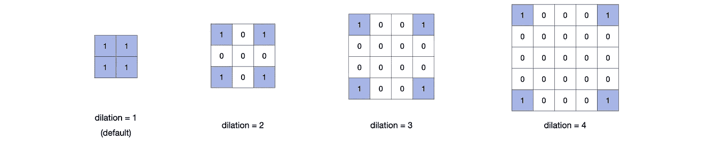

# 揭开转置卷积层的神秘面纱

> 原文：<https://medium.com/analytics-vidhya/demystify-transposed-convolutional-layers-6f7b61485454?source=collection_archive---------15----------------------->

转置卷积层广泛应用于自动编码器和生成对抗网络(GAN)中，作为一种数据上采样的方法。

这是一个简单的概念，但在我的学习过程中，我被大量不一致的材料搞糊涂了。因此，我想创建这个教程，使用动画和 PyTorch 代码来清楚地解释转置卷积层的参数和数学。所有源文件都在我的 [**Github Repo**](https://github.com/RyC37/Demystify-Transposed-Convolutional-Layers) 上。

**鸣谢:**动画设计的风格灵感来源于[**conv _ 算术**](https://github.com/vdumoulin/conv_arithmetic) 。(虽然，它在我的学习过程中让我很困惑。)

## **1。默认情况**

先说最简单的情况。

图一。默认情况。

图 1 显示了转置卷积层的计算过程，其中 *kernel_size* 为 3，其他参数设置为默认值。输入(2x2)和输出(4x4)的尺寸很容易识别。

下面是一步一步的计算过程。如动画所示，生成最终输出有 4 个步骤。

图二。基本情况的计算步骤

让我们使用 PyTorch 来验证相同的计算:

## 2.进展

接下来，我们将更改参数**步距**，其他一切与第一种情况相同。

[PyTorch 文件](https://pytorch.org/docs/stable/nn.html#convtranspose2d)指出:

> `stride`控制互相关的步距。

该文件仅供参考。就我个人而言，一开始我并不理解。但是下面的可视化应该是清楚的。stride 的默认值是 1，这里我们将 stride 设置为 2。

图三。将参数步幅设置为 2

你可以看到，在每个乘法步骤之后，核矩阵水平移动 2 步，直到到达终点，然后垂直移动 2 步，从头开始。

让我们看看计算过程:

图 4。步幅= 2 时的计算步骤

让我们用 pytorch 来验证一下:

## 3.填料

我们将继续基于步幅情况进行构建，这次我们将参数**填充**更改为 1。在以前的情况下，填充具有默认值 0。

图五。将参数填充设置为 1。

在这种情况下，最终输出是中心 3×3 矩阵。你可以把它解释为，在计算之后，丢弃矩阵的边界单元。你应该可以想象，如果我们设置填充等于 2，结果将是中心单元格(1x1)。

图六。步幅= 2、填充= 1 时的计算步骤

图 6 显示了计算过程，正如您所看到的，它几乎与图 4 相同。唯一的区别是我们“移除”了外层细胞。

让我们看看 PyTorch 是否同意我们的观点:

## 4.输出填充

是的，我们有另一种衬垫。他们的区别很简单:

> 输出填充向输出的一侧添加单元格，而填充从输出的两侧移除单元格。

图 7。将 output_padding 设置为 1。

在这种情况下，我们将参数 **output_padding** 设置为 1(默认为 0)，将 **stride** 设置为 2。如图 7 所示，输出矩阵的一侧添加了单元格，其值为 0。

如果您对此有任何理解上的困难，请随意比较图 7 和图 3。

下面是计算步骤:

图 8。output_padding = 1，stride = 2 时的计算步骤

我们再和 PyTorch 确认一下。

## 5.扩张

**膨胀**影响内核矩阵的结构。

PyTorch 文档指出，

> `dilation`控制内核点之间的间距；

我不知道我第一次看到这个是什么时候，因为它非常抽象。然而，看看图 9，您也许能够理解它。为了使事情变得简单，我们在这个例子中使用 2x2 内核。(在前面的例子中，我们使用的是 3x3 内核。)

图九。具有不同膨胀值的核矩阵。

上面是不同膨胀值的核矩阵的样子。基本上，如果膨胀值是 ***n*** ，那么内核矩阵就会被插入 ***n-1*** 单元格填充 0。在这一点上，不难想象对更大的核矩阵进行同样的变换。其余的计算与之前相同，如图 10 所示。

图 10。设置内核为 2，步幅为 2，膨胀为 2。

为了澄清，在图 10 中，我通过使 0 值的内核单元透明而忽略了它。

下面是计算步骤:

图 11。内核= 2、步距= 2、膨胀= 2 时的计算步骤。

下面是 PyTorch 的实现。

## **6。输出形状背后的数学运算**

最后，让我们通过推导输出大小的公式来结束本教程。如果您想更深入地了解转置卷积层，只需阅读这一部分，否则请随意跳过。

输出大小公式的为:

其中 **n** 为输出大小( **n** x **n** 矩阵)， **m** 为输入大小( **m** x **m** 矩阵)。此外，公式中有 5 个参数: **K** 为内核大小， **S** 为步长值， **P** 为填充值， **D** 为膨胀值， **P_out** 为输出 _ 填充值。

这看起来很复杂，但实际上很简单。让我们一步一步来看。

**(1)只考虑 S(步幅)和 K(内核大小)**

因为输入的大小是 m，所以我们有 m*m 步的计算。但是我们实际上只需要考虑前 m 步，因为前 m 步会固定输出矩阵的宽度。

我们可以想象随着计算的进行，输出会逐渐增加，如图 2，4，6，8，11 所示。

*   *在* ***第 1 个*** *步骤中，输出尺寸为* ***K*** *。*
*   *在* ***第二个*** *步骤中，中间矩阵移位由* ***S*** *，所以输出大小为****K+S****。*
*   *在* ***第三个*** *步骤中，中间矩阵由* ***S*** *，所以输出大小为****K+2S****。*
*   *在第* ***m-*** *步中，中间矩阵由***S 移位，所以输出大小为****(m-1)S****。**

*因此，如果我们只考虑 **S** 和 **K** ，则公式为:*

**

***(2)考虑 D(膨胀)***

*正如我们已经讨论过的，膨胀改变了内核的大小。这里，让我们用**K’**来表示变换后的内核大小。如图 9 所示，膨胀转换在内核中插入 **(K-1)(D-1)** 细胞。因此， **K'** 、 **K** 、 **D** 之间的关系应为:*

**

*因此，我们有:*

**

*将(2)中的 **K** 替换为**K’**，我们有:*

**

*现在我们差不多完成了，剩下的参数很容易理解。*

***(3)考虑 P(填充)和 P_out(输出 _ 填充)***

*由于填充删除了两边的单元格，所以它对输出大小的影响是- **2P** 。同样，output_padding 在 1 侧添加单元格，所以它对输出大小的影响是 **+P_out** 。将这些片段加入到(4)中，我们就得出了(1)。*

*本教程到此结束。感谢阅读！我希望本教程有助于您更深入地了解转置卷积层。*

*请随时留下评论。欢迎所有建议、问题！*