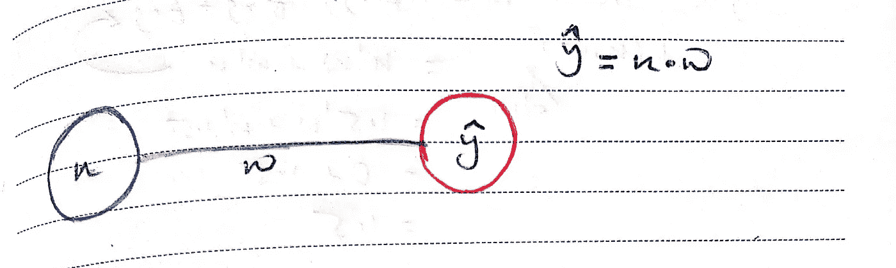
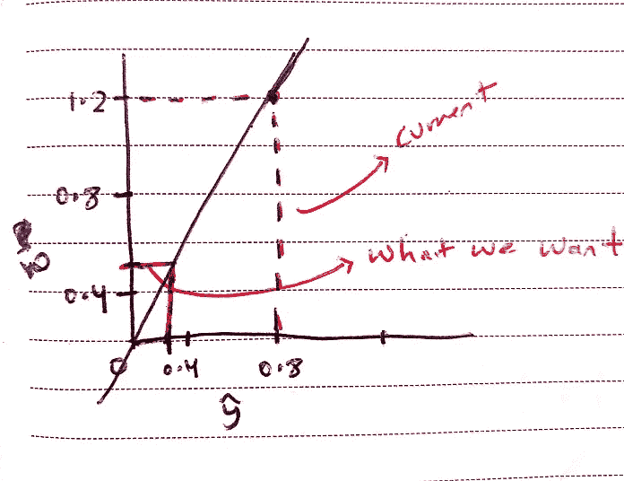
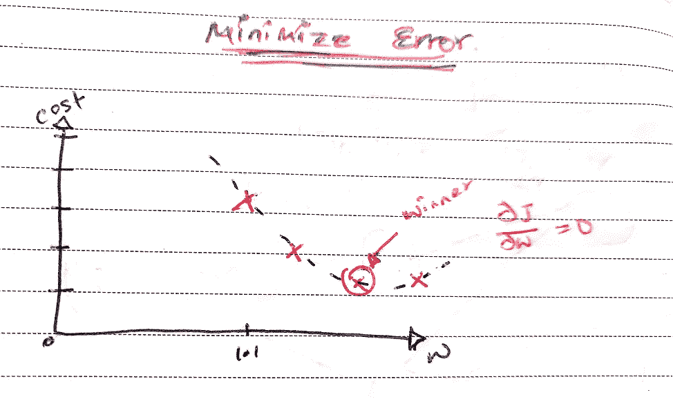
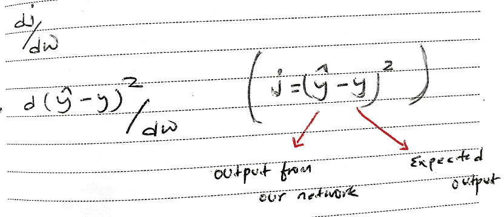
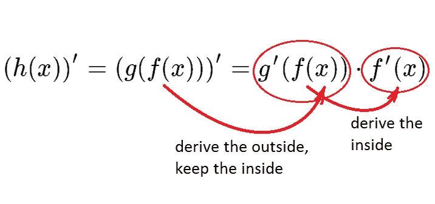
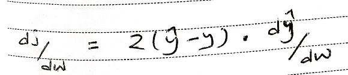

# 人工神经网络的核心学习算法:反向传播揭秘

> 原文：<https://medium.com/analytics-vidhya/demystifying-backpropagation-6d165a4d9bf3?source=collection_archive---------19----------------------->

## 打开黑盒

## 通过一个简单的例子理解反向传播算法的基本过程


[ [来源](https://deeplizard.com/images/ai-cyborg-cropped-2.png)

# 动机

最近在一次 ML 面试中，我被要求解释反向传播算法是如何工作的。

我没有准备好回答这个问题，也不知道从何说起。虽然我对它的工作原理有所了解，但那都是我想象出来的。我不知道从哪里解释，用什么例子。

因此，这篇文章背后的动机是以最简单的方式揭开反向传播算法的神秘面纱，以便像我们这样的 ML 初学者可以在采访中解释它，并理解该算法如何工作的底层过程。

# 先决条件

在开始之前，我假设您对人工神经网络的工作原理有所了解。

至少到你知道一个典型的神经网络结构是什么样子，以及输入层、隐藏层、突触、权重、偏差、输出层和成本函数的作用是什么的程度。😅

# 什么是反向传播？

如果你已经开始学习**机器学习**和**人工神经网络**，那么你可能会遇到术语**反向传播**。

让我们先来看看定义，了解它是什么，有什么作用:

> 反向传播是“误差反向传播”的缩写，是一种使用梯度下降的人工神经网络监督学习算法。—[Brilliant.org](https://brilliant.org/wiki/backpropagation/)

给定人工神经网络和误差函数，反向传播算法计算误差函数相对于网络权重的负梯度。

它是人工神经网络如何学习背后的核心算法。

如果已经有一段时间了，那么您可能已经理解了反向传播的目的。

在这篇文章中，我们不去关注它是什么，而是去理解它实际上是如何工作的，以及它为什么如此棒。

让我们用最简单的例子来理解它。

# 它是如何工作的？—尽可能简单

为了理解算法，让我们以具有一个输入层和一个输出层的简单人工神经网络为例。



它有输入( ***x)*** 与权重(***【w)***)和一个输出(***【ŷ】)***。

> **注意:**这里我们不打算使用任何隐藏层、激活函数或添加任何偏置单元。

因为我们没有任何隐藏层，也没有使用任何激活函数，所以我们的输出(***【ŷ】***)是输入 ***(x)*** 和权重 ***(w)*** 的乘积:

```
***ŷ*** *= x * w*
```

现在，假设我们的训练数据的输入(x)=1.5，预期输出(y)=0.5。

```
+-----------+--------------------+
|input(x)   | expected output(y) |
+-----------+--------------------+
| 1.5       | 0.5                |
+-----------+--------------------+
```

给定输入 1.5，我们期望我们的网络产生输出 0.5。

让我们用随机值 *w=0.8* 初始化我们的权重(w)，看看它会产生什么。

```
1.5 * 0.8 = 1.2+-----------+--------------------+---------------+
|input(x)   | expected output(y) | output(ŷ)     |
+-----------+--------------------+---------------+
| 1.5       | 0.5                | 1.2           |
+-----------+--------------------+---------------+
```

以目前的重量，你可以看到它产生 1.2。



现在我们需要为我们的网络定义一个错误，通过这个错误我们可以知道它的性能有多差。

为简单起见，让我们取实际输出和预期输出之间的差，然后求平方。

```
j = (ŷ - y)²
```

既然我们已经有了误差函数( *j* )，我们的工作就是最小化它。反向传播算法试图通过沿着误差函数下降来实现:这被称为**梯度下降。**



**梯度下降**值得单独解释，但简单来说:它查看误差函数给定点处切线的斜率，并计算出哪个方向是下坡。


梯度下降[ [来源](https://camo.githubusercontent.com/a401a48f5503c52004369148a784e779aa7e3411/68747470733a2f2f63646e2d696d616765732d312e6d656469756d2e636f6d2f6d61782f313630302f312a70775049472d475748796150564d564747354f6841512e676966)

现在，为了执行反向传播，我们需要计算误差函数(j)的导数(变化率)。

由于我们对网络没有太多的控制，我们将通过改变权重(w)来最小化我们的误差。

(j)相对于(w)的变化率表达式为:



为了计算一阶导数，我们必须使用微分的链式法则。



链式法则

链式法则告诉我们如何在函数内部求导，而幂法则告诉我们降低指数 2 并乘以它。



> **注意:**这里我们取外部函数的导数，然后乘以内部函数。因为 *y=0.5* 是一个常数，常数的导数是 0，并且它相对于 *w* 不变，所以我们剩下 dŷ/dw.

```
dj/dw = 2(ŷ - y)*d(ŷ)/dw
```

自***ŷ****= x . w:*

```
dj/dw = 2(ŷ - y) *d(1.5 * w)/d(w) = 2(ŷ-y)*1.5 = 4.5w - 1.5
```

现在我们有了方程:`dj/dw = 4.5w-1.5`让我们执行梯度下降。

我们基本上要从旧的重量中减去误差函数相对于重量的变化率，同时，我们要将变化率乘以学习率( *lr* ) = *0.1* 。

> **注:**学习率定义了我们想要走多大的一步。

我们降低梯度的公式是:

```
w(new) := w(old)-lr(dj/dw)
w(new) := w(old) - 0.1(4.5w(old) - 1.5)
```

现在让我们用这个公式来计算我们的新重量:

```
+-----------+--------------------+
|old weight | new weight         |
+-----------+--------------------+
| 0.8       | 0.59               |
+-----------+--------------------+
| 0.59      | 0.4745             |
+-----------+--------------------+
| 0.4745    | 0.410975           |
+-----------+--------------------+
| 0.410975  | 0.37603625         |
+-----------+--------------------+
| 0.37603625| 0.3568199375       |
+-----------+--------------------++------------+-----------+
|0.3568199375| 0.333333  |
+------------+-----------+
```

我们已经成功训练了我们的神经网络。

我们网络的最佳权重是 0.333。

```
1.5 * 0.333 = 0.5+-----------+--------------------+---------------+
|input(x)   | expected output(y) | output(ŷ)     |
+-----------+--------------------+---------------+
| 1.5       | 0.5                | 0.5           |
+-----------+--------------------+---------------+
```

# 最后的话

这就是反向传播的基本过程如何找到人工神经网络的最佳权重。

我们已经看到了没有任何激活函数或偏差的非常简单的网络的过程。然而，在现实世界中，过程也是相同的，但有点复杂，因为我们必须向后传播到许多具有非线性和偏置单元的隐藏层。

为了采访和表达你的理解，我想这么多解释就足够了。

## 不合你的胃口？

如果这种解释也不能打动你的大脑，或者你想了解更多，那么你可以遵循 [3Blue1Brown](https://www.youtube.com/watch?v=aircAruvnKk&list=PLZHQObOWTQDNU6R1_67000Dx_ZCJB-3pi) 的[神经网络](https://www.youtube.com/watch?v=aircAruvnKk&list=PLZHQObOWTQDNU6R1_67000Dx_ZCJB-3pi)教程系列和 Welch Labs 的[神经网络揭秘](https://www.youtube.com/watch?v=bxe2T-V8XRs&list=PLiaHhY2iBX9hdHaRr6b7XevZtgZRa1PoU)系列。

他们还解释了一步一步的过程与漂亮的视觉表现。

或者如果你想从不同的角度学习，那么[这里](https://www.youtube.com/watch?v=6BMwisTZFr4)是布兰登的一个很好的解释。

希望你学到了一些东西😀。感谢阅读。