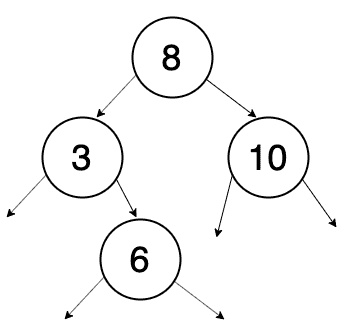
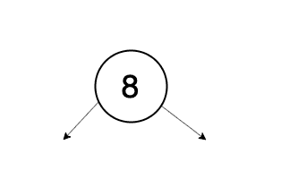
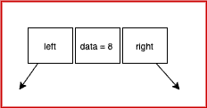
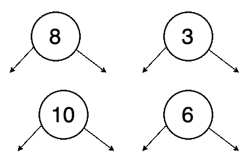
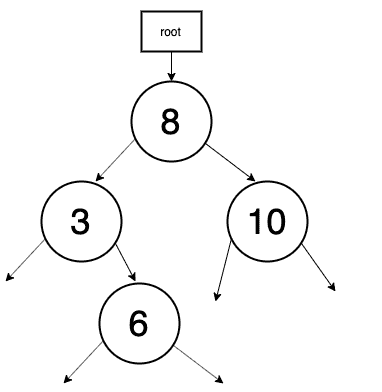

# 揭秘二叉查找树

> 原文：<https://medium.com/analytics-vidhya/demystifying-binary-search-tree-95cf26c90b33?source=collection_archive---------21----------------------->


乔纳斯·斯维德拉斯在 [Unsplash](https://unsplash.com/s/photos/computer-science?utm_source=unsplash&utm_medium=referral&utm_content=creditCopyText) 上的照片

有时学习树相关的数据结构是令人生畏的。我会试着把事情分解成更小的部分来解释，然后我们看看如何把它们放在一起。

**二叉查找树的定义:**

左侧子树中的所有元素都小于根元素，右侧子树中的所有元素都大于根元素。一个典型的二分搜索法[树](https://en.wikipedia.org/wiki/Tree_(data_structure))看起来类似于下图。



1.二叉查找树

**各节点内部**

记住这个图像，让我们开始把它分成更小的部分。我们将在开始时只选取一个元素，并了解它是如何构建的。取第一个元素，即 8。



2.单个节点

在构建更多这样的元素之前，我们需要先找到它的组成元素。就像工厂制造轮胎一样，我们需要学习制造第一个轮胎，然后运用所学知识制造更多这样的轮胎。

因此，这有 3 个元素，数据和两个指针。我们称它们为节点。节点的结构看起来像这样。数据元素是存储节点值的元素，左指针存储左子节点的[引用](https://en.wikipedia.org/wiki/Reference_(computer_science))，右指针存储右子节点的引用。



3.节点的内部

那是一个节点的图示。我们需要以编程方式定义相同的结构。让我们用 javascript 试试。

```
Class Node { 
    constructor(data) { 
        this.data = data; 
        this.left = null;
        this.right = null;
    }
}
```

上面的定义没有创建任何节点，它只是创建了节点的一个[蓝图](https://www.vocabulary.com/dictionary/blueprint)。使用这个蓝图，我们将创建我们的第一个节点，下面这条线会变魔术。

```
let node_1 = new Node(8);
```

你可以想象第三张图片，它创建了一个数据为 8 的节点，两个指针都没有指向任何东西。

**更多节点**

您现在可以创建更多节点。比方说，我又创建了 3 个节点

```
let node_2 = new Node(3);
let node_3 = new Node(10);
let node_4 = new Node(6);
```

现在您总共有 4 个节点。目前的图片如下图。



4.更多节点

**将它们连接在一起**

我们已经创建了许多节点，但是它们没有连接。让我们根据[二叉查找树](https://en.wikipedia.org/wiki/Binary_search_tree)的定义把他们联系起来。

```
node_1.left = node_2; // because node_2.data < node_1.data node_1.right = node_3; // because node_3.data > node_1.data node_2.right = node_4; // because node_4.data > node_2.data
```

最后，你得到了第一张图片。太棒了。你可以建造二叉查找树。


5.二叉查找树

同样，您可以继续添加更多的节点，并按照二叉查找树的定义保持正确的顺序将它们链接起来。

**将理智引入系统**

理论上，这都是关于二叉查找树的。但是过了 10 个节点就会变疯。你会发现管理节点很困难。仅仅为了提供一种更系统的方式来管理节点，我们还需要做更多的工作。在我们开始构建系统之前，让我们列出没有系统时的痛点，这样一旦系统构建完成，我们就可以欣赏它。第一个难点是，当任何新节点添加到系统中时，很难跟踪我的新节点应该去哪里。第二个难点是，如何跟踪到目前为止插入的所有节点。

**解决问题**

我可以直接介绍这个术语，但我希望你用一个现实生活中的例子来描述它。有一棵树，你想爬上树。理想情况下，您应该从寻找树根开始。一旦你有了树根，你就可以爬上树，摘水果或者在树上挂几个人造水果。(没人那么做，你在开玩笑吗？).所以，有一件事我们发现我们需要根来开始。回到我们的例子，我们从零开始。当我们添加节点时，我们需要确保 root 指向第一个节点。(一直！).

```
class BinarySearchTree { 
    constructor() { 
        this.root = null;
    }
}
```

如果我们就此打住，看看它现在有什么力量。让我们再次构建相同的节点，并确保根节点指向第一个节点。

```
let BST = new BinarySearchTree(); // root is null 
let node_1 = new Node(8); // This is first node, root should point to this node 
root = node_1;
let node_2 = new Node(3);
node_1.left = node_2;
let node_3 = new Node(10);
node_1.right = node_3;
let node_4 = new Node(6);
node_2.right = node_4;
```

下面是目前的图片。



6.扎根的感觉真好

我们已经为我们的树添加了根，任何人想要检查(攀爬)所有的元素都可以从根开始。我们解决了跟踪的问题，但是添加节点仍然是一个挑战。我们需要向 BinarySearchTree 类添加一个方法来添加节点。

```
addNode(data) {}
```

这个方法应该使用为节点创建的蓝图。

```
addNode(data) {
    let node = new Node(data);
}
```

当 *addNode()* 被调用时，此时它已经用给定的数据创建了一个节点。请记住，如果它是第一个节点，根应该指向这个节点。让我们加上那张支票。

```
addNode(data) {
    let node = new Node(data);
    if(this.root === null) {
        root = node;
    }
}
```

太好了！您已经添加了第一个节点，并且根节点也指向它。现在是具有挑战性的部分。如果不是第一个节点，这个节点应该去哪里？我们需要根的帮助。我们有节点和根，我们需要添加另一个方法，它接受这两个参数，为我们解决问题，我们不需要担心。

```
addNode(data) {
    let node = new Node(data);
    if(this.root === null) {
        this.root = node;
    } else {
        this.insertNode(node, this.root);
    }
}
```

我撒谎是为了让你开心 1 纳秒，我们需要担心 *insertNode()* 。该方法将根据节点的值插入节点。

```
insertNode(node, root) {
    if(node.data < root.data) {
        if(root.left === null) {
            root.left = node; 
        } else {
            this.insertNode(node, root.left);
        }
    } else {
        if(root.right === null) {
            root.right = node;
        } else {
            this.insertMethod(node, root.right);
        }
    }
}
```

不好！一次抛出的代码太多了。抱歉，还在想怎么才能进一步打破它。反正是管用的。我们有一个系统的方法来添加更多的节点到系统中。接下来，我们希望爬上树并按排序顺序打印所有节点。您还可以在这里探索不同种类的树遍历算法。

```
printInOrder(root) {
    if(this.root === null) {
        return;
    }
    this.printInOrder(root.left);
    console.log(root.data);
    this.printInOrder(root.right);
}
```

**驱动程序**

```
let bst = new BinarySearchTree();
bst.addNode(8);
bst.addNode(3);
bst.addNode(10);
bst.addNode(6);
bst.printInOrder(bst.root); // prints 3,6,8,10
```

**把所有东西放在一起**

```
class Node {
    constructor(data) {
        this.data = data;
        this.left = null;
        this.right = null;
    }
}class BST {
    constructor() {
        this.root = null;
    } add(data) {
        let node = new Node(data);
        if(this.root === null) {
            this.root = node;
        } else {
            this.insertNode(node, this.root);
        }
    } insertNode(node, root) {
        if(node.data < root.data) {
            if(root.left === null) {
                root.left = node;
        } else {
            this.insertNode(node, root.left);
            }
        } else {
            if(root.right === null) {
                root.right = node;
            } else {
                this.insertNode(node, root.right);
            }
        }
    } printInorderBST(root) {
        if(root === null) {
            return;
        } 
        this.printInorderBST(root.left);
        console.log(root.data);
        this.printInorderBST(root.right);
   }
}let bst = new BST();
bst.add(8);
bst.add(3);
bst.add(10);
bst.add(6);
bst.printInorderBST(bst.root); // prints 3,6,8,10
```

请随时提供意见以进一步改进它。

*原载于 2019 年 10 月 8 日*[*http://arvindpandey . in*](https://www.arvindpandey.in/demystifying-binary-search-tree/)*。*