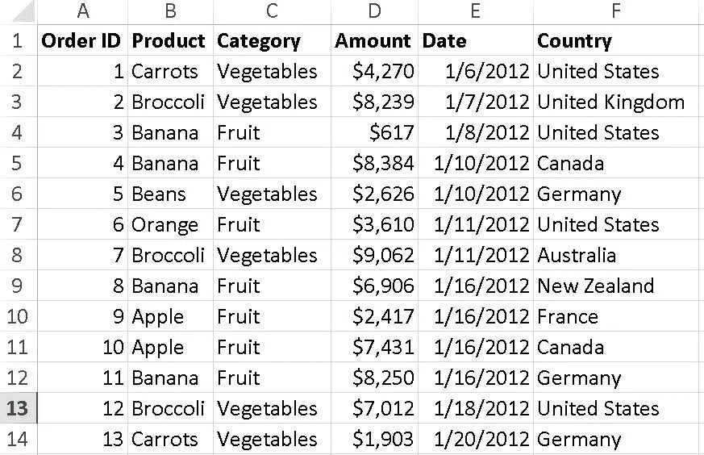
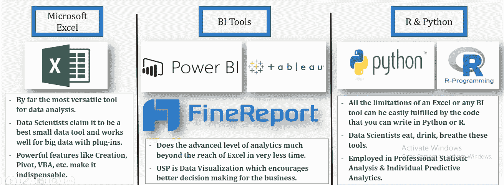
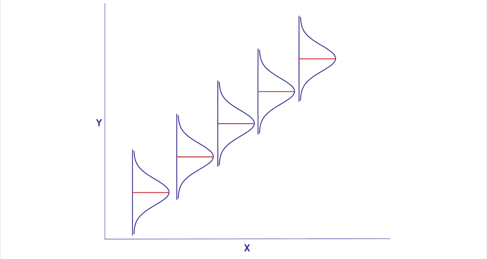
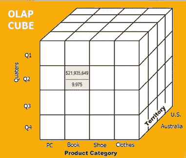
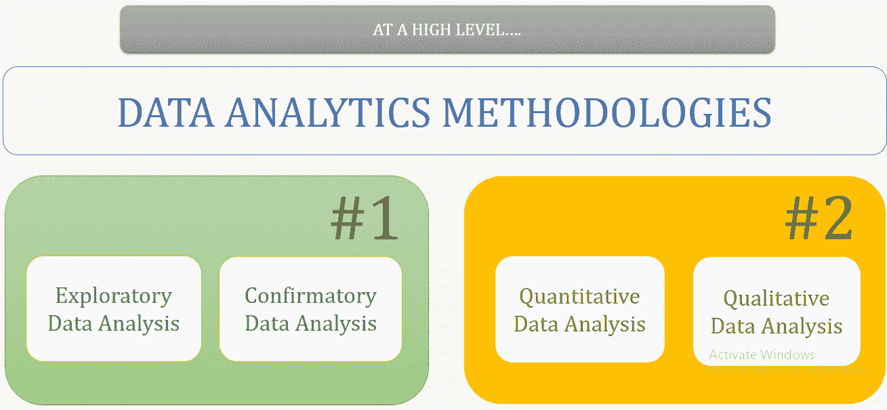
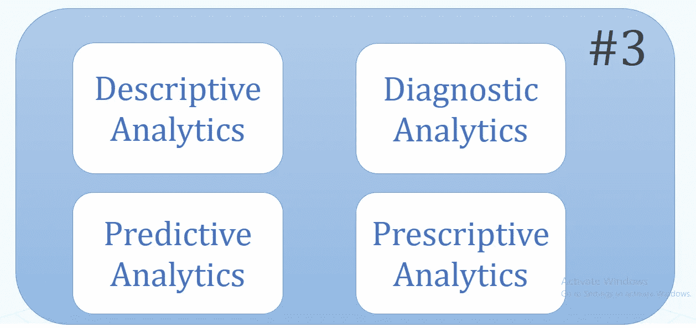

# 揭秘数据分析

> 原文：<https://medium.com/analytics-vidhya/demystifying-data-analytics-b7912a1a7f8a?source=collection_archive---------17----------------------->

**这个世界数据超载。**

# **我今天的日程是什么？**

a)我们的目标是更简单、更容易地理解数据分析到底是什么。

b)数据分析的好处是什么？

c)有哪些不同类型的数据分析方法和应用？

d)什么是探索性数据分析？

e)与揭开数据分析神秘面纱相关的各种其他应用和思想流派有哪些？

## 那我们开始吧…

回到我们上任的第一天，你能想象当你不断听到数据分析的狂热，以及它是如何成为你周围每两个人的 ***兴趣爱好*** 时是什么感觉吗

**数据分析到底是什么？**

# a)那么，数据分析……

*   是一门学科，它鼓励我们检查数据集，以便对它们所包含的信息进行推断并得出结论。
*   借助于**专用系统&软件/软件**执行。
*   构成广泛用于商业行业的技术和方法，使公司能够做出更明智的业务和产品决策，科学家和研究人员也使用这些技术和方法来验证或否定**科学模型、**理论和假设。
*   主要指一系列应用程序，从基本的商业智能(BI)、报告和**在线分析处理(OLAP)** 到各种形式的高级分析。
*   本质上类似于业务分析，后者是数据分析方法的另一个总括术语，不同之处在于后者面向业务用途，而数据分析的关注范围更广。
*   在某些情况下，人们使用数据来专门表示高级分析，将商业智能视为一个单独的类别。

在我继续之前，我认为有必要对上面提到的每个突出显示的(粗体)术语做一些说明。如果你碰巧是数据分析/科学领域的新成员，那么了解这些术语的含义是很重要的。

## **-什么是数据集？**

数据集是以某种方式相关的离散项目的集合，可以单独或组合访问。

**数据集的一般特征:-**

**i)维度:**它基本上是你的数据集中的对象所具有的属性的总数。举个例子，假设一家公司有一个员工数据集，包括员工 ID、姓名、年龄、性别、工资等属性。这使得它成为一个 6 维的数据集 ***。*** 人们通常会避免处理具有大量属性的数据集，因为这样一来，分析这些数据就变得很困难，所遇到的问题被称为 ***维数灾难。***

**ii)稀疏性—** 您会发现许多数据集的大多数属性值为***【0】***(在大多数情况下，不到 1%的数据集具有非零值) ***。*** 这样的数据集被称为 ***稀疏*** 。这与数学中的稀疏矩阵非常相似，在稀疏矩阵中，矩阵的值大多为零。相反，我们有稠密的矩阵，其中大部分是非零值。

**iii)分辨率** —数据集的分辨率可以定义为收集或获取数据的频率。

一个基本的数据集看起来像什么？

数据集最基本和最常规的形式是 Excel 文件。

**数据集的类型:-**

**1)数值型数据集:**数值型数据集是所有数值型数据的集合，只处理数字。 ***一些突出的例子是-*** 1)班级学生的体重和身高，2)患有疾病的患者的医疗报告中的红细胞计数，3)一套书中的总页数。

双变量数据集:由两个变量组成的数据集称为双变量数据集。这种数据集基本上围绕着这两个变量之间的关系，每个变量项都依赖于另一个变量项。 ***举例-*** 1)冰淇淋销量与当天气温的对比，2)天气与当天的交通事故。

**3)多元数据集:**多元数据集是由多个变量组成的数据集。 ***示例-*** 有大约 1000 个矩形盒子，并且为它们提供了一个数据集。数据包括每个盒子的长度、宽度、高度和体积。这就是我们所说的多元数据集。

**4)分类数据集:**分类数据集是那些其数据通常属于一个类别的数据集，这意味着，它们的属性表示可以被分类的人或物体的特征或特性。 ***举例-*** 1)一个人的性别:男/女，2)一个人的婚姻状况:(已婚/未婚)。

相关性数据集:相关性数据集是那些具有一组值的数据集，这些值展示了彼此之间的某种关系。在这样的数据集中，发现值是相互依赖的。 ***举例-*** 我有一个数据集，里面有一个班级学生的身高和体重。现在我们知道，高个子被认为比矮个子重。所以这里体重和身高变量是相互依赖的，因此这个数据集是相关的。

## -什么是专业系统和软件？

为了执行数据分析，显然需要一些专门的软件、系统或工具。

**迄今为止，最受好评的数据分析工具之一是:-**

**最著名的数据分析工具**

## -什么是科学模型？

科学/分析模型是一种统计模型，通常由数据科学家创建，用于执行特定任务或预测特定事件的概率。

**一个样本线性回归图。**

*   简单地说，科学模型是业务问题的数学表示。随着公司业务问题的发展，科学模型也变得越来越复杂。
*   科学模型的世界通常被宽泛地归类为**监督&非监督学习模型。**
*   **监督:**研究这个模型的数据科学家事先知道模型输出属性是什么。这种模型被训练成使用解释变量来解释因变量，两者之间有明显的区别。*例如:—预测(线性回归)、分类(决策树、k 近邻)、时间序列预测(基于回归)等* ***。* 无监督:**模型输出/目标属性未知，不区分 b/w 解释变量和因变量。例如:聚类分析、关联规则等。
*   如果你是一名数据科学家，你应该至少拥有这些机器学习算法

# 线性回归|集成方法|决策树|聚类|逻辑回归|假设检验|神经网络|主成分分析

## **-什么是在线分析处理(OLAP)？**

OLAP 是一种计算方法或一类软件，它使用户能够方便地、有选择地同时从多个数据库中提取数据。

**一个样品 OLAP 立方体**

*   在 OLAP 的正中心坐落着一个 OLAP 立方体。它是一种数据结构，包含按维度分类的度量。简单的电子表格是二维的。& OLAP 魔方是多维的。
*   与资源非常密集的关系数据库相比，OLAP 从业者倾向于以更快的速度频繁地执行分组、聚集和连接操作。使用 OLAP，数据是预先计算和预先汇总的。

# B 数据分析的好处是什么？

请想一想，数据分析如何真正让组织受益？任何组织最终向数据投降的目的是什么？

一家公司如何从数据分析中真正受益？

# c)有哪些不同类型的数据分析方法和应用？

当谈到分析数据分析的各种方法和应用时，人们倾向于将它们大致分类如下。你会发现，在对数据分析进行广泛分类时，我们有三种不同的思想流派

**类别#1 & #2**

**类别#3**

# **D)什么是探索性数据分析？**

探索性数据分析(在数据行业中主要称为 EDA)是一个统计学术语，它基本上定义了分析数据集以发现数据集中的模式和关系的方法。

***但是，那我为什么要真的在乎做 EDA 呢？我从中获得了什么？***

## 让我们更好地理解探索性数据分析。

想象下面的用例，一位女士想要**给自己买一双鞋，并找到了一家合适的商店。**

**我有一种感觉，下面的信息图可能会给人留下一个长久的印象，让人们了解 EDA 对数据分析领域的数据集做了什么&科学，以及验证性数据分析如何验证 EDA 做了什么。**

因此，基本上**探索性数据分析(EDA)** 就像一个侦探，她收集所有的证据(分析数据的所有角度)，寻找线索&模式，根据她根深蒂固的直觉和丰富的经验，预测有关案件(数据集)的一些事情。

**侦探—探索性数据分析**

但随后**验证性数据分析**进来了；在那里我们不会简单地相信侦探的话，并把她的发现带到法庭去获得批准。那个法院是验证性数据分析(CDA)。

**判断—验证性数据分析**

## 谈论其他类别的数据分析应用程序(来自其他思想流派):-

*   **定量数据分析:**对可以计数、测量、用数字表示的数据进行分析。 ***如*** —测试、调查、实验、市场报告等。
*   **定性数据分析:**对可以基于特性和特征分类的数据进行分析。 ***如*** —音频视频记录、图像/符号、采访笔录等。
*   **描述性分析:**以统计的方式查看数据，告诉我们过去发生了什么。
*   **诊断分析:**告诉我们为什么那些事情会发生在过去。
*   **预测分析:**根据输入机器学习模型的历史数据，预测未来最有可能发生的事情。
*   **规定性分析:**推荐我们可以采取的行动来影响这些结果。还分析了规定动作的含义。

***接下来，作为这篇文章的后续，我正在着手探索性数据分析(EDA)。我们将从网上获得一些有趣的数据集，并在此基础上做一些 EDA。请观看这个空间的一些有趣的 EDA 实践。***

## 在那之前……..

谢谢大家！