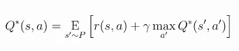
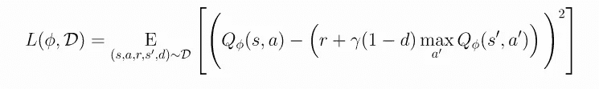

# 揭秘深度确定性策略梯度(DDPG)及其在 ChainerRL 和 OpenAI-baselines 中的实现

> 原文：<https://medium.com/analytics-vidhya/demystifying-deep-deterministic-policy-gradient-ddpg-uding-chainerrl-and-openai-baselines-a087a11630cc?source=collection_archive---------5----------------------->

## 对流行的强化学习技术 DDPG 及其使用 ChainerRL 和 Tensorflow 轻松实现的深入解释。


[强化学习的根源](https://wallpaperplay.com/walls/full/7/9/f/90463.jpg)

深度确定性策略梯度或通常称为 DDPG 基本上是一种非策略方法，它学习 Q 函数和策略来迭代动作。它使用非策略数据和贝尔曼方程来学习 Q 函数，该 Q 函数反过来用于导出和学习策略。

# 学习过程:

学习过程与 Q-learning 密切相关，如果您知道最佳行动值函数 **Q*(s，a)** ，则在该状态下采取的最佳行动可以使用 a*(s)找到，即:


最佳行动估计

# 连续动作空间推导；

DDPG 是专门为处理具有连续动作空间的环境而开发的，本质上就是估计 ***max Q*(s，a)中的最大过度动作。***

1.  在离散动作空间的情况下，可以分别估计每个动作的 Q 值，因此容易比较最佳最大值。
2.  在连续动作空间的情况下，对于每个 Q 值的计算和单独比较变得非常穷尽，导致不稳定的目标值和不稳定的学习。更不用说，这样的过程是非常详尽和计算昂贵的。

基于 Q-learning 的算法，特别是 DDPG 使用以下方法来处理连续动作空间:

*   利用**贝尔曼方程**通过状态-动作/Q 值获得给定状态的最佳动作。



贝尔曼方程

> 在等式*中，s’~ P*指的是从环境中通过概率分布 *P(.|s，a)。*

*   DDPG 使用**均方贝尔曼误差(MSBE)** 函数来估计 Q*接近满足贝尔曼方程的程度，如下式所示:



均方贝尔曼误差值方程

*   利用**经验重放缓冲器**，它是一组先前的经验，有助于为基于 Q 学习的近似器提供稳定的学习行为
*   DDPG 还部署使用 T **目标网络**来处理不稳定的目标值，使学习更加稳定。下面描述什么是**目标**，因为当我们最小化 MSBE 损失时，我们试图使 Q 函数更像这个目标。


目标值

*   DDPG 的目标网络是从主网络复制过来的，每更新一次主网络，就更新一次固定步数，通过 Polyak 平均:


目标网络更新— Polyak 平均

因此，DDPG 通过使用**目标策略网络**来计算近似最大化 **Q*(目标)的动作，来处理这种巨大的连续动作空间挑战和昂贵的计算。**


[记下一些要点的时间](https://www.google.com/url?sa=i&url=https%3A%2F%2Fwww.salesforceblogger.com%2F2017%2F11%2F10%2Fdreamforce-2017-takeaways-on-einstein-analytics%2F&psig=AOvVaw2KBvxZxSqHXcfIdi67LYau&ust=1574756455707000&source=images&cd=vfe&ved=0CAIQjRxqFwoTCJD096T3hOYCFQAAAAAdAAAAABAd)

# **关键要点:**

*   DDPG 的 q 学习是通过用随机梯度下降最小化以下 MSBE 损失来执行的。
*   DDPG 本质上是与政策无关的学习方法
*   它基本上是连续动作空间的 Q 学习。
*   它使用带有经验重放的目标网络进行稳定高效的学习。


[什么都明白了？如果不是，后退几步也无妨](https://media.giphy.com/media/NvCueB7PUf840/giphy.gif)

# 实施:

我们将使用两个框架来实现 DDPG:

*   ChainerRL—[*https://github.com/chainer/chainerrl*](https://github.com/chainer/chainerrl)
*   Tensorflow /OpenAi 基线—[*https://github.com/openai/baselines*](https://github.com/openai/baselines)

> ChainerRL

Chainer 是一个新开发的基于 DL 的框架，它的特点是速度非常快，可以在 Cupy(可能是 GPU 使用的 numpy 的更快版本)上运行，并支持 GPU 的并行化。通过以下方式直接安装 chainerRL

```
pip install chainerrl
```

在安装设置之后，RL 算法可以直接与测试脚本一起运行。在这里，我们将使用下面给出的 train_ddpg 脚本运行 ddpg

[mujoco DDPG 培训代码—链接](https://gist.github.com/Ujwal2910/890afa79e7fbeaa7ce9cd2f5ae08d216)

或者你可以直接从这里使用训练代码- [train_ddpg.py](https://github.com/chainer/chainerrl/blob/master/examples/mujoco/train_ddpg_gym.py) 。

定制环境的 make_env 函数

在该脚本中，您可以修改 make_env()函数以适应您自己选择的环境，或者您也可以添加创建的环境文件，方法是直接导入它们，然后在函数本身中调用它们。


[理解和看到运行代码的快乐](https://www.google.com/search?q=code+is+running+joy+gif&tbm=isch&ved=2ahUKEwjE-4ThgoXmAhXqi0sFHWorDYgQ2-cCegQIABAA&oq=code+is+running+joy+gif&gs_l=img.3...7568.8300..8658...0.0..0.424.1155.3-2j1......0....1..gws-wiz-img.8PEGyfrddso&ei=JpvbXcTQAuqXrtoP6ta0wAg&bih=890&biw=1745&rlz=1C1GCEV_enIN863IN863#imgrc=bJbMW1LuwC4zDM)

> Tensorflow /OpenAi 基线

从 OpenAI 基线运行训练设置也相对容易和简单。首先克隆并安装 TensorFlow，然后是基线包-

```
git clone [https://github.com/openai/baselines.git](https://github.com/openai/baselines.git) #clone the repo
cd baselines #change directorypip install tensorflow-gpu==1.14 # if you have a CUDA-compatible gpu and proper driverspip install -e . # for baseline installation
```

要运行 DDPG，请使用以下命令—

> python-m baselines . run-alg = ddpg-env = half cheetah-v2-num _ time steps = 1e 6

在 Mujoco 环境中运行 1M 帧= 10M 时间步长的算法。更多选项见帮助(`-h`)。欲了解更多信息，请点击此[链接](https://github.com/openai/baselines/tree/master/baselines/ddpg)。


你做得很好。现在运行一些 RL 算法

# **参考文献:**

*   [https://spinning up . open ai . com/en/latest/algorithms/ddpg . html](https://spinningup.openai.com/en/latest/algorithms/ddpg.html)
*   [https://github.com/chainer/chainerrl](https://github.com/chainer/chainerrl)
*   [https://github.com/openai/baselines](https://github.com/openai/baselines)