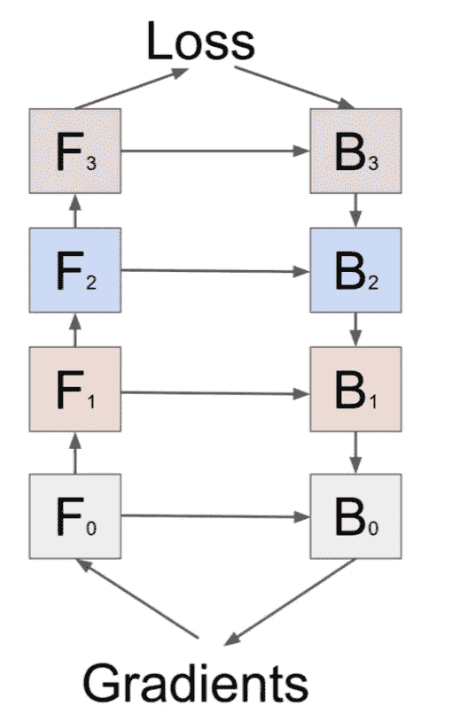
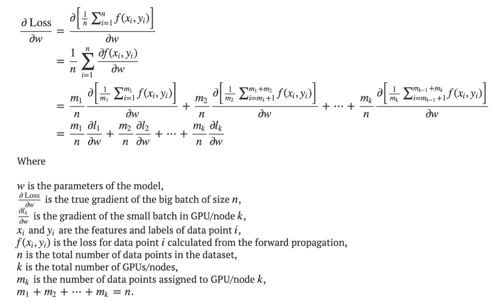
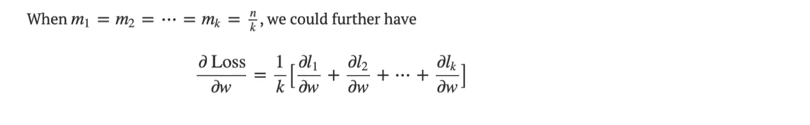
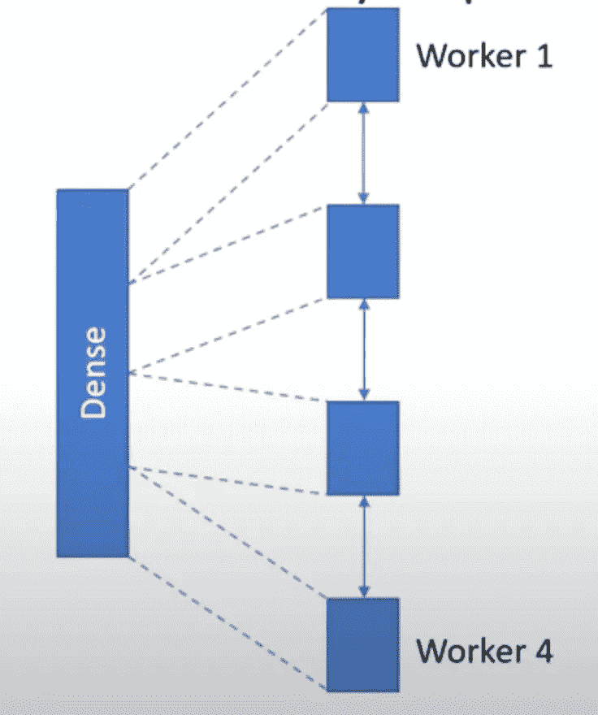
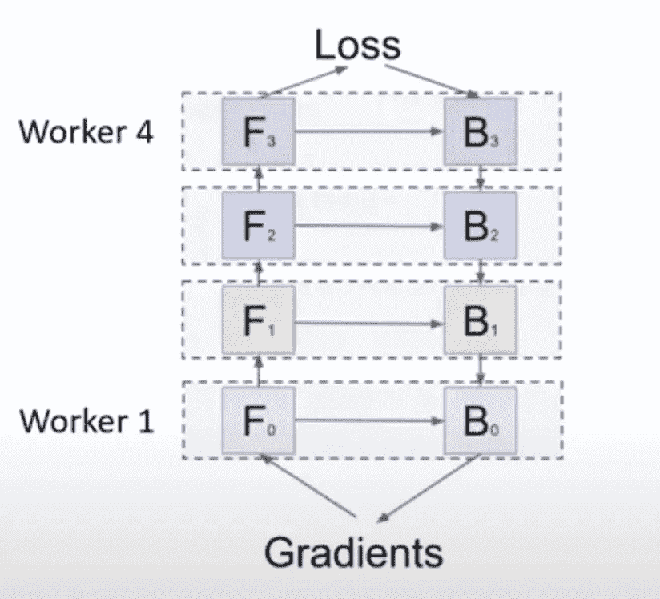
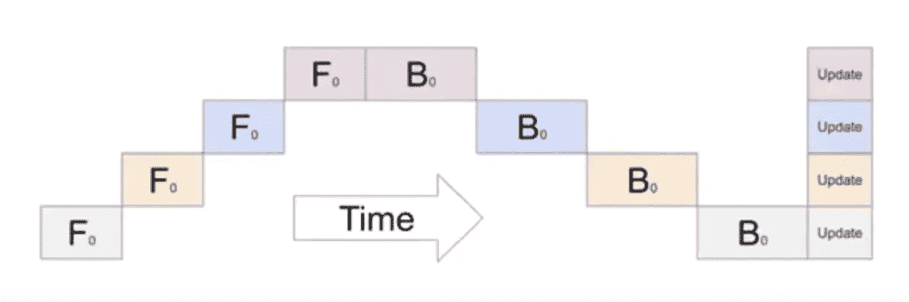
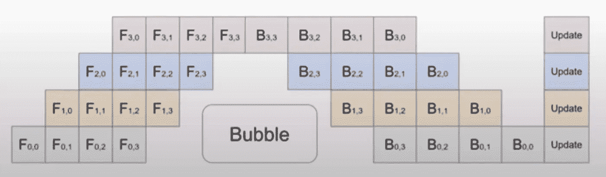
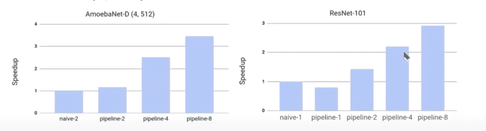
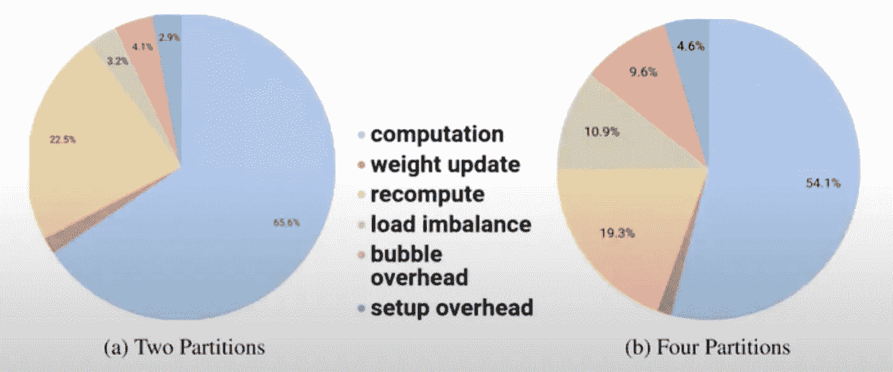

# 使用 GPipe 揭开分布式深度学习的神秘面纱

> 原文：<https://medium.com/analytics-vidhya/demystifying-distributed-deep-learning-using-gpipe-f1a84f7e6207?source=collection_archive---------20----------------------->

我们已经进入了大数据时代。全球每时每刻都在产生数百万个数据点。为了处理这些数据并为技术进步做出决策，我们需要大量的计算资源。过去已经很明显，分布式计算有助于这种计算昂贵的任务。

在整篇文章中，我们将在更广的范围内简要概述不同类型的深度学习技术，并看看分布式深度学习为我们提供了什么。我们将深入研究**模型**和**数据** **并行性**背后的数学原理。最终，使用这些概念，我们将试图理解 GPipe 为我们提供了什么，以及它如何试图弥合这两种类型的分布式深度学习技术之间的差距。

附言:*我不打算深入研究什么是深度学习。所以对它的一点理解可能会对你有所帮助，因为我们将在后面的部分钻研数学。*

# 为什么我们需要分布式深度学习？

> “2014 年 ImageNet 挑战赛的获胜者是 GoogleNet，它使用**400 万个参数**实现了 74.8%的最高准确率。2017 年 ImageNet 挑战赛的获胜者是挤压和激励网络，该网络以**1.458 亿个参数**实现了 82.7%的最高准确率。

GPipe 论文在上面的引用中很好地说明了这一点。可以清楚地看到，参数的数量增加了 **36 倍。**然而，这段时间内存仅增加了 3 倍。这里的内存容量是指深度学习行业中使用的 GPU 或不同加速器的内存容量。

*我们为什么需要记忆？*

所以在深度学习中，我们使用模型的权重来计算梯度，并最终计算损失函数。为了做到这一点，我们需要在内存中存储模型的权重和激活。由于数据以惊人的速度增长，我们需要越来越大的模型进行训练。这导致有更多数量的参数，如上面引用的内容所示。因此，我们需要更多的内存。

从上面的 4 层模型图中可以看出。每一层都有与之相关的向前和向后计算。这些计算由矩阵和向量组成。这些存储在内存中。然而，由于 GPU 和加速器不提供那么多的内存，我们需要求助于不同的来源。我们将在下一节讨论它们。

# 不同的探索解决方案

有许多不同的方法来解决这个问题，我们将看看他们。这些还包括模型和数据并行性，我们也将研究它们。

***反向传播期间重新计算正向激活***

这是解决方案之一。正如你在上面的图片中看到的，我们需要在内存中存储向前和向后激活。我们可以避免存储反向激活，并在反向传播步骤中使用正向激活来简单地计算它们。这将节省内存，但会增加计算量。这里有一个内存和计算速度之间的权衡。

***CPU 和加速器内存之间的内存交换***

除此之外，我们还可以将激活和权重存储在 CPU 或主内存中，因为加速器的内存并不多。在需要的时候，我们会从主内存中获取激活，并使用它进行计算。然而，这在很大程度上取决于主存储器和加速器之间的数据传输速度。通常这不是那么快。所以我们在这里失去了速度。

*然后是并行。*

# 平行

到目前为止，我们一致认为用计算速度交换和牺牲内存是不好的。我们需要两全其美的东西。目前存在两种类型的并行。一个是*数据并行*一个是*模型并行。*

*数据并行*当您有大量数据无法在一台机器上处理时，就会出现这种情况。我们在这里将一台机器称为**节点**。这是因为这是分布式系统中使用的术语。因此，我们将数据分成更小的块，并将其分配给每个节点。每个节点都有自己的模型副本和权重。然后，它们计算自己的块上的损失，并将其返回给主节点**进行剩余的处理。这同样适用于类似方式的反向传播。**

当你有一个包含许多参数的巨大模型时，模型并行性就会显现出来。在这种情况下，您将模型分成更小的块，并将其分配给不同的节点。然后，这些节点分别处理模型的不同部分，并将梯度和损失返回给主节点。这在反向传播步骤中再次重复。

让我们更详细地看看这两种方法。

# *数据并行度*

使用下面的等式可以很容易理解数据并行性。

在上面的等式中，我们做了以下事情。最初，因为我们想计算总损失的梯度，我们考虑每个数据点。这里的数据点数为 *n* 。一旦我们这样做了，我们就考虑分布式网络中所有的 T2 k T3 节点。我们给它们中的每一个分配一组数据点来计算它们各自的梯度。所有这些节点的组合梯度将等于完整数据集上的模型所需的梯度。我们可以通过将数据点平均划分到每个节点来简化这一过程，

从上面可以很容易地看出，损耗的总梯度等于所有节点组合的单个损耗的*平均值*。这就是数据并行的本质。

# 模型并行性

当我们有一个非常大的模型，不容易放入加速器的内存中时，模型并行就发生了。因此，我们采用分布式集群中的不同节点，并划分我们的模型，以便每个节点都获得模型权重的一部分。然后所有人计算梯度并更新总损耗。然而，这里需要注意的一个关键问题是，在这种情况下，在节点之间划分权重的技术会影响算法的性能。我们可以从下面的例子中看出这一点。

*情况 1:单个密集层在不同工人之间拆分*

在上面的图像中，可以看到有 4 个工人，他们每个人都得到了稠密层的一部分。很容易理解，他们必须相互通信才能获得数据和梯度。这是进行模型并行的一种方式。

*案例 2:不同层的不同工人*

在上面的例子中，我们可以看到不同的工人在不同的层上工作。本例中有 4 个不同的密集层。第一个工人将做第一个，第二个工人做第二个，以此类推。

每个工作者还将负责计算他们各自层的反向激活。从上面的例子中可以看出，每个后续的工人都依赖于前面的工人及其结果。*所以这不是一个好的模型并行方式。*

附:图片编号不正确。这摘自 GPipe 的论文。

这是因为我们可以看到数据点遍历模型一次迭代所花费的全部时间。这里可以看到没有 ***流水线*** 一切都是 ***顺序*** 。一旦工人 *0，*完成处理，它就把结果交给工人 *1* ，以此类推。后向前处理，后向后处理也是连续的，后所有不同的工人根据不同的超参数更新他们的权重。

# 到目前为止的简要总结

让我们来看看到目前为止我们学了些什么。

*   我们已经看到，与内存相比，数据正以惊人的速度增长。
*   然后，我们讨论了以前解决这个问题的技术，它在计算速度和内存之间进行了权衡。
*   我们看到，GPU 等加速器没有非常大的内存存储容量，因此我们不得不求助于多个节点或机器。
*   我们讨论了两种不同类型的数据和模型并行，并了解了它们是如何工作的。

到目前为止，我们已经讨论了如果我们有一个非常庞大的模型或大量的数据，而这些数据不适应我们现有的计算资源，将会发生什么。然而，为了在大型数据集上获得有希望的结果，我们需要庞大的模型。因此，问题是，如何以某种方式获得两个世界的最佳效果，以便我们可以在非常大的数据集上训练一个巨大的模型，并获得有希望的结果？

# 两全其美——GPipe

GPipe 使用流水线技术给了我们想要的东西。它使用了多核进程的高中流水线的基本思想，并将其扩展到分布式计算和深度学习。让我们使用下图来理解 GPipe 的功能。

GPipe 所做的是，它将*小批量*划分为*小批量*，这样不同的工人可以同时处理不同的小批量。例如，在上面取自 GPipe 论文的图像中，他们将每个小批量分成 4 个小批量。其工作方式如下:

*   工人 *0* 在微批*0*上工作。张贴这个，它把它交给工人 *1。*
*   工人 *0* 接着处理小批量*1*而工人 *1* 处理前一个工人递交的小批量*0*。
*   等等..
*   最后，一旦处理完整个小批量，梯度就会更新。也就是说，处理单个小批量中的所有小批量。

通过使用数据并行性，消除了先前形式的模型并行性中固有的依赖性。在这里，可以看到，数据被分配给不同的工作人员，他们也因此加载了不同的模型参数。所以这结合了数据和模型并行性。

总结一下 GPipe 的工作:

*   它将一个模型划分到不同的加速器上，并将一个小批量分成不同的微批量。
*   通过跨微批处理的流水线执行，加速器可以并行操作。
*   GPipe 在反向传播期间自动重新计算正向激活，以进一步减少内存消耗。
*   小批量的划分算法是基于启发式的。它最小化了每个复合层的估计成本的差异。

# GPipe 结果

现在我们已经很好地理解了 GPipe 是什么，让我们看一下结果来更好地理解它。

上图比较了使用 GPipe 训练的两个模型的计算速度，以达到最先进的结果。流水线 *k* 仅仅意味着在算法中有 *k* 个小批量的分区。

对于 AmoebaNet，*(相当大)，*当分区数量增加 2 倍时，加速几乎是线性的。在管道 8 中，加速提高了 3 倍以上。

然而，在 ResNet 的情况下，加速并不多。这是因为使用多个加速器(或 GPU)时总会有开销。在较小模型的情况下，与诸如 AmoebaNet 的较大模型相比，开销更多。我们将在下一节深入探讨这个问题。

# 开销考虑

正如上一节关于 GPipe 在两种不同模型中实现的计算加速的讨论，我们可以看看在较小模型和较大模型的情况下与多个加速器相关的开销。

在左图中有两个分区的情况下，我们可以看到蓝色部分约为 65.6%。这是负责计算权重和梯度的部分。第二大部分是重新计算，它负责重新计算前向激活。

但是，当我们查看右边有 4 个分区的图时，我们可以清楚地看到，由于绿色(*负载不平衡*)部分和红色(*气泡开销*)部分的增加，蓝色部分减少到了大约 54.1%。这是因为节点数量的增加。这种增加降低了计算能力，因此影响了模型的加速。

# 那么，为什么选择 GPipe 呢？

GPipe 论文很好地提出了这一点，他们谈到了三件事:

> 1) **效率**:使用一种新颖的批量拆分流水线算法，GPipe 随着器件数量的增加，实现了几乎线性的加速。2) **灵活性** : GPipe 支持任何可以表示为一系列层的深度网络。3) **可靠性** : GPipe 利用同步梯度下降，无论分区数量多少，都能保证训练的一致性。

它还将 GPipe 与 PipeDream 进行了比较，并声明

> PipeDream 需要在每个加速器上维护模型参数的多个版本副本，以便准确计算梯度更新，从而防止用户扩展到更大的模型。

GPipe 用他们的新概念解决了这个问题

> 批处理分裂流水线并行算法，当与重新具体化相结合时，允许扩展到大量的微批处理。

总而言之，GPipe 是一种非常好的创新手段，可以推动庞大的深度学习模型的边界，以及如何将它们纳入以惊人速度增长的训练数据中。

# GPipe 怎么用？

为了在自己的开发中使用 GPipe，可以看看他们的 github [库](https://github.com/tensorflow/lingvo/blob/master/lingvo/core/gpipe.py)。您也可以参考下面的链接，进一步了解 GPipe 及其工作原理。

# 参考链接

***Gpipe 论文***

*   [https://arxiv.org/pdf/1811.06965.pdf](https://arxiv.org/pdf/1811.06965.pdf)

***Google AI 博客的 GPipe***

*   [https://ai . Google blog . com/2019/03/introducing-gpipe-open-source-library . html](https://ai.googleblog.com/2019/03/introducing-gpipe-open-source-library.html)

***并行分布式深度学习***

*   [https://Stanford . edu/~ rezab/classes/CME 323/S16/projects _ reports/hedge _ us mani . pdf](https://stanford.edu/~rezab/classes/cme323/S16/projects_reports/hedge_usmani.pdf)
*   [https://lei Mao . github . io/blog/Data-Parallelism-vs-Model-parale lism/](https://leimao.github.io/blog/Data-Parallelism-vs-Model-Paralelism/)
*   [https://arxiv.org/pdf/1907.13257.pdf](https://arxiv.org/pdf/1907.13257.pdf)
*   [https://arxiv.org/pdf/1802.09941.pdf](https://arxiv.org/pdf/1802.09941.pdf)
*   [https://medium . com/@ esa liya/model-parallelism-in-deep-learning-not-what-you-think-94d 2 f 81 e 82 ed](/@esaliya/model-parallelism-in-deep-learning-is-not-what-you-think-94d2f81e82ed)

***GPipe 和 PipeDream 博客***

*   [https://towards data science . com/gpipe-and-piped dream-two-new-frameworks-for-scaling-the-training-of-deep-neural-networks-32d 17 FD 32 c 07](https://towardsdatascience.com/gpipe-and-pipedream-two-new-frameworks-for-scaling-the-training-of-deep-neural-networks-32d17fd32c07)