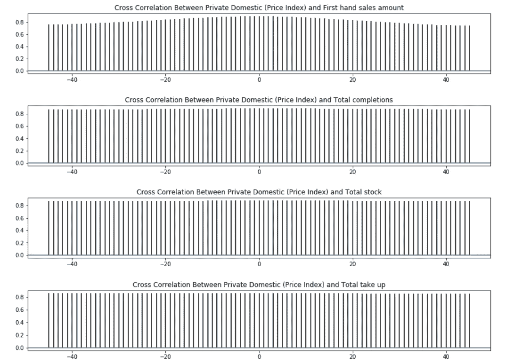
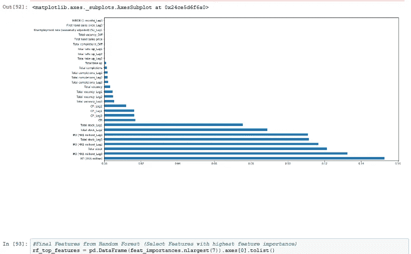
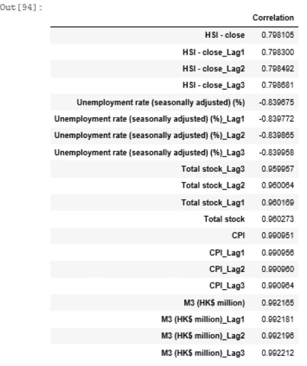
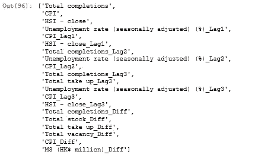
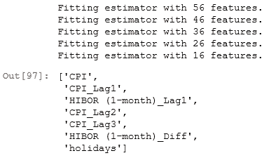
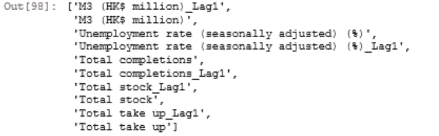
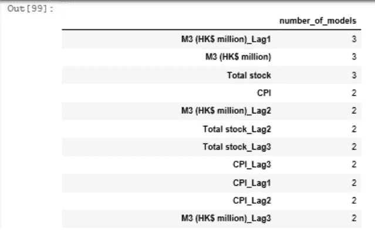
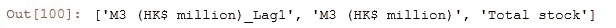

# 揭开基于驱动因素预测的特征工程和选择的神秘面纱

> 原文：<https://medium.com/analytics-vidhya/demystifying-feature-engineering-and-selection-for-driver-based-forecasting-50ba9b5a0fbc?source=collection_archive---------2----------------------->

## 使用第三方数据和人工智能模型(如随机森林、套索回归和递归特征选择)创建和提取关键特征！


欢迎来到我的 3 博客系列的第二部分，关于创建一个健壮的基于驱动程序的预测引擎。第一部分简要介绍了时间序列分析，并为读者提供了理解和清理时间序列数据集所需的工具。我们现在将着眼于我们分析的下一步。

在与印度领先的数据分析团队合作时，我意识到有两个关键因素可以为我们的客户带来切实可行的见解:**特征工程**和**特征选择**。特征工程是指从现有变量中创造新变量的过程，这些变量捕捉隐藏的商业洞察力。特征选择包括为我们的预测模型选择正确的变量。这两种技能都是艺术和科学的结合，需要一些练习来完善。

在本文中，我们将探讨在预测项目中通常设计的不同类型的特性，以及使用它们的基本原理。我们还将研究一套全面的方法，可以用来选择最佳特性，以及一种结合所有这些方法的简便方法。要更深入地挖掘特征分析，可以参考 Max Kuhn 和 Kjell Johnson 的书“[特征工程和选择:预测模型的实用方法](http://www.feat.engineering/index.html)

# 索引:

*   特征工程(滞后、周期差异、事件标志等。)
*   特征选择方法(相关性、套索回归、递归特征选择、随机森林、贝塔系数)
*   组合特征选择方法
*   最后的话

# 特征工程

在模型中使用不同的方式来表示数据字段是一种常见的做法，通常其中一些表示法比其他表示法更好。这是**特征工程**背后的基本思想——创建数据表示以提高模型有效性的过程。我们将讨论从多元时间序列数据中创建的一些经过试验和测试的特征，以及每种特征背后的基本原理。这里使用的数据集与本系列中之前的[博客](/@indraneeldb1993ds/cleaning-and-understanding-multivariate-time-series-data-6554eefbda9c)相同。这是一个关于香港房价和 12 个宏观经济变量的每日数据集。

**特性 1:滞后**

**滞后特征**是先前时间步的值。例如，变量在时间 *t* 的滞后 1 是其来自上一周期 *t-1* 的值。顾名思义，这里的假设是特征对目标变量有滞后影响。找到为每个字段选择的最佳滞后数的最佳方法是查看互相关图。**交叉相关性**图表显示了目标变量(此处为私人住宅价格指数)与各种原始特征(销售、货币供应等)之间的相关性。).

```
# Check Optimal Number of Lags
for i in range(3,12):
    pyplot.figure(i, figsize=(15,2)) # add this statement before your plot
    pyplot.xcorr(df.iloc[:,2],df.iloc[:,i],maxlags=45, usevlines=1)
    pyplot.title('Cross Correlation Between Private Domestic (Price Index) and '+ df.columns[i])
    pyplot.show()
```



*   对于目标变量和大多数特征之间的大量滞后，存在高水平的相关性。
*   在这个练习中，我们用“shift”函数为每列创建了 3 个滞后，如下所示。理想情况下，我们应该增加滞后，直到交叉相关度急剧下降。

```
#Add Lags
predictors2 = predictors1.shift(1)
predictors2 = predictors2.add_suffix('_Lag1')
predictors3 = predictors1.shift(2)
predictors3 = predictors3.add_suffix('_Lag2')
predictors4 = predictors1.shift(3)
predictors4 = predictors4.add_suffix('_Lag3')
```

**特征 2:周期性差异**

该特征被计算为变量的当前值与其先前值之间的差。期望是变量的变化比原始变量本身具有更强的关系。我们可以使用' diff '函数计算周期差(如下所示)。

```
#Add Periodic Difference
predictors5 = predictors1.diff()
predictors5 = predictors5.add_suffix('_Diff')
```

同样，考虑到业务问题，也可以计算月环比、年同比或季度环比的变化。

**功能 3:事件标志**

有时突出显示节假日等关键事件有助于模型更好地预测。例如，如果我们试图预测服装销售，那么圣诞节、感恩节等节日的标志通常有助于模型更好地预测这些时间的突然高峰。在我们的例子中，我们使用“calendar”函数创建了节日标志。

```
# Create Holiday Flagdf['Date'] = pd.to_datetime(df['Date'])
cal = calendar()
holidays = cal.holidays(start=df['Date'].min(), end=df['Date'].max())
df['holidays'] = pd.np.where(df['Date'].dt.date.isin(holidays), 1, 0)
df.head(5)
```

*   要为事件创建标志，重要的是要有一个采用正确日期时间格式的日期列(例如:“YYYY-MM-DD”)
*   我们为假日创建一个单独的日期列表，对于数据集中与该列表匹配的日期列中的所有值，我们将其标记为假日

除了这些共同特征之外，基于业务环境，我们应该尝试创建与目标变量有密切关系的附加特征。例如，我们创建了一个新特性“第一手价格”，作为“第一手销售额”和“第一手数量”之间的比率。

```
#Create a new feature =  First hand price
df['First hand sales price'] = df['First hand sales amount']/df['First hand sales quantity']
predictors1 = df.drop(columns=['Date','Private Domestic (Price Index)','holidays','First hand sales amount','First hand sales quantity'],axis=1) # Add  if applicable
predictors1.head(5)
```

**特性 4:财务数据**

用 Python 下载股票价格和指数等金融数据非常容易。有很多选择(Quandl、Intrinion、AlphaVantage、Tiingo、IEX 云等。)，然而，雅虎财经被认为是最受欢迎的，因为它是最容易访问的(免费且无需注册)。虽然我们在练习中不使用它，但我已经添加了提取以下内容所需的相关代码:

1.  公司的股票价格:

```
#### Additional features: Stock Price import yfinance as yf
from yahoofinancials import YahooFinancialsyahoo_financials = YahooFinancials('CRM')stock_price = yahoo_financials.get_historical_price_data(start_date='2018-08-01', 
                                                  end_date='2020-08-01', 
                                                  time_interval='monthly')stock_price_df = pd.DataFrame(stock_price['CRM']['prices'])
stock_price_df = stock_price_df.drop('date', axis=1).set_index('formatted_date')
stock_price_df = pd.DataFrame(stock_price_df['close'])
stock_price_df.columns = ['Stock_Price']stock_price_df
```

2.公司竞争对手的股票价格指数

```
# Additional features:  Stock Price Index from multiple companiesscaler = StandardScaler()
# transform x data
scaled_stock = scaler.fit_transform(stock_price_df_c)
column_name = competitor_stock[i]
stock_price_df_comp[column_name] = scaled_stock[:,0]

col = stock_price_df_comp.loc[: , "ADBE":"ORCL"]
stock_price_df_comp['Competitor_Stock_Index'] = col.mean(axis=1)
stock_price_df_comp = pd.DataFrame(stock_price_df_comp['Competitor_Stock_Index'])stock_price_df_comp
```

3.标准普尔 500 指数

```
#Additional features:  S&P 500import datetimepd.core.common.is_list_like = pd.api.types.is_list_likeimport pandas_datareader.data as webstart = datetime.datetime(2018, 8, 1)
end = datetime.datetime(2020, 8, 1)SP500 = web.DataReader(['sp500'], 'fred', start, end)SP500_df = SP500.resample('MS').mean()SP500_df
```

# 特征选择方法

特征选择是大多数数据科学项目的关键步骤，因为它使模型能够更快地训练，降低复杂性，并使其更容易解释。如果选择了最佳特征集，它有可能提高模型性能并减少过度拟合的问题。我们将讨论选择最佳特征的各种方法及其各自的规则。

**方法 1:随机森林的可变重要性**

随机森林由多个[决策树](https://towardsdatascience.com/decision-tree-algorithm-explained-83beb6e78ef4#:~:text=Decision%20Tree%20algorithm%20belongs%20to%20the%20family%20of%20supervised%20learning%20algorithms.&text=The%20goal%20of%20using%20a,prior%20data(training%20data).)组成，每个决策树都建立在来自数据集的随机观察样本和随机特征样本之上。这种随机选择保证了树是不相关的，因此不容易过度拟合。对于预测练习，我们使用随机森林的可变重要性特征，该特征测量当排除一个变量时准确度降低多少。要了解更多关于随机森林和可变重要性的信息，请参考 Niklas Donges 撰写的这篇详细的[博客](https://builtin.com/data-science/random-forest-algorithm)。

```
#1.Select the top n features based on feature importance from random forestnp.random.seed(10)# define the model
model = RandomForestRegressor(random_state = random.seed(10))
# fit the model
model.fit(predictors, Target)# get importance
features = predictors
importances = model.feature_importances_
indices = np.argsort(importances)feat_importances = pd.Series(model.feature_importances_, index=predictors.columns)
feat_importances.nlargest(30).plot(kind='barh')
```



*   我们首先拟合随机森林模型，然后提取变量重要性。

```
#Final Features from Random Forest (Select Features with highest feature importance)
rf_top_features = pd.DataFrame(feat_importances.nlargest(7)).axes[0].tolist()
```

*   我们根据变量重要性检查前 30 个变量的特征重要性图。我们可以看到，“M3(百万港元)”的 2 个周期的滞后是最重要的特征，在第 7 个特征之后，变量重要性下降。因此，我们选择了 7 个特征进行分析。

如果默认模型选择的特征不令人满意，我们可以通过调整参数来优化随机森林模型。这是嵌入式方法的一个示例，该方法通过使用机器学习算法评估特征子集来工作，该算法采用搜索策略来查看可能的特征子集的空间，基于给定算法的性能质量来评估每个子集。

**方法二:皮尔逊相关**

我们试图使用皮尔逊相关的绝对值来发现高度相关的特征。这是一个过滤方法的例子，其中特征是根据它们在各种统计测试中的分数来选择的。

```
#2.Select the top n features based on absolute correlation with target variable
corr_data1 = pd.concat([Target,predictors],axis = 1)
corr_data = corr_data1.corr()
corr_data = corr_data.iloc[: , [0]]
corr_data.columns.values[0] = "Correlation"
corr_data = corr_data.iloc[corr_data.Correlation.abs().argsort()] 
corr_data = corr_data[corr_data['Correlation'].notna()]
corr_data = corr_data.loc[corr_data['Correlation'] != 1]
corr_data.tail(20)
```



*   我们计算每个特征与目标变量的相关性，并根据相关性的绝对值对特征进行排序。

```
# Select Features with greater than 90% absolute correlation
corr_data2 = corr_data.loc[corr_data['Correlation'].abs() > .9]
corr_top_features = corr_data2.axes[0].tolist()
```

*   我们选择绝对相关度大于 90%的 12 个特征。基于业务环境，可以修改阈值。

**方法 3:使用套索回归的 L1 正则化**

拉索或 L1 正则化是基于能够将线性回归中的一些系数收缩为零的性质。因此，可以从模型中删除这些特征。这是特征选择的嵌入式方法的另一个例子。

```
#3.Select the features identified by Lasso regressionnp.random.seed(10)estimator = LassoCV(cv=5, normalize = True)sfm = SelectFromModel(estimator, prefit=False, norm_order=1, max_features=None)sfm.fit(predictors, Target)feature_idx = sfm.get_support()
Lasso_features = predictors.columns[feature_idx].tolist()
Lasso_features
```



*   我们指定 Lasso 回归模型，然后使用“selectFromModel”函数，该函数将在理论上选择系数非零的特征

要了解更多关于使用 Lasso 回归进行特征选择的信息，请参考 Valeria Fonti 的论文。

**方法 4:递归特征选择(RFE)**

RFE 是一种贪婪的优化算法，它重复创建模型，并在每次迭代中分离出最佳或最差的性能特征。它用剩余的特征构建下一个模型，直到所有的特征都被使用。最后，它根据消除的顺序对特征进行排序。

```
#4.Perform recursive feature selection and use cross validation to identify the best number of features#Feature ranking with recursive feature elimination and cross-validated selection of the best number of featuresrfe_selector = RFE(estimator=LinearRegression(), n_features_to_select= 7, step=10, verbose=5)
rfe_selector.fit(predictors, Target)
rfe_support = rfe_selector.get_support()
rfe_feature = predictors.loc[:,rfe_support].columns.tolist()
rfe_feature
```



我们使用线性回归来执行递归特征选择，并选择排名前 7 的字段。这是一种特征选择的包装方法，它试图通过基于模型性能迭代地选择特征来找到“最优”特征子集。

**方法五:贝塔系数**

标准化回归系数的绝对值，也称为β系数，可以被认为是特征重要性的代表。这是一种特征选择的过滤方法。

```
#5.Select the top n features based on absolute value of beta coefficients of features# define standard scaler
scaler = StandardScaler()
# transform x data
scaled_predictors = scaler.fit_transform(predictors)
scaled_Target = scaler.fit_transform(Target)sr_reg = LinearRegression(fit_intercept = False).fit(scaled_predictors, scaled_Target)
coef_table = pd.DataFrame(list(predictors.columns)).copy()
coef_table.insert(len(coef_table.columns),"Coefs",sr_reg.coef_.transpose())
coef_table = coef_table.iloc[coef_table.Coefs.abs().argsort()]sr_data2 = coef_table.tail(10)
sr_top_features = sr_data2.iloc[:,0].tolist()
sr_top_features
```



*   我们将数据集标准化，并对其中包含的所有特征进行标准化回归。
*   我们基于β系数的最高绝对值选择 10 个特征。

# 组合特征选择方法

这些模型中的每一个都善于捕捉特征和目标变量之间的特定类型的关系。例如，β系数擅长识别线性关系，而随机森林适合识别非线性键。根据我的经验，我发现尝试将多种方法的结果结合起来会得到更可靠的结果。在这一节中，我们将研究其中一种方法。

```
# Combining features from all the modelscombined_feature_list = sr_top_features + Lasso_features + corr_top_features + rf_top_featurescombined_feature = {x:combined_feature_list.count(x) for x in combined_feature_list}
combined_feature_data = pd.DataFrame.from_dict(combined_feature,orient='index')combined_feature_data.rename(columns={ combined_feature_data.columns[0]: "number_of_models" }, inplace = True)combined_feature_data = combined_feature_data.sort_values(['number_of_models'], ascending=[False])combined_feature_data.head(100)
```



*   我们将每个模型的特性列表合并成一个，然后检查每个特性在列表中出现的次数。这表示选择特征的方法/模型的数量。
*   我们选择在大多数方法中选择的特征。在我们的例子中，我们有 5 个模型，因此，我们选择了 3 个特征，它们是在 5 种方法中的至少 3 种方法中选择的。

```
#Final Features: features which were selected in atleast 3 modelscombined_feature_data = combined_feature_data.loc[combined_feature_data['number_of_models'] > 2]
final_features = combined_feature_data.axes[0].tolist()
final_features
```



使用这种方法来组合特征选择方法的好处是可以根据手头的业务问题灵活地添加/删除模型。来自贝叶斯网络的 Markov blanket、前向/后向回归和来自 XGBoost 的特征重要性是可以考虑的关于特征选择的一些附加方法。

# 最后的话

至此，这个由三部分组成的博客系列的第二部分告一段落。读者现在应该能够从与大多数预测练习相关的数据集中提取各种相关特征。他们还可以添加相关的第三方数据集，如假日标志和金融指数，作为补充原始数据集的新功能。除了设计这些特性之外，读者现在有了一个基于多种方法选择最佳特性的广泛工具包。我想在这里再次强调，特征工程和选择是艺术和科学的结合。随着经验的增加，一个人会变得更好。整个分析的代码可以在[这里](https://github.com/IDB-FOR-DATASCIENCE/Predictive-Excellence-Engine.git)找到。

请务必阅读本系列的最后[部分](/@indraneeldb1993ds/combining-time-series-analysis-with-artificial-intelligence-the-future-of-forecasting-5196f57db913)，在那里，我们通过结合时间序列和机器学习技术，创建了一个经过验证和测试的预测模型的广泛管道。

你对这个博客有什么问题或建议吗？请随时留言。

# 感谢您的阅读！

如果你和我一样，对人工智能、数据科学或经济学充满热情，请随时在 [LinkedIn](http://www.linkedin.com/in/indraneel-dutta-baruah-ds) 、 [Github](https://github.com/IDB-FOR-DATASCIENCE) 和 [Medium](/@indraneeldb1993ds) 上添加/关注我。

