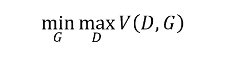

# 揭开生成对抗网络的神秘面纱:真实与虚假鉴别器

> 原文：<https://medium.com/analytics-vidhya/demystifying-generative-adversarial-networks-real-vs-fake-discriminator-bb5383ce89f9?source=collection_archive---------11----------------------->

来源—[https://pt . slide share . net/shamaniseriwardhana/generative-adversarial-networks-slides-Auckland-ai-ml-meetup](https://pt.slideshare.net/ShamaneSiriwardhana/generative-adversarial-networks-slides-auckland-ai-ml-meetup)

# 介绍

***生成对抗网络*** 是一类神经网络，用于生成数据集的样本，也用于对真假样本进行分类。它是由 Ian Goodfellow 和他的同事在 2014 年发明的。根据**严乐存的说法——“*甘的是过去 20 年机器学习中最酷的想法”*** 。

它在现实生活中有很多应用。其中一些是

*   生成图像数据集的示例
*   图像到图像的翻译
*   文本到图像的翻译
*   生成新的人体姿态
*   照片到表情符号

# 氮化镓的结构

***甘的*** 由 2 个神经网络组合而成。在这两个神经网络中，正式名称为 ***生成器*** 的一个网络试图生成与训练样本相似的假样本，并试图欺骗另一个网络**。**另一个正式名称为 ***的网络鉴别器*** 试图在那些生成的假样本和真样本之间进行分类。这样，这两个网络就相互对立地工作，以最大化自己的利润。

# 甘的类型

1.  香草甘- 它们是甘最简单的一种。这里，生成器和鉴别器都基于深度神经网络(简单多层感知器)架构。
2.  **有条件 GAN -** 有条件 GAN(CGAN)是一种 GAN，在生成假样本时，将某种条件(比如说**‘y’**)施加到生成器上。
3.  **深度卷积 GAN (DCGAN):** DCGAN 是最流行也是最成功实现的 GAN 之一。它有点类似于 CGAN，只是有一点不同。不同之处在于它使用卷积转置层来代替卷积层。
4.  **超分辨率 GAN (SRGAN):** SRGAN 是一种实现 GAN 的方法，其中深度神经网络与对抗网络一起使用，以产生更高分辨率的图像。这种 GAN 在放大低分辨率图像以增强细节方面特别有用。

# 甘损失函数

**甘的**损失函数直觉基于**极大极小博弈理论。**

这里， **G** 表示**发电机的**损耗， **D** 表示**鉴频器的**损耗

根据维基百科—

> Minimax 是人工智能、决策理论、博弈论、统计学和哲学中使用的决策规则，用于最小化最坏情况(最大损失)场景的可能损失。

你可以在我文章最后的链接中读到更多关于极大极小理论的内容。

## 公式

*   `D(x)`是鉴别器对真实数据实例 x 为真实的概率的估计。
*   Ex 是所有真实数据实例的期望值。
*   `G(z)`是给定噪声 z 时发电机的输出。
*   `D(G(z))`是鉴别者对假实例为真的概率的估计。
*   E𝓏是对生成器的所有随机输入的期望值(对所有生成的伪实例 G(z)的期望值)。
*   该公式源自真实分布和生成分布之间的交叉熵。

## 上述公式的直觉

对于鉴别器和发生器，上述公式可以有不同的解释。我们先来讨论一下鉴频器的情况——

对于鉴别器，上述公式可以理解为— **D(x)** 显示了我们的鉴别器能够将真实样本分类为真实样本的程度。如果它归类为实数，**D(x)****≈****1****log(D(x))****≈0s**如果不是，**D(x)****≈****0 log(D(x))**将是大负数**。**类似地， **D(G(z))** 显示了我们的鉴别器能够多好地将生成器生成的假样本识别为假的。如果正确识别为假，**D(G(z))****≈0 log(1—D(G(z))))≈0**如果不正确，**D(G(z))****≈1 log(1—D(G(z)))**将是一个很大的负数。这样，鉴别器试图最小化上述损失函数。

现在来看发电机的例子—

对于生成器，术语 **log(D(x))** 将是无用的，因为生成器不会被引入到任何真实样本中，相反，它仅被引入到训练样本的潜在特征中。以及术语 **D(G(z)) ≈** **1** 如果生成器能够生成与训练样本非常相似的假样本。

通过这种方式，生成器和鉴别器同时工作，以获得最佳结果。

这次都是我这边的。下次会有另一个有趣的话题。

 [## 极大极小

### 极大极小值(有时是最小最大值，MM 或鞍点)是人工智能，决策理论…

en.wikipedia.org](https://en.wikipedia.org/wiki/Minimax)