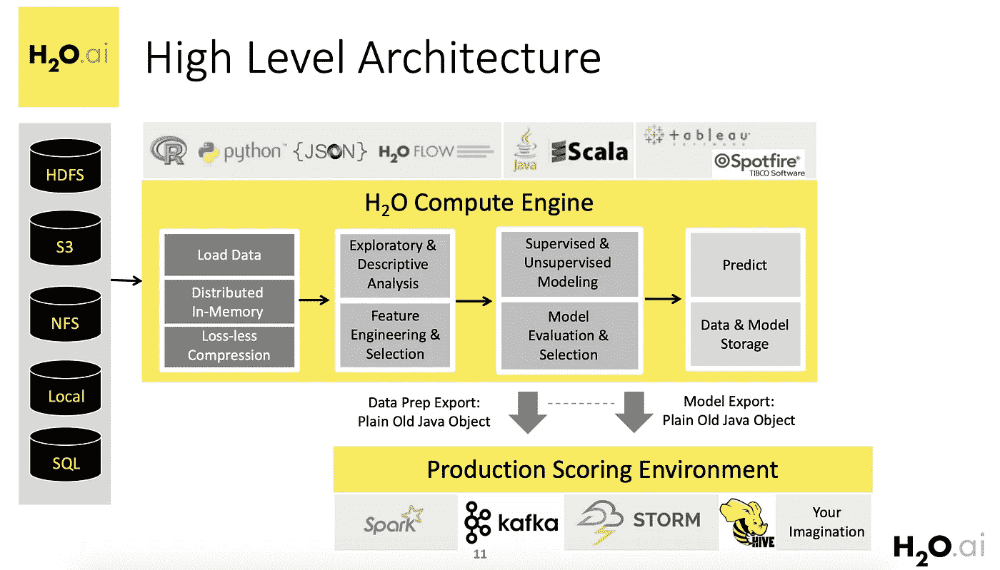
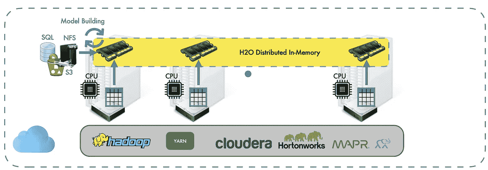

# 揭开 H2O.ai 的神秘面纱|概述

> 原文：<https://medium.com/analytics-vidhya/demystifying-h2o-ai-an-overview-debc08850e20?source=collection_archive---------1----------------------->


## 介绍

H2O.ai 是一个开源的机器学习平台，最近受到了很多关注，这是有原因的。

*   H2O 支持最广泛使用的统计和机器学习算法，广义线性模型，深度学习等等。
*   这使得计算速度极快，效率极高。

H2O 平台的关键是基于 ***的分布式内存计算*** 。这基本上意味着所有的计算、数据和机器学习中涉及的一切都发生在 H2O 集群本身的分布式内存中。

您可以将集群想象成一堆共享内存和计算的节点。节点可以是服务器、EC2 实例或您的笔记本电脑。这比用一个实例进行机器学习并将内容加载到 python 内存中的传统方法更有优势。H2O 的核心代码是用 Java 编写的，这给了它额外的速度提升。H2O 的这些独特功能有助于更快地进行机器学习，并完美地处理大量数据。

这篇文章是为人类揭开 H2O.ai 神秘面纱系列文章的一部分:)

第 1 部分:揭开 H2O.ai 的神秘面纱|概述

[第 2 部分:使用 Python 揭开 H2O.ai 的神秘面纱](/@rehan_ahmad/demystifying-h2o-ai-using-python-a85986e918d7)

[第 3 部分:揭开 H2O.ai |使用 H2O 流的神秘面纱](/@rehan_ahmad/demystifying-h2o-ai-using-h2o-flow-c580f64bee82)

[第四部分:揭秘 H2O.ai |生产化](/@rehan_ahmad/demystifying-h2o-ai-productionizing-2d4596b1a895)

让我们看看 H2O 的不同方面。



***数据导入到 H2O:***

H2O 支持许多常见的数据导入格式，如本地文件系统，远程文件，SQL，S3，HDFS，JDBC 和配置单元。

***H2O 界面支持:***

H2O 为 Scala、Python、R 等语言提供了扩展接口。这意味着我们可以用我们知道的语言编写代码，框架会将代码翻译成 Java 代码在集群上运行，并以我们编写代码的语言返回结果。

***H2O 算法支持:***

H2O 框架支持一系列算法，经过精心优化，以充分利用底层分布式框架。

*支持的算法:*分布式随机森林、线性回归、逻辑回归、XGBoost、梯度推进机、深度学习(带反向传播和随机梯度下降的多层感知器)、K 均值聚类、PCA、朴素贝叶斯分类器和 word2vec。它还支持堆叠和集成，以充分利用单个算法。

***H2O 帧中的数据操作(如熊猫和 R)* :**

H2O 框架中支持的数据操作有合并两个数据集的列、合并两个数据集的行、填充 Nas、分组、输入数据、合并两个数据集、旋转表、替换框架中的值、分割列、分割行、排序列、将数据集分割成训练/测试/验证和目标编码。

***H2O 支持的指标:***

度量是基于我们正在处理的机器学习问题的类型(回归或分类)自动检测的。在训练结束时，它会提供带有一系列衡量模型性能的指标的结果。

对于基于回归的问题:R2 评分，RMSE，均方误差，平均误差等。

对于分类问题:AUC，对数损失，准确性，F1，F2 得分，基尼系数，混淆矩阵。

***H2O 的汽车特征:***

H2O 有一个自动选项，可以为任何给定的数据找到最佳模型。H2O AutoML 功能依赖于必须安装的 pandas 模块。这可以通过简单地调用 H2OAutoML()来调用。可以使用类似 tensorboard 的仪表板查看结果。

***生产化*** :

在建模阶段的最后，H2O 提供了将模型保存为 POJOs 或 MOJOs 的功能。

***POJO*** *-普通旧 Java objec****MOJO****-模型对象，优化后*

通过在这些对象上编写包装类，可以在任何安装了 java 的生产环境中使用这些对象进行预测。

***支持 H2O 的要求* :**

操作系统-Windows 7 或更高版本、OS X 10.9 或更高版本、Ubuntu 12.04 或更高版本、CentOS 6 或更高版本。Java 7 或更高版本是安装和运行 H2O 的基本要求。

# 设置 H2O 多节点集群:



**第一步**

下载 H2O，包括。jar，转到 H2O 下载页面，选择适合您的环境的版本。

**第二步**

确保每个主机上都有相同的 h2o.jar 文件。

**第三步**

让多个 H2O 节点找到彼此的最佳方式是提供一个平面文件，其中列出了节点集。

用每个 H2O 实例的 IP 和端口创建一个 flatfile.txt。每行放一个条目。例如:

```
192.168.1.163:54321
192.168.1.164:54321
```

(注意-flatfile 选项告诉一个 H2O 节点在哪里可以找到其他节点。它不能替代-ip 和-port 规范。)

**第四步**

将 flatfile.txt 复制到集群中的每个节点。

**第五步**

java 命令行中的 Xmx 选项指定分配给一个 H2O 节点的内存量。集群的内存容量是集群中所有 H2O 节点的总和。

例如，如果用户创建一个具有四个 20g 节点的集群(通过指定 Xmx20g)，H2O 将拥有总共 80g 的可用内存。

为了获得最佳性能，我们建议将集群的大小设置为数据大小的四倍左右(但是为了避免交换，Xmx 不能大于任何给定节点上的物理内存)。强烈建议给所有节点相同的内存量(H2O 最适合对称节点)。

请注意，可选的-ip(在下面的示例中未显示)和-port 选项告诉此 H2O 节点要绑定到什么 ip 地址和端口(使用端口和端口+1)。-ip 选项对于具有多个网络接口的主机尤其有用。

```
$ java -Xmx20g -jar h2o.jar -flatfile flatfile.txt -port 54321
```

您将看到类似如下的输出:

```
08:35:33.553 main      INFO WATER: ----- H2O started -----
08:35:33.555 main      INFO WATER: Build git branch: master
08:35:33.555 main      INFO WATER: Build git hash: f253798433c109b19acd14cb973b45f255c59f3f
08:35:33.555 main      INFO WATER: Build git describe: f253798
08:35:33.555 main      INFO WATER: Build project version: 1.7.0.520
08:35:33.555 main      INFO WATER: Built by: 'jenkins'
08:35:33.555 main      INFO WATER: Built on: 'Thu Sep 12 00:01:52 PDT 2013'
08:35:33.556 main      INFO WATER: Java availableProcessors: 32
08:35:33.558 main      INFO WATER: Java heap totalMemory: 1.92 gb
08:35:33.559 main      INFO WATER: Java heap maxMemory: 17.78 gb
08:35:33.559 main      INFO WATER: ICE root: '/tmp/h2o-tomk'
08:35:33.580 main      INFO WATER: Internal communication uses port: 54322
+                                  Listening for HTTP and REST
                                   traffic
                                   on  [http://192.168.1.163:54321/](http://192.168.1.163:54321/)
08:35:33.613 main      INFO WATER: H2O cloud name: 'MyClusterName'
08:35:33.613 main      INFO WATER: (v1.7.0.520) 'MyClusterName' on /192.168.1.163:54321, static configuration based on -flatfile flatfile.txt
08:35:33.615 main      INFO WATER: Cloud of size 1 formed [/192.168.1.163:54321]
08:35:33.747 main      INFO WATER: Log dir: '/tmp/h2o-tomk/h2ologs'
```

当您向群集中添加更多节点时，H2O 输出将通知您:

```
INFO WATER: Cloud of size 2 formed [/...]...
```

**第六步(可选)**

使用您的浏览器访问 H2O 网络用户界面。将您的浏览器指向由**给出的 HTTP 链接，“在 H2O 输出中监听 HTTP 和 REST 流量…”**。

## **如何连接到 H2O 的多节点集群**:

使用上述步骤创建集群后，从输出中获取 IP 地址和端口号。

```
INFO WATER: Internal communication uses port: Listening for HTTP and REST traffic on  [http://192.168.1.163:54321/](http://192.168.1.163:54321/)
```

步骤 1:从你的 python 脚本或笔记本中，导入 H2O 模块

```
*# Import module*
**import** **h2o**
```

步骤 2:使用 IP 地址连接到 H2O 集群

```
*# In order to connect to a H2O cluster in the cloud, you need to specify the IP address*
h2o.connect(ip = "xxx.xxx.xxx.xxx") *# fill in the real IP*
```

这就是我们需要做的一切。现在，我们可以从任何本地机器的 python 笔记本中利用集群的速度和计算能力。

*注意:在笔记本中完成的数据和数据操作实际上并不存储在 python 内存中，而是存储在集群本身上(分布在节点中),在 python 笔记本中只使用指针来引用数据。*

阅读系列文章，了解更多关于 H2O 平台的信息。

> 关于我

我是 [Wavelabs.ai](https://wavelabs.ai/) 的资深机器学习专家。我们 Wavelabs 帮助您利用人工智能(AI)来彻底改变用户体验并降低成本。我们使用人工智能独特地增强您的产品，以达到您的全部市场潜力。我们试图将尖端研究引入您的应用中。

我们擅长与 H2O 平台合作，为您提供前所未有的快速、可扩展的机器学习体验。

欢迎访问 [Wavelabs.ai](https://wavelabs.ai/) 了解更多信息

嗯，这些都在这个博客里。感谢阅读:)

保持好奇！

你可以通过 [LinkedIn](https://www.linkedin.com/in/rehan-a-18675296) 联系我。