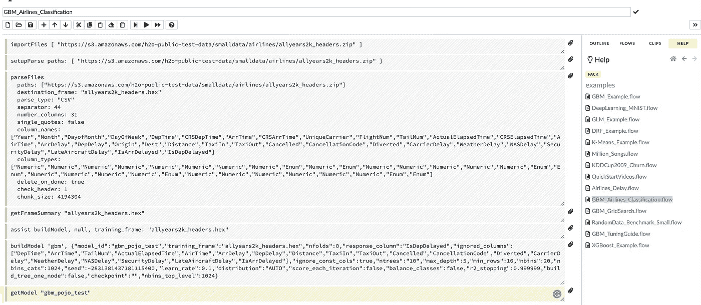
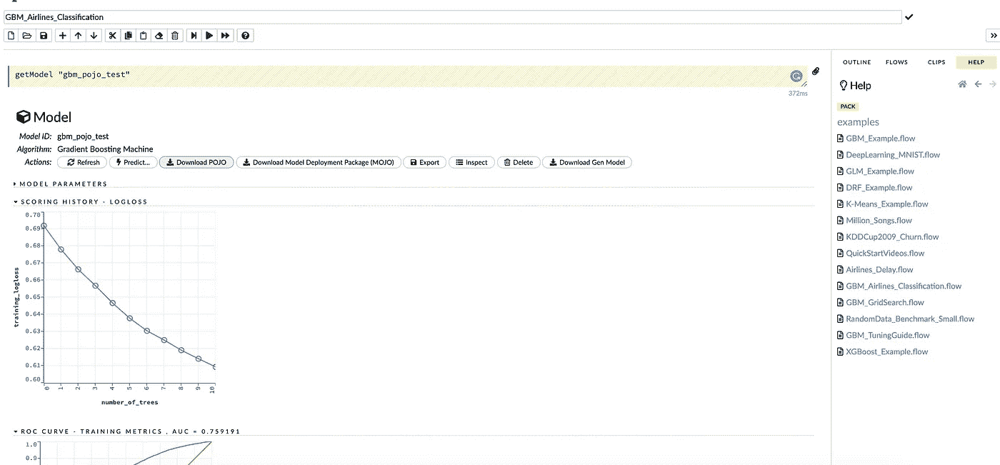

# 揭秘 H2O.ai |生产化

> 原文：<https://medium.com/analytics-vidhya/demystifying-h2o-ai-productionizing-2d4596b1a895?source=collection_archive---------3----------------------->


在“揭秘 H2O”系列的前几篇文章中，我介绍了 H2O 的概述，如何在 python 中使用 H2O，以及如何为使用 H2O 的 Flow 接口的非程序员使用 H2O。

这篇文章是为人类揭开 H2O.ai 神秘面纱系列文章的一部分:)

[第 1 部分:揭开 H2O.ai 的神秘面纱|概述](/@rehan_ahmad/demystifying-h2o-ai-an-overview-debc08850e20)

[第 2 部分:使用 Python 揭开 H2O.ai 的神秘面纱](/@rehan_ahmad/demystifying-h2o-ai-using-python-a85986e918d7)

[第三部分:揭开 H2O.ai |使用 H2O 流的神秘面纱](/@rehan_ahmad/demystifying-h2o-ai-using-h2o-flow-c580f64bee82)

第 4 部分:揭开 H2O.ai |产品化的神秘面纱

现在在这篇文章中，让我们看看如何生产我们从 H2O 得到的模型的例子。这篇文章的目标是开发一个简单的基于 H2O 的预测模型，将它转换成一个普通的旧 Java 对象(POJO)，将它与其他 Java 包一起编译，并将编译后的类文件打包成一个可部署的 JAR 文件，这样它就可以很容易地部署到任何基于 Java 的应用服务器上。该模型将接受 CSV 文件形式的输入数据集，并返回 CSV 格式的预测输出。

在这个例子中，我使用的是 H2O 流程仪表板示例中的“GBM_Airlines_Classification”流程。如果你不知道如何使用 H2O 的心流，请浏览这个系列的前一篇文章。



按照流程运行每个单元，直到到达要获取模型的最后一个单元。

步骤 1:将 POJO 对象下载到本地系统(下载文件夹)。



第二步:在*新的*终端窗口中下载模型。请注意，H2O 必须仍在终端窗口#1 中运行:

```
$ mkdir experiment
$ cd experiment
$ mv ~/Downloads/gbm_pojo_test.java .
$ curl http://localhost:54321/3/h2o-genmodel.jar > h2o-genmodel.jar
```

第三步:在终端窗口#2 中创建一个名为 main.java(`vim main.java`)的新文件，包含以下内容:

```
**import** java.io.*****;
**import** hex.genmodel.easy.RowData;
**import** hex.genmodel.easy.EasyPredictModelWrapper;
**import** hex.genmodel.easy.prediction.*****;

public **class** **main** {
  private static String modelClassName **=** "gbm_pojo_test";

  public static void main(String[] args) throws **Exception** {
    hex**.**genmodel**.**GenModel rawModel;
    rawModel **=** (hex**.**genmodel**.**GenModel) Class**.**forName(modelClassName)**.**newInstance();
    EasyPredictModelWrapper model **=** new EasyPredictModelWrapper(rawModel);

    RowData row **=** new RowData();
    row**.**put("Year", "1987");
    row**.**put("Month", "10");
    row**.**put("DayofMonth", "14");
    row**.**put("DayOfWeek", "3");
    row**.**put("CRSDepTime", "730");
    row**.**put("UniqueCarrier", "PS");
    row**.**put("Origin", "SAN");
    row**.**put("Dest", "SFO");

    BinomialModelPrediction p **=** model**.**predictBinomial(row);
    System**.**out**.**println("Label (aka prediction) is flight departure delayed: " **+** p**.**label);
    System**.**out**.**print("Class probabilities: ");
    **for** (int i **=** 0; i **<** p**.**classProbabilities**.**length; i**++**) {
      **if** (i **>** 0) {
        System**.**out**.**print(",");
      }
      System**.**out**.**print(p**.**classProbabilities[i]);
    }
    System**.**out**.**println("");
  }
}
```

步骤 4:在终端窗口 2 中编译 POJO。

```
$ javac -cp h2o-genmodel.jar -J-Xmx2g -J-XX:MaxPermSize=128m gbm_pojo_test.java main.java
```

步骤 5:在终端窗口 2 中运行 POJO。

```
For Linux and OS X users: 
$ java -cp .:h2o-genmodel.jar mainFor Windows users: 
$ java -cp .;h2o-genmodel.jar main--------------------------------------------------------------------
Output:
Label (aka prediction) **is** flight departure delayed: YES
Class probabilities: 0.4319916897116479,0.5680083102883521
```

这个帖子是在生产中使用 POJO 文件的方法之一。把它想象成一个 java 对象，适用于任何 Java 对象的所有细微差别也适用于这个对象。

希望这些关于 H2O 的系列能给你足够的信息和清晰的画面，让你开始。

H2O 似乎是任何人的技术堆栈中的一个强大工具，尤其是在没有 GPU 的情况下处理大量数据时。此外，这将是一个很酷的技术，会让你从你的同行中脱颖而出。

> 关于我

我是 [Wavelabs.ai](https://wavelabs.ai/) 的资深机器学习专家。我们 Wavelabs 帮助您利用人工智能(AI)来彻底改变用户体验并降低成本。我们使用人工智能独特地增强您的产品，以达到您的全部市场潜力。我们试图将尖端研究引入您的应用中。

我们擅长与 H2O 平台合作，为您提供前所未有的快速、可扩展的机器学习体验。

欢迎访问 [Wavelabs.ai](https://wavelabs.ai/) 了解更多信息。

保持好奇！

你可以在 [LinkedIn](https://www.linkedin.com/in/rehan-a-18675296) 上联系我。