# 揭秘 H2O.ai |使用 H2O 流

> 原文：<https://medium.com/analytics-vidhya/demystifying-h2o-ai-using-h2o-flow-c580f64bee82?source=collection_archive---------2----------------------->


## 介绍

H2O 流是 H2O 的一个开源用户界面。它是一个基于 web 的交互式环境，允许您将代码执行、文本、数学、情节和富媒体结合到一个文档中。

在这篇文章中，我将向你介绍 H2O 流。这篇文章是为人类揭开 H2O.ai 神秘面纱系列文章的一部分:)

[第 1 部分:揭开 H2O.ai 的神秘面纱|概述](/@rehan_ahmad/demystifying-h2o-ai-an-overview-debc08850e20)

[第 2 部分:使用 Python 揭开 H2O.ai 的神秘面纱](/@rehan_ahmad/demystifying-h2o-ai-using-python-a85986e918d7)

第 3 部分:使用 H2O 流揭开 H2O.ai 的神秘面纱

[第四部分:揭秘 H2O.ai |生产化](/@rehan_ahmad/demystifying-h2o-ai-productionizing-2d4596b1a895)

通过 H2O 流程，用户可以捕获、重新运行、注释、展示和共享他们的工作流。H2O 流允许我们交互地使用 H2O 来导入文件，构建模型，并迭代地改进它们。基于您的模型，您可以进行预测并添加丰富的文本来创建您的作品的插图-所有这些都在 Flow 的基于浏览器的环境中进行。

H2O 流将命令作为可执行单元的序列发送给 H2O。可以对单元格进行修改、重新排列或保存到库中。每个单元格都包含一个输入字段，允许您输入命令、定义函数、调用其他函数以及访问页面上的其他单元格或对象。当您执行该单元时，输出是一个图形对象，可以对其进行检查以查看其他详细信息。

运行 H2O 流不需要编程经验。您可以通过点击完成任何 H2O 操作，而无需编写任何代码。您甚至可以禁用输入单元格，仅使用 GUI 运行 H2O 流。

***安装 H2O:***

1.下载 [H2O](http://h2o-release.s3.amazonaws.com/h2o/rel-xu/6/index.html) 。这是一个 zip 文件，包含入门所需的一切。

2.从您的终端运行:

```
cd ~/Downloads
unzip h2o-3.22.1.6.zip
cd h2o-3.22.1.6
java -jar h2o.jar
```

3.将您的浏览器指向 [http://localhost:54321](http://localhost:54321/) 以打开 H2O 流仪表板页面。

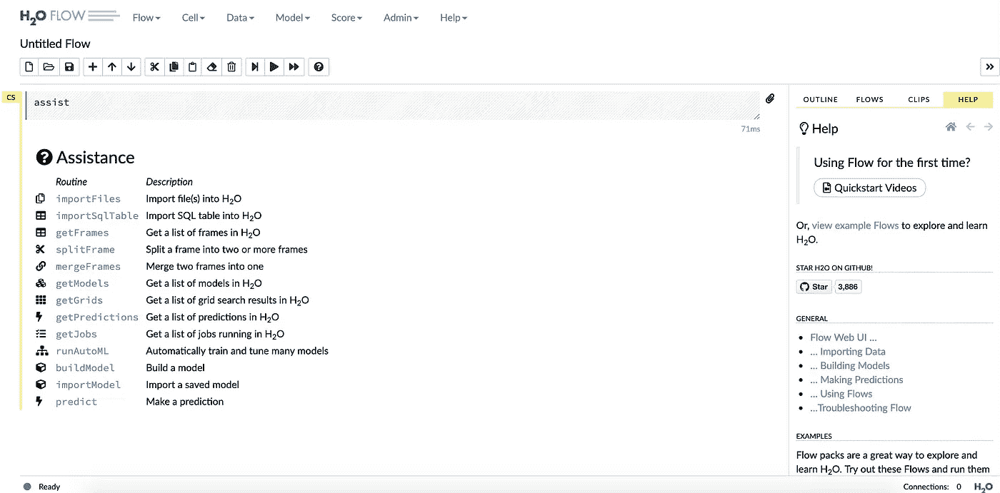

H2O 流程旨在通过提供输入提示、交互式帮助和示例流程来指导您的每一步。所以我不打算解释这个流接口的每个特性。我将运行上一篇 python API 文章中的一个简单的回归示例，但没有编写一行代码。

*注意:所有接口(Python、R、Scala 等)以及 H2O 流都具有完整的特性和功能。所以你在上一篇文章中看到的每一个特性和定制在 Flow 中也是可用的。*

步骤 1:导入文件到 H2O。

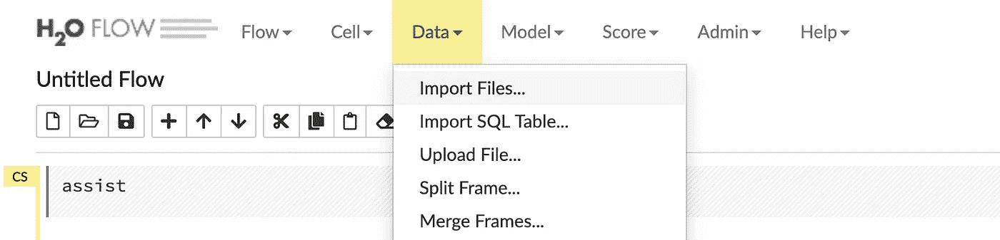

提供 web 源或本地文件，以便将数据导入 H2O。

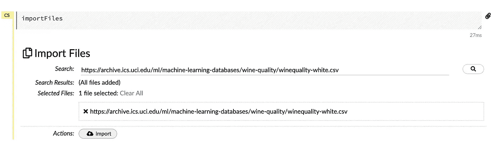

下一步是解析导入的文件。

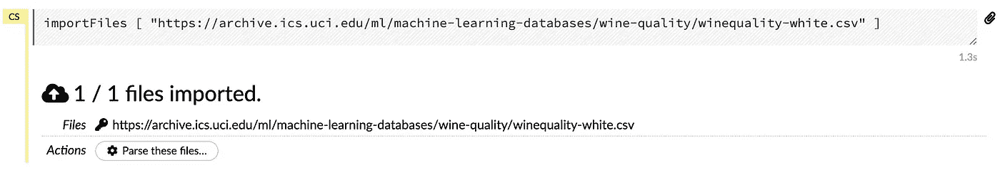

如果需要，H2O 提供了更改自动解析数据的功能。我们还可以指定如何进行解析。

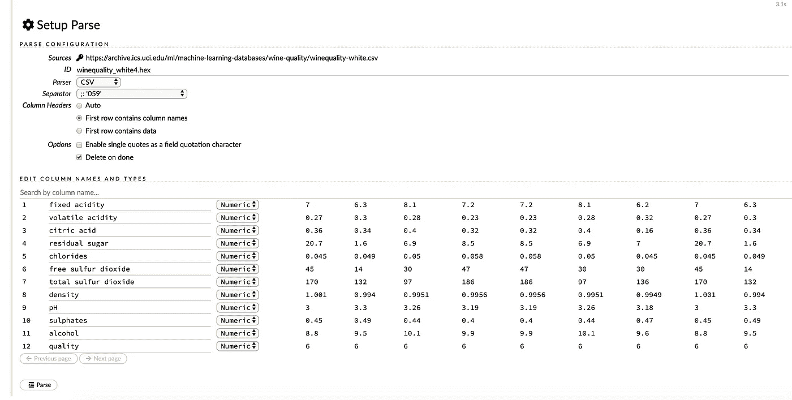

这将接收文件并创建 H2O 数据帧。

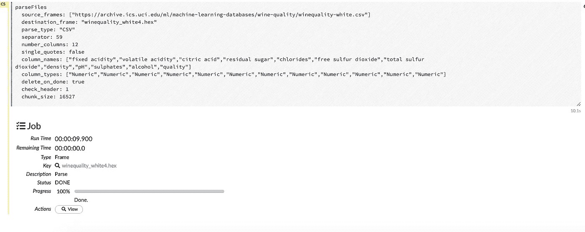

当我们查看数据框时，我们会得到一组可应用于数据框的选项。

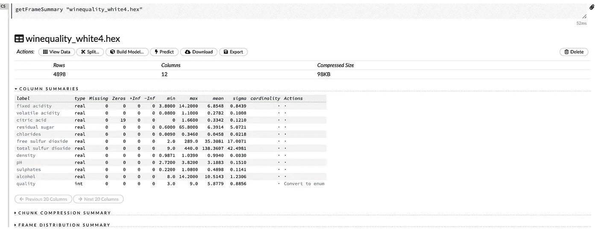

下一步是将数据帧分成训练集和测试集。我们点击“分割”按钮来完成。

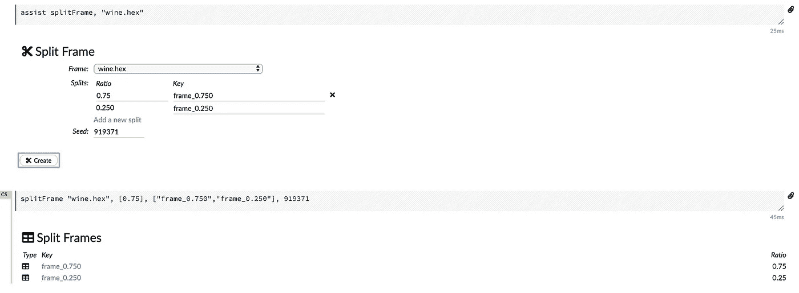

现在训练集是 frame_0.750，测试集是 frame_0.250。现在，单击“构建模型”按钮选择算法。

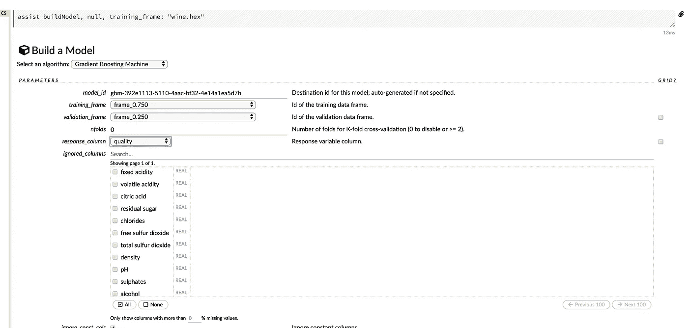

有一大堆设置/参数/超参数可供调整。我将在这里使用默认设置。但是一定要确定分配训练帧、验证帧和响应列。在所有设置结束时，单击“建立模型”按钮。

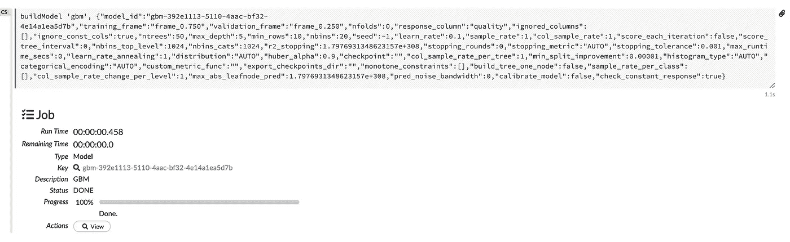

如您所见，由于集群的集体性能，处理时间非常快。

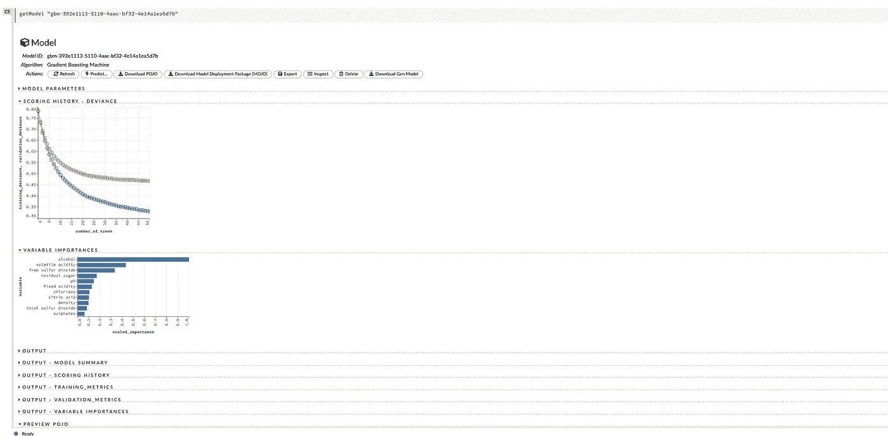

单击 view 为我们提供了一个模型对象的漂亮仪表板，其中有许多有用的功能。

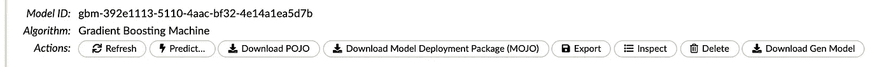

下载 POJO，MOJO 为我们提供了带有模型权重和参数的 java 对象，可用于在任何运行生产环境的 java 中编写包装类进行预测。

这篇文章简要介绍了如何不用写一行代码就能使用 H2O 的 Flow 接口。这对于对编程知之甚少的领域专家来说非常有用，他们可以快速构建模型。H2O 通过交互式帮助和提示来引导我们前进，使它变得非常简单和方便。

阅读系列文章，了解更多关于 H2O 平台的信息。

> 关于我

我是 [Wavelabs.ai](https://wavelabs.ai/) 的资深机器学习专家。我们 Wavelabs 帮助您利用人工智能(AI)来彻底改变用户体验并降低成本。我们使用人工智能独特地增强您的产品，以达到您的全部市场潜力。我们试图将尖端研究引入您的应用中。

我们擅长与 H2O 平台合作，为您提供前所未有的快速、可扩展的机器学习体验。

在 [Wavelabs.ai](https://wavelabs.ai/) 随意探索更多。

嗯，这些都在这个博客里。感谢阅读:)

保持好奇！

你可以在 [LinkedIn](https://www.linkedin.com/in/rehan-a-18675296) 上联系我。