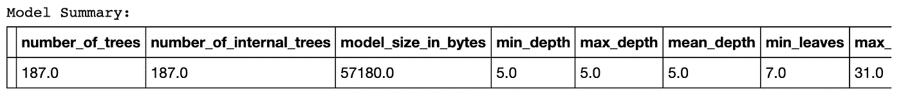

# 揭秘 H2O.ai |使用 Python

> 原文：<https://medium.com/analytics-vidhya/demystifying-h2o-ai-using-python-a85986e918d7?source=collection_archive---------0----------------------->


在“揭开 H2O 的神秘面纱”系列的前一篇文章中，我提供了 H2O 及其建筑的概述。现在让我们看看使用 H2O 的 pythonic 方式。

这篇文章是为人类揭开 H2O.ai 神秘面纱系列文章的一部分:)

[第 1 部分:揭开 H2O.ai 的神秘面纱|概述](/@rehan_ahmad/demystifying-h2o-ai-an-overview-debc08850e20)

第 2 部分:使用 Python 揭开 H2O.ai 的神秘面纱

[第三部分:揭秘 H2O.ai |使用 H2O 流](/@rehan_ahmad/demystifying-h2o-ai-using-h2o-flow-c580f64bee82)

[第四部分:揭秘 H2O.ai |生产化](/@rehan_ahmad/demystifying-h2o-ai-productionizing-2d4596b1a895)

H2O 为 Python 开发者提供了一个与 H2O 集群交互的接口。通过 Python API，我们可以调用负责集群中机器学习的 java 代码。

# 安装依赖关系 ***:***

***安装 H2O:***

1.下载 H2O 。这是一个 zip 文件，包含入门所需的一切。

2.从您的终端运行:

```
cd ~/Downloads
unzip h2o-3.22.1.6.zip
cd h2o-3.22.1.6
java -jar h2o.jar
```

3.将您的浏览器指向 [http://localhost:54321](http://localhost:54321/)

***安装 H2O Python API:***

1.先决条件:Python 2.7.x、3.5.x 或 3.6.x

2.安装依赖项(如果需要，在前面加上' sudo '):

```
pip install requests
pip install tabulate
pip install “colorama>=0.3.8”
pip install future
```

3.在命令行中，一次复制并粘贴一行命令:

```
# The following command removes the H2O module for Python.
pip uninstall h2o# Next, use pip to install this version of the H2O Python module.
pip install [http://h2o-release.s3.amazonaws.com/h2o/rel-xu/6/Python/h2o-3.22.1.6-py2.py3-none-any.whl](http://h2o-release.s3.amazonaws.com/h2o/rel-xu/6/Python/h2o-3.22.1.6-py2.py3-none-any.whl)
```

# 将数据加载到数据框架

我们要看的例子是基于一些数字属性预测白葡萄酒质量的回归问题。

您可以从以下网址下载 CSV 文件形式的数据集:

```
[https://archive.ics.uci.edu/ml/machine-learning-databases/wine-quality/winequality-white.csv](https://archive.ics.uci.edu/ml/machine-learning-databases/wine-quality/winequality-white.csv)
```

让我们看看将数据加载到 H2O 数据框架的不同方法。

*注:H2O 数据帧类似于 Pandas 或 R 数据帧，但驻留在 H2O 共享内存簇中。由于它驻留在内存中，所有操作都非常快。*

**方法 1** :从本地文件加载 CSV。

```
# Method 1 - Import data from a local CSV file
data_from_csv = h2o.import_file("winequality-white.csv")
data_from_csv.head(5)
```

**方法 2** :从任何外部 web 源加载数据

```
*# Method 2 - Import data from the web*data_from_web **=** h2o.import_file("https://archive.ics.uci.edu/ml/machine-learning-databases/wine-quality/winequality-white.csv")data_from_web.head(5)
```

**方法三**:从熊猫数据帧加载数据到 H2O 帧

```
# Method 3 - Convert Python data frame into H2O data frame## Import Wine Quality data using Pandas
import pandas as pd
wine_df = pd.read_csv('winequality-white.csv', sep = ';')
wine_df.head(5)
## Convert Pandas data frame into H2O data frame
data_from_df = h2o.H2OFrame(wine_df)
data_from_df.head(5)
```

# 数据帧上的基本操作

现在我们已经看到了加载数据集的不同方法，让我们继续我们的例子。

```
wine = h2o.import_file("winequality-white.csv")
```

*注意:“wine”数据帧不保存到 python 内存中，而是驻留在 H2O 集群内存中，只有指向数据的指针驻留在 python 内存中。*

让我们看看我们正在处理的所有特性。我们的目标特征是“质量”。

```
# Define features (or predictors)
features = list(wine.columns) # we want to use all the information
features.remove('quality')    # we need to exclude the target 
                               'quality' (otherwise there is nothing 
                                to predict)
featuresOutput:['fixed acidity',
 'volatile acidity',
 'citric acid',
 'residual sugar',
 'chlorides',
 'free sulfur dioxide',
 'total sulfur dioxide',
 'density',
 'pH',
 'sulphates',
 'alcohol']
```

为了检查模型性能，我们可以将数据分成训练集和测试集。这个功能可以使用 split_frame()函数来实现。

```
# Split the H2O data frame into training/test sets
# so we can evaluate out-of-bag performance
wine_split = wine.split_frame(ratios = [0.8], seed = 1234)wine_train = wine_split[0] # using 80% for training
wine_test = wine_split[1]  # using the rest 20% for out-of-bag 
                             evaluation
```

wine_train.shape，wine_test.shape

```
(3932, 12) (966, 12)
```

# 在 H2O 平台上建立模型

既然我们的数据被很好地分割了，是时候进行一些建模了。对于这个例子，我选择使用 GBM(梯度推进机器),但是你可以使用 H2O 平台支持的任何可用算法。

让我们使用默认设置来尝试 GBM 模型，以获得一个基础模型来比较优化后的性能。

```
# Build a Gradient Boosting Machines (GBM) model with default 
                                                     settings# Import the function for GBM
from h2o.estimators.gbm import H2OGradientBoostingEstimator# Set up GBM for regression
# Add a seed for reproducibility
gbm_default = H2OGradientBoostingEstimator(model_id = 'gbm_default', seed = 1234)# Use .train() to build the model
gbm_default.train(x = features, 
                  y = 'quality', 
                  training_frame = wine_train)
# Check the GBM model summary
gbm_default
--------------------------------------------------------------------Output:
gbm Model Build progress: |███████████████████████████████████████████████| 100%
Model Details
=============
H2OGradientBoostingEstimator :  Gradient Boosting Machine
Model Key:  gbm_default

ModelMetricsRegression: gbm
** Reported on train data. **

MSE: 0.33754946668043595
RMSE: 0.5809900745111193
MAE: 0.4582897982543992
RMSLE: 0.0859869651179757
Mean Residual Deviance: 0.33754946668043595
```

正如你在输出中看到的，H2O 给出了一堆为回归问题自动定制的指标。输出还包含评分历史和特性重要性，由于篇幅限制，我选择不显示它们。

我们可以在模型没有看到的数据上检查模型的性能。

```
# Check the model performance on test dataset
gbm_default.model_performance(wine_test)
--------------------------------------------------------------------
Output:ModelMetricsRegression: gbm
** Reported on test data. **

MSE: 0.4569904494269438
RMSE: 0.6760106873614823
MAE: 0.5248612169030329
RMSLE: 0.10032043310648843
Mean Residual Deviance: 0.4569904494269438
```

为了根据我们的模型对未来数据进行预测，我们可以使用模型的 predict()函数传递未来数据。

```
# Use GBM model to make predictions
yhat_test_gbm = gbm_default.predict(wine_test)
yhat_test_gbm.head(5)
--------------------------------------------------------------------
Output:gbm prediction progress: |████████████████████████████████████████████████| 100%predict
5.78661
5.96088
5.32867
6.19424
5.7198
```

# 设置算法的超参数

让我们尝试改进我们的模型。一种方法是对算法使用手动设置。以下是一些可以调整的设置。我不打算解释每一个设定背后的理论，因为这篇文章的目的是集中在 H2O。

如果你需要了解更多关于提高模型性能和调整 GBM 算法的超参数，你可以参考下面的文章:[梯度增强机器中超参数调整(Python 中)](https://www.analyticsvidhya.com/blog/2016/02/complete-guide-parameter-tuning-gradient-boosting-gbm-python/)

```
# increase the number of trees for more accuracy
ntrees = 10000,# Row Random picking for more generalization
sample_rate = 0.9, # Columnar Random picking for more generalization
col_sample_rate = 0.9,# Add cross validation 
nfolds = 5,# Early stopping 
stopping_metric = 'mse', # let early stopping feature determine
stopping_rounds = 15,     # the optimal number of trees
score_tree_interval = 1
```

让我们看看具有这些设置的模型实例化函数调用。

```
# Build a GBM with manual settings, CV and early stopping# Set up GBM for regression
# Add a seed for reproducibility
gbm_manual_cv_es = H2OGradientBoostingEstimator(
                                      model_id = 'gbm_manual_cv_es', 
                                       seed = 1234,
                                       ntrees = 10000,
                                       sample_rate = 0.9,
                                       col_sample_rate = 0.9,
                                       nfolds = 5,
                                       stopping_metric = 'mse',
                                       stopping_rounds = 15,
                                       score_tree_interval = 1) 
# Use .train() to build the model
gbm_manual_cv_es.train(x = features, 
                       y = 'quality', 
                       training_frame = wine_train)
# Check the model summary
gbm_manual_cv_es.summary()
# Check the cross-validation model performance
gbm_manual_cv_es--------------------------------------------------------------------
Output:gbm Model Build progress: |███████████████████████████████████████████████| 100%
Model Details
=============
H2OGradientBoostingEstimator :  Gradient Boosting Machine
Model Key:  gbm_manual_cv_es

ModelMetricsRegression: gbm
** Reported on train data. **

MSE: 0.20686547419217588
RMSE: 0.4548246631309431
MAE: 0.34894778424095163
RMSLE: 0.06741983008017692
Mean Residual Deviance: 0.20686547419217588

ModelMetricsRegression: gbm
** Reported on cross-validation data. **

MSE: 0.43719485835036376
RMSE: 0.6612071221261638
MAE: 0.5071563697468089
RMSLE: 0.09876420394757868
Mean Residual Deviance: 0.43719485835036376
```

让我们在测试集上检查性能。

```
# Check the model performance on test dataset
gbm_manual_cv_es.model_performance(wine_test)
--------------------------------------------------------------------
Output:
ModelMetricsRegression: gbm
** Reported on test data. **

MSE: 0.426937189802319
RMSE: 0.6534043080683805
MAE: 0.49245882283169323
RMSLE: 0.09727407043431956
Mean Residual Deviance: 0.426937189802319
```

度量清楚地显示了模型性能的改进。

> 但是如何为手动设置获得一组完美的值呢？

# H2O 的网格搜索和随机搜索

一种方法是为每个设置分配一组值，运行所有组合并比较结果，以获得设置的最佳值集。这就是所谓的“网格搜索”。如果有太多的设置和太多的组合要运行，我们可以设置最大数量的组合来随机检查，以克服计算限制。这就是所谓的“随机网格搜索”。让我们看看如何在 H2O 做到这两点。

***网格搜索:***

首先设置搜索标准并定义超参数的值集。

*注意:设置、参数和超参数都是不同的术语，用于上下文中的同一事物。*

```
# define the criteria for full grid search
search_criteria = {'strategy': "Cartesian"}# define the range of hyper-parameters for grid search
hyper_params = {'sample_rate': [0.7, 0.8, 0.9],
                'col_sample_rate': [0.7, 0.8, 0.9]}
```

让我们看看网格搜索函数调用。

```
# Set up GBM grid search
# Add a seed for reproducibility
gbm_full_grid = H2OGridSearch(
                    H2OGradientBoostingEstimator(
                        model_id = 'gbm_full_grid', 
                        seed = 1234,
                        ntrees = 10000,   
                        nfolds = 5,
                        stopping_metric = 'mse', 
                        stopping_rounds = 15,     
                        score_tree_interval = 1),
                    search_criteria = search_criteria, 
                    hyper_params = hyper_params)# Use .train() to start the grid search
gbm_full_grid.train(x = features, 
                    y = 'quality', 
                    training_frame = wine_train)
```

现在要获得具有最佳超参数集的最佳模型。

```
# Extract the best model from full grid search
gbm_full_grid_sorted = gbm_full_grid.get_grid(sort_by='mse', decreasing=False)
best_model_id = gbm_full_grid_sorted.model_ids[0]
best_gbm_from_full_grid = h2o.get_model(best_model_id)
best_gbm_from_full_grid.summary()
```



```
# Check the model performance on test dataset
best_gbm_from_full_grid.model_performance(wine_test)
--------------------------------------------------------------------
Output:
ModelMetricsRegression: gbm
** Reported on test data. **

MSE: 0.4225488547806245
RMSE: 0.6500375795141574
MAE: 0.49083490901261195
RMSLE: 0.09684966383616216
Mean Residual Deviance: 0.4225488547806245
```

***随机网格搜索:***

要将网格搜索变成随机网格搜索，我们需要做的唯一更改是将搜索类别更改为“RandomDiscrete ”,并将 max_models 参数添加到搜索标准中。

```
*# define the criteria for random grid search* 
search_criteria = {'strategy': "RandomDiscrete", 
                 'max_models': 9,  
                       'seed': 1234}
```

之后，你可以添加更多的设置和更多的组合。

```
*# define the range of hyper-parameters for grid search* *# 27 combinations in total* 
hyper_params = {'sample_rate': [0.7, 0.8, 0.9],  
                'col_sample_rate': [0.7, 0.8, 0.9],     
                'max_depth': [3, 5, 7]}
```

在这一步之后，它与上面看到的代码非常相似。让我们来看看结果。

```
# Check the model performance on test dataset
best_gbm_from_rand_grid.model_performance(wine_test)
--------------------------------------------------------------------
ModelMetricsRegression: gbm
** Reported on test data. **

MSE: 0.38887438717699785
RMSE: 0.6235979371173367
MAE: 0.45221978663123497
RMSLE: 0.09308978440162519
Mean Residual Deviance: 0.38887438717699785
```

显然，这是对基本模型性能的巨大改进。H2O 提供了更多这样的优化功能，以提高大规模的模型性能。

# 在 H2O 堆垛

H2O 还提供了一个签名功能来堆叠不同的模型，以获得最先进的结果。这尤其有助于赢得卡格尔比赛。

*:*

*首先，让我们尝试使用不同的估计量建立最佳模型。在这个例子中，我使用网格搜索创建了最佳 GBM、DRF 和 DNN 模型。*

**GBM 型号:**

```
**# define the range of hyper-parameters for GBM grid search*
*# 27 combinations in total*
hyper_params = {'sample_rate': [0.7, 0.8, 0.9],
                'col_sample_rate': [0.7, 0.8, 0.9],
                'max_depth': [3, 5, 7]}
*# Set up GBM grid search*
*# Add a seed for reproducibility*
gbm_rand_grid = H2OGridSearch(
                    H2OGradientBoostingEstimator(
                        model_id = 'gbm_rand_grid', 
                        seed = 1234,
                        ntrees = 10000,   
                        nfolds = 5,
                        fold_assignment = "Modulo",               
                        keep_cross_validation_predictions = **True**, 
                        stopping_metric = 'mse', 
                        stopping_rounds = 15,     
                        score_tree_interval = 1),
                    search_criteria = search_criteria, 
                    hyper_params = hyper_params)
*# Use .train() to start the grid search*
gbm_rand_grid.train(x = features, 
                    y = 'quality', 
                    training_frame = wine_train)
gbm_rand_grid_sorted = gbm_rand_grid.get_grid(sort_by='mse', decreasing=**False**)
 *# Extract the best model from random grid search* best_gbm_model_id = gbm_rand_grid_sorted.model_ids[0] best_gbm_from_rand_grid = h2o.get_model(best_gbm_model_id)*
```

**DRF 车型*:*

```
**# define the range of hyper-parameters for DRF grid search* *# 27 combinations in total* 
hyper_params = {'sample_rate': [0.5, 0.6, 0.7], 
                'col_sample_rate_per_tree': [0.7, 0.8, 0.9],    
             'max_depth': [3, 5, 7]}
*# Set up DRF grid search*
*# Add a seed for reproducibility*
drf_rand_grid = H2OGridSearch(
                    H2ORandomForestEstimator(
                        model_id = 'drf_rand_grid', 
                        seed = 1234,
                        ntrees = 200,   
                        nfolds = 5,
                        fold_assignment = "Modulo",                 
                        keep_cross_validation_predictions = **True**),  
                    search_criteria = search_criteria, 
                    hyper_params = hyper_params)
*# Use .train() to start the grid search*
drf_rand_grid.train(x = features, 
                    y = 'quality', 
                    training_frame = wine_train)
drf_rand_grid_sorted = drf_rand_grid.get_grid(sort_by='mse', decreasing=**False**)
 *# Extract the best model from random grid search* best_drf_model_id = drf_rand_grid_sorted.model_ids[0] best_drf_from_rand_grid = h2o.get_model(best_drf_model_id)*
```

**DNN 模式*:*

```
**# define the range of hyper-parameters for DNN grid search*
*# 81 combinations in total*
hyper_params = {'activation': ['tanh', 'rectifier', 'maxout'],
                'hidden': [[50], [50,50], [50,50,50]],
                'l1': [0, 1e-3, 1e-5],
                'l2': [0, 1e-3, 1e-5]}
*# Set up DNN grid search*
*# Add a seed for reproducibility*
dnn_rand_grid = H2OGridSearch(
                    H2ODeepLearningEstimator(
                        model_id = 'dnn_rand_grid', 
                        seed = 1234,
                        epochs = 20,   
                        nfolds = 5,
                        fold_assignment = "Modulo",                
                        keep_cross_validation_predictions = **True**), 
                    search_criteria = search_criteria, 
                    hyper_params = hyper_params)
*# Use .train() to start the grid search*
dnn_rand_grid.train(x = features, 
                    y = 'quality', 
                    training_frame = wine_train)
dnn_rand_grid_sorted = dnn_rand_grid.get_grid(sort_by='mse', decreasing=**False**)*# Extract the best model from random grid search*
best_dnn_model_id = dnn_rand_grid_sorted.model_ids[0]
best_dnn_from_rand_grid = h2o.get_model(best_dnn_model_id)*
```

**模型堆叠:**

```
**# Define a list of models to be stacked*
*# i.e. best model from each grid*
all_ids = [best_gbm_model_id, best_drf_model_id, best_dnn_model_id]*# Set up 
Stacked Ensemble* ensemble = H2OStackedEnsembleEstimator(
                                           model_id = "my_ensemble",
                                        base_models = all_ids)*# use .train to start model stacking*
*# GLM as the default metalearner*
ensemble.train(x = features, 
               y = 'quality', 
               training_frame = wine_train)
ensemble.model_performance(wine_test)
--------------------------------------------------------------------
Output:
Stacked Ensembles        (MSE) :  0.39948493548786057*
```

*上面的例子广泛地涉及了回归问题，但是分类也是同样的代码。H2O 自动根据目标变量的类型检测它是回归还是分类。如果它是一个类别，它将调用分类代码，如果它是一个数字变量，它将调用回归。指定二进制或多类仅仅是实例化调用中一个族属性的改变。*

```
**# Set up GLM for binary classification*
glm_default = H2OGeneralizedLinearEstimator(family = 'binomial', model_id = 'glm_default')*
```

*这篇文章清楚地展示了使用 Python API 调用 H2O 代码是多么容易，以及 H2O 提供了多少复杂性来完成机器学习活动。*

*阅读系列文章，了解更多关于 H2O 平台的信息。*

> *关于我*

*我是 [Wavelabs.ai](https://wavelabs.ai/) 的资深机器学习专家。我们 Wavelabs 帮助您利用人工智能(AI)来彻底改变用户体验并降低成本。我们使用人工智能独特地增强您的产品，以达到您的全部市场潜力。我们试图将尖端研究引入您的应用中。*

*我们擅长与 H2O 平台合作，为您提供前所未有的快速、可扩展的机器学习体验。*

*欢迎访问 [Wavelabs.ai](https://wavelabs.ai/) 了解更多信息。*

*嗯，这些都在这个博客里。感谢阅读:)*

*保持好奇！*

*你可以通过 [LinkedIn](https://www.linkedin.com/in/rehan-a-18675296) 联系我。*