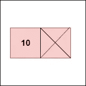
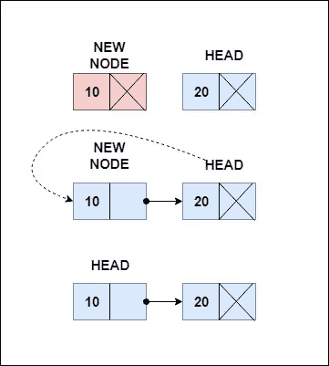
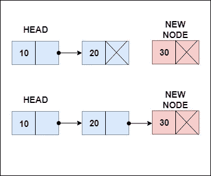
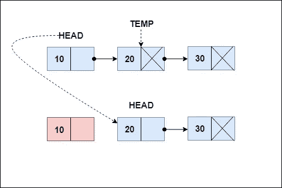
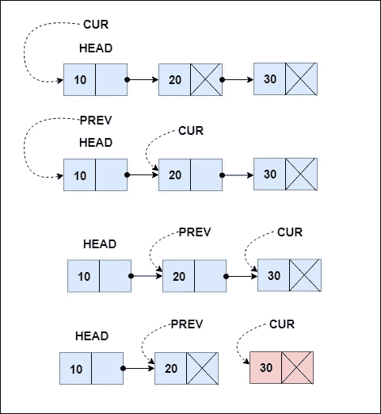

# 揭开数据结构的神秘面纱:链表第 1 部分

> 原文：<https://medium.com/analytics-vidhya/demystifying-linked-lists-part-1-eb12c3e282d3?source=collection_archive---------8----------------------->


来源:丹尼斯·奇克在 [Unsplash](https://unsplash.com/s/photos/train?utm_source=unsplash&utm_medium=referral&utm_content=creditCopyText) 上拍摄的照片

## Python 中执行的单链表的基本操作。

链表是数据元素的线性集合。与将元素存储在连续物理位置的数组等数据结构不同，链表是面向序列的。把链表想象成一列火车，一节车厢跟在另一节车厢后面，它们都由引擎引领。链表中的引擎称为头节点。

链表中的元素称为节点。一个节点通常由两部分组成:


*   数据或该节点的内容。
*   链接，或者指向下一个节点的指针。

下面是一个链接列表的例子:

让我们从创建一个类节点开始。这个类将允许创建节点，这将形成链表。我们用一个数据项和一个设置为 None 的指针初始化每个新节点。

```
class Node:
    def __init__(self, data): 
        self.data = data  
        self.next = None
```

如果您创建一个新节点，它看起来会是这样:

```
new_node = Node(10)
```



现在我们有了节点创建者类，让我们开始构建链表吧！

我们首先定义一个类，如下所示:

```
class LinkedList: 

    def __init__(self):  
        self.head = None
```

有许多操作可以在链表上执行，就像在任何其他数据结构上一样。我们可以根据它们的基本功能将它们分为:

*   插入
*   删除
*   横越

# 插入

可以通过以下方式将元素插入链表:

1.  **从列表的开头插入**

就像在堆栈中一样，我们称这个操作为*推送。把这想象成在列车的起点增加一节新车厢。我们必须把引擎从第一辆教练车上拆下来，然后把它安装到我们的新教练上，或者在我们的列表中，新教练就是新的引擎。*



1.获取一个新节点。
2。将此节点指针设置为指向当前头。
3。使该节点成为新的头部。

```
def push(self, item):
        node = Node(item)

        node.next = self.head
        self.head = node
```

**2。从列表末尾插入**

我们称这个操作为*追加。*这是因为我们从链表的末尾添加元素。这是通过设置最后一个节点的指针指向我们的新节点来实现的。

如果我们的列表没有元素，那么头部将是 None。这意味着新节点现在是我们的引擎。



1.  获取新节点。
2.  如果列表为空，将该节点作为头节点。
3.  如果列表中有元素，遍历它们直到找到最后一个节点。
4.  将最后一个节点的指针设置为指向新节点。

```
def append(self, item):
        node = Node(item)

        if self.head is None: 
            self.head = node 
            return

        last = self.head
        while last.next:
            last = last.next

        last.next = node
```

还有其他插入节点的方法，如在元素后插入或在中间插入。我们将在以后的博客文章中讨论这个问题。现在，让我们继续删除。

# **删除**

正如在插入节点中所讨论的，删除也可以从列表的开头或结尾进行。

1.  **从列表的开头删除**

这个操作被称为*弹出*，因为它类似于堆栈的弹出操作。

从一开始就删除一个元素可以想象为从火车上移除一个引擎，并使紧随其后的车厢成为新的引擎。我知道你在想什么。你不能把任何教练变成一个引擎。但这就是链表的美妙之处，如果你知道怎么做，你可以把任何节点变成头节点。



1.  如果列表为空，则没有要删除的内容。
2.  如果只有一个元素，删除它。换句话说，将 head 设置为 None。
3.  如果存在列表:

*   设置一个临时节点，temp 指向头后的节点。
*   将新的头部设置为节点温度。

```
def pop(self):
        #If the list is empty, do nothing
        if self.head is None:
            return

        #If there is only one element in the list, delete it
        if temp.next == None:
            self.head = None
            return #If there are elements, start with the head  
        temp = self.head.next
        self.head = temp return
```

**2。从列表末尾删除**

从链表的末尾删除就像从最后一节车厢开始删除一列火车的车厢。为此，我们找到最后两个元素，并将 last 之前的元素的指针设置为 None。



1.  如果列表为空，则什么也不做。
2.  如果列表只有一个元素，则删除标题。
3.  如果列表有多个元素:

*   将变量 cur (current)设置为当前头节点，将 prev (previous)设置为 None。
*   现在，将 prev 设置为 cur 元素，并使 cur 指向下一个元素。
*   通过这样做，我们基本上是一次找到两个元素，直到到达列表的末尾。
*   当 cur 后面没有元素时，我们停止这样做。这意味着我们已经到达了最后一个元素。

4.将 prev 的指针设置为 None。这将断开列表中最后一个元素的连接。现在，prev 是列表的最后一个元素。

```
def delete(self):
        cur = self.head

        #If the list is empty
        if self.head is None:
            return

        #If there is only one element in the list
        if cur.next == None:
            self.head = None
            return

        while cur.next != None:
            prev = cur
            cur = cur.next

        prev.next = None
        return
```

# 遍历列表

遍历是从头到尾遍历列表的每个元素。这就像通过按顺序进入每个教练，从发动机走到最后一个教练。当我们遍历一个链表时，我们打印它的元素。

为了遍历列表，我们在列表的开头设置一个变量 temp 并开始打印。我们增加 temp 来指向下一个元素，直到它到达列表的末尾。

```
def printList(self):
        if self.head is None:
            print('EMPTY LIST')

        temp = self.head 
        while temp: 
            print(temp.data, '\t') 
            temp = temp.next
```

就是这样！我们已经讨论了链表最基本的操作。这里是 Python 的完整代码。