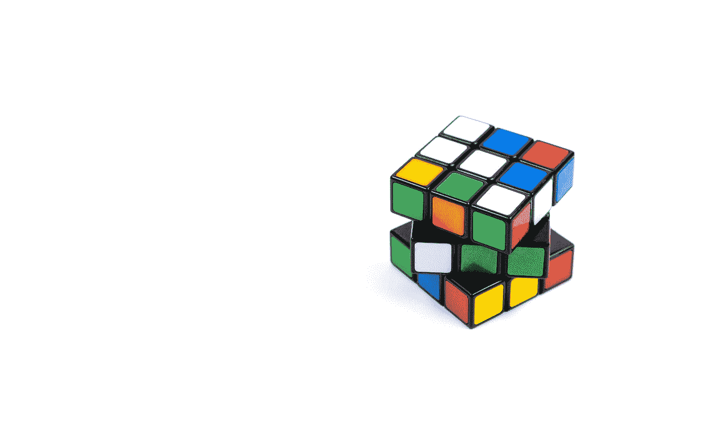
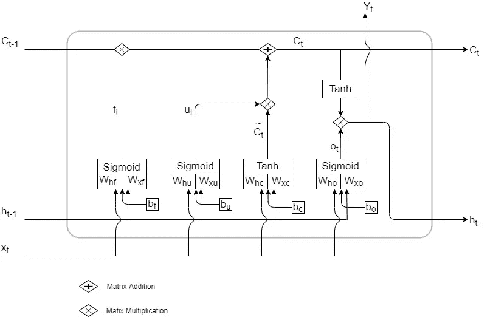
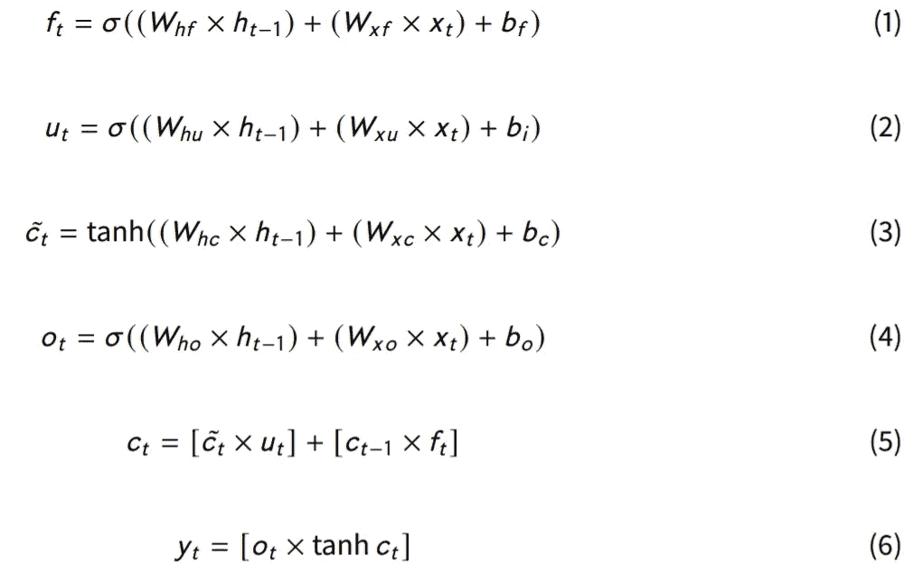
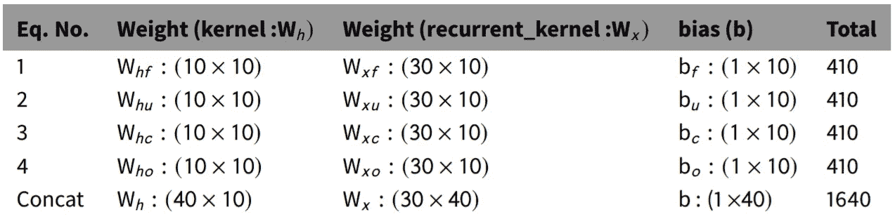
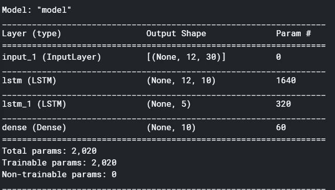
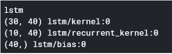

# 揭开 LSTM 权重和偏差维度的神秘面纱。

> 原文：<https://medium.com/analytics-vidhya/demystifying-lstm-weights-and-biases-dimensions-c47dbd39b30a?source=collection_archive---------1----------------------->



沃洛季米尔·赫里先科在 [Unsplash](https://unsplash.com?utm_source=medium&utm_medium=referral) 上的照片

LSTM(长短期记忆)是递归神经网络结构(RNNs)的变体。LSTM 解决了反向传播过程中梯度消失和爆炸的问题。这是通过使用存储单元来实现的。在本帖中，我们将讨论 LSTM 单元的重量和偏差尺寸。了解 LSTM，可以参考这里的[这里的](/mlreview/understanding-lstm-and-its-diagrams-37e2f46f1714)或者[这里的](https://colah.github.io/posts/2015-08-Understanding-LSTMs/)。

# LSTM 建筑



图 1: LSTM 细胞

在 LSTM 图中，我们可以看到我们有 8 个不同的权重参数(4 个与隐藏状态(单元状态)相关，4 个与输入向量相关)。我们还有 4 个不同的偏置参数。为了更好地理解这一点，我们可以使用下面的等式，并更好地理解 LSTM 单元中的操作。



图 2: LSTM 方程

在这里，借助上面的等式，我们可以清楚地看到总共有 4 个偏差和 8 个权重。我们举个例子。

```
Seq_len of the input sentence (S)= 12
embedding dimension (E)= 30
No of LSTM cells (hidden units) (H)= 10
Batch_size (B) = 1
```

输入(x)将是批量大小*嵌入尺寸= B*D
先前的隐藏状态将是批量大小*隐藏单元= B*H

```
Equation 1: forget gate = [(1*10).(10*10)+(1*30).(30*10) + (1*10)]
= (1*10) = (B*H)Equation 2: update gate = [(1*10).(10*10)+(1*30).(30*10) + (1*10)]
= (1*10) = (B*H)Equation 3: candidate memory=[(1*10).(10*10)+(1*30).(30*10)+(1*10)]
= (1*10) = (B*H)Equation 4: output gate =[(1*10).(10*10)+(1*30).(30*10) + (1*10)]
= (1*10) = (B*H)
```

由于所有权重遵循相同的结构，因此可以将这些权重组合在一起，然后乘以各自的输出。与隐藏状态相关联的权重被称为核权重，与输入相关联的权重被称为递归核权重。

**注:**
1。因为 LSTM 按顺序处理数据。它将一次接收一个字，并且同一个 LSTM 单元将接收下一个后续字。LSTM 细胞的数量并不意味着 LSTM 多次重复。这意味着它可以展开到序列长度。在实际的 LSTM 细胞中，同一个细胞将一个接一个地接收所有的字。
2。序列长度对权重和偏差维度没有任何影响。从上面的计算中可以清楚的看到。
3。权重是通过权重的转置来相乘的，但是为了简化，这里我重新安排了权重和输入。

为了查看所有的权重和偏差维度，我已经将它们放在一个表格中，并根据等式相应地命名它们。



图 3:LSTM 每个参数的尺寸

## 请比较 Tensorflow 实现

在下面的代码片段中，我实现了两个 LSTM 层。第一个我们已经讨论过了，下面的结果只适用于第一个 LSTM 层。你可以用第二层 LSTM 来验证你的理解。家庭作业:P

图 Tensorflow 中 LSTM 的代码片段



图 5:代码片段的输出

在这里，我们可以清楚地看到，每个权重和偏差都有相同的维度。所以，现在我们也可以很容易地联系到计算 LSTM 晶胞中参数个数的公式，即

**参数个数= 4×[*h*(*h*+e)+*h*]= 4(10(10+30)+10)= 1640。** 其中 h = LSTM 隐藏单元的数量
，e =输入的嵌入维数

## 参考资料:

 [## 了解 LSTM 网络

### 2015 年 8 月 27 日发布人类不是每秒钟都从零开始思考。当你读这篇文章时，你…

colah.github.io](https://colah.github.io/posts/2015-08-Understanding-LSTMs/) [](/mlreview/understanding-lstm-and-its-diagrams-37e2f46f1714) [## 理解 LSTM 及其图表

### 我只想重申这里所说的:

medium.com](/mlreview/understanding-lstm-and-its-diagrams-37e2f46f1714) 

我希望你喜欢这篇短文。跟着我上 [GitHub](https://github.com/gskdhiman) 和 [Kaggle](https://www.kaggle.com/gskdhiman) 。请随时到 gskdhiman@gmail.com 找我。非常欢迎对这篇文章的任何改进提出建议。