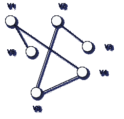
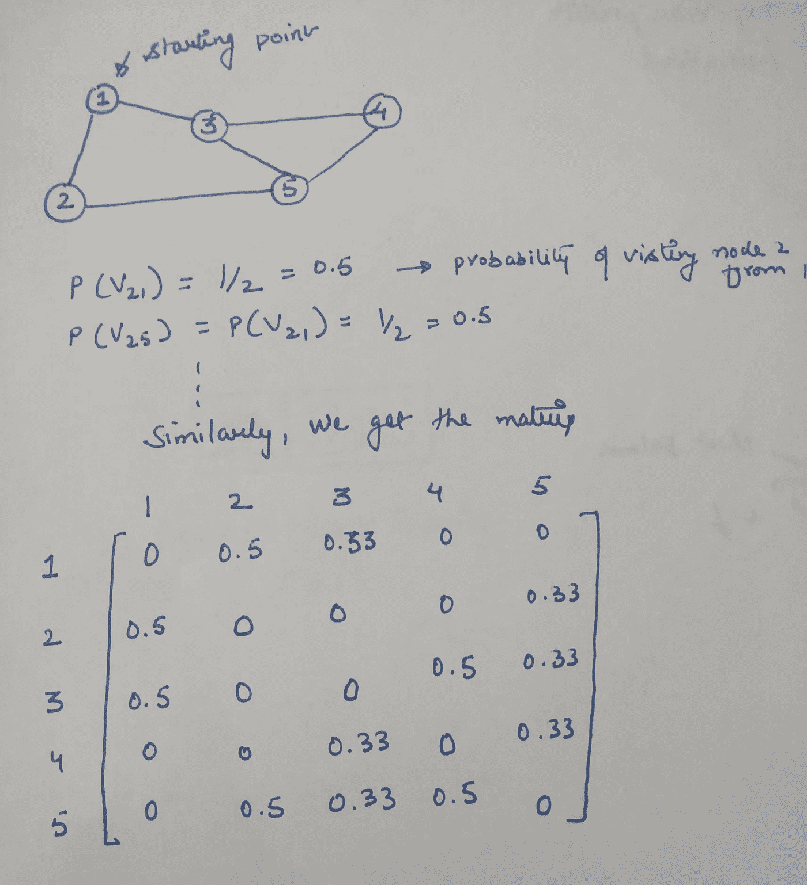

# 揭开马尔可夫聚类的神秘面纱

> 原文：<https://medium.com/analytics-vidhya/demystifying-markov-clustering-aeb6cdabbfc7?source=collection_archive---------2----------------------->

## 介绍马尔可夫聚类算法，以及它如何成为一个真正有用的无监督聚类工具。

克林特·王茂林在 [Unsplash](https://unsplash.com?utm_source=medium&utm_medium=referral) 上拍摄的照片

# 介绍

在数据科学的巨大海洋世界中，人们可能会遇到集群岛。当谈到无监督学习和跨数据发现模式时，聚类是最古老和最广泛使用的技术。

在这篇博客中，我们将谈论一个具体的和一点点的利基，如果你会说，被称为 MCL 或马尔可夫聚类。在接下来的参考文献中，我将马尔可夫聚类称为 MCL。

MCL 与其他聚类算法的真正区别在于，它帮助你在现有节点中检测社区，因为它是无监督的，它不需要你的任何输入来形成聚类，不像 K-means 算法和其他算法。当涉及到网络数据、社交网络数据或者相似性检测时，这确实使得该算法至关重要。

通常集群分为两个主要部分:

1.  向量聚类和
2.  图形聚类可以自己讲述自己的故事。

MCL 是一种图聚类，所以你必须了解一点图论，但不要太花哨。

# 一点图论知识

如果让我用简单明了的术语来解释一个图，那就是:*图是一组向量和边，表示为 G = (V，E ),其中 V = {v1，v2，v3…vn}即 n 个向量，E = {e1，e2，e3…em}有 m 条边。如果顶点 vi 和 vj 是边的端点，那么当没有歧义时，我们用有序对(vi，vj)来表示该边。*

简单未加权图

虽然上面显示的图是一个简单的未加权图，我们将在前面的 MCL 算法中使用加权图。加权图只不过是一个信息量更大的图，它告诉你访问下一个节点的概率，或者一个节点到另一个节点的距离，或者一个节点对另一个节点的依赖性。

一般来说，为了存储这样的信息，我们使用邻接图矩阵，如果你想知道的话，这将在后面解释。对于 MCL，这就是你需要知道的一切..参见 easy-peay。

# 随机漫步和马尔可夫链

随机漫步是 MCL 的核心，所以让我们用一个简单的例子来理解它。如果你还记得旅行推销员问题，这个问题比那个问题更随机，但是思路是一样的。

所以，想想旅行者山姆——真正的旅行家住在伦敦的一个城市，想要环游世界。把城市想象成我们图表中的节点，把边想象成人们可以从一个城市旅行到另一个城市。如果两个城市之间没有边界，就不可能去那个城市旅行，就这么简单。

随着他随意的想法，山姆没有做计划，出去了。因此，根据一个假设的 n 面骰子，萨姆选择去他想去的城市。这个过程在数学上被称为**随机过程或随机过程**，这将描述前方随机路径的路径。这被称为随机漫步。

现在，来看马尔可夫链，

> 马尔可夫链是一个系统，其中下一个状态基于某种概率或规则依赖于当前状态。

在任何时间点，当前状态完全由上一个状态决定，而不管它是如何到达的。简单来说就是*马尔可夫链*。最后，我们计算基于“马尔可夫链”的随机图。这背后的直觉是，随机性不是完全随机的，在一个城市，Sam 访问附近城市的概率大于访问非常远的城市。还在迷茫？看看下面的例子..

如上图所述，这就是我们如何得到第一时间步的转移矩阵或概率矩阵。

# 通货膨胀和扩张

为了实现 MCL，我们需要考虑两个重要的操作，即通货膨胀和经济扩张。

## **通货膨胀:**

*   在膨胀操作下，对于每个顶点，转变值被改变，使得强邻居值被加强，而大邻居值被降级。这可以通过将列值提高到非负幂，然后重新归一化来实现。
*   例如，取膨胀算子为 2。因此，对列中的每个元素求平方，然后对值进行归一化。
*   膨胀算子负责电流的增强和减弱。(加强强电流，并削弱已经
    弱电流)。最后，这会影响集群的粒度。

## **扩展:**

*   扩展有助于使更远的节点或邻居可达。这在数学上是通过取矩阵的 n 次方来实现的。这个值，扩展运算符“e”是在实现时选择的。
*   例如，取 e=2，取矩阵的 2 次方为 A。对于取 n 次方，我们需要另一个博客，因为它需要计算本征向量、本征值和对角矩阵来计算 n 次方，如果需要，我会解释。
*   扩展运算符负责允许流连接图形的不同区域。

# MCL 算法…终于

如果你到目前为止都做得很好，那就完成了一半以上的工作。好的，让我们直接进入正题。MCL 的步骤:

*   输入将是一个无向图，功率参数 **e** 和充气参数 **r** 。
*   通过创建关联矩阵来计算马尔可夫矩阵或概率矩阵。这里需要注意的一点是，我们需要通过归一化邻接矩阵来获得马尔可夫矩阵。
*   一旦获得了马尔可夫矩阵，就可以通过交替两个操作来模拟随机游走，这两个操作就是上面解释的**膨胀**和**膨胀**。
*   第一步:使用“e”参数展开矩阵。
*   步骤 j:使用“r”参数膨胀结果矩阵。
*   重复步骤 I 和 j，直到收敛(即达到值的平衡或没有观察到明显的值变化)。
*   解释结果以获得聚类。

# 瞧啊。MCL 准备好了！

新鲜烹制的 MCL 可以和一些可见的串一起食用。如果你想从头开始写马尔可夫聚类，这应该不是什么大问题，但是一定要添加自循环以获得更好的收敛性。如果你想知道是否有可用的东西，确实有一个 python 包 [markov-clusterin](https://pypi.org/project/markov-clustering/) g 可以帮助你。如果您从未使用过 networkx，您可能也需要看看它，这是一个 python 包，它使得图形操作更容易编写。

最后看一下下面的代码，看看 python 中同样的实现。

如果你已经走了这么远，感谢你的耐心。如果你从博客中学到了什么，非常感谢，或者如果你有任何问题，请大声说出来。再见..！！