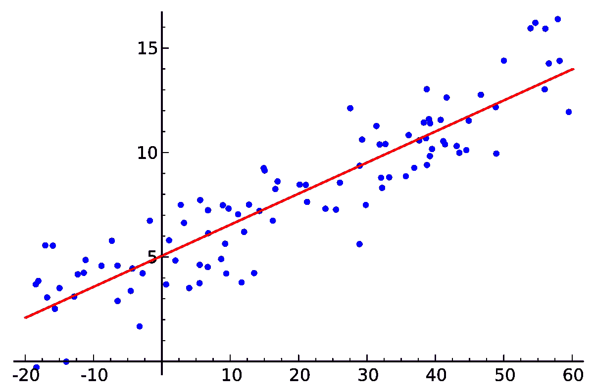
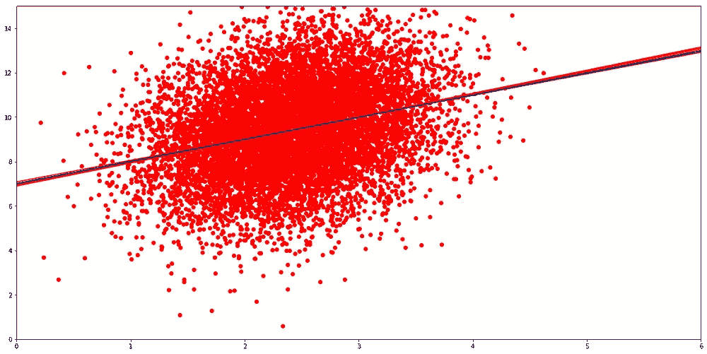

# 揭开线性回归中模型方差的神秘面纱-1

> 原文：<https://medium.com/analytics-vidhya/demystifying-model-variance-in-linear-regression-1-4b1a1f3c9a51?source=collection_archive---------16----------------------->

## 在这一系列博客中，我将尝试解构数理统计中的观点，因为我已经直观地理解了它们。这不是回归分析的教程，而是试图将统计学中的概念从复杂的数学语言中带出来，让数据科学家能够理解。

**代表形象，** [**来源**](https://en.wikipedia.org/wiki/Linear_regression#/media/File:Linear_regression.svg)

**(向下滚动到 tl 的可视化和代码；博士)**

# 设置上下文

考虑线性回归方程

> **y =(β0)+(β1)(x1)+(β2)(x2)+e(~ N(0，σ ))**

*这里的* ***y*** *是回归变量，* ***x1*** *是回归变量，******【β0****是截距，* ***β1*** *是本质上是指 y 对于 x1 的所有值都是固定方差σ正态分布的随机变量，其均值是 x1 → β0+(β1)(x1)的线性函数。参见图 0* 和**

****

****图 0、** [**来源**](http://complx.me/2017-01-22-mle-linear-regression/)**

**当使用 OLS 对任何给定数据拟合模型时，**获得的系数本身并不能给出足够的信息。需要评估它们有多可靠。**模型中可能存在估计系数幅度较高的变量，但它们的**“统计显著性”**较低。**

**问:我们是在谈论拟合模型的准确性吗？**

> **答:不，一个模型可以有高的平方误差，或者低的 R 平方，这意味着低的精确度，但是有高度“统计显著性”的变量。**

**(我们将在后面的部分中更多地讨论变量的**、**统计显著性、平方误差及其与欠拟合/过拟合的关系，现在让我们试着理解模型估计量的**、**。)**

**问:我们是在谈论风险值(X1)还是风险值(X2)？**

> ****答:**不，我们正在讨论估计系数的方差 **β0*和β1*** (我们将使用*符号表示预测值)**

****问:系数怎么会有方差？线性回归不是应该是确定性的吗？每当我用 OLS 模型拟合我的数据时，它每次都给出相同的系数****

> ****答:**让我们从了解总体和样本的区别开始。假设样本是从具有固定分布的无限总体中抽取的。我们拥有的数据只是从人群中抽取的样本。样本越大，越接近总体。因此 **1)具有大量数据点的单个样本的估计参数趋向于实际总体。**对于任何有限的样本量，我们只能不完全地估计总体参数。但是，在 OLS 估计量的情况下， **2)大量样本的估计参数的平均值趋向于实际的总体参数。****
> 
> **对于简单的线性回归，方程 **y=β0+(β1)(x)+e(~N(0，σ ))** **代表假设从中抽取样本的总体**。因此 **β0，β1，σ** 是总体的参数。**
> 
> **OLS 回归得到的系数 **β0*** 和 **β1*** 只是基于给定样本的实际总体参数的估计。对于从总体中抽取的每个随机样本，估计参数的不同值。因此在估计的参数中存在**【方差】**。即使实际的总体参数是不同的，对任何给定样本计算的估计值也可以很好地得到。**

# ****估计方差示例****

****让我们试着想象拟合线的“变化”。**假设总体用 **y=5+x+e(~N(0，9))** 表示。在**图 1** 中，**蓝色**线代表总体的 **y** 值的平均值( **y=5+x** )。我们使用随机数生成器为 **X** 和 **e** 生成多个大小为 **50** 的样本，并使用公式 **y=5+x+e** 计算 **Y** 值。其中一个样本显示为散点图。**

**红色线是通过在这些样本上拟合 OLS 回归得到的。绿色的**线**拟合在散点图显示的特定样本上。向下滚动链接到用于生成图表的 python 代码。**

****

****图一****

# ****深潜****

**大量样本的**估计参数**的方差本身取决于未知的假设总体的**实际参数**。因此，我们拥有的数据的估计参数和其他统计用于估计方差**、**，假设样本代表总体**、**。**

**考虑一下 **Var(β1*)，**的计算公式**

> ****Var(β1 *)=(σ)/((n-1)Var(X))****

**其中 **σ** 估计为均方误差**s =σ(Y-Y *)/(n-2)**， **n** 为样本大小或数据点数， **Var(X)** 为数据在 X 轴上投影的样本方差。 **Var(β1*)** 估计为 **(s )/((n-1)Var(X))****

**让我们分析出现在估计 **Var(β1*)** 的公式中的比率 **(s )/(Var*(X))****

****(s)/(Var(X))比值的极值暗示了什么？****

## **在 **(s )/(Var(X))=0****

> **分子将是 0，这意味着残差将是 0。这意味着拟合线穿过样本中的所有点，如图**图 2** 所示。基于给定的样本，总体位于一条完美的直线上，从总体中抽取的任何样本在回归时都会给出相同的直线，即斜率和截距的方差为 **0** 。**

****

****图 2****

## **在**(s)/(Var(X))→无穷大****

> **分母变成零。这意味着样本中的 X 值没有变化。所有点都位于一条垂直线上，这条垂直线上表示 **X** 的固定值，如图**图 3** 所示。在这种情况下，对于通过这些点的质心的任何线，平方误差 **s** 将被最小化到相同的值。由于存在无穷多个解，为了预测的目的，在相关的 **x** 值上等价，斜率和截距的方差是无穷的。**

****

****图 3****

**在实践中，当 **Var(X)** 和残差 **s** 之间的反差很大时，从远处看，散点图看起来像**图 2** 或**图 3** 。**

**在这两个极端值之间，存在比率 **(σ )/(Var(X))** 的整个值范围，针对固定样本量 **50** 和模型方程 **y=5+x+e(~N(0，σ ))** 生成以下图表。**

****

****图 4****

**我们只剩下 **Var(β1*)** 公式分母中的 **(n-1)** 项。**

> ****Var(β1 *)=(σ)/((n-1)Var(X))****

**样本量 **n** 与方差 **Var(β1*)** 成反比关系。可以在**图 5** 中看到，所有的图表都是用同一组总体参数 **β1，β2，σ** 生成的，样本量 **n** 不同。这与对于大的 **n** 样本更接近总体的想法是一致的。所有参数 **β1*、β2*、σ *** 的估计值位于其实际值的附近，并且随着 **n、**的增加而更接近于实际值，无论拟合的模型有多差。**

****************

****图 5****

**最后，让我们来看看 **Var(β0*)，**它的计算公式为**

> ****var(β0 *)=(σ){ 1/n+(x̅)/(n-1)var(x)}****

**这里还有一个额外的因素 **(x̅ )** ，其中**【x̅】**是沿 **X 轴**的样本平均值，其余分量与 **Var(β0*)** 的关系类似于 **Var(β1*)** 的单调性。**图 6** 显示了沿 **X 轴**移动的两个等效实例。由于拟合线的变化，在 **Y 轴**上截距的 [**视差**](https://en.wikipedia.org/wiki/Parallax) 对于更大的**|**更大，即沿着 **X 轴**的质心远离原点。换句话说，更高的 **Var(β0*)。****

****

****图 6****

**(我知道这不是一个令人满意的直觉，拟合线在[x̅ ,y̅ ]并不严格同时。如果有人能帮助我更直观地解释 E[y **̅*** |x】的方差依赖于与 x̅的距离，我会很高兴**

****在下面找到用来生成上图的 python 代码。****

** [## palash 93/VisualizeEstimatorVariance

### permalink dissolve GitHub 是超过 5000 万开发人员的家园，他们一起工作来托管和审查代码，管理…

github.com](https://github.com/Palash93/VisualizeEstimatorVariance/blob/master/EstimatorVariance.ipynb) 

# 最后

通过剖析公式和使用可视化，我们看到了估计量的方差与许多因素的关系。在下一部分中，我们将通过引入多个变量使事情变得更加复杂。palash31093@gmail.com 欢迎任何反馈或问题

**(未完待续……)****