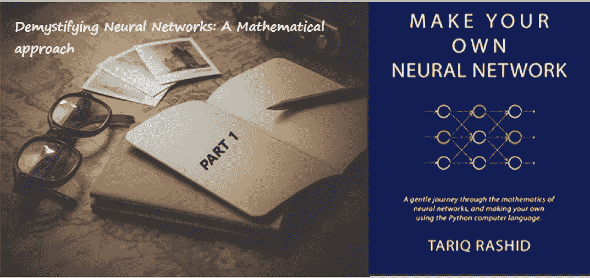

# 揭开神经网络的神秘面纱:数学方法(第一部分)

> 原文：<https://medium.com/analytics-vidhya/demystifying-neural-networks-a-mathematical-approach-part-1-4e10bed61400?source=collection_archive---------0----------------------->

*我的笔记摘自《打造自己的神经网络》***作者* ***塔里克·拉希德。****

**

*来源:Pixabay/ [达留什](https://pixabay.com/en/users/DariuszSankowski-1441456/)扬科夫斯基，[链接](https://www.amazon.com/Make-Your-Own-Neural-Network-ebook/dp/B01EER4Z4G)*

> *“从你身边所有的小事中获取灵感。”塔里克·拉希德*

> *注意:这里引用的所有图片都来自于这本书*