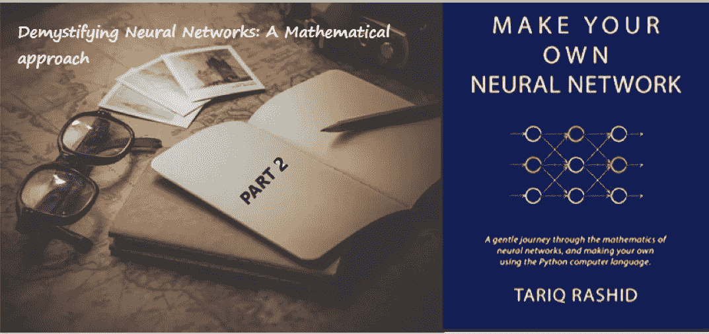

# 揭开神经网络的神秘面纱:数学方法(下)

> 原文：<https://medium.com/analytics-vidhya/demystifying-neural-networks-a-mathematical-approach-part-2-e48bb8611661?source=collection_archive---------0----------------------->

*我的笔记摘自本书'* [***打造自己的神经网络***](https://www.amazon.com/Make-Your-Own-Neural-Network-ebook/dp/B01EER4Z4G)***'****by****塔里克·拉希德***

> 神经网络是一种技术，而不是一种算法。它是一个有权重的网络，你可以调整这些权重让它学习。你通过…