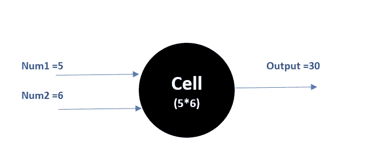
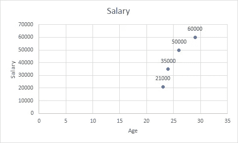
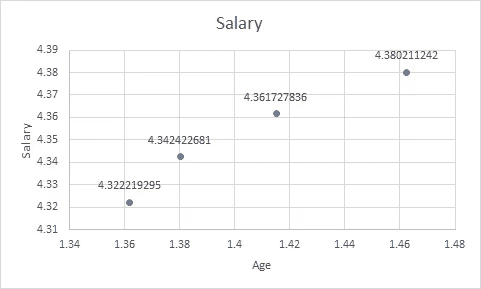

# 揭开神经网络的神秘面纱

> 原文：<https://medium.com/analytics-vidhya/demystifying-neural-networks-f5925af327ad?source=collection_archive---------34----------------------->

隐藏在秘密背后的是什么？

乔希·里默尔在 [Unsplash](https://unsplash.com?utm_source=medium&utm_medium=referral) 上的照片

不同的人从不同的角度看待神经网络。对于新手来说，它们是一个谜，解码需要几十年的时间，至少需要两个博士学位。对于一些数据科学家来说，神经网络是一个黑匣子，它接受你的数据，并在数小时的训练后做出预测。然后是第三类，数据爱好者希望揭开它的秘密，并利用它来创造惊人的产品。

今天，我将试图消除围绕神经网络的一些误解，在接下来的文章中，我们将尝试更深入地研究它们。

为了对神经网络有更好的直觉，我们需要先了解一些事情。

1.  **它们不是你大脑的模型:**尽管该模型的一些灵感肯定来自神经生物学，但没有证据表明我们的大脑遵循与神经网络相似的路径。
2.  **它们是纯数学模型:**在我们的日常生活中，我们被数学包围着。环顾四周，你的手机，笔记本电脑，吊扇可能是由电力驱动的，但最终它们都是由数学控制的。

想象一个小的数学单位，姑且称之为细胞。这个单元只有一个任务，将两个数相乘:-

细胞的图示

细胞也可以执行不同的功能，

1.  一个单元格可以接受(2，3，4，5，6)等输入，并返回最大值(6)
2.  一个单元格可以接受(2，3，4)这样的输入，并返回值的乘积(24)
3.  一个单元格可以接收输入(7)并返回对数值(0.84)

数学模型改变了你理解数字的方式。

参见下图:-

年龄是工资的函数

这些数字过于接近，无法产生任何有价值的见解。看看一个简单的数学模型如何改变这个图表

对数(年龄)与对数(工资)

数据看起来更分散了，不是吗？

这就是数学的力量！

现在，想象成千上万的细胞在一起协同工作时转换数据，细胞 1 的输出进入细胞 2，细胞 2 的输出进入细胞 3，依此类推…

把它们堆在一起，你手上就有了一个神经网络！

在接下来的讲座中，我们将深入研究这些神经网络是如何运作的。

下次见！