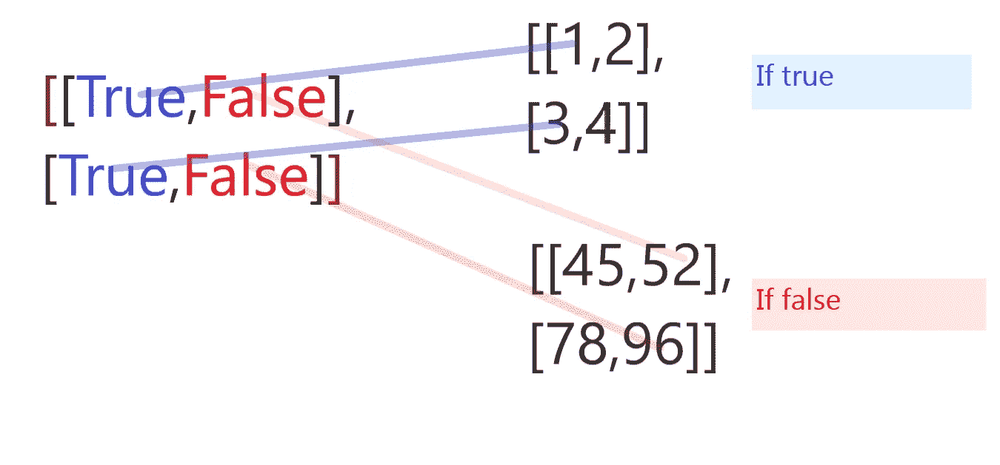

# 揭秘 np.where 和 np.select

> 原文：<https://medium.com/analytics-vidhya/demystifying-np-where-and-np-select-76e3ca49e316?source=collection_archive---------0----------------------->

## 在这篇文章中，我们将通过一些例子来理解 np.where，np.select。

> **numpy.where**

```
**numpy.where****(***condition***[,** *x***,** *y***])**
```

如果条件为真，这个函数返回 x，否则返回 y

**例 1** :给定一个来自(0，9)的一维数组，如果元素少于 5，则元素应该相同，否则将元素乘以 10。

```
import numpy as np 
a = np.arange(10)
np.where(a < 5,a,10*a)
Out[1]: array([ 0,  1,  2,  3,  4, 50, 60, 70, 80, 90])
```

**例 2:** 给定两个二维数组，获得一个关于条件的数组。

```
np.where([[True,False],[True,False]],[[1,2],[3,4]],[[45,52],[78,96]])
Out[3]: 
array([[ 1, 52],
       [ 3, 96]])
```

如果条件为真，我们从 x 中取出元素，否则从 y 中取出。



**例 3:** 给定一个二维矩阵如果 ix 中的值小于 4，则该值应该相同否则返回值为-1。

```
np.where(a < 4,a,-1)
Out[8]: 
array([[ 0,  1,  2],
       [ 0,  2, -1],
       [ 0,  3, -1]])
```

**更多例子**

如果未指定 x 和 y，则由*返回的值，其中*函数是满足条件的元素的索引。这些索引是元组。

```
array = np.ones((3,3))array
Out[19]: 
array([[1., 1., 1.],
       [1., 1., 1.],
       [1., 1., 1.]])testing_array = np.where([[True,False,True],[False,True,False],[True,False,True]],array,-array)testing_array
Out[22]: 
array([[ 1., -1.,  1.],
       [-1.,  1., -1.],
       [ 1., -1.,  1.]])np.where(testing_array > 0)
Out[24]: (array([0, 0, 1, 2, 2], dtype=int64), array([0, 2, 1, 0, 2], dtype=int64))
```

在上面的例子中，返回值是由相应的行索引和列索引组成的元组。

如果我们希望值作为一个单一的列表，我们可以使用以下

```
list(zip(*np.where(testing_array > 0)))
Out[26]: [(0, 0), (0, 2), (1, 1), (2, 0), (2, 2)]
```

> **np.select**

```
**numpy.select****(***condlist***,** *choicelist***,** *default=0***)**
```

*条件列表*是条件列表，决定从*选择列表*中的哪个数组获取输出元素。如果满足多个条件，则使用*条件列表*中的第一个。

*choicelist* 是从中提取输出元素的数组列表。当所有条件评估为假时，返回默认值。