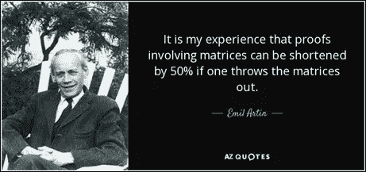
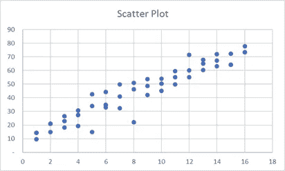
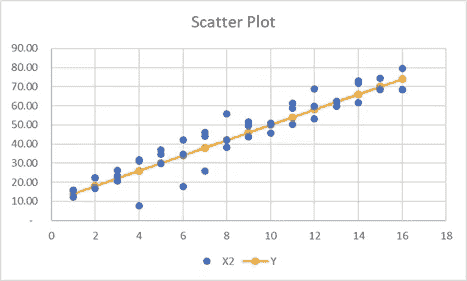
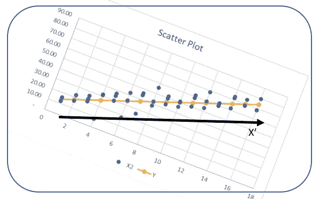
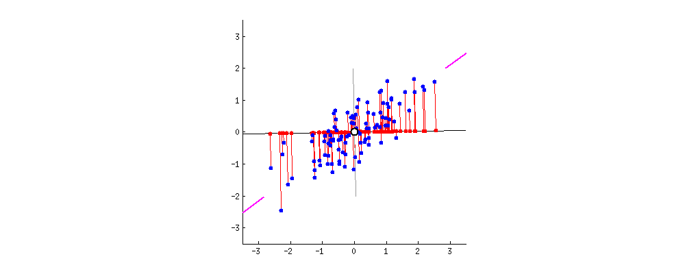
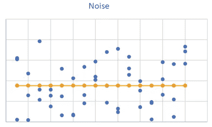

# 揭秘 PCA

> 原文：<https://medium.com/analytics-vidhya/demystifying-pca-65aac0fd3e4c?source=collection_archive---------14----------------------->

在这篇由两部分组成的文章中，首先我将帮助您了解 PCA。接下来，我会在带你进行数学推导的同时，用简单的英语解释线性代数。

承蒙[https://www.azquotes.com/quote/764974](https://www.azquotes.com/quote/764974)

这将是我这篇文章的主题。

我的目标是给你一个完整的眼睛，呆呆地看着 PCA 内部发生的事情，用一个坚实的直觉来指导你解决 ML 问题。作为一名商业分析师，我发现抓住问题的症结是至关重要的，这样我就知道盔甲的薄弱环节在哪里。

首先，对骗子来说，这是肉-

*如果你是一名侦探，在一个满是嫌疑犯的城市里侦破一起谋杀案，PCA——你的华生医生，会根据行为变化给你一份最有可能的嫌疑犯名单。*

*从数学上来说，它会告诉你如何低头，这样你就可以在杂乱的数据中查看最多的信息。简单来说就是基础的改变。*

现在，对于达到最终结论的手段。

我们看过数据。这是个嵌合体。**数据太多信息太少**。为了说明这一点，我们来看一个简单的数据集，它有两个特征 X1 (X 轴)和 X2 (Y 轴),其散点图如下所示:

图 1

为了使它更加有形，想象 X1 是头发的长度，X2 是消耗的洗发水。显然，它们与一个是另一个的线性组合相关。

我们可以用一个功能代替两个功能。就像下面这条橙色的线？

图 2

本质上，我们可以将每个蓝色点近似为橙色线上最近的点(称为它的投影，也称为到该线的垂直距离)。

是时候转换视角了。想象一下，我们只有一个轴，而不是两个轴——单独的橙色线。让我们稍微倾斜一下-

图 3

那里。

X1 和 X2 中的信息由 X’行上的单个数字表示。我们少了一个功能。耶！

这条橙色的线被称为主成分 1。对于更高的维度，它不断增加垂直于前一个的主成分，直到所有的数据都被捕获。典型地，第一分量将在最大方差的方向上。并且以递减的方式继续。

哦，为什么又是方差？它是如何影响这一切的？

为了理解这种差异，想象一下你被要求识别你花园里不同种类的树。您只是漫无目的地收集数据(没有目标变量)的活动。不同物种的叶子颜色会有很大差异吗？不，它大部分倾向于绿色。因此，即使我们捕捉到了，它所包含的信息也很少。相反，叶子的形状或水果/花的性质会成为更好的区分因素。为什么？*这些特征在不同物种间差异很大。*这是通过方差获取的。

因此，方差是**数据和信息**的关键区别。

为了理解我们如何选择主成分的方向，请看下面的动画。

图 4:承蒙这个奇妙的链接-[https://stats . stack exchange . com/questions/2691/making-sense-of-principal-component-analysis-features vectors-特征值](https://stats.stackexchange.com/questions/2691/making-sense-of-principal-component-analysis-eigenvectors-eigenvalues)

表示主成分的黑色旋转线在所有蓝点到它的垂直距离最小时放置最佳- **较少的数据损失**。此外，红点(线上蓝点的投影)应该尽可能间隔开- **意味着更高的方差**。如果红点彼此靠得太近，当你沿着轴移动时，我们会丢失数据如何变化的信息。盯着它，直到它变得清晰。

数学的美妙之处在于两者同时发生(提示:毕达哥拉斯定理)。这里有一个 [StatQuest 视频](https://www.youtube.com/watch?v=FgakZw6K1QQ)，如果你想进一步调查的话。

在这个**最小误差点或最大方差点**，惊人的事情发生了。看一下下面的噪声图(虽然放大了，但看起来与图 3 相似吧)。蓝点和橙点的变化没有关系。由于随机性，上升的蓝点数量等于下降的蓝点数量。

图 5

数学上，我们说两者的协方差为 0，因为橙色点(有目的地沿着线)和蓝色点(随机放置)之间的变化没有关系。

在主成分的任何其他位置，蓝点(想象在橙色线的中心有尾部的向量)聚集时会指向一个方向。也就是说，它仍然有一个有价值的信号，没有被主成分捕获。

瞧啊。在协方差为 0 的约束下，我们找到了我们的解。

关于数学推导，你可以参考这篇论文。在下一篇文章中，我会解释背后的全部数学原理。(当心！前方的协方差，特征值…来吧，试试看？).

参考资料:

没有这个 PCA 是不完整的-[https://stats . stack exchange . com/questions/2691/making-sense-of-principal-component-analysis-features vectors-environments](https://stats.stackexchange.com/questions/2691/making-sense-of-principal-component-analysis-eigenvectors-eigenvalues)

强烈推荐这篇论文，以便更正式地理解 PCA-[https://arxiv.org/pdf/1404.1100.pdf](https://arxiv.org/pdf/1404.1100.pdf)

完成图片的最后一块拼图-[https://towards data science . com/principal-component-analysis-math-and-intuition-post-3-35 ea8d 2301 B3](https://towardsdatascience.com/principal-component-analysis-math-and-intution-post-3-35ea8d2301b3)