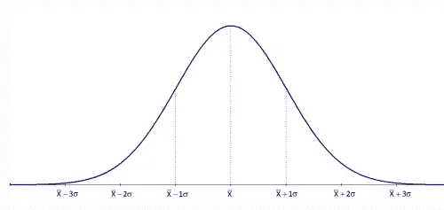
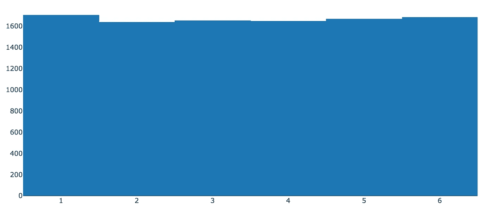
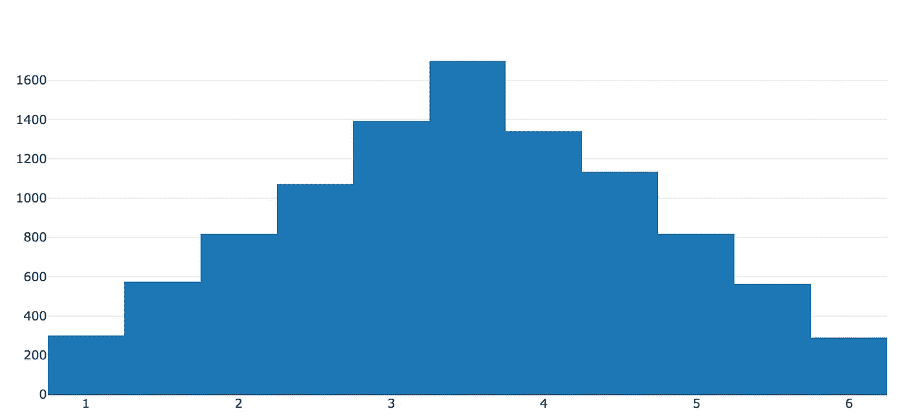
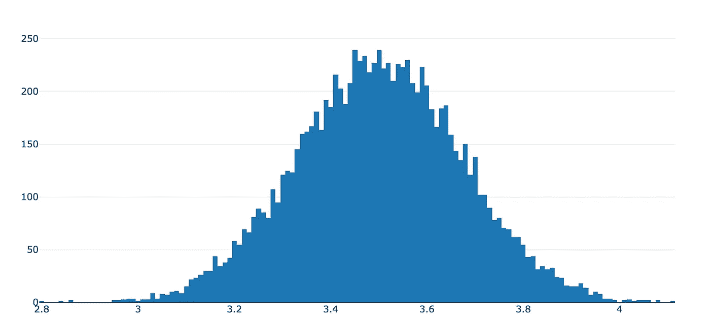

# 为数据科学家揭开统计学的神秘面纱——中心极限定理

> 原文：<https://medium.com/analytics-vidhya/demystifying-statistics-for-data-scientists-central-limit-theorem-ee9d420fc154?source=collection_archive---------1----------------------->


在 [Unsplash](https://unsplash.com/search/photos/statistics?utm_source=unsplash&utm_medium=referral&utm_content=creditCopyText) 上由 [Carlos Muza](https://unsplash.com/photos/hpjSkU2UYSU?utm_source=unsplash&utm_medium=referral&utm_content=creditCopyText) 拍摄的照片

中心极限定理也许是现代统计学发展中最重要的定理。它使我们能够使用样本数据集来估计人口特征。

在本文中，我们将探索该定理的工作原理。我们还将浏览一些 python 代码，使用一些可视化工具来验证中心极限定理。

在深入研究这个定理之前，让我们先了解一下这个定理中用到的一些统计学的基本术语。

注意:您可以在 https://github.com/sandeepvja/statistics-repo 的[找到本文的代码示例](https://github.com/sandeepvja/statistics-repo)

# **基本术语**

1.  **人口**

填充表示特定数据集中所有可能的数据项。总的来说，我们无法接触到全部人口。

由于我们没有人口数据集，我们无法准确计算人口数据集指标，如均值、方差等。但是使用中心极限定理，我们可以估计它们(尽可能接近)。

**示例:**学生数据集的人口数据代表世界上所有学生的信息。

2.**样本**

样本是总体的一个子集。我们通常只能接触样本。

**示例:**马里兰大学的学生数据集是学生数据集总体中的一个样本。

3.**概率分布/分布**

概率分布是一个简单的数学公式，通过它我们可以描述整个数据集。

4.**高斯分布**

高斯分布(正态分布)是一种概率分布，遵循类似下图的钟形。该分布围绕其平均值完全对称。



正态分布

现在让我们试着理解中心极限定理，

# 中心极限定理

> 中心极限定理指出，给定来自方差水平有限的总体的足够大的样本量，来自同一总体的所有样本的均值将遵循高斯分布。

简而言之，该定理指出，从人口数据集中，如果我们取大量足够大的随机样本，并取每个样本的平均值，所有这些平均值将遵循高斯分布。

这个定理是我们将在后面的文章中看到的许多统计技术的核心。但首先，让我们试着用 python 验证一下中心极限定理。

首先，让我们假设我们知道要从中收集样本的总体。为了简单起见，让我们把人口数从 1 到 6。

现在，让我们创建一个 python 函数来生成样本并计算它们的平均值，该函数采用以下参数:

1.  人口的数量
2.  从总体中抽取的每个样本的大小(替换抽样)。如果你想了解有替代和无替代抽样，请看看这篇文章
3.  要采集的样本数量

```
import pandas as pddef getSampleMeans(population_size, sample_size, num_samples):

    population_range = range(1, population_size + 1)

    population_data = pd.Series(population_range) sample_means = [population_data.sample(sample_size, replace=True).mean() for i in range(num_samples)]

    return sample_means
```

让我们还创建另一个函数，该函数使用 plotly 从上述函数生成的样本均值创建直方图

```
def plotHistogram(sample_means):
   # Import plotly
    import plotly
    import plotly.plotly as py
    import plotly.graph_objs as go
    data = [go.Histogram(x=sample_means)]
    plotly.offline.init_notebook_mode() 
    plotly.offline.iplot(data, filename='jupyter/Normal')
```

上面代码片段的最后两行是 jupyter 笔记本显示 plotly 可视化所需要的。

现在，根据中心极限定理，来自同一总体的样本均值将遵循正态分布。

让我们假设一个从 1 到 6 的数字群体。每次取 1 个样本，取这些样本的平均值并绘制直方图。

```
sample_means = getSampleMeans(population_size = 6, sample_size = 1, num_samples = 10000)
plotHistogram(sample_means)
```

上面的代码将绘制一个类似下图的直方图



样本量为 1 的 6 人总体直方图

但是等等！！这看起来不像正态分布！！

**为什么中心极限定理不起作用？**

注意，在上面的定理定义中，语句清楚地指定， ***来自总体的足够大的样本量*。**

我们只从人群中抽取了一个样本，由于样本不足，所以它不起作用。

现在让我们尝试将样本大小增加到 2，下面的代码，

```
sample_means = getSampleMeans(population_size = 6, sample_size = 2, num_samples = 10000)
plotHistogram(sample_means)
```

然后我们会看到一个类似下图的直方图。



6 人总体的样本量为 2 的直方图

现在，这看起来稍微好一点，更接近正态分布曲线，但我们可以用更高的样本量做得更好。由于我们采用替换抽样，我们也可以采用比总体规模更大的样本规模。

```
sample_means = getSampleMeans(population_size = 6, sample_size = 100, num_samples = 10000)
plotHistogram(sample_means)
```



6 人样本量为 100 的直方图

您现在可以看到，上面的样本意味着接近正态分布。

您可以进一步改变样本数量、总体规模或代表数量，并查看样本均值如何开始收敛到高斯分布。

我们将在以后的文章中进一步探讨中心极限定理的应用。