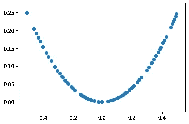
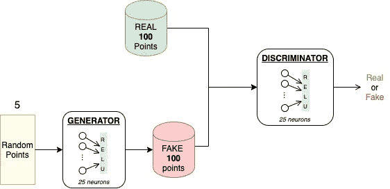
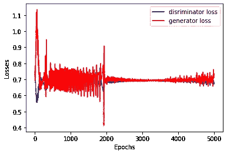
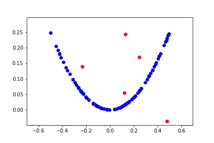

# 使用 1D 函数(Keras)揭开 GAN 的神秘面纱

> 原文：<https://medium.com/analytics-vidhya/demystifying-the-gan-using-a-1d-function-keras-bc7b861bb304?source=collection_archive---------5----------------------->

> “最近 20 年深度学习领域最酷的想法”。

在这篇文章中，我们将探讨如何创建一个简单的 GAN (1DGAN)，它将在一个平面上生成点。GANs 代表生成对抗网络，这个名字本身就描述了它的含义。我们来分析一下。

> **网络:**表示一个 GAN 由多个神经网络组成。
> 
> **对抗性:**意味着这些网络以对抗的方式彼此竞争(彼此对立)。
> 
> **生成:**表示它们属于深度学习的生成模型范畴。

gan 用于生成与真实世界图像难以区分的美丽图像。他们通过学习图像的概率分布，然后在这个分布中创建一个数据项来实现这一点。该数据项是新图像。然而，由于图像数据的高维数，理解 GAN 的功能是一个巨大的痛苦。作为人类，我们无法用 ***n*** 维来可视化数据。这就是为什么甘的 BTS(幕后)是个谜。让我们来揭开它的神秘面纱。

> — — —现在卷起你的袖子————

我们将朝着实际工作前进，并且只理解我们前进道路上的那一部分。我鼓励你使用[***【Jupyter Notebook】***](https://jupyter.org)*跟随，因为这些代码片段都准备在笔记本上。*

# *巨人🛠的肩膀*

*从使用以下导入开始*

*   ***tensorflow:** 深度学习库 by [Google](http://www.google.com)*
*   ***keras:** 写在 [TensorFlow](http://tensorflow.org) 之上的 API*
*   ***numpy:** 用于 python 中的数值工作*
*   ***matplotlib:** 用于绘图和保存图像*
*   *赛璐珞:用我们的结果做一些动画很有用*

# *我是神秘的🧰*

## *1D 函数*

*导入所需的库后，我们继续选择 1D 函数。这里我们选择的是 U 型函数，它是一个平方函数 ***f(x)=x*** *。然而，你可以选择任何你喜欢的功能。**

*使用此函数在平面上生成数据点，并绘制它们，以查看您的函数看起来如何。这里我们使用 **100 个**点，因为很容易将它们可视化。*

**

***图 1:** 平方函数的绘制*

# *竞争对手来了！！！⚔️🛡*

*确认你的功能后。现在是时候创建深度学习模型了。我们遵循[keras 的](https://keras.io/examples/) s 的[代码示例中为 GAN](https://keras.io/examples/generative/dcgan_overriding_train_step/) 提供的【官方方法】。*

***创建模型(鉴别器和生成器):***

**

***图 2:** 我们模型的架构*

# ***你好甘先生***

*现在我们将创建一个具有**自定义训练函数**的 GAN 模型，因为 GAN 的训练不像其他深度学习模型，那些在 ***x(数据)和 y(标签)*** 上进行训练，用于对某个东西进行分类或回归。*

# *请留意我，🧐🔍*

*我们必须建立一个可以存储我们训练结果的东西，这个东西被称为回调。这里我们创建了一个自定义回调函数，它将在每个 **20** 时期后存储结果，并带有一个**列表**来存储生成的点数。你可以在这里阅读关于回调 [**的内容！**](https://keras.io/api/callbacks/) **。***

# *让游戏开始吧🎭 ▶️*

*使用以下代码训练您的 GAN 并绘制损失结果。请注意，我们正在为 **5000** 纪元训练我们的模型，但他的数目取决于你的**耐心。我们的模型没有很多参数，我们的数据也不是很大，所以它可以很容易地在您的系统(CPU)上运行。***

**

***图 3:** 损失 w.r.t 历元*

# *给我们表演魔术🎊*

*最后，我们准备好看看我们的生成器的能力来生成上述**函数**中的点(它自称是一个谜🙄).下面的代码将动画显示存储在列表中的生成点。*

*这里是一些结果，你可以看到我们的发电机在训练后变得多么强大。它只是将点映射到原始数据分布。生成器在没有看到原始点的情况下学习这一点。*

**

*图 4: 结果*

*祝贺你！我们刚刚建造并训练了我们的 1D-甘。我希望现在您已经了解了 GAN 场景背后的基础知识，并准备好进一步探索它。祝你旅途好运。*

# ***参考文献:***

* [## 如何在 Keras -机器学习掌握中从零开始开发 1D 生成对抗网络

### 生成对抗网络，简称 GANs，是一种用于训练强大生成器的深度学习架构

machinelearningmastery.com](https://machinelearningmastery.com/how-to-develop-a-generative-adversarial-network-for-a-1-dimensional-function-from-scratch-in-keras/)  [## Keras 文档:GAN 覆盖` Model.train_step '

### 作者:fchollet 创建日期:2019/04/29 最后修改时间:2020/04/29 描述:由…使用 fit()训练的简单 DCGAN

keras.io](https://keras.io/examples/generative/dcgan_overriding_train_step/)*