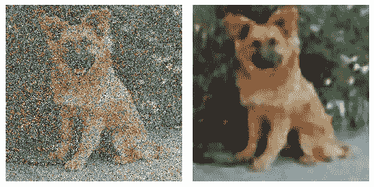
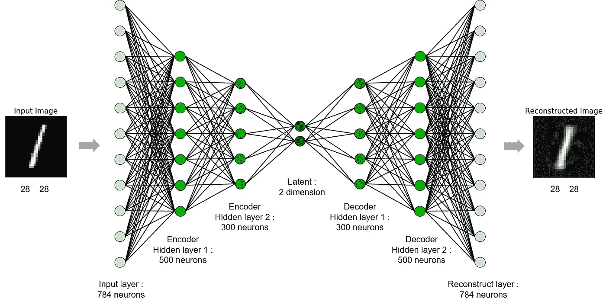
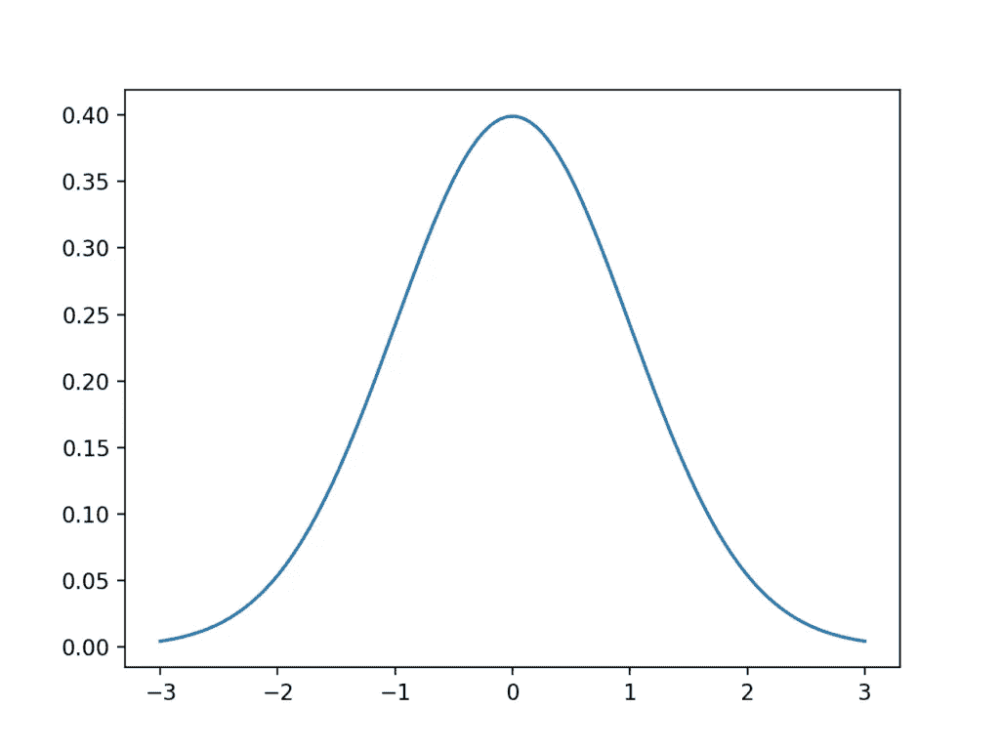
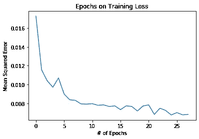
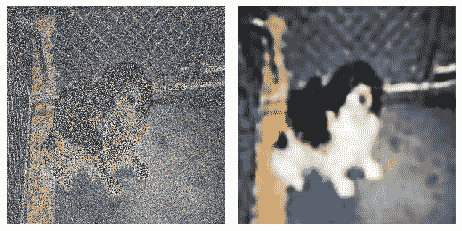

# 基于张量流的彩色图像自动编码器去噪

> 原文：<https://medium.com/analytics-vidhya/denoising-autoencoder-on-colored-images-using-tensorflow-17bf63e19dad?source=collection_archive---------6----------------------->



使用去噪自动编码器前后的图像

在本文中，我将构建一个自动编码器来消除彩色图像中的噪声。大多数文章使用灰度而不是 RGB，我想做一些不同的东西。

要对此进行编程，我们需要了解自动编码器是如何工作的。自动编码器是一种神经网络，旨在以无监督的方式复制原始输入。它由两部分组成:编码器和解码器。编码器接收输入，并将其压缩成潜在空间表示。另一方面，解码器试图从潜在空间重建原始输入。



自动编码器的结构。来源:[https://I-systems . github . io/HSE 545/machine % 20 learning % 20 all/KIMM/image _ files/AE _ arch 2 . png](https://i-systems.github.io/HSE545/machine%20learning%20all/KIMM/image_files/AE_arch2.png)

内森·胡本斯写了一篇关于自动编码器的很棒的文章:[https://towards data science . com/deep-inside-auto encoders-7e 41 f 319999 f](https://towardsdatascience.com/deep-inside-autoencoders-7e41f319999f)

它帮助我更好地理解这个概念。内森，谢谢你的贡献。

那么我们为什么要复制原始数据呢？

众所周知，自动编码器用于降维应用。然而，在这种情况下，我们希望使用一种称为降噪自动编码器的自动编码器。

我们可以将噪声添加到训练数据中，并根据我们的原始图像对它们进行训练。因此，自动编码器将学习对输入数据进行降噪的必要步骤。

对于这个项目，我使用的是微软的猫狗数据集。你可以在这里找到[。因为这不是一个分类算法，所以我在这个例子中使用了狗的图片。你可以使用任何你想要的数据集。](https://www.microsoft.com/en-us/download/details.aspx?id=54765)

首先，我们需要将图像调整到相同的大小。这可以通过 OpenCV 中的 [cv2.resize()](https://www.tutorialkart.com/opencv/python/opencv-python-resize-image/) 来实现。我正在将它们的尺寸调整为 300 x 300。当然，您也可以使用其他图像处理库来完成这项工作。

确保您还使用了 reshape data to(# of pictures，width，height，3)来获得适当的形状，否则自动编码器将无法工作。你可以使用一个叫做[NP . shape](https://docs.scipy.org/doc/numpy/reference/generated/numpy.reshape.html)的方法来做这件事。

现在我们来讨论一下在数据中加入噪声的问题。有几种方法可以实现这一点。然而，我在这个例子中使用的是高斯噪声算法。还记得统计学上的正态分布吗？我们需要它来制造噪音。



来源:[https://machine learning mastery . com/a-gentle-简介-计算-普通-汇总-统计/](https://machinelearningmastery.com/a-gentle-introduction-to-calculating-normal-summary-statistics/)

像宇宙中的大多数事物一样，噪音也遵循正态分布，其特征是标志性的钟形曲线。本质上，我们是基于高斯函数值来产生噪声的。这可以通过以下代码实现:

```
# adds the Gaussian noise based on the mean and the standard deviation
def add_gaussian_noise(data):
    mean = (10, 10, 10)
    std = (50, 50, 50)
    row, col, channel = data.shape
    noise = np.random.normal(mean, std, (row, col,     channel)).astype('uint8')
    eturn data + noisedef add_gaussian_to_dataset(data):
    count = 0
    end = len(data)
    output_data = []
    while count < end:
        output_data.append(add_gaussian_noise(data[count]))
        count+=1
    return np.array(output_data)
```

第一个函数用于向单个图像添加高斯噪声。第二个函数用于使用第一个函数将高斯噪声添加到给定的数据集。

现在让我们来谈谈房间里的大象，去噪自动编码器。正如我们所见，神经网络由一个编码器和一个解码器组成。我正在使用 3000 张带有高斯噪声的狗的图像和 3000 张没有高斯噪声的狗的图像来训练我的神经网络。代码如下:

```
def create_model():
  x = Input(shape=(300, 300, 3))# Encoder
  e_conv1 = Conv2D(64, (3, 3), activation='relu', padding='same')(x)
  pool1 = MaxPooling2D((2, 2), padding='same')(e_conv1)
  batchnorm_1 = BatchNormalization()(pool1)
  e_conv2 = Conv2D(32, (3, 3), activation='relu', padding='same')(batchnorm_1)
  pool2 = MaxPooling2D((2, 2), padding='same')(e_conv2)
  batchnorm_2 = BatchNormalization()(pool2)
  e_conv3 = Conv2D(16, (3, 3), activation='relu', padding='same')(batchnorm_2)
  h = MaxPooling2D((2, 2), padding='same')(e_conv3)# Decoder
  d_conv1 = Conv2D(64, (3, 3), activation='relu', padding='same')(h)
  up1 = UpSampling2D((2, 2))(d_conv1)
  d_conv2 = Conv2D(32, (3, 3), activation='relu', padding='same')(up1)
  up2 = UpSampling2D((2, 2))(d_conv2)
  d_conv3 = Conv2D(16, (3, 3), activation='relu')(up2)
  up3 = UpSampling2D((2, 2))(d_conv3)
  r = Conv2D(3, (3, 3), activation='sigmoid', padding='same')(up3) model = Model(x, r)
  model.compile(optimizer='adam', loss='mse')
  return modelgaussian_auto_encoder = create_model()
gaussian_early_stop = EarlyStopping(monitor='loss', patience=3)
gaussian_history = gaussian_auto_encoder.fit(gaussian_train_data, train_data, epochs=50, batch_size=32, callbacks=[gaussian_early_stop])
```



我们在训练中得到的图表

这种 autoencoder 布局使用函数式 API，类似于代数中的函数工作方式(函数组合)。这使得我们的模型比传统的顺序格式更加灵活。

与使用复杂的神经网络类似，您也可以为自动编码器使用卷积和池层。我使用提前停止回调来确保我没有对我的模型进行不必要的训练。

结果如下:

我正在对来自测试数据的图片使用训练好的模型。我的测试数据包括 1000 张带有高斯噪声的狗的图片和 1000 张没有高斯噪声的狗的图片。



使用自动编码器前后

正如我们所看到的，autoencoder 很好地消除了测试图像中的高斯噪声。尽管图像清晰度有了巨大的提高(图像损失更少)，但这并没有提高图像分辨率。这是卷积神经网络的完全不同的实现。

然而，仍有很大的改进空间。更大的数据集可能是有利的，因为它提供了更多的变化。此外，我们可能希望使训练数据多样化，以包括除狗以外的图像。因此，该模型可能会更好地概括。

这篇文章的代码可以在[这里](https://github.com/therealcyberlord/tensorflow_keras_color_images_denoiser)找到

希望这有帮助。请随时向我提供反馈。