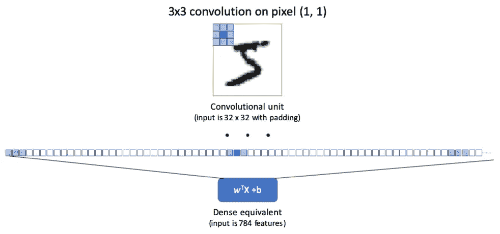
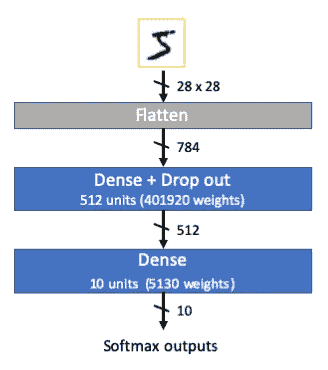
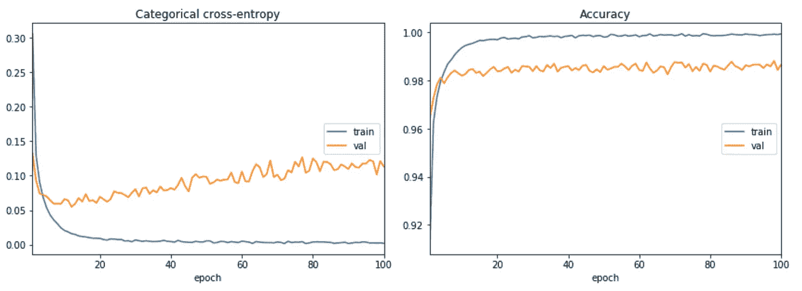
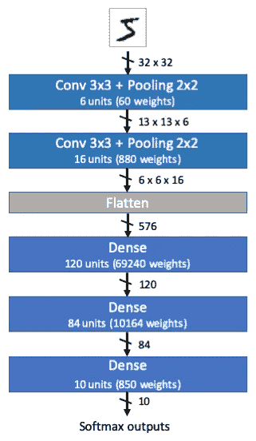
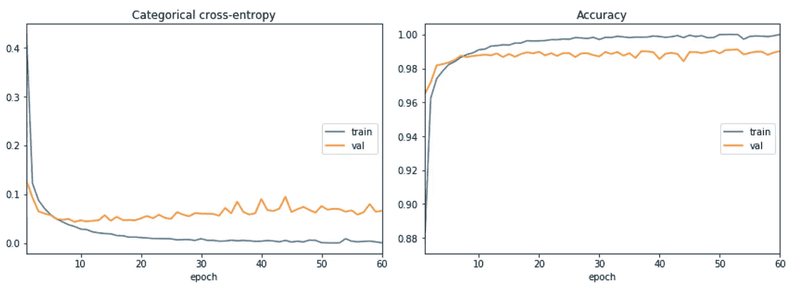
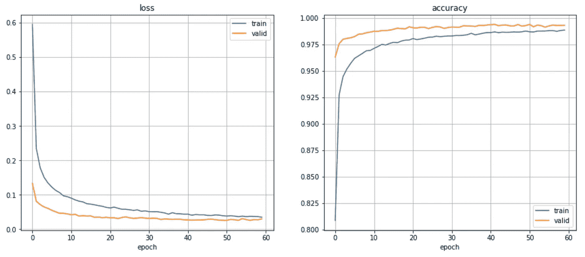
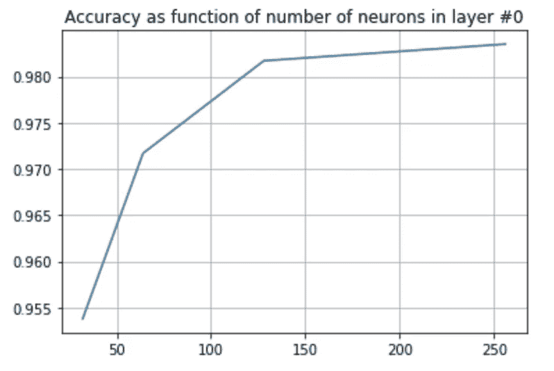

# 密集或卷积神经网络

> 原文：<https://medium.com/analytics-vidhya/dense-or-convolutional-part-1-c75c59c5b4ad?source=collection_archive---------1----------------------->

## 第 1 部分——建筑、几何、性能

当设计深度神经网络(DNN)时，有几个顶级架构选择，其中之一是我应该使用卷积还是密集(又名。感知器，全连接，还是内积)层？


在这一系列的文章中，我们将从架构、几何和性能的角度回顾这些层类型之间的差异。

在第一部分中，我们将设计并比较两个网络作为 MNIST 数字分类器的性能[1]。第一个网络是 TensorFlow 在教程[2]中提出的仅密集网络。第二个网络是 DNN 的一个标志，通常与 MNIST 数据集相关联:LeNet 5 卷积神经网络(CNN) [3]。

# 建筑评论

卷积层之所以被称为卷积层，是因为它们的工作原理类似于图像/视频处理和任何信号处理(声音、电信等)中使用的卷积滤波器。[4]中对卷积层做了很好的介绍。卷积可以是任何维度，但是在下文中，我们将集中在图像处理中使用的 2D 卷积，特别是在 LeNet-5 网络中。



卷积滤波器的等效密度

从体系结构的角度来看，任何单个卷积都可以由密集层代替，该密集层将对每个像素执行相邻像素的相同关联。这意味着每个像素一个神经元，仅在相邻像素上具有非零系数。卷积层正在实施参数共享:每个像素的处理是通过设计而不是通过学习来实现的。这意味着需要学习的参数数量大幅减少，但性能仍然非常出色，我们将在评估部分看到这一点。

还有其他与卷积层相关的几何特性，这将在第 3 部分讨论。

# 模特们

为了进行比较，我们将从 TensorFlow 教程[2]的密集模型以及基于 Keras [5]的 LeNet-5 实现开始。



用于 MNIST 分类的密集神经网络

**密集实现**基于一个大的 512 单元层，其后是最后一层计算对应于 10 个数字的 10 个类别中的每一个类别的 softmax 概率:

```
modelDense0 = models.Sequential([
  layers.Flatten(input_shape=(28, 28)),
  layers.Dense(512, activation=activations.relu),
  layers.Dropout(0.2),
  layers.Dense(10, activation=activations.softmax)
])
```

尺寸为 28×28 像素的输入图像被转换成展平层中的矢量，给出宽度为 784 的特征空间。

该 DNN 的系数的数量主要在第一层上，512 个神经元全部连接到 784 个权重，即 784*512 + 512 = 401 920 个权重来计算，包括偏差。和总共 407 050 个系数。



MNIST 训练集上密集神经网络的损失和精度

**LeNet-5 实现**有更多的层，但没有一层是一样大的:

```
modelLeNet0 = models.Sequential([
  layers.Conv2D(filters=6, kernel_size=(3, 3),
    activation=activations.relu, 
  layers.AveragePooling2D(),
  layers.Conv2D(filters=16, kernel_size=(3, 3),
    activation=’relu’),
  layers.AveragePooling2D(), layers.Flatten(),
  layers.Dense(units=120, activation=activations.relu),
  layers.Dense(units=84, activation=activations.relu),
  layers.Dense(units=10, activation =activations.softmax)
])
```

最初的实现是使用 Tanh 函数来激活，现在更频繁地使用 ReLU，这导致更快的训练和更低的消失梯度概率。



LeNet5 CNN 为 MNIST 分类

有两个基于具有平均池的 3×3 滤波器的卷积层。特征空间因此从 32×32×3 减少到 6×6×16。接着是 2 个隐藏的密集层，分别由 120 个和 84 个神经元组成，最后是同样的 10 个神经元的 softmax 层，用于计算概率。LeNet-5 的系数总数为 101 770，是稠密 DNN 的四分之一。



LeNet5 神经网络在 MNIST 训练集上的损失和精度

在 MNIST 测量了这两个基线网络的性能:

*   密集 DNN，测试准确度= 97.5%
*   LeNet-5 CNN，测试准确率= 98.5%

卷积神经网络在大小和性能方面已经有了明显的优势。唯一的缺点是训练时间较长，给定层数。在 90 年代，训练需要几天或几周的时间，现在只需要几分钟。

# 模型优化

上面评估的两个网络过度拟合，并且在对新样本进行测试时性能下降。这是可以观察到的:

*   训练和验证评估之间在损失和准确性上有很大差距
*   在最初的急剧下降之后，验证损失随着训练时期而恶化

这并不意外，因为训练样本的数量是 60 000，这小于要训练的系数的数量。网络正在学习和记忆训练样本。

在下文中，我们将优化这两个网络，增加正则化并寻找最佳的大小-性能权衡。

# 正规化

正则化是一组在训练期间加速收敛并避免过度拟合的技术。有几个正规化的家族:

**惩罚**:将惩罚项添加到梯度反向传播中，以便将系数“推”向 0。经典的惩罚是套索(基于 L1 范数)和脊(基于 L2 范数)，还有许多其他的改变使用的范数，还有结合套索和脊的弹性网[7]。

**提前停止**:假设过拟合发生在网络学习训练样本的时候，并且可以通过验证期间的性能下降观察到，当检测到这种拐点时，训练停止。

**丢失**【6】:对于每一批，输出的随机部分被无效，以避免相邻层部分之间的强依赖性。这种技术类似于决策树上的提升技术。

**数据扩充**:通过几何变换(平移、缩放、旋转……)或过滤(模糊)，从现有样本中创建更多的训练样本。

**模型尺寸缩减**倾斜系数数量与训练样本数量的比值。

在上面的密集模型中，两个密集层之间已经有一个落差。鉴于观察到的过拟合，我们应用了原始压差论文[6]的建议:输入压差为 20%，两层之间压差为 50%。根据下面的损耗和精度曲线观察，过拟合要低得多，密集网络的性能现在为 98.5%，高达 LeNet5！

在 LeNet5 网络上，我们还研究了正则化的影响。在 1990 年代创建时，基于处罚的正规化是一个热门话题。但是，直到 2016 年才知道退学。使用网格搜索，我们测量并调整了弹性网(L1-L2 组合)和漏失的正则化参数。



LeNet5 具有可调压差，可实现 99.4%的精度

我们发现最佳的一组参数是:

*   对于惩罚:参数λ= 10–5 的第一密集层上的 L2 正则化，导致 99.15%的测试精度
*   对于 dropout: dropout 应用于前两个密集层的输入，参数为 40%和 30%，导致**测试精度为 99.4%**

Dropout 的性能更好，也更容易调整。

# 模型尺寸优化

由于我们需要比较密集网络和卷积网络，因此使用最大的网络毫无意义。事实上，对任何 CNN 都有一个基于密集架构的等价物。在[6]中，在具有 2048 个单位的两个致密层的 MNIST 上报道了一些结果，准确度在 99%以上。只看业绩不会导致公平的比较。



作为图层#0 大小的函数的密集 DNN 精度

您还可能有一些额外的要求来优化处理时间或成本。

如上所述，减小网络大小也减少了过拟合。

这就是为什么我们一直在寻找两个正则化网络的最佳性能-规模权衡。以下是我们的结果:

*   **密网有漏失**，有 128 个隐层单位，即 **101 个 770 系数，测试准确率 98%**
*   **lenet 5 网络，具有 60 和 42 个单元的密集隐层(初始的一半)， **38 552 个系数，测试精度 99.2%****

**CNN 是明显的赢家，它只用 1/3 的系数就能表现得更好**

# **结论**

**在本帖中，我们解释了基于密集的神经网络和具有卷积层的网络在架构上的共性和差异。我们已经证明，后者总是表现出色，并且系数数量较少。**

**我们还展示了给定一些互联网上可用的模型，评估这些模型并对它们进行调整总是一个好主意。通过这一过程，您将验证所选模型是否符合您的实际需求，更好地了解其架构和行为，并且您可以应用一些设计时没有的新技术，例如 LeNet5 上的 Dropout。**

**这个调查的代码和细节可以在**笔记本**([HTML](https://tonio73.github.io/data-science/cnn/CnnVsDense-Part1.html)/[Jupyter](https://nbviewer.jupyter.org/urls/tonio73.github.io/data-science/cnn/CnnVsDense-Part1.ipynb))【8】中找到。**

**在下一部分中，我们将继续我们的比较，在第二部分中查看内部层的可视化，在第三部分中查看每个网络对几何变换的鲁棒性。**

**不要忘记在下面留下评论/反馈。你现在可以鼓掌了，然后继续讨论关于可解释性的第 2 部分。**

**参考资料:**

1.  **Yann Lecun 等人的 MNIST 数据集——http://yann.lecun.com/exdb/mnist/**
2.  **TensorFlow 教程—[https://www.tensorflow.org/tensorboard/get_started](https://www.tensorflow.org/tensorboard/get_started)MNIST 分类器的密集实现**
3.  **基于梯度的学习应用于文档识别，Lecun 等人。[http://yann.lecun.com/exdb/publis/pdf/lecun-98.pdf](http://yann.lecun.com/exdb/publis/pdf/lecun-98.pdf)**
4.  **卷积神经网络(CNN)初学者指南，suh yun Kim—[https://towardsdatascience . com/a—卷积神经网络初学者指南—CNNs-14649 dbddce 8](https://towardsdatascience.com/a-beginners-guide-to-convolutional-neural-networks-cnns-14649dbddce8)**
5.  **LeNet 实现 tensor flow Keras—[https://colab . research . Google . com/drive/1 CVM 50 PGE 4 vht b5 I _ a _ YC 4 H5 f-it kovl 9](https://colab.research.google.com/drive/1CVm50PGE4vhtB5I_a_yc4h5F-itKOVL9)**
6.  **辍学:防止神经网络过度拟合的简单方法，Nitish Srivastava 等人。[http://jmlr.org/papers/v15/srivastava14a.html](http://jmlr.org/papers/v15/srivastava14a.html)**
7.  **通过弹性网的正则化和变量选择，https://citeseerx.ist.psu.edu/viewdoc/summary?，邹慧和特雷弗·哈斯蒂 doi=10.1.1.124.4696**