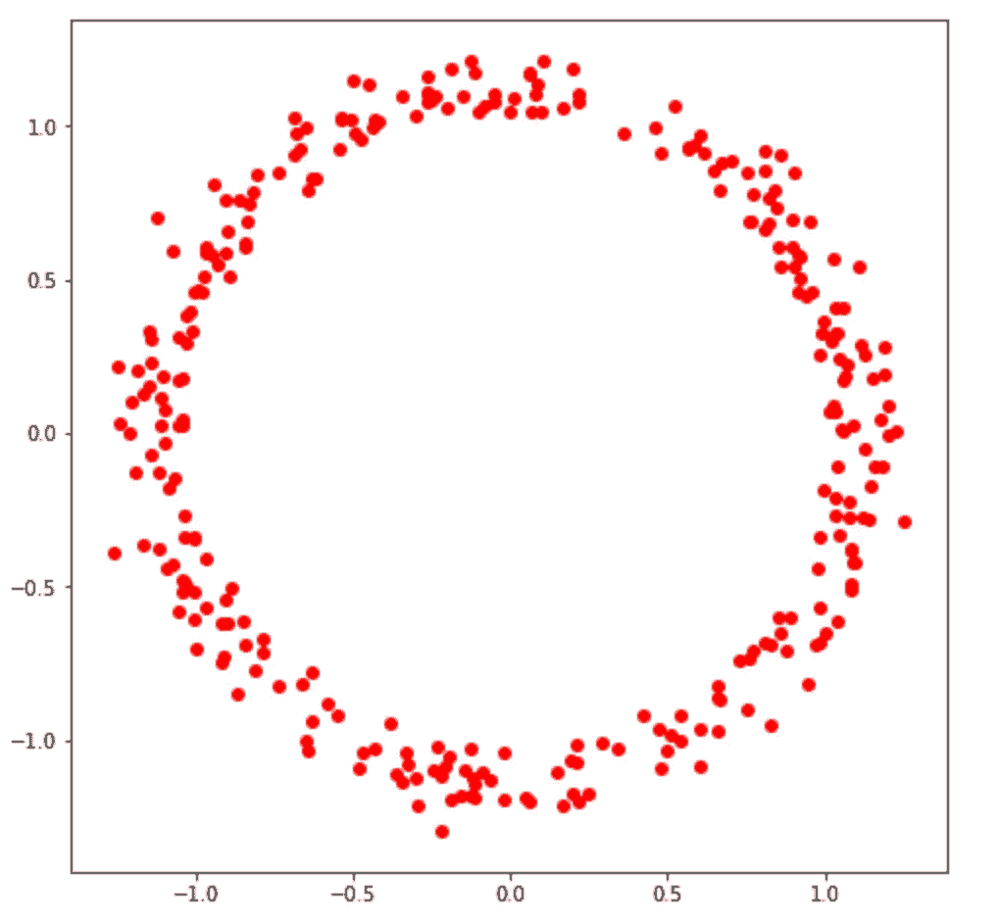
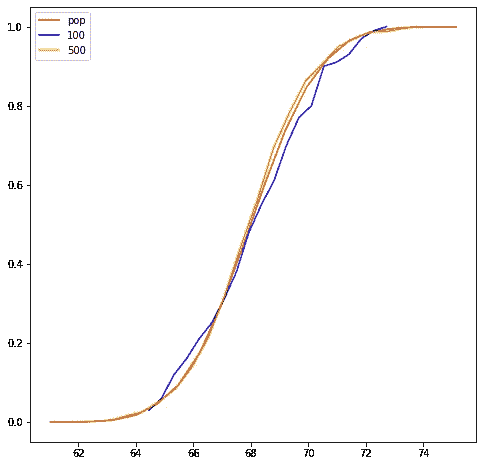
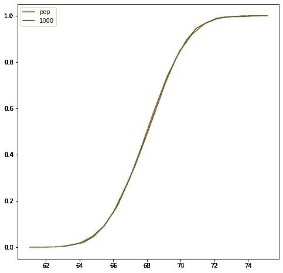
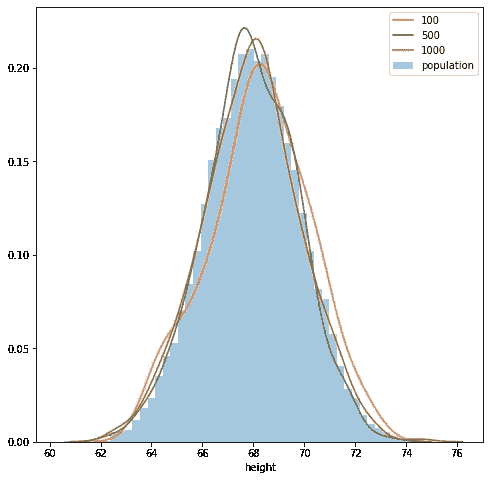
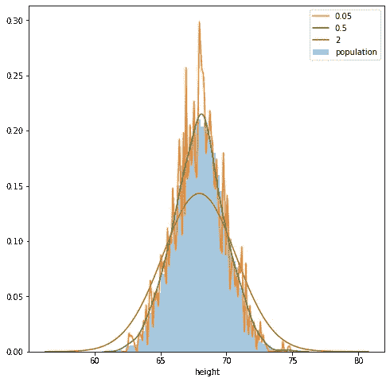
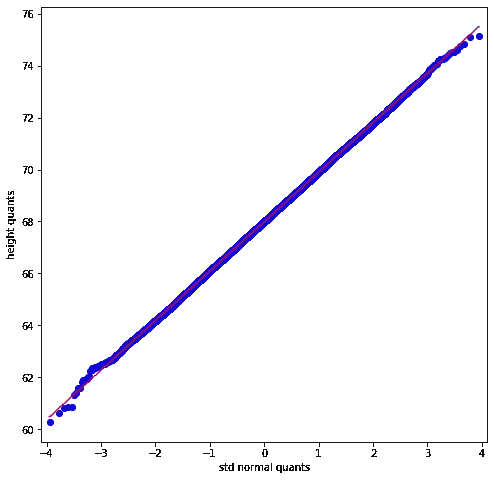
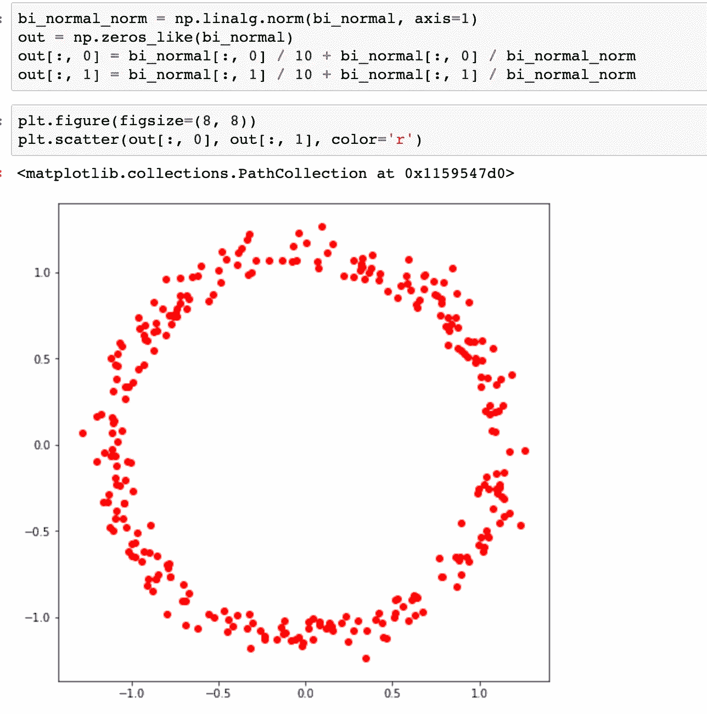

# 密度估计:最大似然法、地图、矩量法、、、Q-Q 图、甘

> 原文：<https://medium.com/analytics-vidhya/density-estimation-mle-map-mom-kde-ecdf-q-q-plot-gan-5161f84d28d7?source=collection_archive---------2----------------------->

统计学围绕着从样本中对总体进行估计。密度估计是从样本中估计总体的概率密度函数。

# 术语

**估计量:**逼近感兴趣参数的数据函数。估计量是一个随机变量，因为它是随机样本的函数。

**一致估计量**:当样本量趋于无穷大时，任何收敛到感兴趣的真实参数的估计量称为一致估计量。样本均值是一个一致的估计量。

**无偏估计量:**任何期望值等于感兴趣的真实参数的估计量称为无偏估计量。样本均值是一个无偏估计量。

参数方法:我们假设人口服从某种分布，并试图从现有数据中估计其参数。

**非参数方法**:对人口分布不做任何假设。虽然参数方法只涉及估计几个参数，但非参数方法试图估计整个样本空间的密度。

**显式密度估计:**估计样本空间上的真实 pdf 或 cdf。

**隐式密度估计:**不产生显式密度，但产生一个函数，可以从真实分布中抽取样本。

# 显式密度估计

## 最大似然估计

最大似然法是一种参数方法，它使似然函数或对数似然函数最大化，对数似然函数是参数的函数。MLE 是一个随机变量，因为它是根据随机样本计算的。MLE 是一个相合估计量，在一定条件下，它渐近收敛于一个正态分布，其真参数为均值，方差等于 Fisher 信息矩阵的逆。

例如，如果我们假设我们的总体遵循正态分布，它由均值和方差参数化，MLE 是样本均值和重标样本方差。

**MLE 的一致性**

如上所述，MLE 是一个一致的估计量，即随着样本量的增加，MLE 接近真实参数，如上图所示。

## 最大后验估计

在计算其后验似然性时，映射考虑了我们对真实参数先验信念。如果我们的先验信念在参数空间上是一致的，MLE 等于 MAP。

# 矩量法

根据大数定律(LLN)，随着样本量趋于无穷大，平均值收敛于期望值。使用该法则，作为参数函数的群体矩被设置为等于样本矩以求解参数。对于正态分布，MLE 和 MOM 都产生样本均值作为总体均值的估计。

## 经验累积分布函数(ECDF)

描述数据生成分布(也称为人口分布)的另一种方法是估计其 cdf，而不是 pdf。ECDF 是一致估计量、无偏估计量和非参数估计量。

随着样本量的增加，ecdf 变得接近真实的 cdf。

## 核密度估计(KDE)

KDE 是一种估计数据生成分布的概率密度函数的非参数方法。如果样本数据周围有许多数据点，KDE 会为某些`x`分配高密度。一个数据点对某个`x`的贡献取决于它到`x`的距离和带宽。随着样本量的增加，KDE 近似在一定条件下接近真实的概率密度函数。

核函数应该总是产生大于或等于零的值，并且应该在样本空间上积分为 1。一些流行的核有均匀核、高斯核、双权重核等。

带宽:斯科特，内核:高斯

带宽的影响

由于带宽较大，它会高估周围数据点较少的点的密度，从而过度平滑曲线。另一方面，如果带宽非常小，它会产生虚假波动，并使数据过度拟合。

# Q-Q 图

绘制两个分布的分位数，通常是相对于具有已知参数的理论分布，如标准正态分布。如果样本是由与理论分布相同的数据分布生成的，q-q 图看起来像一条直线。

虽然 Q-Q 图不能估计真实的 pdf，但它是检验我们对真实 pdf 的假设的一种快速简单的方法。

# 隐式密度估计

## 开始

GAN 从潜在分布中随机抽取样本作为输入，并将其映射到数据空间。训练的任务是学习确定性函数，该函数可以有效地捕获数据中的相关性和模式，以便映射的点类似于从数据分布中生成的样本。下面我从`Isortropic Bivariate Gaussian`分布中生成了 300 个随机样本。

当通过上述函数时，样本形成一个环。在 GAN 中，该功能实质上是发电机网络。

上面的例子表明，可能存在高容量函数，该函数能够对像图像这样的高维数据的数据分布进行建模。神经网络是最好的选择，因为它们是通用的函数逼近器。因此，在对图像的数据分布建模时使用深度神经网络。

我刚刚介绍了文章中的主题。多读一些关于它们的书，加强你对它们的理解。在这里找到完整的笔记本。