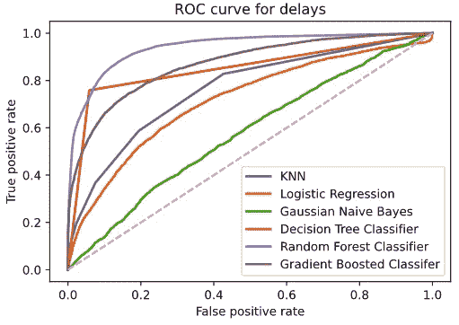

# 出发延误！啊！

> 原文：<https://medium.com/analytics-vidhya/departure-delays-ugh-a634facdbf6d?source=collection_archive---------25----------------------->

演示视频

好吧！回到数据科学世界的另一个独家新闻，以及它如何帮助你！

基本上，我们都厌倦了延误的航班(前 COVID 时间，与我在这里工作的人)，我们都想知道🤔

> “为什么美国航空公司一直告诉我，很抱歉我们什么也做不了”

那可能会让我失去一次美国人的机会

基本上，我想把重点放在纽约市大都会区的航班起飞延误上。为什么这么问？！因为，如果你曾经离开过那里，你就会知道那有多糟糕。想想看，2000 万人住在纽约市的大都会区，他们使用 3 个机场。我说过他们都是国际航班吗？这就像把 20 条车道的汽车合并在一起。相信我，伙计们，它已经被尝试和测试，它不工作，问洛杉矶(我烧桥左和右显然)

因此，在这个实验中，我想关注的是，我是否可以创建一个模型来预测从拉瓜迪亚(LGA)、约翰·肯尼迪(JFK)和纽瓦克(EWR)起飞的航班的延误。开始了。

首先我必须收集数据🤔这让我找到了交通统计局。我只关注夏季，因为那是最繁忙的旅行时期，对于这个模型，我们只关注 2019 年 6 月、7 月和 8 月的数据集。在我检索到数据后，我真的不得不考虑我应该关注什么特性。我决定了出发时间、日期、承运人、出发地、目的地，最后是距离。我对这个列表非常满意，并且基于领域知识，我排除了其他特性，比如向上滚动、向下滚动、征税、到达时间等等。它会给这个模型比我想要的更多一点的窥视

但首先我们必须平衡数据！当我最初看它的时候，它有点倾向于准时出发🤦‍♂

我使用了几种不同的技术，但最终选择了随机采样和 SMOTE。随机过采样器给了我一个近乎完美平衡的数据集，好得令人难以置信，所以！击杀它！

现在，有趣的部分来了，建模！

不，不，不是那种模特。这种类型的建模:

好吧，是的，没有那么激动人心，但我保证它会变得更好(我可能会在这里交叉手指)。

我看了太多不同的模型，但最终选定了随机森林分类器和梯度增强分类器。随机森林开箱即用非常棒，但最终给了我比我预期高得多的分数，特别是因为我没有调整我的任何超级参数。

> 你问什么是超参数？

本质上，您可以调整模型本身的参数，如最大深度、最大特征等。为了看看什么会计算出最优的分数。无论如何，因为我对 Random Forest 的分数不确定，我决定更倾向于使用 SMOTE 平衡器和超参数调整的梯度增强分类器。我觉得我可以根据我的迭代过程来证明这一点。此外，我还进行了交叉验证，将 X-set 和 y-set 分成 10 个相等的部分，然后在一个部分和另一个部分上运行模型，您会得到一个平均准确度分数，这！并不是我们唯一的目标。我们还想看看我们是否有好的召回率、精确度和 f1 分数。

## 我确信我没有错过任何延误的航班。

## **精确=我确定所有我标注延误的航班实际上都延误了**

## **F1 =两者的加权平均值**

因此，在平衡、选择我的模型、交叉验证和超参数调整之后，我在所有这些方面都得到了 90%的分数！万岁！这意味着 90%的时间我的模型是正确的(理论上)

我敢肯定，你们中的一些人会翻着白眼想，“是的，没错”，你很可能是对的。我可能会错过一些东西，但这就是这个过程的美妙之处。数据科学迭代流程不仅仅是在数据科学领域实施的流程，也贯穿于您的日常流程，例如您的工作流。重点是每次都变得更好。对我自己来说，第一周我在同龄人中迷失了，但现在我可以感觉到我的腿在我下面，并开始更好地理解概念。在迄今为止的旅程中，我一直问自己

**“下周我能改进什么”**

**“我怎样才能更有效地学习”**

**“如何更有效地利用我的时间”**

**“我如何照顾好自己的心理健康，以便在接下来的一周里尽可能地更有效率”**

这个迭代过程是你独有的，也是你一个人独有的。只要你知道你正在自己的道路上变得更好，你旁边的人在做什么并不重要。

我相信你们很多人现在都在想“我是来做一次激励性演讲的吗？”是的，我想我喜欢激励别人，我希望我能激励我的同事和我一起变得更好。

我之所以提出这个问题，是因为我和我在 Metis 的同事都觉得我们在努力工作，但我们会问，我们够了吗？答案是:

# **是的！我们是！我们绰绰有余！**

此次训练营和数据科学之旅的目的是通过数据科学来学习、创造和积极影响世界。这就是我们选择这样做的原因。因此，无论我们在这个数据科学过程中学到了什么，我们也应该应用于日常元素。

好吧，回到正题。所以第二周，如果你读了我的文章，我的分数不是很高，这一周我真的想重点了解不同的模型(KNearestNeighbors、逻辑回归、高斯朴素贝叶斯、决策树分类器、随机森林分类器和梯度增强分类器)，我想了解平衡它们的不同方法(随机过采样器、SMOTE、ADASYN 和随机欠采样器)。这就是我开始要做的，也是我完成的。不，我对他们的理解不足以写论文，但我对他们的理解足以和他们交谈。

不管怎样，孩子们，这很有趣，但我得走了！请继续关注我的数据滑雪之旅的下一章！佩丝。