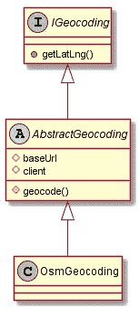
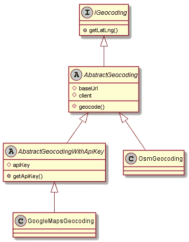

# 通过 Symfony 使用依赖注入和固体原理:地理编码示例

> 原文：<https://medium.com/analytics-vidhya/dependency-injection-and-solid-principles-with-symfony-the-geocoding-example-f18ad08ed20b?source=collection_archive---------2----------------------->


照片由[捕捉人心。](https://unsplash.com/@dead____artist?utm_source=medium&utm_medium=referral)号上[的 Unsplash](https://unsplash.com?utm_source=medium&utm_medium=referral)

*本文假设你对 Symfony 框架(制作控制器、实体、处理表单、构造器/方法注入……)、PHP7 和 OOP 有基本的了解。*

***撰写时使用的版本:
PHP 7 . 4 . 1
Symfony 4 . 4 . 4***

这是我的第一篇文章，希望你会喜欢。
不要犹豫，提出任何你可能觉得有用的意见和/或建议！

# 本文的目标

本文的目标是提供一个地理编码功能实现的例子，使用 Symfony 并试图记住[坚实的原则](https://en.wikipedia.org/wiki/SOLID)。

我决定遵循这种形式:我们从一大块代码(最明显/简单的一个)开始，然后我们通过多个步骤将它分解成最终结果。

# 背景

您正在开发一个包含“目的地”实体的“旅行”应用程序。此实体与“国家”实体有多对一链接。

一个目的地基本上是一个“城市”字符串字段，一个“坐标”`LatLng` [条令可嵌入](https://www.doctrine-project.org/projects/doctrine-orm/en/2.7/tutorials/embeddables.html)与 2 个“纬度”和“液化天然气”字符串字段，以及到“国家”的链接。

你有一个管理界面，你可以在那里 CRUD 目的地，当你创建一个新的目的地时，你想检索一个目的地的 GPS 坐标，使用[nom im OpenStreeMap API](https://wiki.openstreetmap.org/wiki/Nominatim)。

然后，您将能够在界面中的地图上锁定目的地。

# 1 —让我们在控制器中处理它

第一种方法是在控制器中处理表单提交，并检索我们的坐标。这将是我们的起点:

DestinationController.php 文件摘录，“新”控制器

我们在这里做什么？

*   注入并使用带有参数类型提示的 [HttpClient Symfony 组件](https://symfony.com/doc/current/components/http_client.html)
*   向 OSM API 发出请求
*   创建嵌入的锁定对象并保存我们的目的地

**这里有什么问题？**

*   我们的控制器处理所有的逻辑。相反，它应该充当应用程序组件/服务之间的“粘合剂”。现在，它太长了，做了太多的事情
*   我们的代码不是动态的(例如硬编码的 OSM API URL)
*   我们的代码很难读懂
*   我们的代码很难测试
*   因此，我们的代码很难维护/发展

# 2-分离服务中的地理编码逻辑

像许多框架一样，Symfony 提供了一个[服务容器](https://symfony.com/doc/current/service_container.html)，它允许我们将应用程序的各个部分分成不同的服务。这有利于更好地分离特征。

让我们创建一个新的地理编码服务:

我们的首个 osm 地理编码服务

然后，由于`autowire: true` [默认配置](https://symfony.com/doc/current/service_container.html#service-container-services-load-example)，我们可以在我们的控制器中输入提示我们的服务:

我们做了什么？

*   我们将地理编码逻辑分离到它自己的服务中
*   我们的代码可读性更强:更容易理解`$geocodingService->geocode...`

来自罗伯特·c·马丁的《[清洁守则](https://www.amazon.fr/Clean-Code-Handbook-Software-Craftsmanship/dp/0132350882/)》一书，在第十章“类”中，有一节是关于“单一责任原则”(SRP)的，说:

> 我们希望我们的系统由许多小类组成，而不是几个大类。每个小类都封装了一个单独的职责，有一个单独的变更理由，并与其他一些人合作来实现期望的系统行为。
> (来源:干净的代码，罗伯特·c·马丁)

几年后，Robert C. Martin 在他的书“ [Clean Architecture](https://www.amazon.fr/Clean-Architecture-Craftsmans-Software-Structure/dp/0134494164) ”中提到了单一责任原则(SRP)的最终版本:

> 一个**模块**应该只对一个**角色**负责。

一个**模块**可以被认为是一个源文件，或者一组"*内聚的函数和数据结构*"(来源:“Clean Architecture”，Robert C. Martin)。

一个**参与者**通常是，对于一个给定的必需的变更，“一个或者多个人需要那个变更”(来源:“干净的架构”，Robert C. Martin)。

在这里，我们将一个地理编码逻辑分离成一个新的类(一个源文件)。这可以被认为是一个模块。

如果，对于一个给定的场景，这个模块负责一个参与者，这意味着它改变的唯一原因是因为一个参与者的需求，从“干净的架构”的角度来看，这可以被认为是一个更好的 SRP，即坚实原则的 **S** 。

但是在这里，参考 SRP 的“干净代码”定义可能更方便:我们的目标更多的是将一个职责封装到一个类中。

感谢[弗尔切克 Rx](/@vlcek.rx) 指出这一点。

**有哪些问题？**

我们的代码可能看起来更好，但我们仍然有一些东西要修复:

*   在我们的`OsmGeocoding` 服务中，我们硬编码了 OSM API Url
*   我们的控制器与`OsmGeocoding` 服务紧密耦合
*   我们在`geocode` 方法中检索所有地理编码数据，然后只返回`coordinates`

# 3 —改善我们的服务

在控制器“耦合”部分之前，让我们首先关注我们的服务。

我们的地理编码服务还不错，但还可以做得更好。我们可以以一种允许我们以后添加更多方法的方式来设计它，并且我们可以将基本 URL 变成应用程序参数，这样，如果/当它改变时，我们将能够非常容易地更新它。

在`services.yaml`文件中定义一个新的[应用参数](https://symfony.com/doc/current/best_practices.html#use-parameters-for-application-configuration)；

我们新的“app.api_osm_base_url”应用程序参数

通过添加新的私有`$baseUrl`字段和带有新参数的构造函数签名来更改您的服务:

然后我们可以[手动将参数](https://symfony.com/doc/current/service_container.html#manually-wiring-arguments)连接到我们的应用程序参数:

这里我们只是告诉服务容器将参数值注入到服务构造函数中。该服务现在可以依靠该字段来发出请求:

使用服务容器注入的参数

然后，我们可以通过定义一个公共的`getLatLng`方法来进一步改进我们的服务。这将让`geocode`方法自由地用于其他任何事情，因为它提供了所有的地理编码信息。我们还可以将`geocode`设为私有，以便从外部强制使用我们的公共`getLatLng`方法，或者我们将在以下情况后实现的任何其他方法:

我们的服务有一个新的公共方法 getLatLng

当然，我们现在必须在控制器中使用`getLatLng`方法。
变化:

```
$coordinates = $geocodingService->geocode($location);
```

收件人:

```
$coordinates = $geocodingService->getLatLng($location);
```

我们做了什么？

*   将 OSM API 基本 Url 放入应用程序参数中，并将其注入我们的 OsmGeocoding 服务(更易于维护)
*   定义一个新的`getLatLng`方法来提高我们服务的可用性和可读性。`geocode`方法现在是私有的，因为它提供所有的地理编码信息，没有任何区别。如果我们需要更多的信息或者信息的组合，我们现在能够定义新的公共方法。但是我们只会把必要的东西还给外面

**有哪些问题？**

我们仍然有一个问题:`DestinationController`与我们的`OsmGeocoding`服务紧密耦合。

*   如果我们必须使用谷歌地图，会发生什么？或任何其他地理编码提供商？
*   控制器真的需要知道使用的是哪个地理编码提供者吗？
*   如果我需要使用不同的地理编码提供程序(例如，基于用户计划),该怎么办？它可能是免费计划的 OpenStreetMap，以及付费计划的改进功能的谷歌地图…

# 4-抽象地理编码过程

嗯，这一节的标题是剧透，但我觉得这是最有趣的部分。

我们已经看到了坚实原则的 **S** 。通过创建新的抽象层次，并以特定的方式组织我们的类/接口，我们也将利用 **O** 、 **L** 和 **D** 。

但是，让我们问自己正确的问题，而不是首先考虑固体。基本的问题是:我们如何才能摆脱紧密的`OsmGeocoding` / `DestinationController` 耦合？

毕竟，问题是:`DestinationController`真的需要知道地理编码过程是由`OsmGeocoding`服务操作的吗？

**如果我们的控制器只使用一个“地理编码服务”，而不知道执行的是哪一个，不是更好吗？可能是 OpenStreetMap、谷歌地图……如果我们将来需要使用的话。**

然后，我们可以考虑，对于我们的应用程序，“地理编码服务”通常应该是一个具有`getLatLng`方法的类。我们应该为此定义一个**契约**，因为*这就是我们现在需要的地理编码服务*。

这正是一个 [**接口**](https://www.php.net/manual/en/language.oop5.interfaces.php) 的定义。

让我们创建它:

事情是这样的，我们已经让我们的`OsmGeocoding` 实现了一个`getLatLng`公共方法，正如我们的接口中所描述的。所以我们可以说`OsmGeocoding`T10 实现了 T3:

我们在这里所做的是通过创建接口来创建地理编码服务的**通用定义。这个接口告诉我们“地理编码服务必须有一个`getLatLng`公共方法”。顺便说一句:**

> 接口中声明的所有方法都必须是公共的；这就是界面的本质(来源:[PHP.net](https://www.php.net/manual/en/language.oop5.interfaces.php))。

然后，我们用`OsmGeocoding`实现了地理编码服务的第一个具体实现。

首先，这样做允许我们在`DestinationController`中改变我们的类型提示:

Symfony 实际上在他们的[文档](https://symfony.com/doc/current/service_container/autowiring.html#working-with-interfaces)中告诉我们:

> 当使用[服务定义原型](https://symfony.com/blog/new-in-symfony-3-3-psr-4-based-service-discovery)时，如果只发现一个实现接口的服务，并且该接口也在同一个文件中被发现，则配置别名不是强制性的，Symfony 将自动创建一个。

我们只有`OsmGeocoding`实现`IGeocoding`，所以服务容器会在看到`IGeocoding` 类型提示时自动注入它。您可以通过在控制台中执行以下命令来验证这一点:

```
php bin/console debug:autowiring Geocoding
```

这应该会输出如下内容:

```
Autowirable Types
=================The following classes & interfaces can be used as type-hints when autowiring:
 (only showing classes/interfaces matching Geocoding)App\Geocoding\IGeocoding (App\Geocoding\OsmGeocoding)
```

我们在这里做了 3 件事(我们将在后面润色) :

*   [**O** 笔封闭原则](https://en.wikipedia.org/wiki/Open%E2%80%93closed_principle) ( ***未完成但第一个版本*** ):通过创建一个新的抽象层次，**我们将代码开放给扩展而不是修改**。如果我们需要一个新的地理编码服务，我们不需要修改`OsmGeocoding`，但是我们可以创建一个新的实现，一个新的具体的类来代替`implements IGeocoding`。我们将在后面看到如何完成这一点，因为我们在`OsmGeocoding`中还有`geocode`方法，它还不是地理编码服务通用规范的一部分。
*   [**D** 依赖倒置原则](https://en.wikipedia.org/wiki/Dependency_inversion_principle):在`DestinationController`中，我们现在依赖的是地理编码服务的抽象`IGeocoding`，而不是地理编码服务的具体实现`OsmGeocoding`。我们将控制器从`OsmGeocoding`中分离出来，使我们的架构更加灵活。
*   [**L** 伊斯科夫替换原则](https://en.wikipedia.org/wiki/Liskov_substitution_principle):我们在`IGeocoding`中为`getLatLng`定义了一个签名，比如“它必须返回`LatLng|null`”。这样，当我们的应用程序将使用`IGeocoding`的一个子类型，即一个具体的地理编码服务的实例时，实现的`getLatLng`方法的行为将保持一致。举例来说，如果我们选择返回一个`array`，这将是不一致的，因为我们没有指定的格式，我们可以将子类中的任何东西返回到这个数组中。

# 5-让我们完成并抛光它

为了拥有一个可扩展的模型，让我们定义一个地理编码服务是一个`AbstractGeocoding`对象，实现`IGeocoding.`



用 [PlantUML](https://marketplace.visualstudio.com/items?itemName=jebbs.plantuml) 制造

所有这些都在抽象类中受到保护。

对于`geocode` 方法来说没问题，因为它是私有的，我们不能把它放入基本接口。

最后，我们将其抽象，因为我们只想使用`OsmGeocoding`或其他具体的类，还因为我们想在子类中实现`getLatLng`和`geocode` 方法，例如`OsmGeocoding`。

然后，我们有一个开放的架构来实现更具体的类。

> 等等，要用谷歌地图，我需要用一个 API 密匙！

好吧，那么，让我们定义另一个抽象地理编码类型，它可以使用一个 API 键:



用 [PlantUML](https://marketplace.visualstudio.com/items?itemName=jebbs.plantuml) 制造

最后，我们只有 2 个具体的类:GoogleMapsGeocoding 和 OsmGeocoding。

## 关于 API 密钥

我们可以将 API 键定义为`.env.local`中的一个 env 变量，然后使用参数注入:

## 配置服务容器以在实现之间进行选择

现在我们已经有了地理编码服务的 **2 个实现**，我们必须配置服务容器**实际上选择了一个**。

我们可以很容易地在`services.yaml`中配置它:

这里我们只是告诉容器，如果他遇到了`IGeocoding`类型提示，就选择注入`OsmGeocoding`服务。

关于语法中的' @ '，Symfony 在他们来自[文档](https://symfony.com/doc/current/service_container.html#choose-a-specific-service)的例子中告诉我们:

> ' @ '符号很重要:它告诉容器
> 你想要传递 id 为' monolog.logger.request '，
> 的*service*，而不仅仅是* string * ' monolog . logger . request '

# 6-最后(但并非最不重要)

这里我们遇到的最后一个问题是，我们只在控制器中检索坐标。
**如果我在应用程序中从另一个地方创建目的地会怎样**？将执行的不是同一个控制器，然后……我将不得不**复制我的代码**(这很糟糕)，以便能够使用地理编码服务并再次实现相同的逻辑。

## 利用事件订阅者自动进行坐标检索

这里的解决方案是创建一个[事件订阅者或事件监听器](https://symfony.com/doc/current/event_dispatcher.html)。当实体管理器将要保存一个目的地时，它唯一的任务是检索坐标并用结果填充目的地。

要做到这一点，我们可以听一个[学说生命周期事件](https://www.doctrine-project.org/projects/doctrine-orm/en/2.6/reference/events.html#lifecycle-events)(例如 prePersist)。因此，当实体管理器将要持久化目的地时，我们从`IGeocoding`依赖关系中触发坐标检索。每当要创建一个新的目的地时，这就会在应用程序中的任何地方触发。

> 由于这不是本文的主题，我也不想让它太长，所以我没有在这里放任何代码。但是您可以在我放在文章末尾的示例应用程序中找到事件订阅者实现，在 Github repo 中。我认为它值得一提，因为它帮助我们分离代码并自动化一些操作。

# 结论

有了这种实现，我们做了什么？

## 单一责任原则

根据“干净的架构”这本书，SRP 是关于参与者的。这里，我们的例子可能更多的是关于“干净的代码”一书的定义:这里的目标是将我们的代码分成不同的部分。结果是**的代码乍一看可能不容易理解，但是更容易维护、发展和测试**(单元/功能测试不是本文的主题)。

## 以后扩展我们架构的可能性(开闭原则)

这种架构允许我们在需要时**扩展它**。我们没有设计一个封闭的、过于具体的架构，而是保留了一些特性，但是它们被封装在具体的、最终的类中。这些类继承自抽象类和接口，这样我们可以在将来定义更具体的类。每一个具体的类都有自己的行为，继承自父类的定义。

## 依赖抽象而不是具体的类(依赖倒置)

通过引入`IGeocoding`接口，我们定义了一个**通用行为**，它必须在较低的级别(具体类)实现。然后，具体的行为将取决于注入服务的具体类型。

然后，我们甚至可以实现一个动态选择地理编码服务的**特性**，使用一个[服务订阅者](https://symfony.com/doc/current/service_container/service_subscribers_locators.html)或者一个具有服务定位器依赖的工厂。唯一的条件是有一个`IGeocoding`实例作为返回类型。

## 利斯科夫替代原理

因为我们有一个定义方法的父接口，所以我们确保子类将与这个定义保持一致。所以，当我们对一个`IGeocoding`类型、**有依赖时，我们知道任何具体使用的对象都会实现这个契约**，比如“当我调用`getLatLng`时，返回一个`LatLng`对象”。

我们没有看到“I”(针对[接口分离原理](https://en.wikipedia.org/wiki/Interface_segregation_principle))，因为我们这里只有一个接口。如果我们仅在所有具体地理编码提供程序的子集中拥有一些新要素，我们可能需要这一原则。然后，我们应该分离方法定义，以避免在具体类中不需要这些方法的空的和无用的实现。

> 当然，这是实现该特性的一种方式，还有许多其他方式。有更简单的，更普通的，这取决于你喜欢/需要什么和你有多少时间。

你会在 Github 上找到一个示例应用，这里:[https://github.com/ld-web/medium-sf-di-solid-geocoding](https://github.com/ld-web/medium-sf-di-solid-geocoding)

不要犹豫评论和/或建议任何你可能发现有用的东西！