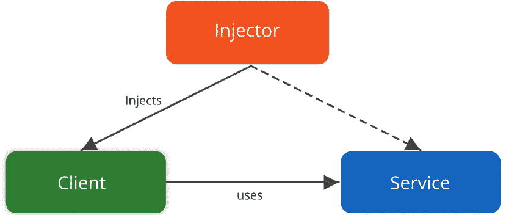
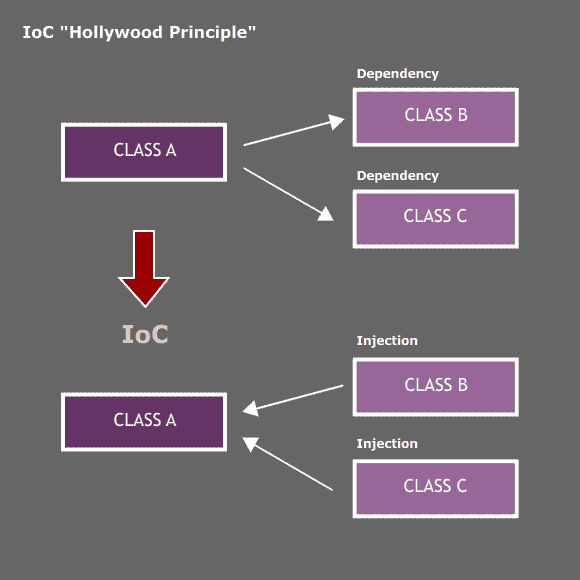
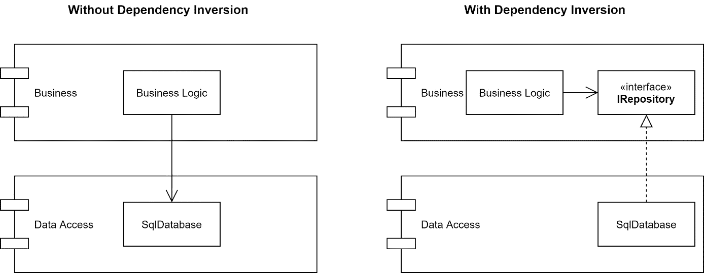

# 依赖注入:Spring 框架的概念

> 原文：<https://medium.com/analytics-vidhya/dependency-injection-concept-of-spring-framework-d9c3688005f8?source=collection_archive---------7----------------------->

**依赖注入概述**

当 Rod Johnson 写的一本名为*没有 EJB 的 J2EE 开发的书在 2002 年*发布时，Spring 框架开始引人注目。带着 spring 框架想法的作者认为它可能比 Java EE 更好。当时，Java 企业版被认为是非常重要的，而且从开发者的角度来看，与 EJB 合作是一项艰巨的任务。作者随后提出了 spring 框架，spring 框架的一个重要概念是*依赖注入。*

# **依赖注入概述**

Spring framework 充当依赖注入，这是反转控制的一种形式(控制反转是一种编程原则，与传统的控制流相比，它反转了控制流)。IoC 是好莱坞的一种原则，*别叫我们，我们就叫你*，应用在编程上。

**控制原理反转**

作为依赖注入的 spring 框架在您提供的指令的帮助下将您的应用程序的类绑定在一起，这些指令可以作为代码中的*注释*或者通过*显式绑定配置代码*或者通过使用 *XML* 配置来提供。

# **举例说明**

如果您从一个应用程序开始，它可能还需要其他类，比如 helper 和 utility 类。因此，在 basic Java 中，应用程序类将实例化助手和实用程序类，然后开始使用它们，这将增加类之间的耦合。现在类之间有了一个紧密耦合的 T21，因为应用程序类现在依赖于助手类和实用程序类的正确实现，而且类之间没有抽象的概念。这使得单独测试应用程序类变得困难，因为它总是会实例化其他两个类。

这就是 spring 依赖注入容器出现的时候。在 spring 依赖注入的帮助下，您将拥有相同的类来运行您的应用程序，但是您将不得不指示 *spring DI 容器*为您做同样的事情，而不是实例化和绑定这些类。这可以使用代码中的注释、配置代码或 XML 配置代码来完成。

**弹簧 DI 容器的一个例子**

在 spring 框架中，我们必须告诉 spring 应用程序代码中使用的类以及这些类之间的相互依赖关系。spring DI 控制器将实例化助手、实用程序和应用程序类，这些实例将被称为*spring bean。*

现在 DI 容器已经配置好了，它知道了应用程序的类之间的依赖关系。但是，在没有从应用程序类实例化助手和实用程序类的情况下，spring DI 容器会将助手和实用程序类注入到应用程序类中，这样助手和实用程序类将从应用程序类中*解耦*。此外，应用程序的配置现在更加*灵活*，因为它现在由配置类指示。

# **总结**

因此，spring 依赖注入在某种程度上帮助了你，你必须声明组件和它们之间的依赖，DI 容器在运行时将它们绑定在一起。