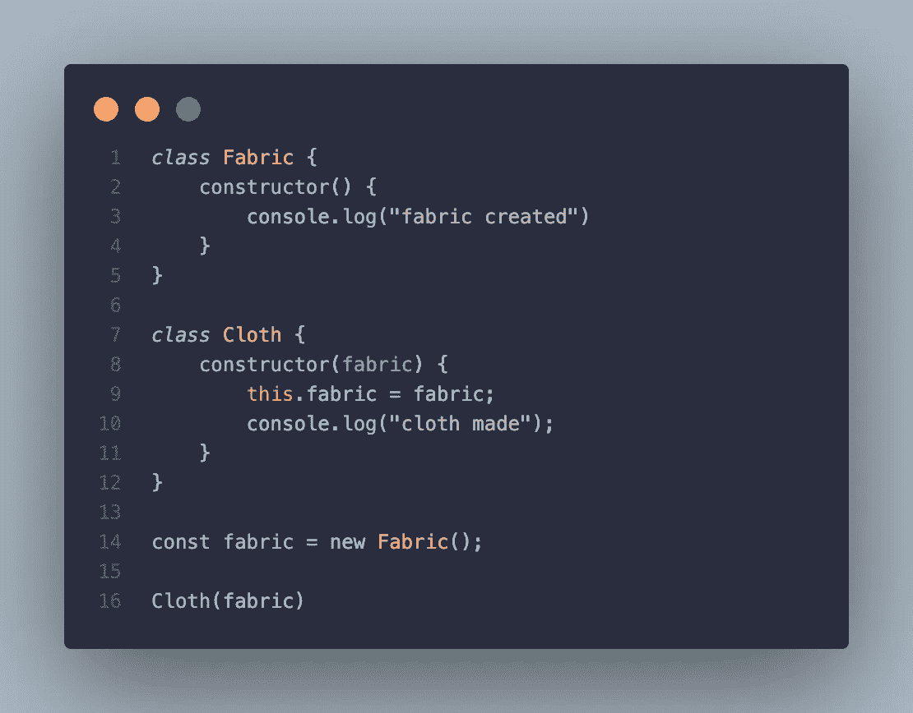

# 没有库的 Javascript 中的依赖注入

> 原文：<https://medium.com/analytics-vidhya/dependency-injection-in-javascript-with-no-libraries-8ad1aba74fbd?source=collection_archive---------11----------------------->

嘿，这是更多故事的第二个。

依赖注入就是这些概念中的一个，(就像位运算一样)，它被大多数开发人员忽略了。“它给代码库带来了很多复杂性”是你从一个显然不理解 DI 的开发人员那里得到的著名回答之一。

## 什么是依赖注入？

首先，软件工程中的依赖是一个函数或过程需要的对象、实例或任何数据结构。下面展示了一个例子。

织物是布料对象中的一个依赖项。Fabric 对象是在 Cloth 对象内部创建的，它不允许我们在 Cloth 类之外测试甚至使用 Fabric 对象。这个限制由一个概念进一步解决，**控制反转**——依赖注入背后的概念。控制反转建议将依赖项作为参数传递给依赖项，从而将它们注入到依赖项中。

因此**依赖注入**是一种技术，其中一个[对象](https://en.wikipedia.org/wiki/Object_(computer_science))接收它所依赖的其他对象。

感谢您的阅读，下次见。

欢迎回来！

依赖注入不仅仅是将参数传递给依赖者。是的，这解释了为什么大多数人不利用它。为了进一步演示，我们将构建一个迷你应用程序来验证用户，并让用户添加和显示笑话。

我们从编写注射器开始。这个注射器是一个容器，它保存着我们的依赖，当被要求时，它会很快吐出来。

是啊。就是这样。

接下来，我们为我们的应用程序创建依赖项(服务)。我们将把这些添加到依赖容器中。

然后是笑话服务。

让我们在注射器中注册这些服务。我们在 secretary.js 文件中这样做。

是时候了！让我们在视图模型中使用这些。视图模型承载着应用程序级的业务逻辑。首先，我们为视图模型编写一个基类来获取这些依赖关系。

最后，是时候利用这些依赖性了。让我们写一个用于认证的视图模型，然后再写一个用于笑话的视图模型。

视图模型扩展了 BaseViewModel 类，因此可以访问依赖项。

著名的 index.js 时间到了

运行 index.js

这种实现消除了在依赖关系中创建依赖关系的想法，最重要的是帮助我们避免传递依赖关系，从而破坏我们的依赖关系图。

你觉得这篇文章有什么启发吗？留下几个掌声。多次鼓掌。

在 https://github.com/nuelsoft/js-di.git[找到整个代码库](https://github.com/nuelsoft/js-di.git)