# 在 Amazon AWS EC2 上部署 flask 应用程序，并在离线时保持其运行。

> 原文：<https://medium.com/analytics-vidhya/deploy-a-flask-app-on-amazon-aws-ec2-and-keep-it-running-while-you-are-offline-38d22571e2c5?source=collection_archive---------4----------------------->

**Flask:**
Flask 是 python 中的一个微 web 框架。它旨在快速轻松地开始使用，并能够扩展到复杂的应用程序。部署起来很容易。py 在网上。

**亚马逊网络服务 EC2:** 你可以在上面谷歌一下。简而言之——它为你提供了一台远离的电脑，随时运行并与互联网连接。根据您需要的计算，您可以从不同的规格中选择机器。基本的机器是免费的，复杂的规格是要付费的。

我们开始吧-

**第一步:在**[**AWS**](https://aws.amazon.com/)上创建一个帐户开始时，你需要一张信用卡。但是免费实例(我们将会使用)不会向您收费。

**第 2 步:导航到 AWS 管理控制台，服务，然后单击计算服务中的 EC2。**

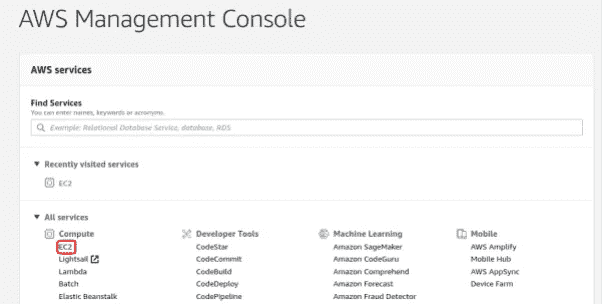

**步骤 3:导航至侧栏上的实例，然后单击启动实例。**

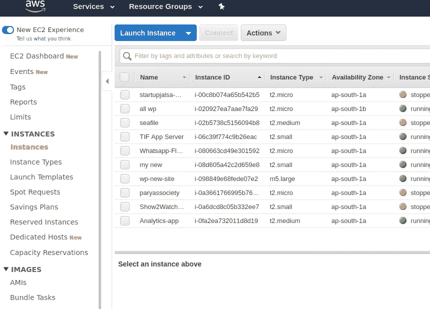

**根据要求选择所需机器。我选择的是 Ubuntu 18.04 LTS 服务器。**

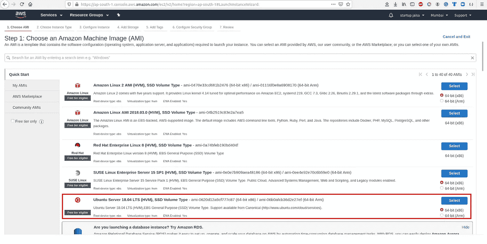

**第四步:选择 TF2.micro 类型实例并点击右下角的‘查看并启动按钮’。**

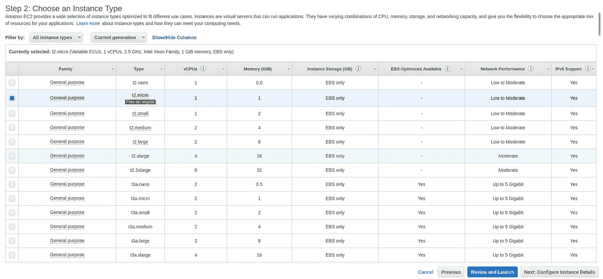

第五步:你可以在这里查看你的系统配置。上一步，点击右下角的启动。

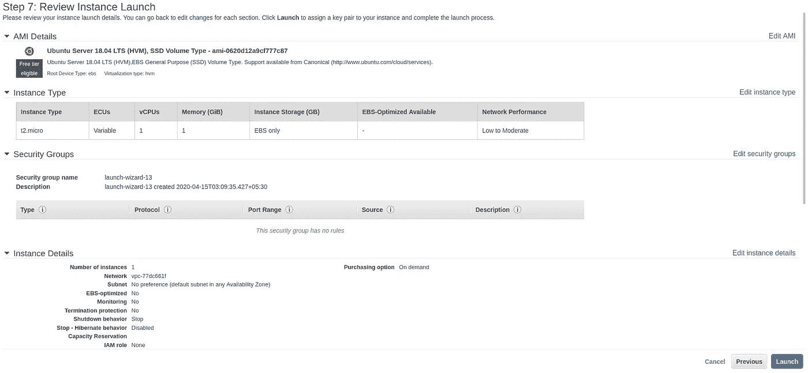

**步骤 6:选择“创建新的密钥对”选项，并提供您选择的“密钥对名称”。
(1)下载密钥对**(不要丢失，在访问机器时会有用)。
**(2)下载后，点击‘启动实例’。
(3)点击下一页的“查看实例”。**

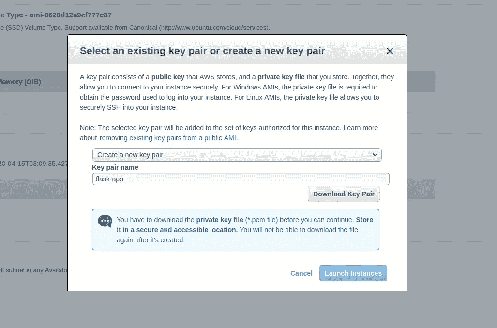

第七步:等待实例初始化。

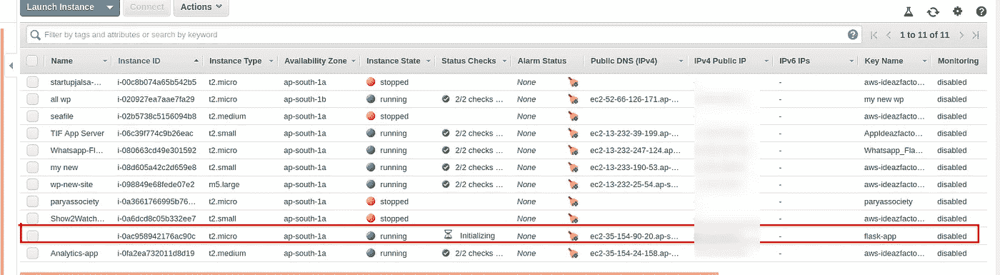

您可以根据自己的选择为实例命名。

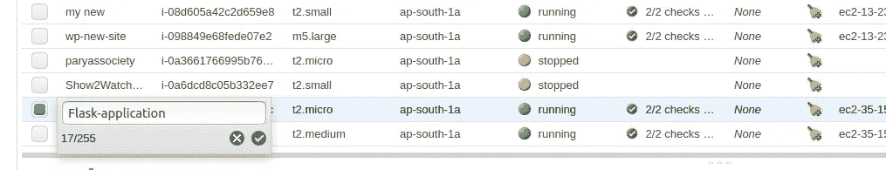

**第八步:复制 IPv4 公有 IP 地址。**

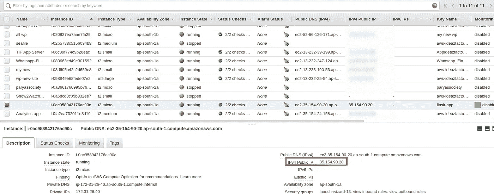

第 9 步:现在我们需要在本地 pc 上进行 ssh。
1。为此，首先我们需要打开终端并导航到下载的密钥对文件所在的目录。pem 文件)
**2。**现在使用下面的命令赋予密钥对文件只读权限:`**chmod 400 <your-pem-file-name>.pem**`(它将为文件提供[只读](https://chmodcommand.com/chmod-400/)权限)
**3 .**并使用复制的公钥，SSH 进入 AWS 实例使用此命令:
`**ssh -i <your-pem-file-name>.pem <your-machine-type>@<your-public-ip>**`

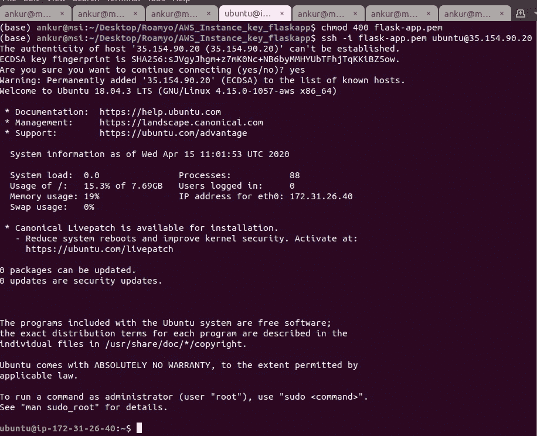

**第十步:**更新系统:`**sudo apt-get update**`检查是否有 python3: `**python3 -V**` (如果不存在——那么安装)
检查是否有 pip3/ install 使用:`**sudo apt install python3-pip**`安装 Flask 使用:`**pip3 install flask**`同时安装你的 flask app 的其他依赖项。

**步骤 11:** 安装完依赖项后，创建一个名为 **server.py** 的文件，添加你的 flask app 的内容。这里我使用的只是一个简单的应用程序，内容如下。
***检查主机和端口号**

`from flask import Flask
app = Flask(__name__)`

`@app.route('/')
def hello_world():
return 'Hello, World!'`

`if __name__ == "__main__":
app.run(host="0.0.0.0", port=80)`

**步骤 12:对于您的 Flask 应用程序实例，在“描述”选项卡的“安全组”选项中单击“启动向导”。**

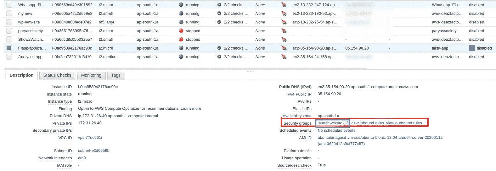

**第 13 步:点击“入站规则”→“编辑入站规则”** 添加一个新规则(使用“添加规则”按钮)，其类型为 **HTTP** ，端口为 **80** ，主机为 **0.0.0.0/0** 和 **::/0**

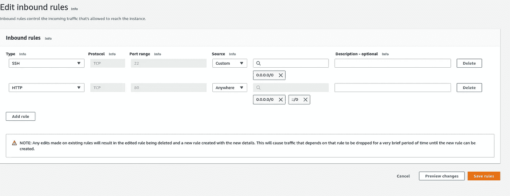

**步骤 14:这是运行 Flask 应用程序的重要步骤。** 从终端，您可以使用命令运行 flask 应用程序:
`**sudo python3 server.py**`(确保您通过 ssh 连接到实例)但是如果我们关闭终端，或者从 ssh 退出到实例，该命令将自动终止。
为了继续运行应用程序(这样当应用程序继续运行时，您可以关闭您的笔记本电脑，享受一些乐趣)，我们将使用强大的 linux 命令: **nohup** (不挂起)。因此，为了运行 python 应用程序，我们将使用命令:
`**nohup python3 server.py &**` ( &允许我们在后台运行应用程序，nohup 允许应用程序即使在挂机/注销时也能继续运行)

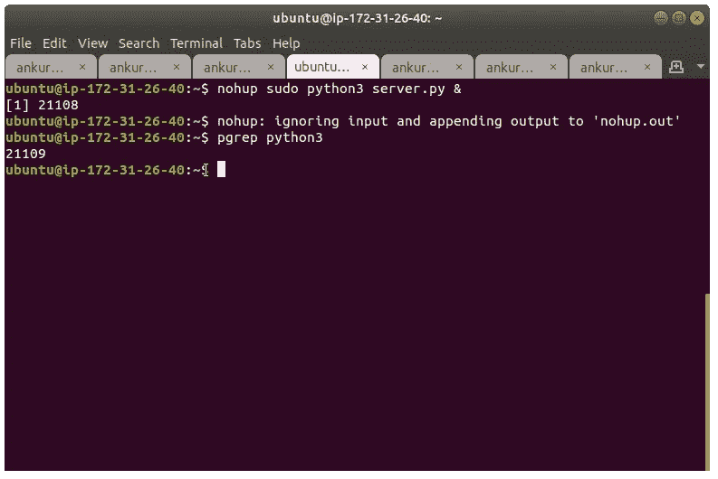

我们可以在 nohup 命令后看到“进程 id”:正在运行的进程的 21108。
我们可以使用`**pgrep <process-type>**` 命令来检查“流程型”的流程运行情况。现在我们可以从终端/系统注销，但是我们的进程将会运行。要检查进程运行情况，请在浏览器中粘贴实例的 IPv4 公共 IP 地址。在我们的情况下其:**35.154.90.20**

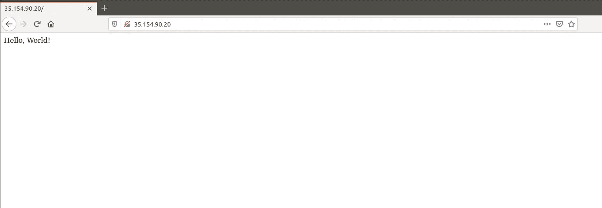

我们到了！活下去！

现在，如果我们希望终止该进程，我们可以使用命令:`**sudo kill <process-id>**`。所以要杀死这个进程我们可以使用命令:`**sudo kill 21108**`。(确保您在实例中被 ssh'ed)

请在评论中留下建议和反馈。如果你有任何疑问，给我发邮件:**bhatia.ankur24@gmail.com**