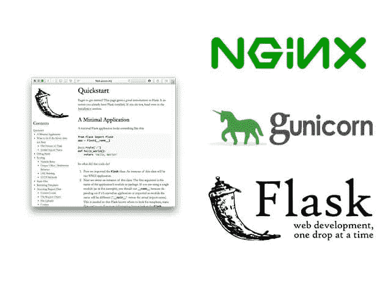
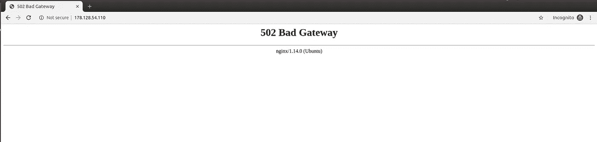
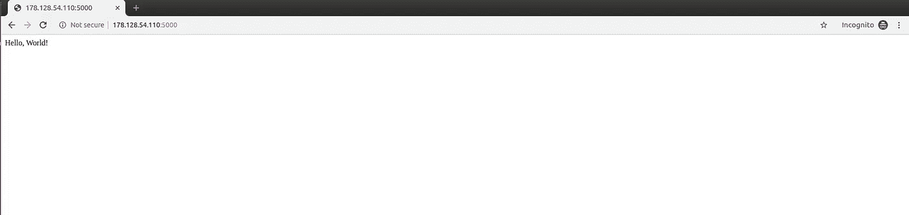

# 将 Flask 应用程序部署到 Ubuntu 18.04 服务器

> 原文：<https://medium.com/analytics-vidhya/deploy-a-flask-application-to-ubuntu-18-04-server-69b414b10881?source=collection_archive---------2----------------------->



在本文中，我们将尝试使用 Nginx 在 Ubuntu 服务器上部署一个非常简单的 Flask 应用程序。本文旨在让您了解如何尽可能简单地在 Ubuntu server 中部署 flask 应用程序。因此，我们将从一个新的 Ubuntu VPS 开始，安装一个非常基本的 Flask 应用程序，然后部署它。通过删除不必要的复杂性，如数据库设置和其他依赖项，我相信这将有助于您轻松理解基本部署，然后您可以尝试自己解决另一个问题，如安装数据库或其他包。

首先，我假设您已经在自己的 VPS 中安装了一个全新的 Ubuntu 服务器，并以 root 身份登录到该服务器。现在让我们在这里创建一个用户，以我为例，我创建了一个名为“gerry”的用户。使用这个命令，您可以随意命名它。

```
$ adduser gerry
```

随意插入密码和密码确认。如果您愿意，可以将其他内容留空。在我们创建一个用户(在我的例子中是 gerry)之后，我们将首先更新 Ubuntu 服务器中的软件包，以确保我们可以安装 python3 和我们需要的其他软件包:

```
$ apt update
```

首先我们需要安装 web 服务器 Nginx:

```
$ apt install nginx
```

现在我们要为 Nginx 创建一个配置文件:

```
nano /etc/nginx/sites-enabled/flask_app
```

在编辑器中添加如下代码:

```
**server** {
    **listen** 80;
    **server_name** 192.0.2.0;

    **location** / {
        **proxy_pass** http://127.0.0.1:8000;
        **proxy_set_header** Host $host;
        **proxy_set_header** X-Forwarded-For $proxy_add_x_forwarded_for;
    }
}
```

禁用 Nginx 默认配置，因为我们将使用自己的配置:

```
unlink /etc/nginx/sites-enabled/default
```

使用命令重新加载 Nginx 服务器:

```
nginx -s reload
```

如果您使用您的域名或 IP 地址访问您的服务器，您将看到如下结果:



这意味着我们已经成功安装了 nginx，但是还没有配置 WSGI 来连接我们的 flask 应用程序。

接下来，我们安装 python3:

```
$ apt install python3
```

安装 python3 pip

```
$ apt install python3-pip
```

然后导航到创建的用户的主目录(在我的例子中，我创建的用户是“gerry”)

```
$ cd /home/gerry
```

现在让我们安装 flask 应用程序，我们将按照本文安装一个新的 flask 应用程序([https://flask.palletsprojects.com/en/1.1.x/installation/](https://flask.palletsprojects.com/en/1.1.x/installation/))。

1.  创建一个名为 myproject `$ mkdir myproject`的目录
2.  转到我的项目目录`$ cd myproject`
3.  在我的项目`$ mkdir application`中创建一个名为 application 的目录
4.  转到应用程序目录`$ cd application`

5.将烧瓶安装在`$ pip3 install flask`目录下

6.创建一个非常基本的名为`__init__.py`的 flask 应用程序，如下所示:

7.让我们通过键入`$ python3 __init__.py`来测试我们的服务器

6.如果您使用端口 5000 访问您的服务器，您可以看到 Hello，World！现在。这意味着我们已经成功地将简单的 flask 应用程序安装到了服务器上



让我们按 ctrl+c 来停止服务器。

现在我们将安装 Gunicorn:

```
$ apt install gunicorn3
```

从应用程序的根目录运行 Gunicorn(在 myproject 中，而不是在应用程序中)

```
$ gunicorn3 --workers=3 application:app
```

现在我们简单的 flask 应用程序在互联网上运行，你可以使用你的域名或 IP 地址直接访问它。