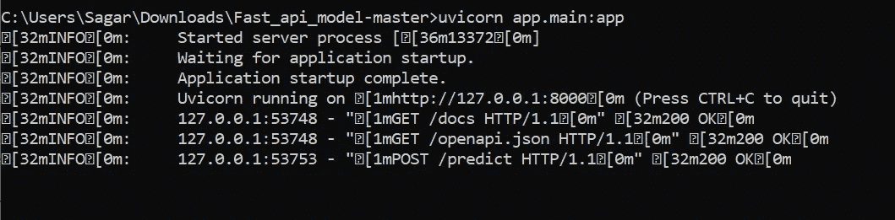
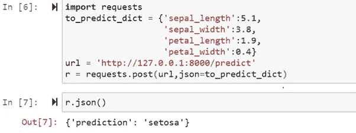
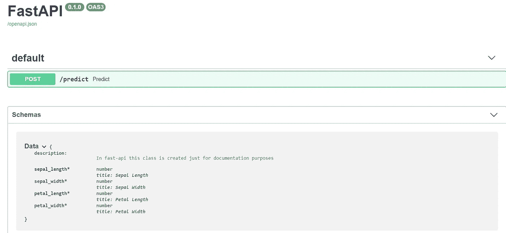
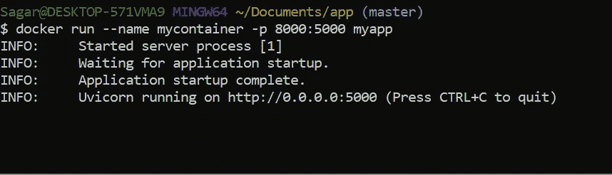
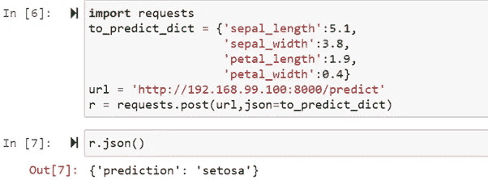
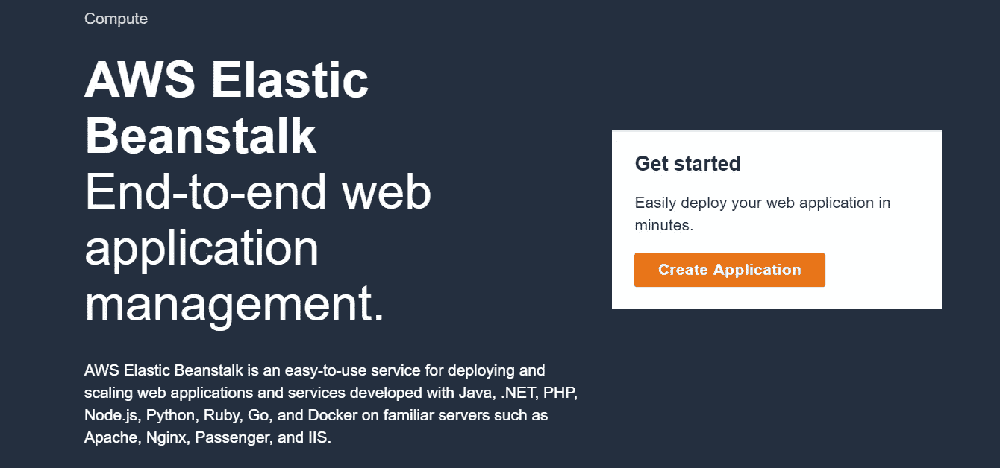
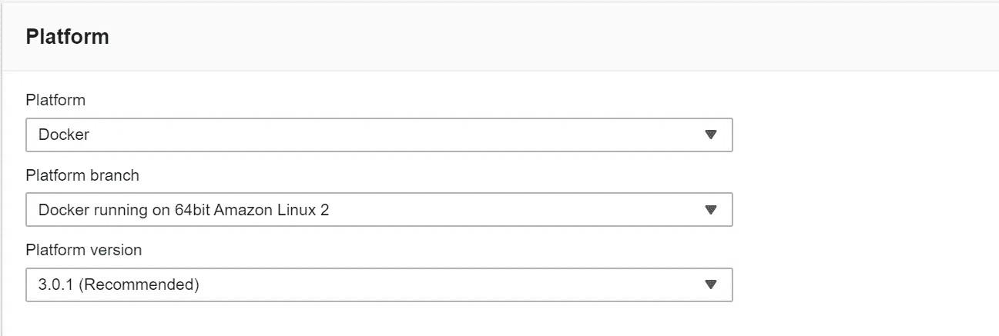
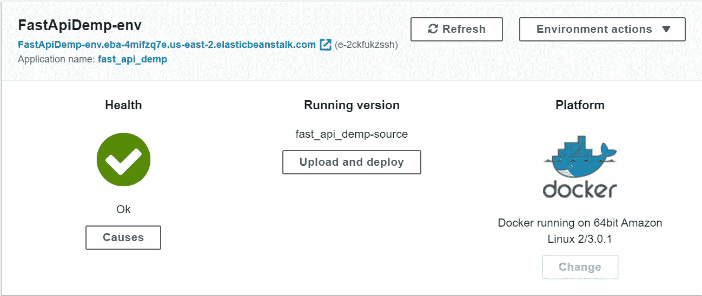
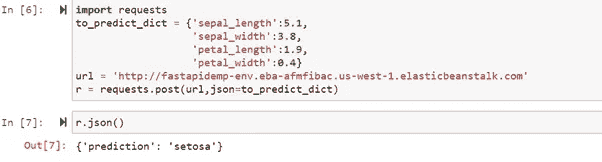

# 使用 FastApi 和 Docker 在 AWS 上部署机器学习 ONNX 模型

> 原文：<https://medium.com/analytics-vidhya/deploy-a-machine-learning-onnx-model-on-aws-using-fastapi-and-docker-3872c17f99b5?source=collection_archive---------8----------------------->


照片由[斯隆](https://www.slon.pics)拍摄

T 关于各种机器学习模型的复杂性，有很多教程，但很少有人谈论实际创建一个生产就绪的 API。数据科学家有两种角色。

1.  从提供给他们的数据中产生洞察力并创建模型。
2.  开发以 ML 为核心的软件。

本文将专注于第二部分，并将向您展示**如何以 ONNX(开放神经网络交换)格式保存机器学习模型，然后从它创建一个生产就绪的 API**。如果你在一家公司工作，一个非机器学习的工程师很难从你创建的模型中获得一些洞察力。同时处理机器学习和应用程序开发也变得很困难。生产就绪 API 使这项工作变得更加容易，因为它使您可以轻松地将您的工作与其他开发人员集成，这些开发人员可以开发出更好的 web 应用程序。

对于那些没有太多模型部署经验的人来说，这篇文章会很有帮助，因为他们不想直接进入复杂的模型，而是想从一个基本的模型开始。在前进之前，克隆这个 [**库**](https://github.com/shgoyal33/Fast_api_model) **然后跟着前进。**

最后，您将了解如何:

1.  以 onnx 格式保存模型。
2.  使用 FastAPI 和 uvicorn 创建一个 API。
3.  使用 docker 将应用程序容器化。
4.  在 AWS Elastic Beanstalk 上部署 Docker 映像。
5.  使用 python 测试 API。

# 为什么不把 ml 模型放在后端？

在继续之前，让我们先谈谈我们为什么要这样做。

假设你正在制作一个网站或移动应用程序，将使用一些机器学习模型，那么为什么不把整个代码放在后端。一些原因是:

1.  当模型是一个独立的实体，而不是在后端从头开始实现时，它就变得可扩展。
2.  易于与多个应用程序集成，因为开发人员无需担心 ML 部分，可以直接使用 API 作为黑盒。

现在，让我们开始部署。

# 开放式神经网络交换(ONNX)

这是交换机器学习和深度学习模型的新标准。它使这些模型可移植，并防止供应商锁定。当模型保存在中时。onnx 格式，单个 onnxruntime 可以用于所有不同模型的推断。本教程将向您展示如何以 onnx 格式保存一个简单的随机森林分类器，并从中生成推论。所有这些都将在 FastAPI 应用程序内部完成。

**如何将模型保存为 ONNX 格式？**

对于本教程，将使用一个非常传统的数据集，因为它对初学者来说更容易理解。该数据集被称为虹膜数据集。在转到代码之前，确保通过运行以下命令安装 skl2onnx。

```
pip install skl2onnx
```

如果您打开 model.py 文件，您将看到代码。

这个文件中有两个函数 load_data()，它们加载 iris 数据以将列名和目标名保存在 pickle 文件中。

我们将通过传递一个字典来调用 API，该字典以 key 作为列名(在本例中是 petal_length、petal_width、sepal_length 和 sepal_width ),以 values 作为我们要分配的值。输出将是数字 0、1 或 2。然后我们把它映射回花的名字，使它更容易理解。

第二个功能是我们训练一个随机森林模型并以 onnx 格式保存它。第 42 行定义了初始数据类型，在我们的例子中是 FloatTensorType。我们将形状作为 None 传递，X.shape[1]。然后我们使用来自 **skl2onnx** 的函数 convert_sklearn(第 45 行)。在这个函数中，我们传递 rf 对象和输入数据类型。然后，我们打开一个文件，将模型(第 48–49 行)序列化为 string，并将模型保存为 rf_m.onnx。要了解关于 onnx 的更多信息，请关注 [**和**](https://github.com/onnx/tutorials) 。

现在，如果您理解了这一点，请打开命令行，转到包含 model.py 的文件夹(在本例中，它是 Fast_api_model-master 文件夹)，并使用

```
python model.py
```

执行之后，你会在 app 文件夹中看到文件 **rf_m.onnx，target.pickle 和 features.pickle** 。

# 使用 FastAPI 创建端点

大多数关于云部署的文章讨论的都是 Flask，这没什么不对，但是与 FastAPI 相比，它没有那么快。就像 Flask 一样，可以用最少的代码**创建一个端点。它自动创建**开放 API(Swagger)** 和**氧化还原文档**。在这篇文章中，我不会涉及太多的细节。要了解 FastAPI 的更多信息，请点击 [**此处**](https://fastapi.tiangolo.com/) 。**

## 紫玉米

为了主持这个模型，我们将使用 uvicorn。与更通用的 WSGI 服务器相比，它是一个允许异步流程的 ASGI 服务器。这加快了进程。在继续之前，请确保安装了 FastAPI 和 univorn。

```
pip install fastapi
pip install uvicorn
```

要做出推断，您需要 onnxruntime。通过运行以下命令进行安装:

```
pip install onnxruntime
```

安装必要的包之后，我们创建 main.py 文件，这是端点创建的代码。

我们通过导入必要的库来开始代码，然后创建一个 FASTAPI 类的对象，并将其命名为 app。这将用于运行应用程序。然后，我们加载使用 model.py 文件创建的目标和特征文件。现在已经创建了一个推理会话。不管 ML 库如何，都将使用相同的推理会话，这是创建 onnx 格式的一个原因。这个推理会话将生成保存 onnx 文件时使用的输入和输出名称。

FastAPI 受欢迎的原因之一是它能够创建文档，我们在这里通过创建一个从 class BaseModel 继承的类数据来做到这一点。在本课程中，我们将提供有关用于生成预测的特征的信息。

创建端点最关键的步骤是处理 GET 或 POST 请求。这里我们通过使用 POST 请求来访问 API，我们通过使用。

```
@app.post(“/predict”)
```

这告诉应用程序在 post 请求到来时调用 predict 函数。在这个函数中，我们首先将数据转换成一个 numpy 数组。因为我们一次传递一个数据点，所以我们必须将其整形为(1，4)，其中 4 是数据集中要素的数量。因为我们将输入数据定义为浮点张量，所以我们显式地将输入类型转换为浮点。为了生成预测，我们运行会话并传递输出、输入数据名称以及要生成预测的数据。这个预测值然后被转换成一个字典并被返回。

# 运行模型并生成请求

要运行此模型，请打开 cmd 并遍历到 Fast_api_model-master 文件夹并执行。

```
uvicorn app.main:app
```

服务器将启动，您可以通过链接 127.0.0.1 访问它



使用 requests.post()方法向 API 发送 post 请求。发送 post 请求有多种方法，但我发现这种方法相对简单。



要访问 swagger 页面，请转到 uvicorn 服务器正在运行的 URL，并在末尾添加/docs。大摇大摆的页面看起来会像这样。在这里您可以看到模式，其中给出了数据集中使用的特性，您甚至可以从这里测试 API。



# 容器化应用程序

容器的可移植性使得可以轻松快速地部署到多种硬件平台和操作系统上。为此，我们将使用 docker。要设置 docker，请遵循此处的 [**指示。你还需要一个码头枢纽**](https://docs.docker.com/get-docker/) **[**账户**](https://hub.docker.com) 。**

要创建 docker 映像，需要两个文件

1.  Dockerfile 文件
2.  requirements.txt。

docker 文件包含创建环境、安装依赖项和运行应用程序的指令。

requirements.txt 文件包含运行应用程序所需的必要包。

```
#app/requirements.txtfastapi==0.54.1
numpy==1.18.1
scikit-learn==0.22
skl2onnx==1.6.1
onnx==1.6.0
onnxconverter-common==1.6.1
onnxruntime==1.2.0
requests==2.22.0
pydantic==1.5.1
uvicorn==0.11.5
pandas==1.0.1
```

在 Fast_api_model-master 目录中运行:

```
docker build -t <image_name>./docker run --name <container_name> -p 8000:5000 <image_name>
```



要测试应用程序，首先使用以下方法确定主机 IP:

```
docker-machine ip
```

在这种情况下，它是 192.168.99.100。我们可以像测试本地部署一样进行测试。



通过运行以下命令，将此映像推送到您的 docker hub 帐户:

```
docker tag <image_name> <dockerhub_username>/<image_name>:<tag_name>
docker push <dockerhub_username>/<image_name>
```

# AWS 弹性豆茎

现在我们在 **AWS、**上托管应用程序，你将需要一个 AWS 帐户(如果你没有，请在 [**这里**](https://portal.aws.amazon.com/billing/signup?nc2=h_ct&src=header_signup&redirect_url=https%3A%2F%2Faws.amazon.com%2Fregistration-confirmation#/start) 创建一个)。它会要求一个**信用卡/借记卡**，如果你遵循选项而不改变任何配置，你将有资格获得一个**免费层账户**，并且费用将是最小的。

创建账户后，搜索**弹力豆茎**并打开。将会看到以下屏幕。



点击**创建应用**。添加名称和描述。然后，您必须指定平台，在本例中，该平台将是运行在 Linux 上的 docker。



对于应用程序代码，我们有两个选项，要么选择“示例代码”，要么选择“上传您的代码”我们将上传我们的代码，为此，我们将创建一个 JSON 文件，并将其命名为 Docker.aws.json。

```
{
 “AWSEBDockerrunVersion”: “1”,
 “Image”: {
 “Name”: “<your_dockerhub_username>/<image_name>:<tag_name>”,
 “Update”: “true”
 },
 “Ports”: [
 {
 “ContainerPort”: “5000”
 }
 ],
 “Logging”: “/var/log/nginx”
}
```

选择**上传您的代码**并上传该文件，点击**创建环境**。

如果您想要根据您的要求进行自定义，请点按“配置更多选项”这将需要一些时间来部署，完成后，将出现以下屏幕:



我们可以通过链接进行测试

```
[http://fastapidemp-env.eba-afmfibac.us-west-1.elasticbeanstalk.com](http://fastapidemp-env.eba-4mifzq7e.us-east-2.elasticbeanstalk.com/docs)
```

请记住，这个链接在您的部署中是不同的，您可以使用 requests.post()函数来测试这个链接。



# 摘要

在本教程中，我们在 Iris 数据集上训练了一个简单的随机森林分类器，将其保存为 onnx 格式，使用 FastApi 创建了一个生产就绪的 API，使用 docker 将其容器化，并将其部署在 AWS 上。您现在可以创建您的模型并尝试这种方法。这种方法使开发人员更容易使用您的机器学习模型，因为他们只需学习如何使用 API，而无需了解模型的本质。如果您有任何反馈，请随时与我分享。这是我第一个关于媒体的博客，如果这对你有帮助，请喜欢这篇文章。感谢阅读！！！！