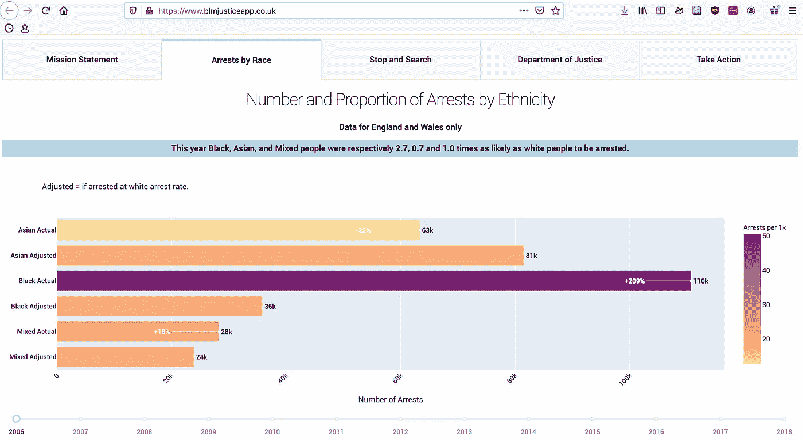
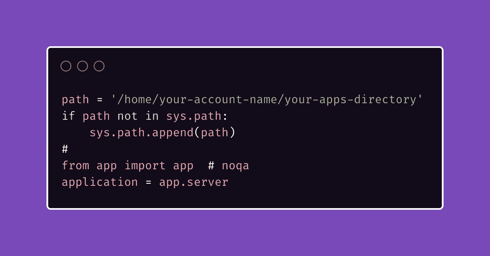
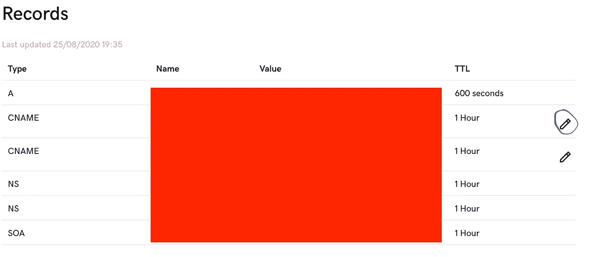
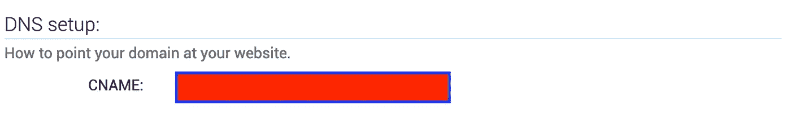

# 在 15 分钟内部署 Python Dash 应用程序

> 原文：<https://medium.com/analytics-vidhya/deploy-a-python-dash-app-in-15-minutes-4a19a4f2acb7?source=collection_archive---------14----------------------->

我的 dash 在线应用——在 blmjusticeapp.co.uk 了解更多

## 如何通过 7 个简单的步骤让你的 Dash 应用上线

你已经创建了你的应用程序，当你在你自己的机器上运行它的时候，它工作得很好，但是现在你想真正地说“你好，世界”。

嗯，你来对地方了。

## **部署的七个阶段**

1.  在 pythonanywhere.com 开一个付费账户。
2.  在 godaddy.com 购买你感兴趣的域名。
3.  将您的存储库克隆到 pythonanywhere.com 上的 bash 控制台中。
4.  编辑你的 WSGI 文件(web 服务器网关接口，更容易说 WSGI 对吗？).
5.  指出 pythonanywhere.com 你买的域名。
6.  在 godaddy.com 改变你的 CNAME 记录。
7.  设置域转发。

## 跳到第四位

我假设你可以自己完成第一步到第三步，并且喜欢[这首](https://www.youtube.com/watch?v=5ESHJKat6ds)歌曲。

在您的 pythonanywhere.com 帐户中，点击 web 选项卡，在 code 部分，指定源代码在 bash 控制台中克隆 github 存储库的目录。这也应该是工作目录。

接下来，单击指向您的 WSGI 文件的链接。在该文件中，取消指定部分的注释——对我来说是第 107–12 行。

WSGI.py 文件应该是什么样子

## 指向自定义域

回到网页标签，点击添加新网页应用按钮，然后添加你购买的域名——重要的是这里是 www.yourdomain.com 的[而不是 yourdomain.com 的](http://www.yourdomain.com)。

如果你已经启动并运行了网络应用，那么点击铅笔编辑从 yourusername.pythonanywhere.com 到 www.yourdomain.com 的内容。

如果你在这些问题上遇到困难，请查看[这篇](https://help.pythonanywhere.com/pages/CustomDomains)帮助文章！

## 配置您的域

接下来，您需要编辑 CNAME 记录。点击 godaddy 面板上的管理 DNS，然后你需要编辑下图中蓝色圆圈内的记录。

如何编辑 godaddy.com 的 CNAME 纪录

在名称列中输入 www，然后在值列中输入来自 pythonanywhere.com 的 web 选项卡的 DNS 设置部分的值。它的格式是 webapp-XXXXXX.pythonanywhere.com。

在哪里可以找到 python anywhere.com 的 DNS 信息

## 域转发

至此，一切都准备好了，所以如果你在浏览器中输入 www.yourdomain.com——在 pythonanywhere.com 网站上重新加载之后——应该就可以了。

但是如果你在 yourdomain.com 输入，就不行了！那么，如何解决这个问题呢？

要做到这一点，回到 godaddy.com 网站的管理 DNS 部分，然后在 godaddy 页面的右下角寻找转发选项卡。

在那里，编辑域值，使其显示为 https://www.yourdomain.com。就是这样！

请记住，DNS 更改需要一段时间才能在万维网上传播，因此这些更改可能需要几天时间才能生效。所以，在时间证明你错之前，不要急于下结论说你犯了一个错误！

## 排除故障

如果有任何差错，检查 pythonanywhere.com 的日志。您可以通过浏览 web 选项卡并查看日志文件部分来找到这些文件。这些几乎肯定会告诉你哪里出了问题。

如果您正在寻找解决方案，我强烈推荐查看 pythonanywhere 指南。你可以通过谷歌搜索这个:

> 你的错误信息在这里

## 别忘了安全！

最后但同样重要的是，在与每个人分享你的网站之前，采取一些基本的安全措施。

首先，确保在 Dash 应用程序的 app.py 文件中，末尾写着`debug=False`不是真的！

回到 pythonanywhere.com 的“web”选项卡，将“force https”滑块切换到“on ”,并选择“https 证书”单选项目下的“自动续订让我们加密证书”。

作为一个额外的奖励，这也意味着没有人会收到一个错误信息，说你的网站不安全，你可能正在窃取信息。

确保你在 godaddy 上的注册信息是保密的也是值得的，除非你特别想让全世界都知道谁在托管你的网站。