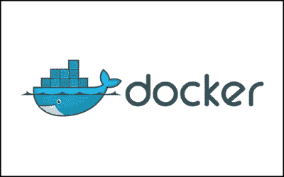
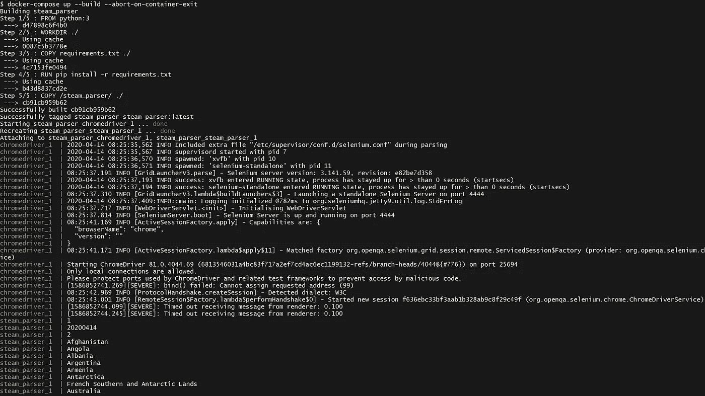
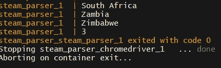

# 将基于 selenium 的爬虫部署到 Docker

> 原文：<https://medium.com/analytics-vidhya/deploy-a-selenium-based-crawler-to-docker-fd26f53f52e7?source=collection_archive---------5----------------------->

*使用 selenium grid 设置 docker compose 运行爬虫的教程*



最近，我得到了一个爬虫项目。爬虫放在装有 Windows 10 Professional 的 PC 电脑上，爬虫基于 selenium。

虽然我有使用 selenium 的经验，但是我没有将它们打包成 docker 映像的经验。然而，我确实有包装我的刺痒爬虫到一个图像之前。我会在以后的帖子里分享。

构建一个基于 selenium 的 crawler docker 映像与打包一个 Scrapy 映像完全不同。

# 当前环境和操作

爬虫放在 Windows 10 Professional 上，每周使用 ***任务调度器*** 从 **Steam** 抓取数据。目前的解决方案运行非常顺利，没有出现任何问题。然而，我们希望爬虫能在未来被非常快速和到处部署。因此，我的任务是将当前的爬虫变成 docker 映像。

# 试错

我的第一个想法是构建一个 python3 映像，并将爬虫放入其中。然而，我面临一个问题。

> WebDriverException:消息:“chromedriver”可执行文件需要位于路径中。

我认为每个人都必须遇到这个问题，并可以很容易地解决它。

我试图通过下载 chromedriver 并将其解压缩到镜像中来解决这个问题，但是失败了。

所以，我想出了另一种方法。我构建了一个 python-alpine 图像，并将爬虫放入其中。然而，我仍然面临一些关于 chromedriver 和 selenium 的问题。

# 最终解决方案

最后，我发现 Selenium 为 Selenium 网格服务器提供了一个 Docker images，名为 [Docker-selenium](https://github.com/SeleniumHQ/docker-selenium) 。

在我的例子中，我使用这个图像:***selenium/standalone-chrome***

下面是我的爬虫 Dockerfile 文件

```
FROM python:3WORKDIR ./COPY requirements.txt ./
RUN pip install -r requirements.txtCOPY /steam_parser/ ./
```

呸。真的真的很短。

因为我需要同步运行两个映像，并且爬虫映像 id 依赖于 selenium/standalone-chrome。因此，我需要一个 docker-compose。

下面是我的 docker-compose.yml

```
version: "3"
services:chromedriver:
    image: selenium/standalone-chrome
    ports: 
      - "4444:4444"steam_parser:
    build: .
    command: python ***.py
    volumes:
      - /c/Users/***/Desktop/test:/data/.
    links:
      - chromedriver
```

我觉得如果有基本的 docker 知识就很好理解了。

现在，docker 的设置完成了。我们需要修改一些代码。巴拉圭

我们需要导入 selenium 并连接到远程驱动程序。

```
from selenium.webdriver.common.desired_capabilities import DesiredCapabilitiessleep(5)
driver = webdriver.Remote(  command_executor='[http://your_local_ip/wd/hub',](http://10.96.152.248:4444/wd/hub',#'http://192.168.1.100:4444/wd/hub/')
   desired_capabilities=DesiredCapabilities.CHROME)
```

在爬行之前，我让爬虫睡眠 5 秒钟，然后爬虫将使用 ***独立浏览器*** 来爬行数据。

由于您的操作系统，您需要使用`ifconfig`或`ipconfig`找到您的本地 IP。

最后，我们只是在命令下运行

```
docker-compose up --build --abort-on-container-exit
```



docker 命令后的输出

你可以告诉那个 ***chromedriver*** 开始一个新的会话。

您可以通过下面的 url 查看会话。

```
http://your_local_ip/wd/hub/static/resource/hub.html
```

您可以打印某些输出来检查爬虫程序是否正确运行。

对我来说，我打印 1，2 和日期来检查。

下面是 crawler 爬完数据后的结果。容器会自动停止，因为我用了`--abort-on-container-exit`或者 chromedriver 容器会一直运行。



已完成爬网

如果已经将数据输出到，可以检查本地文件以查看结果。json 或者其他。

# 结论

通过这个项目，对我来说是一个很好的学习机会。Docker 是一个很好的工具，可以快速流畅地构建任何东西。我认为 docker 就像乐高积木，你可以放入任何你需要的或者你想建造的小而精致的杰作。

欢迎回复，如果你有任何问题或意见给我。谢谢你。

# 参考文献。

[](https://github.com/SeleniumHQ/docker-selenium) [## 硒 HQ/docker-硒

### 这个项目是由自愿贡献者促成的，他们投入了自己数千小时的时间，使…

github.com](https://github.com/SeleniumHQ/docker-selenium)  [## 2.入门- Selenium Python 绑定 2 文档

### 如果您已经安装了 Selenium Python 绑定，您可以像这样从 Python 开始使用它。以上脚本可以是…

selenium-python.readthedocs.io](https://selenium-python.readthedocs.io/getting-started.html#using-selenium-with-remote-webdriver)