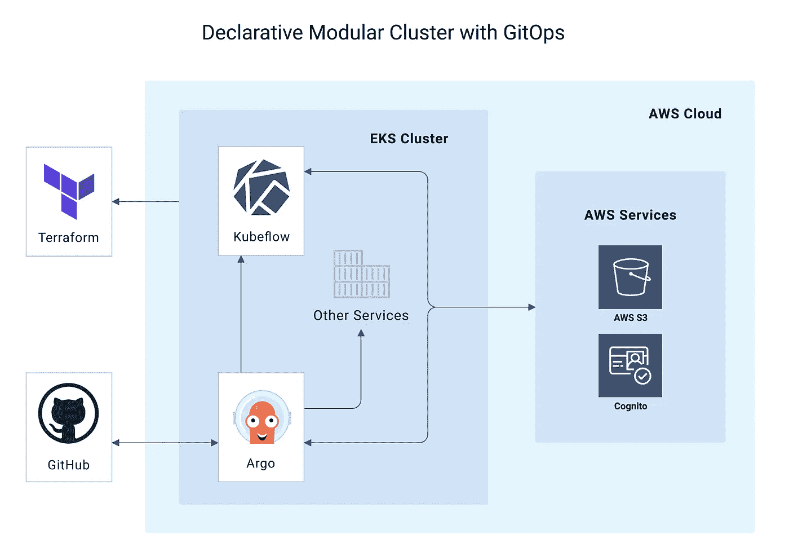
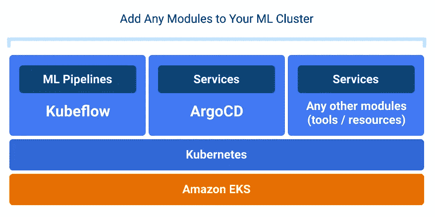
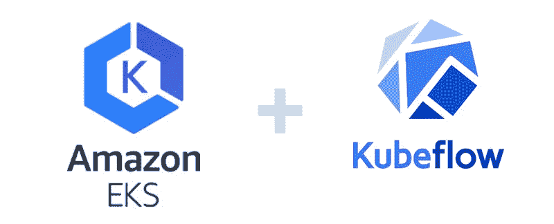
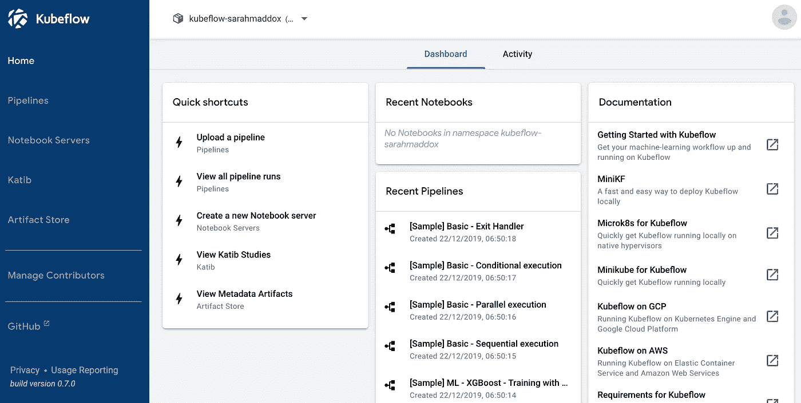
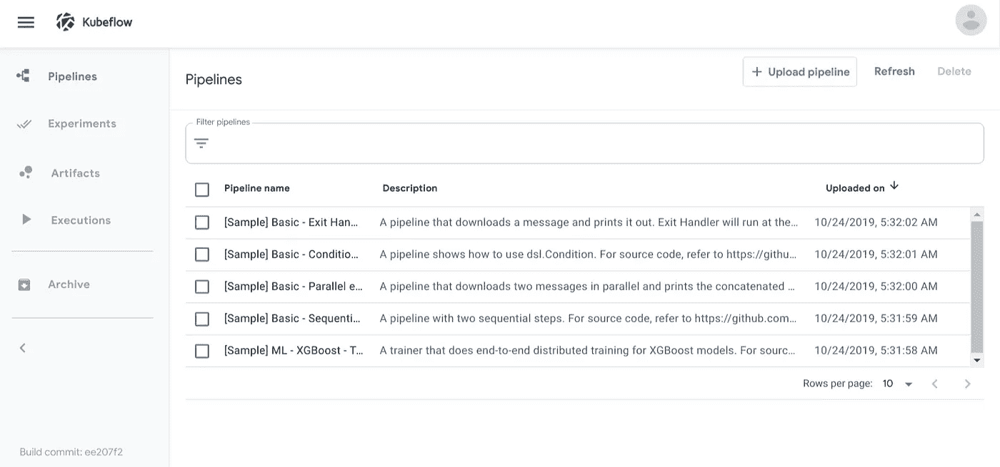
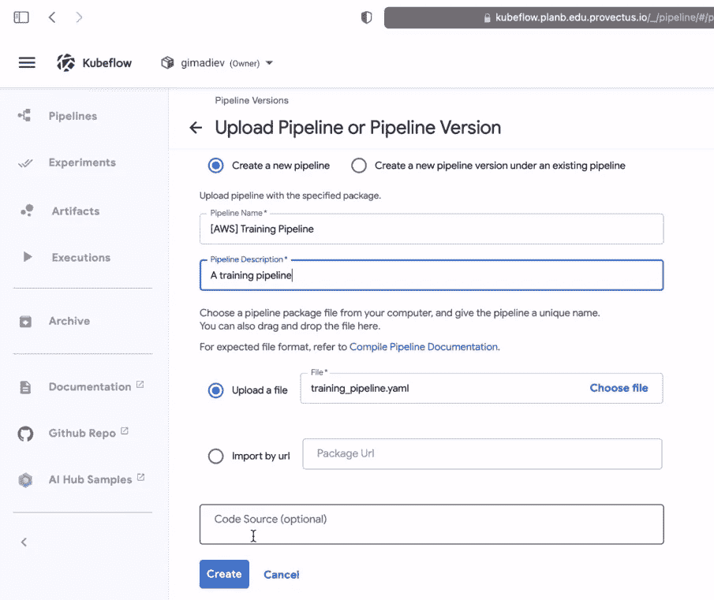
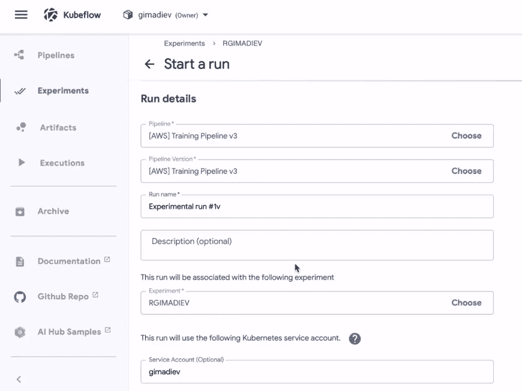

# SAKK:一个使用 Kubeflow 大规模部署 EKS 集群的开源工具

> 原文：<https://medium.com/analytics-vidhya/deploy-amazon-eks-clusters-with-kubeflow-at-scale-with-swiss-army-kube-27f8a47861e9?source=collection_archive---------11----------------------->



使用 Terraform *和 SAKK blueprint 在 EKS 内部部署了 Kubeflow 和 Argo CD 的声明式管理的 GitOps 集群示意图。图片作者。*

## 介绍

在过去的几年中，ML 的采用在众多行业中持续稳定的增长。随着生产 ML 项目数量的增长，在云中运行 ML 的采用也在增长。公司为其 AI/ML 堆栈选择的最著名的 ML 工具包之一 Kubeflow 正在被知名科技巨头越来越多地采用和贡献。

最初于 2017 年 12 月开源，Kubeflow 在最近 2 年获得了显著的发展势头。亚马逊是主要的云平台之一，它提供亚马逊 EKS(弹性 Kubernetes 服务)作为一种灵活的方式，在 AWS 中运行和扩展 Kubernetes 上的应用程序。亚马逊 EKS 在 2018 年开始普遍可用，现在是 Kubernetes 的领先环境之一，经常用于运行 Kubeflow。

然而，尽管有如此强大的工具可用，对于许多企业 ML 团队来说，在 EKS 上快速有效地启动和运行生产 Kubeflow 集群仍然是一个挑战，因为缺乏实现这一目标的明确路径。在 [Provectus](https://provectus.com/) ，我们基于自己的最佳实践和通过我们的 ML 团队获得的知识，构建了一个简单的开源工具，我们希望与大家分享。

## 为什么要大规模部署带有 Kubeflow 的亚马逊 EKS？

许多从事 ML/AI 项目的公司(无论是客户还是内部)经常不得不部署多个类似的 Kubeflow 集群，然后随着他们的训练和推理工作量的增长，管理和增加新的资源。当几个团队在一个项目上工作时，出于效率和安全性的原因，他们可能还需要隔离访问 Kubeflow 管道。

虽然在一个 Kubeflow 实例中可以有几个管道，但是目前在 Kubeflow 中没有办法向在一个 Kubeflow 集群上工作的团队授予隔离的安全访问权限。此外，每个 Kubeflow 实例都需要一个单独的亚马逊 EKS 集群。设置和部署 Kubeflow EKS 集群的现有方法需要使用 Kubeflow 和 Kubernetes 的几个本机工具，这些工具不允许您在以后向已部署的集群添加非本机资源。

例如，如果您的公司从事许多 ML/AI 项目，它至少需要几个带有 Kubeflow 实例的集群(开发、测试、生产环境、客户平台等)。)对于每个项目，并且通常对于每个项目团队。所有这些部署都需要您安装几个 CLI 工具，分别配置它们以描述您想要部署的所有 Kubernetes 和 Kubeflow 资源，并对您的每个集群重复这个过程。

这意味着你可能必须分配高素质的工程师来处理 ML 基础设施的部署和维护。他们将手动或通过编写大量 bash 脚本来设置多个集群配置。这同样适用于进一步的集群支持和升级。

## 什么是瑞士陆军 Kube 为 Kubeflow

瑞士陆军 Kube for Kubeflow 通过提供基于最佳 DevOps 实践的简单蓝图，弥合了这一差距。它使您不必再分别部署和管理 Kubeflow、亚马逊 EKS 和其他资源，您可能需要将这些资源带到您的集群中，以实现您想要的 ML 工作流。

SAKK 存储库的[示例文件夹扮演一个现成的项目模板的角色。你所需要做的就是在每次你想用 Kubeflow 部署亚马逊 EKS 的时候检查分支并设置它。ML 团队可以通过在存储库根目录下的单个](https://github.com/provectus/sak-kubeflow/tree/init/examples/simple) [main.tf 文件](https://github.com/provectus/sak-kubeflow/blob/init/main.tf)中设置变量来配置集群，并使用几个 Terraform 命令进行部署。使用 Terraform 作为单一入口点，您可以在几分钟内多次重复这个简单的过程，以建立和运行多个 ML 集群。



亚马逊 EKS 集群，带有 Kubeflow 和 Argo CD，这是您使用 SAKK 通过 Terraform 配置和部署 ML 基础架构的结果。*作者图片。*

部署后，可以使用 Argo CD CLI 或 UI 管理集群。它们的状态通过有组织的 CI/CD 管道存储在 GitHub 存储库中。这种方法不仅允许用户享受 Kubernetes 和亚马逊 EKS 的所有可移植性和标准化优势，还可以向集群添加资源，超越本地 Kubeflow、Kubernetes 或亚马逊 EKS CLI 工具的限制，而无需编写自定义代码。

使用 SAKK 进行集群配置和部署不需要丰富的 DevOps 工具知识，因此，它可以帮助节省 DevOps 工程师的时间来完成更重要的任务。它提供了一个机会，可以大大减少与 ML 基础设施的部署和维护以及管理人员的培训相关的时间、资源和成本。一些主要亮点是:

**使用 Argo CD 的集群自动化**

SAKK 使用 Argo CD 来自动化应用程序状态，并提供 GitOps 方法。你的集群的状态将被存储在一个 GitHub 存储库和 S3 桶中，描述为代码。

**地形的优势**

Terraform 用于通过 IaC 统一和标准化云基础设施部署，IaC 是一个首选标准，目前是 ML DevOps (MLOps)的最佳实践之一。目前，Terraform 是这一领域的领先软件。Terraform 配置的 HCL (HashiCorp 配置语言)语法易于学习，是处理集群的随机脚本的更好替代方案。此外，Terraform 有很好的文档和充满活力的社区。

**Amazon Cognito 的内置身份管理**

对于 AWS 上的身份管理，SAKK 使用 Cognito 用户池。在下面的快速入门中，Cognito 用于创建一个安全的环境，在一个地方管理所有访问权限。但是，SAKK 不会锁定您的供应商，因为它可以使用任何其他身份提供者。

# 快速入门:使用 Kubeflow 部署 EKS 集群



*图片作者。*

使用瑞士陆军 Kube 在 EKS 部署 Kubeflow 非常简单。除了先决条件之外，还需要几个步骤:

*   配置您的集群部署(在一个文件中设置大约 5 个变量)
*   使用两个 Terraform 命令(init 和 apply)部署集群

之后，您将获得一个可供访问和进一步管理的集群。

## 先决条件

1.  对于这个简短的教程，您需要有一个安装了 IAM 用户和 AWS CLI 的 AWS 帐户。如果您还没有，请使用 AWS 的这些官方指南:

*   [建立 AWS 账户并创建用户](https://docs.aws.amazon.com/polly/latest/dg/setting-up.html)
*   [安装、更新和卸载 AWS CLI](https://docs.aws.amazon.com/cli/latest/userguide/cli-chap-install.html)

2.接下来，使用官方指南安装 Terraform:

*   [安装地形](https://learn.hashicorp.com/tutorials/terraform/install-cli)

3.分叉和克隆瑞士陆军 Kube for Kubeflow 官方资源库:

*   [瑞士陆军 Kube for Kubeflow on Github](https://github.com/provectus/sak-kubeflow/blob/init/custom.tf)

就是这样！现在让我们配置和部署亚马逊 EKS Kubeflow 集群。

## 1.配置群集部署

您在一个单独的 Terraform 文件中设置了您的集群:`main.tf`。这里需要配置的最少内容如下:

*   `cluster_name`(集群的名称)
*   `mainzoneid`(主干道 53 区 id)
*   `domains`(端点域名)
*   `admin_arns`(将拥有管理员权限的用户的 ARNs)
*   `cert_manager_email`(lets encrypt 通知邮件)
*   `cognito_users`(cogn ITO 池用户列表)

`main.tf`的配置示例:

```
terraform {
  backend s3 {}
}module "sak_kubeflow" {
  source = "git::https://github.com/provectus/sak-kubeflow.git?ref=init" cluster_name = "simple" owner      = "github-repo-owner"
  repository = "github-repo-name"
  branch     = "branch-name" #Main route53 zone id if exist (Change It)
  mainzoneid = "id-of-route53-zone" # Name of domains aimed for endpoints
  domains = ["sandbox.some.domain.local"] # ARNs of users who will have admin permissions.
  admin_arns = [
    {
      userarn  = "arn:aws:iam::<aws-account-id>:user/<username>"
      username = "<username>"
      groups   = ["system:masters"]
    }
  ] # Email that would be used for LetsEncrypt notifications
  cert_manager_email = "info@some.domain.local" # An optional list of users for Cognito Pool
  cognito_users = [
    {
      email    = "qa@some.domain.local"
      username = "qa"
      group    = "masters"
    },
    {
      email    = "developer@some.domain.local"
      username = "developer"
    }
  ] argo_path_prefix = "examples/simple/"
  argo_apps_dir    = "argocd-applications"
}
```

在大多数情况下，您还需要在`main.tf`中覆盖与 GitHub 库相关的变量(`repository`、`branch`、`owner`)。

接下来，您可能想要配置存储地形状态的`backend.hcl`。`backend.hcl`的配置示例:

```
bucket         = "bucket-with-terraform-states"
key            = "some-key/kubeflow-sandbox"
region         = "region-where-bucket-placed"
dynamodb_table = "dynamodb-table-for-locks"
```

## 2.部署您的 AWS EKS Kubeflow 集群

使用以下 Terraform 命令部署刚刚配置的集群:

```
terraform init
terraform apply
aws --region <region> eks update-kubeconfig --name <cluster-name>
```

这些命令允许您:

*   初始化 Terraform 并下载所有远程依赖项
*   使用所有必需的 AWS 资源(IAM 角色、ASG、S3 存储桶等)创建一个干净的 EKS 集群。)
*   更新您的本地`kubeconfig`文件，以便在已配置的上下文中访问您新创建的 EKS 集群

这些 Terraform 命令将在存储库的默认`apps`文件夹中生成一些文件。在开始将服务部署到您的 EKS Kubernetes 集群之前，您需要在 Git 中提交它们，并将它们推送到您的 Github 存储库:

请注意，Argo CD 是预先配置的，用于跟踪当前存储库的变化。当对其`apps`文件夹进行新的更改时，它们会触发同步过程，并且放置在该文件夹中的所有对象都会被创建。

之后，您可以使用 Argo CD CLI/UI 或`kubectl`来管理您的 Kubernetes 集群。要开始使用`kubectl`(用于集群管理的 Kubernetes CLI)，请按照本官方指南进行安装和配置:

*   [安装并设置 kubectl](https://kubernetes.io/docs/tasks/tools/install-kubectl/)

## 3.访问和管理您的亚马逊 EKS Kubeflow 集群

现在，您已经部署了集群并准备好工作。在部署过程中，根据您在`main.tf`文件中的`domains`变量设置创建了两个服务访问端点:

*   阿尔戈 CD `[https://argocd.some.domain.local](https://argocd.some.domain.local)`
*   库伯流`[https://kubeflow.some.domain.local](https://kubeflow.some.domain.local)`

检查您在`domains`变量中提供的电子邮件以获取访问凭证，并使用它们登录。

要了解 Kubeflow 和 Argo CD 的更多信息，您可以查看它们各自的官方文档:

*   [库伯弗洛](https://www.kubeflow.org/docs/pipelines/pipelines-quickstart/)
*   [阿尔戈 CD](https://argoproj.github.io/argo-cd/)

# 开始使用 Kubeflow 管道

一旦您通过`kubectl`成功登录亚马逊 EKS 集群，访问 Kubeflow UI 并通过所有配置屏幕，您将看到 Kubeflow 仪表盘:



图片作者。

在管道部分，Kubeflow 提供了一些示例，让您快速尝试管道。要了解更多关于在 AWS 上使用 Kubeflow 的信息，请查看[官方 Kubeflow 文档](https://www.kubeflow.org/docs/aws/)。



图片作者。

或者，您可以使用 AWS SageMaker 和 Kubeflow 上传自己的管道。例如，让我们上传一个带有内置 AWS SageMaker 算法的演示模块。

1.  创建一个文件夹，用于管理单独的 Terraform 状态(包含与管道执行相关的资源)，并添加一个`main.tf`文件，代码如下:

```
module kmeans_mnist {
  source = "path/to/kmeans-mnist-pipeline/folder/at/root/of/the/project" cluster_name = "<your-cluster-name>"
  username     = "<your-kubeflow-username>"
}
```

2.运行 Terraform:

```
terraform init
terraform apply
```

Terraform 将生成一个`training_pipeline.yaml`文件，并创建一个与您的 Kubeflow 用户名相匹配的 Kubernetes 服务帐户，该帐户拥有 AWS 运行管道所需的所有权限。

3.通过 Kubeflow UI 的管道部分将培训管道上传到 Kubflow:



图片作者。

4.现在您已经有了第一个 pipeline 和一个准备好的 Kubernetes 服务帐户，请在表单中指定它们以开始运行:



图片作者。

就是这样！现在，您有一个在 Kubeflow 中执行的管道。

## 按照路线图前进

SAKK 会按照[路线图](https://github.com/provectus/sak-kubeflow/projects/1)继续进化。即将推出的计划包括通过 Terraform(在`[main.tf](https://github.com/provectus/sak-kubeflow/blob/init/main.tf)`中)配置更多资源:

*   **进一步整合 AWS。**更多的 AWS 功能将可以通过 Terraform 配置:RDS (Postgres)、elastic cache(Redis)、S3 (Minio)等。将搬出 Kubernetes，由 AWS 管理。
*   **升级产品版本。**通过 Terraform 设置产品版本(Argo CD、Kubeflow、Kubeflow Pipelines)将成为可能。
*   **为 Kubeflow 设置 AWS IAM 角色。**设置 Kubeflow 用户的角色和权限以使其能够使用 AWS 将转移到 Terraform。用户将能够生成 Kubeflow 配置文件和资源，它们将存储在 GitHub 存储库中，并作为 GitOps 流程的一部分使用。
*   **Kubeflow 管道管理。**可以存储库伯流管道的状态。用户将能够从外部使用现成的管道部署 Kubeflow:从 GitHub 存储库预加载它们，上传默认的 AWS 管道。
*   **与其他云平台的集成。**目前，SAKK 仅适用于[亚马逊 EKS](https://aws.amazon.com/eks/) (弹性 Kubernetes 服务)，但长期计划是扩展到其他云平台。

# 结论

在这篇文章中，我们分享了我们用来为 ML 团队建立有效工作流的内部工具 SAKK，并展示了如何在部署后开始使用 Kubeflow。该工具基于我们的 ML 和 DevOps 工程师多年来总结的最佳 MLOps 实践。我们希望该产品能像对我们一样对您的 ML 团队有所帮助，并为您节省服务和管理生产 ML 工作负载的时间和精力。

我们相信，任何使用 ML 的组织或工程师都应该能够专注于他们的 ML 应用程序和管道，而不必过于担心基础设施的部署。