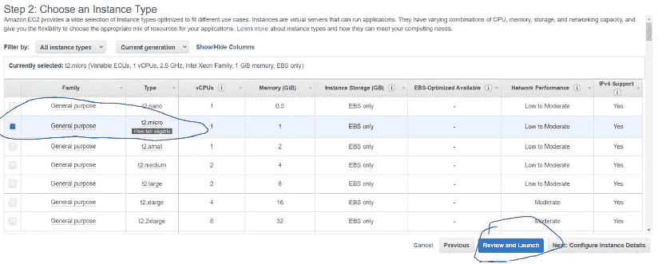
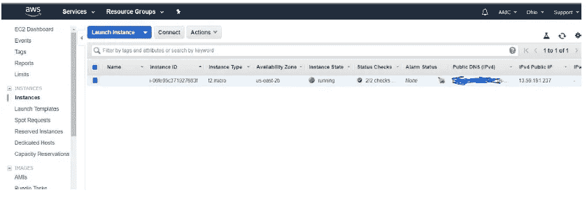
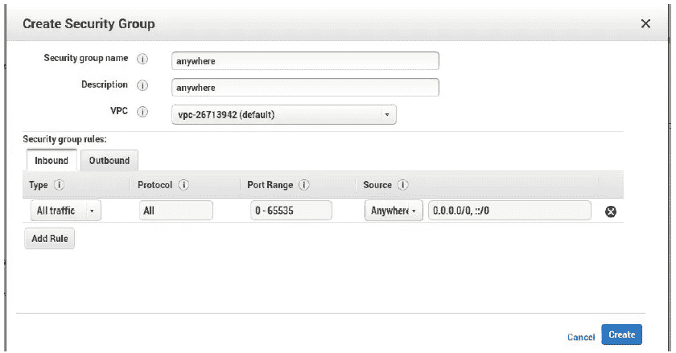

# 在本地和 AWS 上使用 API 部署 ML 模型

> 原文：<https://medium.com/analytics-vidhya/deploy-an-ml-model-using-apis-on-local-as-well-as-aws-cf7d7b0d0ed7?source=collection_archive---------18----------------------->

**什么是 API？**

用非常简单的语言来说，就是函数调用。换句话说，调用一个函数很可能来自一个不同的机器，这个机器只不过是一个服务器。输出数据集采用 json 或 XML 格式。

所以有两个步骤，这个博客的一部分告诉你如何在你自己的机器上部署你的模型，第二部分告诉你如何在 AWS 上部署。

**使用的步骤:**

1.  在您的本地机器(Amazon Fine Food reviews)上构建一个模型，并将该模型和其他与模型相关的关键变量存储在。pkl 文件

2.在 AWS 上启动一个微实例。

3.连接到 AWS 盒[ssh]

4.将文件移动到 AWS EC2 实例/盒子[scp]

5.在 AWS 盒子上安装所有需要的软件包。

6.在 AWS 盒子上运行 app.py。

7.在浏览器中检查输出。

**所需软件:**

1.蟒蛇:

a.Windows 64 位:[https://repo . continuum . io/archive/anaconda 3-5 . 2 . 0-Windows-x86 _ 64 . exe](https://repo.continuum.io/archive/Anaconda3-5.2.0-Windows-x86_64.exe)

b.Windows 32 位:[https://repo . continuum . io/archive/anaconda 3-5 . 2 . 0-Windows-x86 . exe](https://repo.continuum.io/archive/Anaconda3-5.2.0-Windows-x86.exe)

c.MAC:[https://repo . continuum . io/archive/anaconda 3-5 . 2 . 0-ma cosx-x86 _ 64 . sh](https://repo.continuum.io/archive/Anaconda3-5.2.0-MacOSX-x86_64.sh)

d.Linux 64 位:[https://repo . continuum . io/archive/anaconda 3-5 . 2 . 0-Linux-x86 _ 64 . sh](https://repo.continuum.io/archive/Anaconda3-5.2.0-Linux-x86_64.sh)

e.Linux 32 位:[https://repo . continuum . io/archive/anaconda 3-5 . 2 . 0-Linux-x86 . sh](https://repo.continuum.io/archive/Anaconda3-5.2.0-Linux-x86.sh)

f.查一下《蟒蛇》以前的档案:[https://repo.continuum.io/archive/](https://repo.continuum.io/archive/)

**套餐需求:**

pip3，pandas，NumPy，sklearn，beautifulsoup4，lxml，flask，re

你可以把这些包都复制过来，这样试试:[https://stackoverflow.com/a/15593865/4084039](https://stackoverflow.com/a/15593865/4084039)

数据集:我们正在使用的数据集是亚马逊美食评论

# [1]本地盒上的代码(本地机器)

打开 Anaconda 提示符，并按照以下步骤操作:在 Github 链接中使用的代码，带有目录的裁剪屏幕

 [## Rana Singh-gkp/Deployment _ Models _ LOCAL _ AWS

### 在 GitHub 上创建一个帐户，为 Rana Singh-gkp/Deployment _ Models _ LOCAL _ AWS 开发做贡献。

github.com](https://github.com/ranasingh-gkp/Deployment_Models_LOCAL_AWS/tree/master/AFR) 

1.转到代码目录。(> cd“目录的路径”)

2.运行“python3 app.py”

3.浏览器:[http://localhost:8080/index](http://localhost:8080/index)

在您的浏览器中，会出现一个窗口框，将文本粘贴到该框中

您将在本地浏览器中找到答案:

**→** 现在让我浏览一下目录中的所有文件并在后端处理

**首先:model.py - >** 请浏览我的 GitHub 链接上的代码

*流程:*从 SQLite(database.sqlite)加载数据>训练数据>将模型存储在 pkl 文件(model.pkl，count_vect.pkl)中

**第二:**[**index.html**](https://github.com/ranasingh-gkp/Deployment_Models_LOCAL_AWS/blob/master/AFR/templates/index.html)

在这里，您粘贴到 review_text 框中的任何内容，在点击提交按钮后，都将作为输入发布到*预测函数*。

**第三:app.py**

它使用 flask 构建 API，基本上加载 model.py 中创建的模型，导入一些预处理函数，并从 HTML 导入数据集，使用 predict 函数预测输出。(请浏览代码)

*祝贺:*您将在本地 web 浏览器上看到使用 HTML 页面的输出

# [2]在 AWS 上启动一个微实例。

在 AWS 上启动一个微实例。

基本上，你想在 AWS 上租赁一个机器来进行计算。租赁的盒子被称为弹性计算云(ECC)。EC2 帮助我们租赁了不止一个计算箱。

在这里，我们遵循上一个案例中的所有步骤 a，但是我们将在 AWS 服务器上部署。

*为* **创建实例** *执行以下步骤:*

1.创建一个 AWS 账户[https://aws.amazon.com](https://aws.amazon.com)，

[https://portal.aws.amazon.com/billing/signup#/start](https://portal.aws.amazon.com/billing/signup#/start)

2.登录:[https://console.aws.amazon.com](https://console.aws.amazon.com)

登录后:

现在启动 EC2 实例

3.选择 ubuntu 免费轮胎

亚马逊为你的实验提供了免费的 Ubuntu 机器。这只是为了实验，但实际上您将选择一台更强大的机器进行部署并支付费用。**点击选择**

4.选择 t2.micro 免费层合格

检查实验的 t2.micro 实例。根据您的部署要求选择框。点击**查看并启动**

现在点击**发射**

key pair——给你一个加密的密钥，让你安全地登录 AWS 上的远程实例(box)。下载密钥对并启动实例。下载密钥对**。pem "文件**,该文件位于将用于连接本地机器和 aws 机器的位置。

您将看到这个屏幕，您已经成功启动了 EC2 实例，现在我们需要在其中启动一个 flask API。

5.创建安全组

选择“网络与安全”->“安全组”，然后点击“创建安全组”。这里，安全组意味着谁可以访问实例(框)。

保留所有默认值。点击**创建**

6.然后将特定的安全组添加到网络接口

## [3]连接到 AWS 盒

因此，这里您需要在本地 cmd 上使用 ssh 命令将您的机器与 AWS 机器连接起来。现在打开你的系统命令提示符(cmd)并把目录改为**。pem 文件**已定位。

请遵循下图中的示例代码。在创建的实例上单击鼠标右键，您将看到此窗口

按回车键后->

现在，您已经远程登录到 AWS box。这是一个 Linux 命令提示符。现在，您必须安全地将数据传输到 AWS 盒。

## [4]将文件移动到 AWS EC2 实例/盒子[]

在您的本地系统上打开另一个 cmd，并按照代码进行操作。复制文件的命令行

c:\ Users \ Asus \ one drive \ Desktop > scp-r-I " for _ live . PEM "。/AFR

ubuntu@ec2–13–59–191–237.us-east-2.compute.amazonaws.com:~/

## **[5]在 AWS 盒上安装所有需要的包。**

## [6]在 AWS 盒子上运行 app.py。

我们不需要 database 和 model.py，因为他们曾经训练过模型。但是保留模型将用于预测的所有数据集或字典。

因为 **model.pkl 和 count_vect.pkl** 总是被使用，所以它最好保存为一个**全局变量**以避免每次点击时上传。

[https://github . com/Rana Singh-gkp/Deployment _ Models _ LOCAL _ AWS/blob/master/AFR/app . py](https://github.com/ranasingh-gkp/Deployment_Models_LOCAL_AWS/blob/master/AFR/app.py)

它在 AWS 盒子上运行。

## [8]在浏览器中检查输出。

= = = = = = = = = = = = = = = end = = = = = = = = = = = = = = = = = = = =

# 参考:

1.  上述案例中使用的代码

 [## Rana Singh-gkp/Deployment _ Models _ LOCAL _ AWS

### 在 GitHub 上创建一个帐户，为 Rana Singh-gkp/Deployment _ Models _ LOCAL _ AWS 开发做贡献。

github.com](https://github.com/ranasingh-gkp/Deployment_Models_LOCAL_AWS/tree/master/AFR) 

2.图片来自谷歌图片。

3.AWS 文档