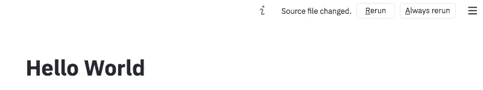

# 使用 Streamlit 和 Heroku 部署 NLP 模型

> 原文：<https://medium.com/analytics-vidhya/deploy-an-nlp-model-with-streamlit-and-heroku-5f0ae4b9048c?source=collection_archive---------10----------------------->


[尤拉鲜](https://unsplash.com/@mr_fresh?utm_source=medium&utm_medium=referral)在 [Unsplash](https://unsplash.com?utm_source=medium&utm_medium=referral) 上拍照

在完成最近的一个[假新闻分类项目](https://merb92.medium.com/too-good-to-be-true-nlp-c97868c2db55)后，我想建立一个使用我的模型的简单 webapp。因为它们易于实现，我选择用 [Streamlit](https://www.streamlit.io/) 构建应用程序，用 [Heroku](https://www.heroku.com/) 部署它。虽然这两个平台还可以做更多的事情，但接下来是一步一步的指导，以我的应用程序为例，开始一个简单的项目。

# 安装细流

请注意，Streamlit 需要 Python 3.6 或更高版本。

```
pip install streamlit
```

安装完成后，使用内置的“hello world”应用程序测试安装。

```
streamlit hello
```

如果一切正常，这将在浏览器中打开一个窗口，其中有一个提供几个演示的网页。

然后，您可以返回终端窗口，用 *control-c* 停止 Streamlit。

# 为应用程序创建基本的 Python 脚本

既然有了 Streamlit，就该做个 app 了。打开一个文本编辑器，创建一个新的 Python 文件，例如`my_app.py`
现在你可以创建自己的“Hello World”应用程序了。

```
import streamlit as stst.title('Hello World')
```

保存文件并运行应用程序。

```
$ streamlit run my_app.py
```

你的 Hello World 应用程序将打开一个新的浏览器窗口或标签。
接下来，向您的应用程序添加另一行代码，如下所示:

```
import streamlit as stst.title('Hello World')st.write('Change is Coming')
```

保存后，Streamlit 会注意到并询问您是否要使用新代码重新运行应用程序。这非常方便，因为你不必每次做出改变都重新启动应用程序。



# 是时候让应用做点什么了

正如你从一些 Streamlit 演示中看到的，它非常适合快速启动和运行一个简单但好看的应用程序。从创建“Hello World”应用程序所需的两行代码中可以看出，它在后台为你处理很多事情。

因为它在幕后处理很多事情，我发现即使是我做的这个简单的应用程序也有一些权衡。每当用户与应用程序交互时，整个脚本都会重新运行。对于我的应用程序，这在界面上产生了一些焦点问题。我要求用户输入新闻故事的标题，在他们按下 enter 键后，整个脚本再次运行，现在他们能够输入新闻故事的文本，但焦点仍然在新闻标题的第一个单元格上。我的脚本中还需要很多嵌套的 if thens 来跟踪应用程序的状态。

也就是说，如果您想轻松地探索数据集或展示一些数据的可视化效果，Streamlit 看起来是一个不错的框架。

我希望我的应用程序接受一个新闻标题和一个新闻故事，使用我训练的模型对其进行分类，然后输出结果。我的模型基于新闻故事中使用的停用词进行分类，所以我也想输出该版本的故事，以便用户可以看到它。

正如我上面提到的，每当有某种用户输入时，Streamlit 都会重新运行您的脚本。如果你有任何功能需要一些时间，你的应用程序可能会变得非常慢。Streamlit 通过允许你用`@st.cache`来修饰你的函数来处理这个问题，它将缓存这个函数，直到这个函数的某些东西改变。我需要在加载我训练过的模型/管道时使用它。

```
[@st](http://twitter.com/st).cache
def load_pipeline(model_path, model_file_name):
    """
    Load the Text Processing and Classifier Pipeline
    """
    return pickle.load(open(model_path + model_file_name, 'rb'))pipeline = load_pipeline()
```

现在我已经加载了管道，我需要从文本字段和文本区域获取一些输入。Streamlit 有两个内置函数来处理这个问题。`st.text_input`和`st.text_area`。

```
news_title = st.text_input('Enter a News Title')
news_story = st.text_area('Enter a News Story', height=400)
```

然后，我使用我的模型对新闻故事进行分类，并输出结果。我使用了`st.write`，它可以像我一样输出文本，也可以输出可视化或数据帧。据细流说，这是他们“细流指挥的瑞士军刀”

```
st.write('Your news story is classified as ', class_text, 'with a ',
          probability, '% probability.')
```

# 在 Heroku 上部署您的应用

现在你已经创建了你的应用程序，是时候让它在本地机器之外的地方运行了。Streamlit 正在推出一种自己处理部署的方法，但目前还有一个等待列表。现有的解决方案是使用 Heroku。

Heroku 提供付费和免费的应用托管服务。因为你可能刚刚开始，免费选项应该没问题。

你可以选择从 github 上传你的应用，也可以选择 Heroku 命令行界面(CLI)。我将使用 Heroku CLI 进行演示。

首先，您需要安装 Heroku CLI。你可以按照 Heroku [提供的指示在这里](https://devcenter.heroku.com/articles/getting-started-with-python#set-up)。

## 登录 Heroku

现在打开一个终端，转到包含您的应用程序的目录，并登录 Heroku。

```
$ heroku login
```

上述命令将打开一个新的浏览器窗口，您可以在其中输入您的 Heroku 登录信息。

## 创建一个新的 Heroku 实例

```
$ heroku create
```

该命令将为您的应用程序创建一个新的 Heroku 实例，并给它一个随机名称。

## 为 Heroku 准备您的应用程序

在上传你的应用程序之前，需要创建几个额外的文件，让 Heroku 知道如何运行你的应用程序，以及需要哪些依赖项。

**过程文件**

Procfile 将告诉 Heroku 运行什么命令来启动你的应用程序。打开一个文本编辑器，输入下面的命令，用名字或者你的脚本替换`web_app.py`。请注意，Procfile 没有文件扩展名。

```
web: streamlit run --server.enableCORS false --server.port $PORT web_app.py
```

请注意，您也可以在单独的 shell 脚本文件中设置`enableCORS`和`port`参数，但是我发现这种方法更简单。

**requirements.txt**

在这个文件中，您将列出您的应用程序需要运行的 Python 包。请确保只包含您真正需要的包，否则您最终会得到一个臃肿的实例。创建这个文件的一个简单方法是使用`pipreqs`。首先安装这个包。

```
$ pip install pipreqs
```

现在，从您的应用程序所在的位置向上一级目录，然后以您的应用程序的文件夹名称作为参数运行 pipreqs。

```
$ pipreqs <path>
```

它将在您指定的目录中创建`requirements.txt`文件，其中只包含您需要的 Python 包和相应的版本。它看起来会像下面这样:

```
nltk==3.4.5
matplotlib==3.1.1
pandas==1.0.3
streamlit==0.69.2
numpy==1.16.5
scikit_learn==0.23.2
```

**runtime.txt**

此文件包含您希望应用程序使用的 Python 版本。该文件的内容如下所示:

```
python-3.6.9
```

**nltk.txt**

不是每个应用程序都需要这个文件，但是因为我使用 nltk 标记器，所以我需要告诉 Heroku 一些额外的信息。如果你使用 nltk 并且没有把它放在这个文件中，当你试图运行你的应用程序时你会得到一个错误，这个错误会告诉你你需要把什么放在这个文件中。在我的情况下，我只需要在文件中放一件东西。

```
punkt
```

# **设置 Git 存储库**

如果您还没有这样做，您需要为您的应用程序建立一个 Git 存储库。在应用程序的目录中输入以下命令:

```
git init
```

如果目录中的所有东西都是你的应用程序运行所必需的，你可以用一个命令把它们都推送到 Heroku，如果不是，你需要对每个你需要的文件使用`$ git add`。

```
$ git add .
$ git commit -m 'First commit'
$ git push heroku master
```

此时，git 将收集文件，Heroku 将开始为您的应用程序构建一个源文件，其中包含运行它所需的一切。如果几分钟后一切顺利，您将看到以下消息。

```
remote: Verifying deploy... done.
```

接下来，您需要运行以下命令来运行您的应用程序。

```
$ heroku ps:scale web=1
```

# 让我们看看应用程序

现在是关键时刻了。在终端中输入以下命令，将会打开一个包含您的应用程序的新浏览器窗口。

```
$ heroku open
```


[https://www . Reuters . com/article/us-USA-election-early voting/early-voting-in-u-s-election-tops-9000 万-idUSKBN27G0S2](https://www.reuters.com/article/us-usa-election-earlyvoting/early-voting-in-u-s-election-tops-90-million-idUSKBN27G0S2)

以上是我在路透社的一篇文章上运行的应用程序。它认为这篇文章是真实的。

我希望这个指南对你有所帮助。