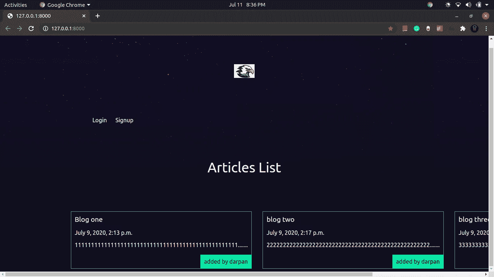
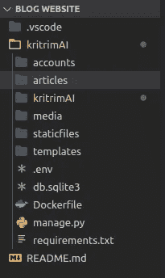
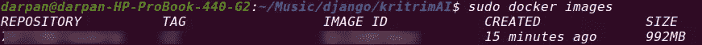

# 使用 Docker 映像在 AWS EC2 实例中部署 Django 应用程序

> 原文：<https://medium.com/analytics-vidhya/deploy-django-app-in-aws-ec2-instance-using-docker-image-614529e6f6d1?source=collection_archive---------5----------------------->


在这个教程中，我将展示如何在 AWS ec2 实例中部署 Django 网站。

**Django** 是一个基于 Python 的高级免费开源 Web 框架，它鼓励快速开发和干净、实用的设计。

**Docker** 是一个工具，旨在通过使用容器来简化应用程序的创建、部署和运行。容器允许开发人员将应用程序与它需要的所有部分打包在一起，比如库和其他依赖项，并作为一个包进行部署。

**亚马逊弹性计算云** (Amazon **EC2** )是一种网络服务，在云中提供安全的、可调整大小的计算能力。它旨在使开发人员更容易进行网络规模的云计算。

# Django 应用程序

这里我正在部署一个用 Django 制作的博客网站。当我们在本地托管该网站时，它看起来如下。



文件夹结构

我通过修改 setting.py 文件中的 ALLOWED_HOSTS 来允许所有来源的流量

```
ALLOWED_HOSTS = ['*']
```

*在生产中使用您站点的域，而不是“*”。

我们应该为这个项目创建一个虚拟环境，一旦我们的项目完成，我们将使用下面的命令保存 requirements.txt 中的依赖关系列表。

```
pip freeze > requirements.txt
```

现在我们已经完成了项目并存储了所有的依赖项，我们可以开始构建 docker 映像了。

# 建立码头形象

我们将从 docker 文件构建 docker 映像。我们的文档将包含-

```
FROM python:3.7-buster
RUN mkdir /home/myblog
WORKDIR /home/myblog 
COPY ./ /home/myblog/
RUN pip install -r /home/myblog/requirements.txt
EXPOSE 8000
ENTRYPOINT ["python","manage.py","runserver","0.0.0.0:8000"]
```

我已经在 manage.py 文件所在的主目录中创建了 Dockerfile。在 [Dockerhub](https://hub.docker.com/) 中创建一个账户。

然后，我们将通过运行以下命令来构建 docker 映像

```
sudo docker build -t <username>/<imagename:version> .
```

构建映像后，我们将运行`sudo docker images`命令来验证 docker 映像是否存在。



# 将 Docker 图像推送到 Dockerhub

现在我们将 docker 映像推送到我们的 docker 存储库，这样我们就可以在 ec2 实例中提取它。

```
sudo docker push <username>/<imagename:version>
```

# AWS EC2 实例

一旦我们完成了 docker 映像的构建，我们将转移到 AWS ec2 实例来托管我们的站点。

我采用的是预装 Docker 的亚马逊 Linux 实例。

启动实例时，我将*安全组*下的*入站规则*和*出站规则*保留为*所有流量。*拯救*。pem* 文件。

# 访问 EC2 实例

由于我们的实例正在运行，我们将部署代码。为此我们需要。 *pem* 文件， *IPv4 公共 IP* ，*亚马逊 Linux AMI 用户名为* `*ec2-user.*`

打开一个终端。pem 文件存在，并通过命令- `chmod 400 <.pem file name>`更改密钥权限以避免警告。

```
ssh -i < .pem file name> ec2-user@< *IPv4 Public IP*>
```

在上面的命令之后，我们将登录到实例。

现在，我们将从 Dockerhub 中提取应用程序映像，并使用以下命令运行它:

```
docker run -it -p 8080:8000 <username>/<imagename:version>
```

我们可以通过 ***http:// < IPv4 公共 IP > :8080/*** 访问我们的网站

如果这篇文章对你有所帮助，请考虑给👏🏼来激励我。