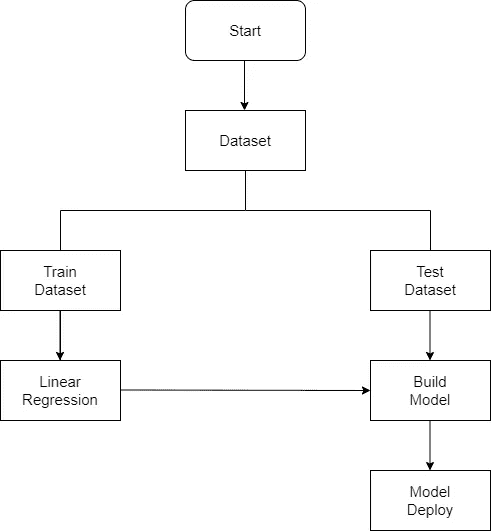
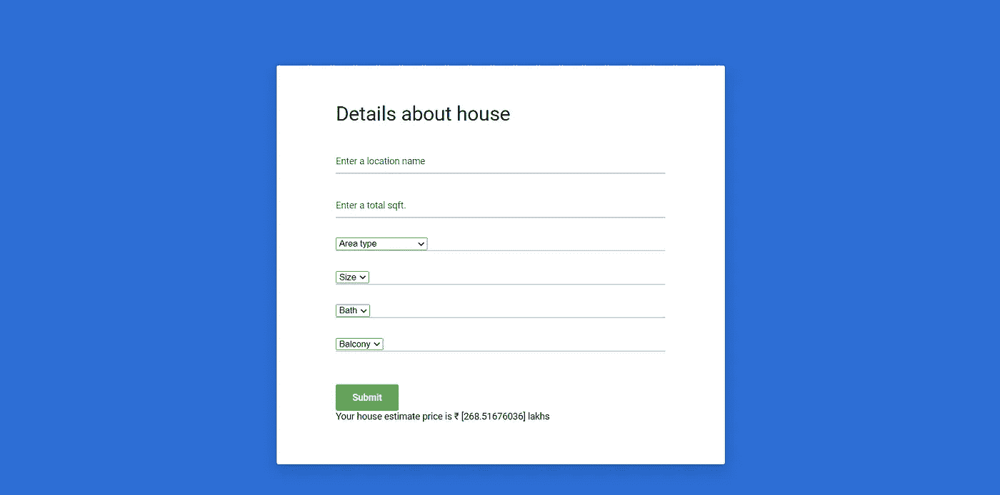

# 用烧瓶预测房价

> 原文：<https://medium.com/analytics-vidhya/deploy-house-price-prediction-using-flask-16d88c40d0cd?source=collection_archive---------6----------------------->

在今天的场景中，我们都知道房地产市场是一个关注价格并保持波动的市场。运用机器学习的思想来提高成本的准确性是目前的共识。该项目有助于通过打破过去的市场模式和价值范围以及未来的发展来寻找基于地理变量的房地产价格，未来的成本将被预期。

# **项目概述**

首先，我们必须从 kaggle 下载数据集。然后，我们必须将特征工程应用到数据集，以清理数据、特征缩放、数据预处理等许多事情。然后我们必须把我们的数据集分成两部分，第一部分是独立特征和从属特征。在从属特征中，我们考虑价格，而独立特征考虑列中的其余部分。然后，我们必须将数据集分成两部分，第一部分是训练数据集，第二部分是测试数据集。然后，我们必须应用一些回归模型来训练数据。之后我们对模型进行了检验，检查了模型的准确性。在检查模型后，我得出结论，线性回归模型最适合这个项目，线性回归模型的准确性为 88%。

流程图

创建模型后，我们必须将线性回归模型部署到 web 应用程序中。为此，我使用了 python 框架 Flask。基本上，Flask 用于将线性回归模型与 HTML、CSS、Javascript 代码连接起来。

成功创建 web 应用程序后，我们必须托管我们的 web 应用程序。为此，我使用了 Heroku 平台。Heroku 用于托管我们 web 应用程序。

网络应用

另外，我在这个网络应用程序中添加了一个聊天机器人。这个聊天机器人是使用 IBM Watson Assistant 创建的。

# **工具&技术**

**科技** — Jupyter 笔记本

**语言—** Python

# **结论:**

在这个项目中，我学习了如何加载数据集，如何应用特征工程，如何将模型放入数据集，如何检查模型准确性，以及我在这个项目中学到的许多其他东西。

# **Github 链接:**

[https://github . com/PrinceAjudiya/Deploy-House-Price-Prediction-Using-Flask-in-Heroku](https://github.com/PrinceAjudiya/Deploy-House-Price-Prediction-Using-Flask-in-Heroku)

# **网络应用链接:**

[https://banglore-house-price.herokuapp.com/](https://banglore-house-price.herokuapp.com/)