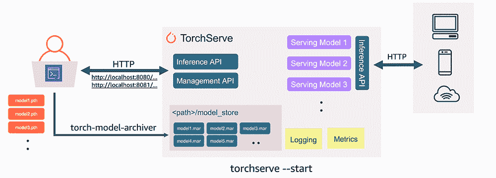
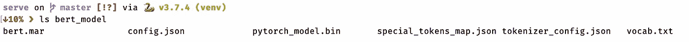

# 使用 pytorch/serve 将 huggingface 的 BERT 部署到生产中

> 原文：<https://medium.com/analytics-vidhya/deploy-huggingface-s-bert-to-production-with-pytorch-serve-27b068026d18?source=collection_archive---------0----------------------->



火炬服务建筑。图片首次出现在 TorchServe 上的一篇 [AWS 博客文章中。](https://aws.amazon.com/blogs/machine-learning/deploying-pytorch-models-for-inference-at-scale-using-torchserve/)

TL；DR: pytorch/serve 是一个新的令人敬畏的框架，为生产中的 torch 模型提供服务。这个故事教你如何将它用于像伯特这样的*拥抱脸/变形金刚*模型。

传统上，在生产中为 *pytorch* 车型服务是**挑战**，因为过去没有标准框架可用于这项任务。这种差距使其主要竞争对手 *tensorflow* 到[在许多生产系统上保持强大的掌控力](https://blog.exxactcorp.com/pytorch-vs-tensorflow-in-2020-what-you-should-know-about-these-frameworks/)，因为它在其[*tensor flow/serving*](https://www.tensorflow.org/tfx/guide/serving)框架中为此类部署提供了坚实的工具。

然而，如今大多数新的模型和方法倾向于首先在 pytorch 中开发和提供，因为研究人员喜欢它的原型灵活性。这在研究实验室开发的最新技术和大多数公司通常部署到生产中的模型之间产生了差距。在自然语言处理(NLP)等快速发展的领域中，尽管像[*hugging face/transformers*](https://github.com/huggingface/transformers)这样的框架努力为两种框架提供模型兼容性，但这种差距仍然非常明显。在实践中，新方法的开发和采用往往首先发生在 pytorch 中，当框架和生产系统赶上并集成了 tensorflow 版本时，新的和更多改进的模型已经弃用了它。

最近， *pytorch* 开发者发布了他们的新服务框架 *pytorch/serve* 以一种直接的方式解决了这些问题。

# TorchServe 简介

> TorchServe 是一个灵活易用的工具，用于服务 PyTorch 模型。

[TorchServe](https://pytorch.org/serve/) (资源库: [pytorch/serve](https://github.com/pytorch/serve) )是最近(撰写本文时的 4 天前)发布的框架，由 *pytorch* 开发人员开发，允许简单高效地生产经过训练的 pytorch 模型。

我推荐阅读[这篇 AWS 博客文章](https://aws.amazon.com/blogs/machine-learning/deploying-pytorch-models-for-inference-at-scale-using-torchserve/)来全面了解*火炬服务*。

# 服务变压器型号

*hugging face/transformers*可以被认为是一个最先进的文本深度学习框架，并且已经显示出足够的灵活性，能够跟上这个快速发展的空间的快速发展。

由于这是一个非常受欢迎的框架，拥有来自不同领域的许多活跃用户(Github 上超过 25k 颗星)，因此毫不奇怪已经有人对使用 TorchServe 服务 BERT 和其他 transformer 模型感兴趣(例如这里的、这里的和这里的)。

这个故事将解释如何用 TorchServe 服务你训练过的变形金刚模型。

## 先决条件

为了避免这篇文章不必要的膨胀，我将做一个假设:你已经有一个训练过的 BERT(或其他变形金刚句子分类器模型)检查点。

如果你没有，不要担心:我会提供一些参考指南，你可以根据这些指南很快找到自己的指南。

**安装火炬服务器**

TorchServe 为使用 pip、conda 或 docker 安装提供了简单的[指南。目前，安装大致包括两个步骤:](https://github.com/pytorch/serve#install-torchserve)

*   安装 Java JDK 11
*   安装 *torchserve* 及其 python 依赖项

请仔细阅读上面链接的安装指南，以确保 TorchServe 已安装在您的计算机上。

**训练一个拥抱脸伯特句子分类器**

有许多关于这方面的教程，由于我严重怀疑自己是否有能力补充现有的关于这一主题的知识，我只是给出一些我推荐的参考资料:

*   [https://blog . Rosetta . ai/learn-hugging-face-transformers-Bert-with-py torch-in-5-minutes-acee 1 e 3 be 63d](https://blog.rosetta.ai/learn-hugging-face-transformers-bert-with-pytorch-in-5-minutes-acee1e3be63d)
*   [https://medium . com/@ nikhil . utane/running-py torch-transformers-on-custom-datasets-717 FD 9 e 10 Fe 2](/@nikhil.utane/running-pytorch-transformers-on-custom-datasets-717fd9e10fe2)

获得训练过的 BERT 检查点的一个简单方法是使用 *huggingface* GLUE 示例进行句子分类:

[https://github . com/hugging face/transformers/blob/master/examples/run _ glue . py](https://github.com/huggingface/transformers/blob/master/examples/run_glue.py)

训练结束时，请确保将训练好的模型检查点( *pytorch.bin* )、模型配置文件( *config.json* )和 tokenizer 词汇文件( *vocab.txt* )放在同一个目录下。在下面的内容中，我将使用一个经过训练的*“Bert-base-un cased”*检查点，并将其与标记化器词汇表一起存储在文件夹*中。/bert_model”。*

作为参考，我的是这样的:



模型检查点文件夹，一些文件是可选的

**为我们的 BERT 模型定义 TorchServe 处理程序**

这就是 salt: TorchServe 使用**处理程序**的概念来定义服务模型如何处理请求。一个很好的特性是，在打包模型时，这些处理程序可以由客户端代码注入，从而允许大量的定制和灵活性。

下面是我为 BERT/transformer 分类器设计的一个非常基本的 TorchServe 处理程序的模板:

我的负责人不做但你的负责人可能想做的几件事:

*   文本的自定义预处理(这里我们只是进行标记化)
*   伯特预测的任何后处理(这些可以添加到*后处理*功能中)。
*   加载一组模型。实现这一点的一个简单方法是在*初始化*函数中加载额外的检查点，并在*推理*函数中提供集合预测逻辑。

**将训练好的关卡转换成火炬服务器 MAR 文件**

TorchServe 使用一种叫做 [MAR(模型存档)](https://pytorch.org/serve/model-archiver.html)的格式来打包模型，并在它的模型库中对它们进行版本化。为了使它可以从 TorchServe 访问，我们需要将我们训练过的 BERT 检查点转换成这种格式，并在上面附加我们的处理程序。

以下命令可以实现这一目的:

```
torch-model-archiver --model-name "bert" --version 1.0 --serialized-file ./bert_model/pytorch_model.bin --extra-files "./bert_model/config.json,./bert_model/vocab.txt" --handler "./[transformers_classifier_torchserve_handler.py](https://gist.github.com/MFreidank/3463d407a94ffe53d0d0daa137ad3973#file-transformers_classifier_torchserve_handler-py)"
```

该命令附加 BERT 模型的序列化检查点(*)。/Bert _ model/py torch _ model . bin*)添加到我们新的定制处理程序*中，transformers _ classifier _ torch serve _ handler . py*如上所述，并为配置和记号化器词汇表添加额外的文件。它生成一个 TorchServe 可以理解的名为 *bert.mar* 的文件。

接下来，我们可以为我们的 BERT 模型启动一个 TorchServe 服务器(默认情况下它使用[端口 8080 和 8081](https://pytorch.org/serve/rest_api.html) ),模型存储包含我们新创建的 MAR 文件:

```
mkdir model_store && mv bert.mar model_store && torchserve --start --model-store model_store --models bert=bert.mar
```

就是这样！我们现在可以使用[推理 API](https://pytorch.org/serve/inference_api.html) 查询模型:

```
curl -X POST http://127.0.0.1:8080/predictions/bert -T unhappy_sentiment.txt
```

在我的例子中，*是一个包含负面情绪例句的文件。我的模型正确地预测了该文本的负面情绪(类别 0)。*

请注意，在[管理 API](https://pytorch.org/serve/management_api.html#list-models) 中有许多额外的有趣功能。例如，我们可以很容易地获得所有注册模型的列表，注册一个新的模型或新的模型版本，并动态地切换每个模型的服务模型版本。

编码和服务愉快！