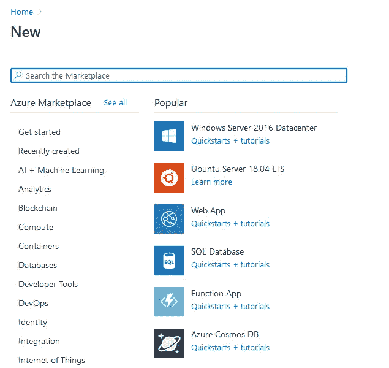

# 使用 Azure 部署机器学习模型

> 原文：<https://medium.com/analytics-vidhya/deploy-machine-learning-model-using-azure-25191b124aff?source=collection_archive---------8----------------------->

你想炫耀你的机器学习/深度学习项目吗？如果是，那么这个博客是给你的。今天我们将学习如何使用 GitHub 在 Azure 云上部署一个简单的机器学习模型。

# 目录

*   为部署准备 Flask 应用程序
*   创建 GitHub 存储库
*   在 Azure 上部署
*   结束注释

# 为部署准备 Flask 应用程序

首先，我们需要做的是创建两个文件。第一个是 **Procfile** (无文件扩展名)在这个文件里我们会写“web: gunicorn app:app”。 **web** 用于描述这是一个 web 应用程序，而 **gunicorn** 是我们的应用程序将在其上运行的服务器。第一个“app”将代表 Web 应用程序应该启动的文件名。第二个“应用程序”将代表应用程序的名称。

Procfile

我们将需要的第二个文件是 **requirements.txt** 在这个文件中，我们将添加我们的 Web 应用程序将使用的所有库。

requirements.txt

# 创建 GitHub 存储库

一旦你在 GitHub 上创建了一个帐户，你会在你的屏幕上看到这个。接下来你可以克隆我的 [GitHub 库](https://github.com/Naivedh/ml_test_model)。

开源代码库

单击 New 并为您的项目选择一个唯一的存储库名称。保持存储库公开，以便可以部署。如果愿意，您可以选择使用自述文件来初始化存储库。下一步是简单地点击创建存储库。

创建存储库

现在，您将看到如下所示的屏幕。如果你有 Git 的经验，你可以按照显示的过程，否则你可以点击上传一个现有的文件，上传所有的文件，并提交。

上传文件

# 在 Azure 上部署

第一步是创建一个 Azure 账户。一旦你创建了一个帐户，你会看到如下所示的屏幕。

**注意**:你可以使用 [GitHub 学生开发者包](https://education.github.com/pack)获得免费的 Azure 资源。

蔚蓝的

单击创建资源，您将看到以下屏幕。

资源

单击 Web App，因为我们要部署 Web App。您将看到如下所示的屏幕。点击**新建创建一个新的资源组。**为您的 Web 应用程序选择一个唯一的名称。对于运行时堆栈，选择 Python 3.7，Region 作为中心用户，rest 保持原样。最后，点击审查+创建按钮，然后创建。(这可能需要一些时间)

创建 Web 应用程序

一旦该过程完成，您将能够看到**转到资源**按钮。在下一个屏幕上，您将看到一个侧面板，从面板中选择部署中心。

侧板

你会看到如下选项，如下选择 GitHub。(您可能需要登录 GitHub)

部署选项

在接下来的屏幕中，您将看到其他部署选项选择 **App Service build service** 。

选择

在最后一步中，选择您的组织、存储库和分支，然后单击 continue and Finish。

配置

**注意:**部署可能需要一些时间

部署后，状态将变为成功(活动)。要访问 Web 应用程序，请单击侧面板上的概述。您将在屏幕右侧看到该链接。

部署的链接

您可以通过点击链接访问 Web 应用程序。

Web 应用程序

# 结束注释

今天我们学习了如何使用 Azure 部署机器学习模型。如果你想了解更多关于机器学习和数据科学的博客，请关注我，并告诉我你想了解的话题。

嘿，读者们，感谢你们的时间。如果你喜欢这个博客，别忘了鼓掌欣赏它👏如果你喜欢❤，你可以给 50 英镑👏

*数据科学爱好者| ML 爱好者| TCS CA |编码块 CA | Blogger |社区成员|公共演讲者*

如果您有任何疑问或建议，请随时联系我

[https://twitter.com/shah_naivedh](https://twitter.com/shah_naivedh)

[https://www.linkedin.com/in/naivedh-shah/](https://www.linkedin.com/in/naivedh-shah/?originalSubdomain=in)