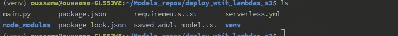

# 在 AWS Lambda 上部署机器学习模型

> 原文：<https://medium.com/analytics-vidhya/deploy-machine-learning-models-on-aws-lambda-5969b11616bf?source=collection_archive---------0----------------------->

## 在 AWS Lambda 上服务机器学习模型的实践指南


# 简介:

在花费几周/几个月的时间设计和学习 ML 模型之后，最困难的部分之一可能是在生产环境中实际部署和维护模型，在生产环境中您需要一个服务器和一个工作环境。

AWS 通过 AWS Lambdas 提供托管和部署模型，使这一过程变得更加容易，这非常便宜，并且通过在 AWS 基础设施上并行运行来自动“扩展”，猜猜看，您只需在发出预测请求(调用 Lambdas)时付费。

在这篇文章中，我们将教你如何利用 AWS Lambdas 来部署你的机器学习/深度学习模型。

我们开始吧。

# 1 —准备模型:

在本节中，我们将准备、拟合并保存我们的模型，我们将在教程中使用该模型。

本教程中使用的数据是一个真实世界的数据集，称为在 *UCI 回购*中可用的*成人数据集*，这些数据是关于*预测一个人的潜在收入是超过 5 万美元/年还是更少。*

我们将在这一部分采取的步骤是:

*   加载并调查数据
*   拟合并保存模型。

## 1.1-加载并调查数据:

让我们加载数据:

我们使用 shap 包加载我们的数据，

现在让我们检查一下:


成人数据集

似乎所有的功能都设置好了。

我们将构建一个基本的 lightgbm 模型并保存它，因此不会有预处理或特性工程，因为本教程的主要目的是在 AWS Lambda 中部署。

所以让我们这样做:

## 1.2 —拟合并保存模型:

```
import lightgbm  as lgbmparams = {'objective':'binary',
          'booster_type':'gbdt',
          'max_depth':6,
          'learning_rate':0.05,
          'metric':'auc'
    }

dtrain = lgbm.Dataset(data,labels)

model = lgbm.train(params,dtrain,num_boost_round=100,valid_sets=[dtrain])

model.save_model('saved_adult_model.txt')
```

如您所见，基本模型，无列车/val 分割，基本参数。

现在我们已经准备好了模型，让我们转移到 AWS，这是本教程的主要目的。

# 2 — AWS Lambdas:

在我们开始深入研究使用这个服务之前，让我们首先定义它:

> AWS Lambda 是一种计算服务，让您无需配置或管理服务器即可运行代码。

那么这意味着什么呢？

简而言之，这意味着无论何时你有一个随时可以部署的机器学习模型，AWS lambda 都将充当你的模型将被部署的服务器，你所要做的就是，给它代码+依赖项，就这样，就像把你的代码推给一个回购。

让我来告诉你怎么做:

首先，你将需要**无服务器框架**——一个麻省理工学院的开源项目——这将是我们构建应用的工具，所以让我们开始吧:

我们将遵循的步骤如下:

*   安装无服务器框架
*   在 AWS 中创建存储桶
*   将我们训练好的模型推到创建的桶中
*   构建 main.py，这个 python 文件将调用我们的模型并进行预测
*   构建 serverless.yml 文件，其中我们将告诉 serverless 框架要做什么(创建 lambda 函数)
*   测试我们在本地构建的内容(使用无服务器框架用我们的模型生成预测)
*   部署到 AWS。
*   测试部署的应用程序。

为了在 AWS lambda 中部署我们训练好的模型，这些将是我们在本教程中要遵循的步骤。

让我们开始吧:

## 重要备注:

> 对于本教程的其余部分，请确保您始终在文件所在的目录中，requirements.txt、main.py 和 saved_adult_model.txt，因为我提到了它，所以这是我们的 requirements.txt:

```
lightgbm==2.2.3
numpy==1.17.0
scipy==1.3.0
scikit-learn==0.21.3 
```

## 2.1 —安装无服务器框架:

要在 ubuntu 中安装无服务器框架，首先你必须安装 npm。为此，您可以在终端中运行以下命令:

```
curl -sL https://deb.nodesource.com/setup_10.x | sudo -E bash -sudo apt-get install nodejs
```

以上命令将安装 nodejs 和 npm。

接下来，您可以通过运行以下命令来检查所有安装是否正确:

```
**$ node -v**
```

这将返回 nodejs 的版本

```
**npm -v**
```

这将返回 npm 的版本。

现在我们已经安装了 npm，让我们通过运行以下命令来安装无服务器:

```
npm install -g serverless
```

您可以通过运行以下命令来检查所有组件是否安装成功:

```
serverless
```

如果您没有出现任何错误，那么恭喜您，您已经安装了无服务器，一切就绪。

让我们进入下一步。

## 2.2—在 AWS 中创建一个存储桶:

我们的下一步是将我们训练的模型推送到 AWS 存储桶，为此，我们首先需要创建一个存储桶，让我们这样做:

在 AWS 上创建一个 bucket 可以使用下面的代码从命令行完成:

```
aws s3api create-bucket --acl private --bucket deploy-lgbm --create-bucket-configuration  LocationConstraint=eu-west-1 
```

以上命令将在 eu-west-1 位置以私有模式创建一个名为 deploy-lgbm 的存储桶。

## 2.3 —将我们训练过的模型推到创建的桶中:

因此，现在我们的 bucket 已经准备好了，让我们通过运行以下命令将训练好的模型推送到它那里:

```
aws s3 cp saved_adult_model.txt s3://deploy-lgbm/model/saved_model.txt
```

很好，现在让我们进入下一步，构建我们的 main.py python 文件，我们将用它来调用我们的模型并进行预测。

## 2.3 —构建 Main.py 文件:

当在 AWS lambdas 中进行部署时，代码的主要函数是一个名为 lambda_handler 的函数(或者我们选择给它的任何其他名称，尽管标准名称是 lambda_handler)。

为什么这个函数很重要？

该函数是 AWS lambdas 每次调用它(与之交互)时都会执行的函数。因此，该函数将接收您的输入，进行预测，并返回输出。

如果您曾经使用过 cloud9 中的 AWS lambdas，您会注意到当您创建一个新的 lambda 函数并导入它时，lambda_function 的标准定义是这样的:

```
def lambda_handler(event,context):

    return {'StatusCode':200,
    'body':'Hello there, this is Lambda'}
```

如您所见，lambda 函数需要两个输入—一个事件和一个上下文:

*   该事件将包含我们将发送给 lambda 的信息，在这种情况下，这将是我们想要预测的样本。(它们将采用 json 格式)
*   至于上下文，它通常包含关于调用、函数和执行环境的信息。对于本教程，我们不会使用它。

让我们总结一下我们在这一部分要做的事情:

*   首先，我们需要从 bucket 中获取训练好的模型，初始化我们的 lightgbm 并返回它，因此我们将为此构建一个函数。
*   然后我们要用我们的模型做预测，所以我们也要为此建立一个函数。
*   最后，在我们的 lambda_handler 函数中，我们将把所有这些东西放在一起，这意味着，接收事件，从事件中提取数据，获得模型，进行预测，然后返回预测。

这么简单对吧？

现在让我们建立我们的文件:

首先我们将构建 get_model()函数，它将下载经过训练的 lightgbm，然后初始化我们的模型并返回它:

下载保存的模型。

如您所见，首先我们使用 boto3 创建了对 bucket deploy-lgbm 的访问，然后我们使用 download_file 方法下载 saved_model.txt 并将其保存在/tmp/test_model.txt 中(回想一下，我们使用键:model/saved_model.txt 将模型保存在 bucket 中)。

没事吧。那我们继续吧。

现在，我们将构建 predict 函数，该函数将获取模型、数据样本，进行预测，然后将其返回:

预测功能

让我解释一下上面的函数是做什么的:

该函数获取事件，从事件中提取我们的数据，并将提取的数据提供给模型进行预测。

这么简单对吧？

重要备注:

*   最佳实践是，始终使用 json 格式在事件中传递数据。
*   在我们的例子中，事情是简单的，我们提取数据并将其直接传递给模型，在大多数其他情况下，在将数据传递给模型之前，会对数据进行一些处理，因此您将需要另一个函数，您将在将数据传递给模型之前调用该函数。
*   总是把你的程序分成多个函数，我们可以把所有东西都放在 lambda 函数中，但是我们的代码不会再漂亮了。所以尽可能使用函数。

现在，最后一步是定义我们的 lambda 处理函数，让我们这样做:

λ处理器

如您所见，这是一个非常基本的功能，在现实世界的项目中，它会变得更加复杂。

它做的事情很清楚，获取事件并将其发送给 predict 函数以获得预测，然后以标准格式返回输出(您应该始终使用该格式):一个带有 Statuscode 的 dict，结果在一个主体中。

这部分到此结束，让我们继续下一步:构建 serverless.yml 文件。

## 2.4 —构建 Serverless.yml 文件:

正如我们在本文开始时提到的，无服务器框架将是我们与 AWS 通信的工具，并创建一个 lambda 函数，该函数将充当托管我们训练好的模型的服务器。为此，我们需要告诉 serverless 它需要的所有信息:

*   提供商是谁？比如是 AWS 还是 google，
*   使用的是什么语言？
*   我们想要创造什么？
*   它应该有什么作用？…等等。

所有这些指令，我们将在 serverless.yml 文件中传递它们，所以让我们开始构建它:

首先，我们将为我们的服务命名，比如说:test-deploy

```
service : test-deploy
```

我们文件中的下一部分将是关于我们的提供者，在这个例子中是 AWS，yml 文件中的指令看起来像这样:

那么，我们在上面的命令行中做了什么呢？让我解释一下:

*   我们设置提供者的名称，即 aws，
*   使用的语言(python3.6)，
*   我们的 lambda 将要部署的区域，
*   无服务器将用于放置包的部署桶。
*   iamRoleStatements，意思是:
    我们的 lambda 函数将从 aws 中的 bucket 下载训练好的模型，默认情况下，它没有权限这样做。所以我们需要给它这个权限，这就是为什么我们创建了一个角色，所以我们可以给我们的 lambda 它需要的权限(在这个例子中，只是访问一个桶。在其他情况下可能更多，您可以查阅 aws 文档以获得关于此事的详细解释)。
    为了给出更多关于角色的例子，假设您需要从这个 lambda 调用另一个 lambda，在这种情况下，这个 lambda 需要权限，所以您必须将它们添加到 iamRoleStatements 中。

重要备注:

*   我们放置模型的桶和 lambda 使用的桶应该在同一个区域(对于本教程，我们使用 eu-west-1)，如果它们不在同一个区域，就不能工作。

我们的 serverless.yml 文件的下一部分将是关于我们将要创建的函数:

如你所见，

*   首先我们定义一些非常基本的东西，比如名称和描述。
*   我们定义我们的处理程序:
    回想一下我们说过的 lambda_function，我们提到过这个函数将会做所有的工作。现在是你告诉 serverless 谁是你的 lambda_handler 函数的时候了；对于这种情况，我们在 main.py 文件中用名称 lambda_handler 定义了它，所以我们将 handler : main.lambda_handler。如前所述，我们可以给它取任何我们想要的名字，比如，我们可以把这个函数命名为 hello，但是我们必须放入 handler : main.hello。
*   我们定义我们的事件:
    我们将如何与我们的 lambda 函数通信，或者换句话说，我们将如何触发(调用)我们的 lambda 函数。对于本教程，我们将使用 http 事件，这意味着通过调用 url 来调用 lambda 函数，这将是一个 POST，资源将是/predictadult。

下一节是关于插件的:

那是什么意思？让我解释一下:

到目前为止，我们告诉无服务器者谁是我们的提供商，我们的功能是什么。现在，为了让我们的代码工作，我们需要安装软件包，我们已经将它们放在 requirements.txt 文件中，因此，我们需要告诉 serverless 安装这些需求，为此我们将使用一个名为 serverless-python-requirements 的插件。

我们将把它添加到 serverless.yml 文件中，如下所示:

```
plugins:
 - serverless-python-requirements
```

我们要在文件中添加的最后一件事是优化，但是为什么我们需要优化呢？让我解释一下:

Lambda 函数对要上传的包的最大大小有一些限制，允许的最大解压缩文件大小为 250 MB。有时我们会超过这个数量，为了减少这个数量，我们可以删除包中的一些垃圾，这样可以节省一些兆字节。为此，我们通过在 serverless.yml 文件中添加以下命令来指示 serverless:

```
custom:
 pythonRequirements:
  slim : true 
```

就这样，完整的 serverless.yml 文件将如下所示:

```
service : test-deploy

plugins:
 - serverless-python-requirements

provider:
 name: aws
 runtime: python3.6
 region : eu-west-1
 deploymentBucket:
  name : deploy-tenserflow
 iamRoleStatements:
  - Effect : Allow
    Action:
     - s3.GetObject
    Resource:
     - "arn:aws:s3:::deply-tenserflow/*"

custom:
 pythonRequirements:
  slim : true

functions:
 lgbm-lambda:
  name: lgbm-lambda-function
  description : deploy trained lightgbm on aws lambda using serverless
  handler : main.lambda_handler
  events :
   - http : POST /predictadult 
```

很好，现在让我们进入下一章:测试我们在本地构建的东西。

## 2.5 —测试我们在本地构建的内容:

所以现在是考验的时候了:

首先，您的本地目录应该如下所示:



现在我们的模型已经准备好了，我们的 serverless.yml 文件也准备好了，让我们在本地调用我们的 serverless，并通过在命令行中运行以下命令来测试一切是否正常:

```
serverless invoke local -f lgbm-lambda -d '{"body":[[3.900e+01, 7.000e+00, 1.300e+01, 4.000e+00, 1.000e+00, 0.000e+00,4.000e+00, 1.000e+00, 2.174e+03, 0.000e+00, 4.000e+01, 3.900e+01]]}'
```

如果您正确地遵循了这些步骤，您应该会从这个命令中得到一个输出。在这种情况下，输出是:

> {
> “状态码”:200，
> “正文”:0.0687186340046925
> }

正如你所看到的，我们选择了选项**调用本地**，这意味着我们正在使用我们的计算机，而不是云，我们还通过“身体”字段只传递了 1 个样本(这些值是特征值，不是很优雅，为什么对吗？)

所以，看起来一切都在本地工作，现在让我们部署我们的 lambda。

## 2.6 —部署到 AWS:

所以，现在是部署时间:

一旦一切都设置好并开始工作，部署 lambda 就像运行以下命令行一样简单:

```
serverless deploy
```

就这样，你会开始看到一些关于包被推送的日志消息，你也会看到你的压缩包的大小。

## 2.7 —测试部署的模型:

一旦 deploy 命令被正确执行，并且您的 lambda 被部署，您将获得您的端点(url ),我们将使用它来进行预测。这个 url 会是这样的 [https://xxx/predictadult](https://xxx/predictadult) :

为了测试我们的预测，我们将运行以下命令:

```
curl -X POST [https://xxx/predictadult](https://xxx/predictadult) -d [[3.900e+01, 7.000e+00, 1.300e+01, 4.000e+00, 1.000e+00, 0.000e+00,4.000e+00, 1.000e+00, 2.174e+03, 0.000e+00, 4.000e+01, 3.900e+01]]
```

就这样，恭喜你，你已经在 AWS lambdas 功能中部署了你的模型，现在可以为你服务了。

如果你在重新运行上述教程时遇到任何错误，你可以联系我，我的联系方式在下面，我将非常乐意帮助你。

我希望你觉得这篇教程非常有见地和实用，我希望你在读完所有这些文字后，现在觉得自己是一个更好的数据科学家。

下次再见，同时如果你有任何问题要问我，或者你对未来的教程有什么建议，我的联系方式在下面。

# 关于我

我是@ [Clever Ecommerce Inc](https://www.cleverecommerce.com/) 的首席数据科学家，我们利用基于人工智能的强大技术，帮助企业[创建和管理谷歌广告活动](https://cleverads.com/google-ads-automation?)。

你可以通过中的[链接或者通过 Gmail:errabia.oussama@gmail.com 联系我。](https://www.linkedin.com/in/oussama-errabia-0b1a14b3/)