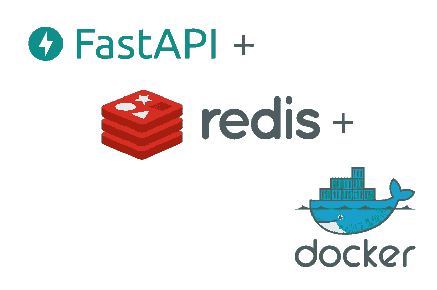

# 用 Keras、FastAPI、Redis 和 Docker 部署机器学习模型

> 原文：<https://medium.com/analytics-vidhya/deploy-machine-learning-models-with-keras-fastapi-redis-and-docker-4940df614ece?source=collection_archive---------0----------------------->



本教程将向您展示如何使用 FastAPI、Redis 和 Docker 快速部署您的机器学习模型。

如果你想快进，伴随代码库的[将在几分钟内为你提供一个图像分类模型。](https://github.com/shanesoh/deploy-ml-fastapi-redis-docker)

# 概观

有很多很棒的“用 Flask 包装你的机器学习模型”教程。然而，当我看到[Adrian rose Brock 的这个令人敬畏的系列帖子时，](https://www.pyimagesearch.com/2018/02/05/deep-learning-production-keras-redis-flask-apache/)我认为他的方法更适合生产，并且非常适合 docker 化。Docker 化这种设置不仅可以让 Docker Compose 更容易地启动和运行，还可以更容易地扩展到生产中。

本教程结束时，您将能够:

1.使用 FastAPI(与 Uvicorn 一起)构建一个 **web 服务器**来服务我们的机器学习端点。

2.构建一个机器学习**模型服务器**，服务于一个 Keras 图像分类模型(在 ImageNet 上训练的 ResNet50)。

3.使用 Redis 作为**消息队列**在 **web 服务器**和**模型服务器**之间传递查询和响应。

4.使用 Docker Compose 将它们全部旋转起来！

# 体系结构

我们将使用前面 Adrian Rosebrock 的文章中的相同架构，但是替换 web 服务器框架(FastAPI+uvicon 代替 Flask + Apache ),更重要的是，将整个设置容器化以便于使用。我们还将使用 Adrian 的大部分代码，因为他在处理、序列化和解决一些小问题方面做得非常出色。


**web 服务器**的主要功能是服务于一个`/predict`端点，其他应用程序将通过它调用我们的机器学习模型。当端点被调用时，web 服务器将请求路由到 Redis，Redis 充当许多并发请求的内存中消息队列。**模型服务器**简单地轮询 Redis 消息队列中的一批图像，对这批图像进行分类，然后将结果返回给 Redis。web 服务器获取结果并返回。

# 代码库

您可以在这里找到本教程中使用的所有代码:

[](https://github.com/shanesoh/deploy-ml-fastapi-redis-docker) [## Shane soh/deploy-ml-fastapi-redis-docker

### 使用 FastAPI、Redis 和…服务于生产就绪和可扩展的基于 Keras 的深度学习模型图像分类

github.com](https://github.com/shanesoh/deploy-ml-fastapi-redis-docker) 

# 构建 web 服务器

我选择使用`tiangolo/uvicorn-gunicorn-fastapi`作为 web 服务器。这个 Docker 映像提供了一个整洁的 ASGI 堆栈(Uvicorn 由 Gunicorn 使用 FastAPI 框架管理),它承诺比更常见的基于 WSGI 的 flask-uwsgi-nginx 有显著的性能改进。

这个决定很大程度上是因为想要尝试 ASGI 堆栈，像 tiangolo 这样的高质量 docker 图像使实验变得更加容易。此外，正如您将在后面的代码中看到的，在 FastAPI 中编写简单的 HTTP 端点与我们在 Flask 中的做法没有太大的不同。

`webserver/Dockerfile`很简单。它获取上述映像，安装必要的 Python 需求，并将代码复制到容器中:

```
FROM tiangolo/uvicorn-gunicorn-fastapi:python3.7

COPY requirements.txt /app/

RUN pip install -r /app/requirements.txt

COPY . /app
```

`webserver/main.py`文件运行 FastAPI 服务器，暴露`/predict`端点，该端点获取上传的图像，将其序列化，将其推送到 Redis 并轮询结果预测。

webserver/main.py

代码大部分保持原样，为 Dockerized 环境做一些内务处理，即分离 web 和模型服务器的助手函数和参数。此外，参数通过环境变量传递到 Docker 容器中(稍后将详细介绍)。

# 构建模型服务器

这个`modelserver/Dockerfile`也相当简单:

```
FROM python:3.7-slim-buster

COPY requirements.txt /app/

RUN pip install -r /app/requirements.txt# Download ResNet50 model and cache in image                       RUN python -c "from keras.applications import ResNet50; ResNet50(weights='imagenet')"COPY . /app

CMD ["python", "/app/main.py"]
```

这里我使用了`python:3.7-slim-buster`图像。`slim`变体将整体图像大小减少了大约 700mb。`alpine`变体无法与 tensorflow 一起使用，所以我选择不使用它。

我还选择在 Docker 文件中下载机器学习模型，这样它将被缓存在 Docker 映像中。否则，将在运行模型服务器时下载模型。除了给复制过程增加几分钟的延迟之外，这并不是一个问题(因为每个启动的工作者需要首先下载模型)。

Dockerfile 再次安装需求，然后运行`main.py`文件。

modelserver/main.py

模型服务器向 Redis 轮询一批图像以进行预测。批量推理对于深度学习模型特别高效，尤其是在 GPU 上运行的时候。可以调整`BATCH_SIZE`参数以提供最低的延迟。

我们还必须使用 redis-py 的`pipeline`(这是一个误称，因为它在 redis-py 中默认是事务性的)来实现多个元素的原子左弹出(参见第 45–48 行)。当我们复制模型服务器时，这对于防止竞争情况变得很重要。

# 用 Docker Compose 把它们放在一起

docker-compose.yml

我们创建了 3 个服务——Redis、模型服务器和 web 服务器——它们都在同一个 Docker 网络上。

“全局”参数在`app.env`文件中，而特定于服务的参数(如`SERVER_SLEEP`和`BATCH_SIZE`)作为环境变量传递给容器。

`deploy`参数仅用于 Docker Swarm(在后面的帖子中会有更多介绍), Docker Compose 会安全地忽略这些参数。

我们可以用`docker-compose up`来旋转一切，它将构建图像并启动各种服务。就是这样！

# 测试端点

现在通过卷曲端点来测试服务:

```
$ curl [http://localhost](http://localhost)
"Hello World!"$ curl -X POST -F img_file=@doge.jpg [http://localhost/predict](http://localhost/predict)
{"success":true,"predictions":[{"label":"dingo","probability":0.6836559772491455},{"label":"Pembroke","probability":0.17909787595272064},{"label":"basenji","probability":0.07694739103317261},{"label":"Eskimo_dog","probability":0.01792934536933899},{"label":"Chihuahua","probability":0.005690475460141897}]}
```

成功！ImageNet 中可能没有“shiba inu”类，所以现在只能用“dingo”了。够近了。


# 用蝗虫进行负载测试

[Locust](https://locust.io) 是一款为负载测试网站设计的负载测试工具。它是为负载测试网站设计的，但也适用于像我们这样的简单 HTTP 端点。

它很容易启动和运行。首先用`pip install locustio`安装它，然后在项目目录下运行启动它:

```
locust --host=http://localhost
```

这使用提供的`locustfile`来测试`/predict`端点。请注意，我们将主机指向`localhost` —我们正在测试我们的机器学习服务的响应时间，没有任何实际的网络延迟。

现在将您的浏览器指向`http://localhost:8089`以访问 locust web ui。


蝗虫网络用户界面

我们将模拟 50 个用户(他们都在开始时被孵化)。


绿色表示平均响应时间；黄色代表 p95

大约 5000 毫秒的 p95 响应时间意味着 95%的请求应该在 5 秒内完成。根据您的使用情况和预期负载，这可能太慢了。

# 结论

在这篇文章中，我们看到了如何使用 Keras、FastAPI 和 Redis 构建 Dockerized 机器学习服务。我们还做了一个负载测试，看看性能可能不够好。

在下面这篇文章中，我将展示如何使用 Docker Swarm 轻松扩展我们的模型服务器以获得更好的性能:

[](/@shane.soh/scaling-machine-learning-models-with-docker-swarm-39a1a875a692) [## 用 Docker Swarm 扩展机器学习模型

### 本教程展示了我们如何使用 Docker Swarm 在多台主机上轻松扩展机器学习服务。

medium.com](/@shane.soh/scaling-machine-learning-models-with-docker-swarm-39a1a875a692)