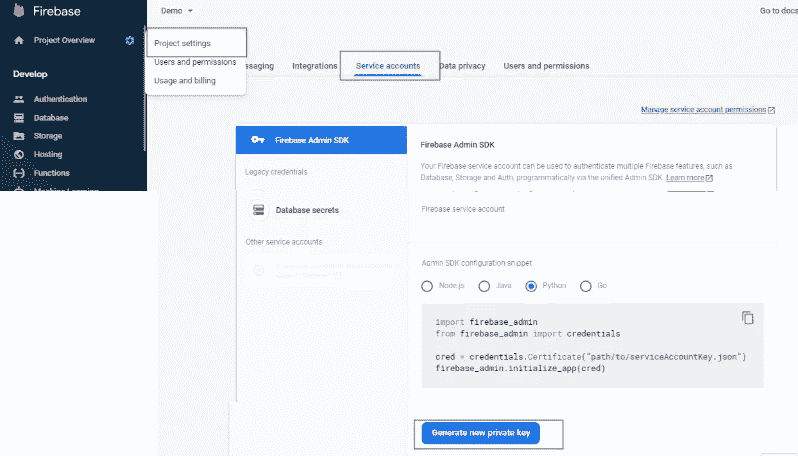
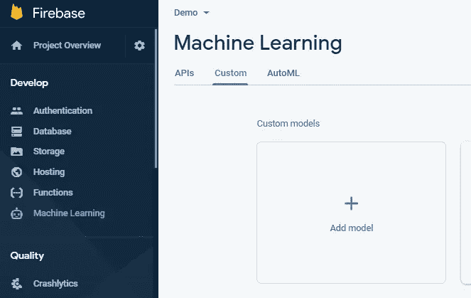
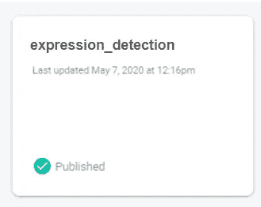

# 轻松部署 ML 模型

> 原文：<https://medium.com/analytics-vidhya/deploy-ml-model-with-ease-60d394ee5e92?source=collection_archive---------7----------------------->

机器学习模型的大小可能很大，将 tflite 模型添加到 android 或 iOS 应用程序中，同时将其打包到 apk 到 ipa 文件中，会增加应用程序的大小，但是随着应用程序大小的增加，安装量可能会下降，因此减少应用程序大小的方法之一是根据需求部署模型并即时下载。

**Firebase 机器学习定制模型** Firebase 机器学习是 Firebase 提供的服务之一，它提供 ML 功能，您可以部署定制训练的 tflite 模型，甚至可以使用 AutoML Vision Edge 训练图像分类模型。
模型可以从 firebase 控制台部署，或者在脚本的情况下通过脚本部署。一旦您训练了您的机器学习模型并将其转换为 tflite，它就会从同一个 python 脚本部署到 firebase 上。

> firebase 的自定义模型支持 tflite 模型，所以你需要在上传到 firebase 之前将 pb 模型转换为 tflite 模型。

**使用 python 脚本部署 tflite 模型** 使用 python 脚本，您可以将以下代码添加到用于训练机器学习模型的同一脚本中，以便当您的模型被训练后，可以直接部署它，但在此之前，不要忘记在 firebase 上创建一个项目。

首先，从 firebase 获取 JSON 文件，它位于 service account 下，这将授予管理员对项目的访问权限。

> 如果没有安装 firebase admin，那么运行下面的命令
> “pip install firebase-admin”来安装它

如果您想要更新模型，也可以通过 python 脚本来实现。firebase 定制模型的优势之一是，一旦新模型可用，FirebaseModelManager 将尝试下载它，这样您就不必手动更新移动应用程序上的模型。

**在 firebase 上看起来怎么样？** 当您打开 firebase 控制台时，左侧菜单会显示一个选项 firebase machine learning，只需单击它就会将您带到 ML 功能屏幕，单击 custom 选项卡，您会看到如下内容

如前所述，您可以从这里通过单击添加模型或使用脚本来部署 tflite 模型，一旦模型部署在 firebase 上，它将显示如下所示的卡片

**如何即时下载模型？** 为了下载模型，我们有 FirebaseModelManager，它负责下载并提供下载的 tflite 模型的路径。

firebase 的定制模型部署是免费使用的，它提供了 firebase 基础架构来部署和交付模型到 android 或 iOS 应用程序，要了解更多信息，请查看以下文档，其中陈述了所需的梯度依赖关系和关于模型安全性的注意事项。
[https://www.youtube.com/watch?v=Ym8hPXIEBEc&t = 2s](https://www.youtube.com/watch?v=Ym8hPXIEBEc&t=2s)

 [## 在 Android | Firebase 上使用自定义 TensorFlow Lite 模型

### 如果您的应用程序使用自定义 TensorFlow Lite 模型，您可以使用 Firebase ML 来部署您的模型。通过部署模型与…

firebase.google.com](https://firebase.google.com/docs/ml/android/use-custom-models)