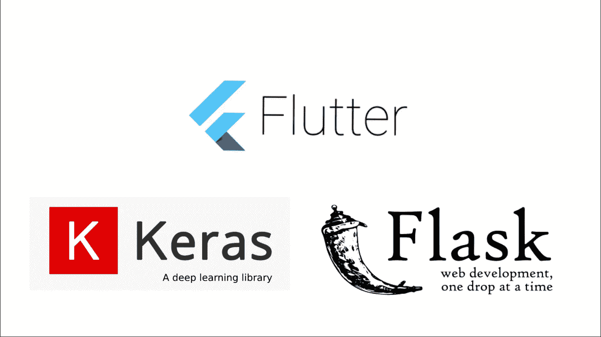
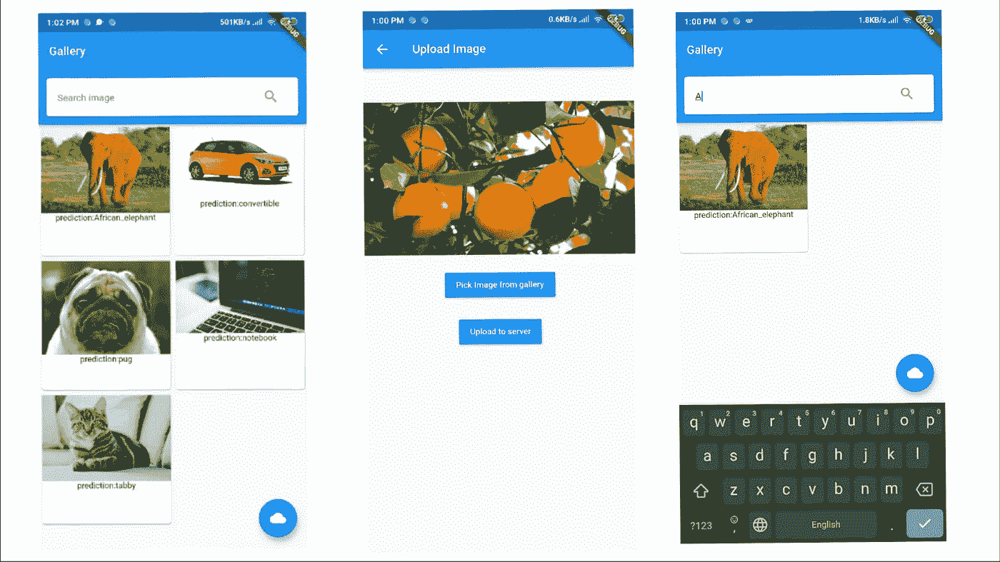

# 使用 Flask 作为 REST API 部署 ML 模型，并通过 Flutter 应用程序访问

> 原文：<https://medium.com/analytics-vidhya/deploy-ml-models-using-flask-as-rest-api-and-access-via-flutter-app-7ce63d5c1f3b?source=collection_archive---------0----------------------->

## Flask 的简单，Flutter 的精彩，以及 Keras 的图像分类模型



## 介绍

最近，机器学习已经成为一种很酷的技术，几乎市场上所有的软件产品都以这样或那样的方式使用 ML。让我们看看如何建立一个应用程序，可以上传图像到服务器，并对它进行预测(图像分类)。这些图片可以通过应用程序访问，你可以简单地通过内容搜索图片。

我们将使用 **Flask (Python 框架)**作为我们 REST API 的后端， **Flutter** 用于手机 app， **Keras** 用于图像分类。我们还将使用 **MongoDB** 作为我们的数据库来存储关于图像的数据，并使用 Keras **ResNet50 model** 对图像进行分类，使用预训练模型似乎有助于实现这一目的。如果需要，我们可以通过保存 Keras 中可用的 save_model()和 load_model()方法来使用自定义模型。Keras 第一次下载模型大约需要 100 mb。要了解更多可用型号，请参考[文档](https://keras.io/applications/)

## 让我们从烧瓶开始

在 Flask 中定义路由非常简单，使用 decorator @app.route('/')，其中@app 是包含 Flask 应用程序的对象的名称。让我们看一个例子

```
from flask import Flask 
app = Flask(__name__)@app.route(’/’) 
def hello_world():
    return ‘Hello, World!’
```

从 flask 导入 Flask，并为 app 提供一个名称，这里的“app”是包含我们的 app 的对象的名称。接下来，我们将使用装饰器来定义 route，以便每当请求到达该路由时(例如:http://127.0.0.1:5000/)，flask 将自动返回

> *你好世界！*

作为回应。是的，就是这么简单！

如果你想了解更多关于 Flask 的信息，请查阅文档[。现在看看我们的后端代码:](https://flask.palletsprojects.com/en/1.1.x/)

```
import os
import tensorflow as tf
from tensorflow.keras.models import load_model
from tensorflow.keras.preprocessing import image as img
from keras.preprocessing.image import img_to_array
import numpy as np
from PIL import Image
from keras.applications.resnet50 import  ResNet50,decode_predictions,preprocess_input
from datetime import datetime
import io
from flask import Flask,Blueprint,request,render_template,jsonify
from modules.dataBase import collection as db
```

我们有一些包含 tensorflow 的 import 语句，因为我们使用 tensorflow 作为 keras 的后端，使用 numpy 处理多维数组。

```
mod=Blueprint(‘backend’,__name__,template_folder=’templates’,static_folder=’./static’)
UPLOAD_URL = ‘http://192.168.1.103:5000/static/'
model = ResNet50(weights=’imagenet’)
model._make_predict_function()
```

因为这个例子使用了 [Flask-blueprints](https://flask.palletsprojects.com/en/1.0.x/blueprints/) (将文件组织成模块的方式)，所以第一行将它作为一个对象。

有一点需要注意的是，现在我们所有的路由装饰器都会使用 **@mod.route('/')** 来定义路由。我们的模型将在 imagenet 数据集上进行 Resnet50 训练，并在其上调用 _make_predict_function()。如果不使用此方法，您可能会出错。如果你有自定义模型，你可以用同样的方式改变它

*model = resnet 50(weights = ' imagenet ')*

到

*model = load _ model(" saved _ model . H5 ")*

```
@mod.route(‘/predict’ ,methods=[‘POST’])
def predict():
if request.method == ‘POST’:
*# check if the post request has the file part* if ‘file’ not in request.files:
    return “No file found”user_file = request.files[‘file’]
temp = request.files[‘file’]
if user_file.filename == ‘’:
    return “file name not found …”else:
path=os.path.join(os.getcwd()+’\\modules\\static\\’+user_file.filename)
user_file.save(path)classes = identifyImage(path)#save image details to databasedb.addNewImage(
user_file.filename,
classes[0][0][1],
str(classes[0][0][2]),
datetime.now(),
UPLOAD_URL+user_file.filename)
return jsonify({
“status”:”success”,
“prediction”:classes[0][0][1],
“confidence”:str(classes[0][0][2]),
“upload_time”:datetime.now()
})
```

上述路径接受 POST 请求并检查文件，然后图像被传递给 *identifyImage(file_path)* 方法，如下所示:

```
def identifyImage(img_path):
    image = img.load_img(img_path,target_size=(224,224))
    x = img_to_array(image)
    x = np.expand_dims(x, axis=0)
    x = preprocess_input(x)
    preds = model.predict(x)
    preds = decode_predictions(preds,top=1)
    print(preds)
    return preds
```

此方法接受文件路径作为参数。然后，图像被转换为 224*224 大小，因为我们的模型需要图像的精确形状。然后，我们将预处理图像，并将其传递给 model.predict()函数。现在，我们的模型将进行预测，解码后的预测将返回元组的 2D 数组(top=1 仅返回 1 个具有最高置信度的预测)。

然后，我们将把图像细节保存到我们的 MongoDB 数据库中，db.addData()将负责这项工作。数据库代码如下所示:

```
from pymongo import MongoClient
from bson import ObjectId
client = MongoClient(“mongodb://localhost:27017”) *#host uri* db = client.image_predition *#Select the database*image_details = db.imageData
def addNewImage(i_name,prediction,conf,time,url):
    image_details.insert({
    “file_name”:i_name,
    “prediction”:prediction,
    “confidence”:conf,
    “upload_time”:time,
    “url”:url
    })def getAllImages():
    data = image_details.find()
    return data
```

由于此示例使用 blueprint，我们可以将 API 代码编写在一个单独的文件中，如下所示:

```
from flask import Flask,render_template,jsonify,Blueprint
mod = Blueprint(‘api’,__name__,template_folder=’templates’)
from modules.dataBase import collection as db
from bson.json_util import dumps@mod.route(‘/’)
def api():
    return dumps(db.getAllImages())
```

我们有几个导入语句“dumps”帮助我们将 py mongo(MongoDB 的 python api)对象转换成 json 值。

获取我们上传的所有图片。我们的 API 可以通过端点访问

```
[http://127.0.0.1:5000/](http://127.0.0.1:5000/)api  # address may vary depending upon the host provided in app.run()
```

这里只解释代码的重要部分。要知道文件是如何排列的，请查看 [GitHub 库](https://github.com/SHARONZACHARIA/Deploy-ML-model)。要了解更多关于 Pymongo 的信息，请点击查看[。](https://api.mongodb.com/python/current)

## 颤振应用

该应用程序将使用 REST API 来获取图像并显示它，我们也可以通过内容搜索图像。我们的应用程序看起来会像这样



将作为我们的模型类的 ImageData 类

```
import ‘dart:convert’;
import ‘package:http/http.dart’ as http;
import ‘dart:async’;
class ImageData
{String uri;
String prediction;
ImageData(*this*.uri,*this*.prediction);
}Future<List<ImageData>> LoadImages() async
{
var data = await http.get(
‘http://192.168.1.103:5000/api/'); #localhost api path
var jsondata = json.decode(data.body);
List<ImageData>list = [];
for (var data in jsondata) {
ImageData n = ImageData(data[‘url’],data[‘prediction’]);
list.add(n);
}returnlist;}
```

在这里，我们获取 json 数据，并将其转换为 ImageData 的对象列表，然后在 LoadImages()函数的帮助下返回到 Future Builder。

## 将图像上传到服务器

```
uploadImageToServer(File imageFile)async{print(“attempting to connect to server……”);var stream = new http.ByteStream(DelegatingStream.typed(imageFile.openRead()));var length = await imageFile.length();print(length);var uri = Uri.parse(‘http://192.168.1.103:5000/predict');print(“connection established.”);var request = new http.MultipartRequest(“POST”, uri);var multipartFile = new http.MultipartFile(‘file’, stream, length,filename: basename(imageFile.path));*//contentType: new MediaType(‘image’, ‘png’));*request.files.add(multipartFile);var response = await request.send();print(response.statusCode);}
```

为了使我们的 Flask 应用程序在本地网络上可用，请确保该应用程序不处于调试模式，方法是将其更改为 False，并使用 *ipconfig* 命令从命令行找到 ipv4 地址。这里的地址是“192.168.1.103”

```
app.run(debug=False,host=’192.168.1.103',port=5000)
```

防火墙可能会阻止应用程序访问本地主机，因此请确保防火墙已关闭。

关于 Flutter app 的完整代码参考可以在 [GitHub 库](https://github.com/SHARONZACHARIA/Deploy-ML-model)中找到。以下是一些其他有用的链接

https://keras.io/

扑:[https://flutter.dev/](https://flutter.dev/)

https://www.tutorialspoint.com/mongodb/

哈佛大学关于 Python 和 flask 的 CS50 课程:[https://www.youtube.com/watch?v=j5wysXqaIV8&t = 5515s](https://www.youtube.com/watch?v=j5wysXqaIV8&t=5515s)(观看讲座 2、3、4)

GitHub:[https://github.com/SHARONZACHARIA](https://github.com/SHARONZACHARIA/Deploy-ML-model)