# 使用 Flask 部署 ML tensorflow 模型(后端+前端)

> 原文：<https://medium.com/analytics-vidhya/deploy-ml-tensorflow-model-using-flask-backend-frontend-12a38ce53b7f?source=collection_archive---------3----------------------->

使用 flask 连接张量流模型或任何 python 项目，而不使用任何 API 调用。添加任何 ML 原型和展示您的项目。使用 heroku 部署。

## 动机:

因为，许多**学生**想要部署他们的**大学项目**，例如最后一年的项目，但是他们对不同的技术不太熟悉。他们的主要动机是生产而不是部署，所以大多数学生给**最少的部署时间**。

> **注意:这不是部署的实际解决方案，而是展示您的工作原型的简单方法。**

假设你创建了一个**机器学习项目**，但是你必须用**漂亮的 GUI** 向**你的向导**展示最终的工作模型，它应该看起来像最终产品。

但是，相反，我们运行代码，并试图解释发生了什么，你的向导可能不喜欢。因此，为了让它工作，我创建了这个教程来处理机器学习模型**而不使用任何 API 调用**和其他复杂的东西。

您可以用类似的方式部署任何 python 项目，而不是使用 tkinter 或任何其他框架。

> 这种方法有一些缺点:
> 
> 没有 api 调用，因此进程不会异步运行。程序可能需要一些时间来完成进程，因为它的执行是同步进行的。

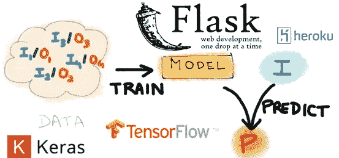

# 目录:

> 1.创建 Flask web 应用程序
> 
> 2.下载并检查模型文件或使用您自己的文件
> 
> 3.创建表单以从 flask web 应用程序获取输入
> 
> 4.将图像传递给模型
> 
> 5.预测结果
> 
> 6.部署
> 
> 7.维持

*每一步都提供了所有中间代码的链接。*

# 1.创建 Flask web 应用程序

完成下面给定的教程或直接从教程中克隆 git 库。

 [## 使用 pycharm 在任何地方创建 Flask web 应用程序

### Flask 网络应用程序创建与系统的 flask 文件结构，即用型模板和使用它在任何地方为任何…

medium.com](/@hasan123.haider/create-anywhere-use-flask-web-app-with-pycharm-fa67719df4d7) 

你将得到一个现成的文件结构，它将被使用。在上面的教程中，我们将项目文件夹命名为‘flask _ H5’。

# 2.下载并检查模型文件或使用您自己的模型文件

让我们为我们的项目找出一些预先训练好的模型文件。您可以带着您想要使用的模型文件和代码。

我们正在从 **imageAI** 中获取预训练图像**预测模型文件**

 [## 预测类别— ImageAI 2.1.5 文档

### ImageAI 提供了非常强大但易于使用的类来执行图像识别任务。您可以执行所有这些…

imageai.readthedocs.io](https://imageai.readthedocs.io/en/latest/prediction/index.html) 

我下载了我们项目的第一个 h5 模型文件。阅读 imageAI 文档以了解更多信息。

**resnet 50 _ weights _ TF _ dim _ ordering _ TF _ kernels . H5 车型链接**:

> [https://github . com/OlafenwaMoses/ImageAI/releases/download/1.0/resnet 50 _ weights _ TF _ dim _ ordering _ TF _ kernels . H5](https://github.com/OlafenwaMoses/ImageAI/releases/download/1.0/resnet50_weights_tf_dim_ordering_tf_kernels.h5)

是时候让**测试我们的模型**了。为此，我们将在“app”文件夹中创建一个新的***python 文件*** ，我们希望在将来使用我们的模型。

> 您可以在任何地方创建它，因为我们正在测试我们的模型，然后在测试后将其添加到**应用程序文件夹**中。

我把它命名为**‘process . py’**。

在文档页的末尾([https://imageai . readthe docs . io/en/latest/prediction/index . html](https://imageai.readthedocs.io/en/latest/prediction/index.html))**提供了预测一幅图像的示例代码**。

我们将整个代码粘贴到我们的 ***流程*** 文件中。

这里我们只写**所需库、加载模型、预测、返回结果等预测代码**(不需要从头到尾粘贴整个笔记本内容)。

> 使用 IDE 的好处是我们不需要找出我们的错误和依赖。

首先，我们需要 tensorflow 来运行我们的模型文件，因此我们将使用 pip 安装 tensorflow 库。我们采用 **tensorflow v1** 是因为我们的 imageAI 模型与 v1 兼容。

您也可以通过 **PyCharm 设置**来完成

转到文件→设置→项目→项目解释器

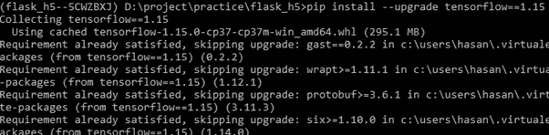

pip 安装张量流==1.15

您将看到虚拟环境中安装的所有模块。点击右上角的+图标。搜索 tensorflow。勾选指定版本并**选择版本 1.15。**

点击**安装包。**

如果您得到错误或无法安装它从设置。

尝试以下命令:

> **pip 安装张量流==1.15**

## 使用 process.py

如果您使用自己的模型和代码，请跳过这一部分。

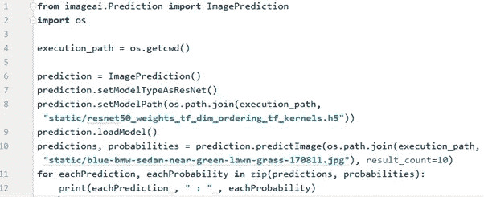

process.py

您将在**行 1** 看到一个错误，即导入库。

这里点击灯泡按钮，安装 imageAI 库。您也可以通过在虚拟环境中编写 pip 命令来手动完成。

> **pip 安装图像 ai**

安装软件包可能需要一些时间。

在此之前，让我们找出代码中的内容。

**在开始**时，所有的依赖项都被导入。

**第 4 行**获取当前文件位置，我们将在稍后连接 flask 时删除该位置。

**第 6 到 9 行**定义并加载我们的模型文件。这里我们可以看到使用了 resnet 模型，我**在文件'**static/**resnet 50 _ weights _ TF _ dim _ ordering _ TF _ kernels . H5 前添加了静态文件夹位置**

将模型文件复制并粘贴到 **app/static** 文件夹中。

下载任何输入图像并**放入 app/static** 文件夹。

编辑**第 10 行**并将图像位置更改为我们下载的图像

> 预测，概率= prediction . prediction image(OS . path . join(execution _ path，**" static/input _ image _ name . jpg "**)，result_count=10)

到目前为止，我们的包 imageAI 已经安装好了。模型文件、输入图像也放在静态文件夹中。

现在**运行并测试 process.py** 文件。

*如果你有任何错误，请尝试解决，否则请在评论区提问。*

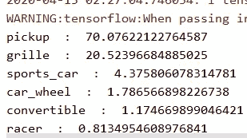

试验结果

> 注意:如果您没有 GPU，则无需担心 tensorflow 警告。

我们可以看到预测是成功的。

# 3.创建表单以从 Flask web 应用程序获取输入

现在，我们将尝试制作一个页面，并从用户那里获取图像，然后将其保存为临时文件，这些文件将在使用后被删除。

## a.在模板文件夹中创建一个名为 predict.html 的 html 文件

**Predict.html:**

这里，我们将照常扩展布局文件，并开始实际的块。

在这里面，我们添加了一个表单域，它将接受图像输入。

 [## Hasan-Haider/Deploy-ML-tensor flow-model-using-Flask

### 使用 flask 连接 tensorflow 模型，不使用任何 API 调用。添加任何 ML 原型和展示您的项目。…

github.com](https://github.com/hasan-haider/Deploy-ML-tensorflow-model-using-Flask/blob/8727f2402d2fe8c2a5a8d0e3f588ec0334a8bcc4/app/templates/predict.html#L5) 

## b.为预测页面添加路由功能

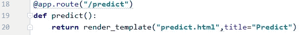

routes.py

这是连接我们的 html 文件和 flask。

## c.修改 layout.html 并在导航栏中添加预测链接

[点击此处查看代码](https://github.com/hasan-haider/Deploy-ML-tensorflow-model-using-Flask/blob/8727f2402d2fe8c2a5a8d0e3f588ec0334a8bcc4/app/templates/layout.html#L26)

导航条

通过在虚拟环境中键入命令来运行 flask 应用程序。终端:

> **python app.py**

## d.创建名为“上传”的新路由函数，该函数将由表单操作调用，它会将输入图像保存在临时文件夹中。

添加获取表单输入请求的方法。在 app 文件夹中新建**文件夹**，命名为 ***temp*** 。

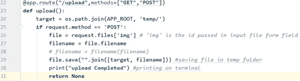

routes.py 中的上传功能

该功能将图像文件保存在临时文件夹中，并将用于发送预测。

继续运行应用程序以查看中间结果。

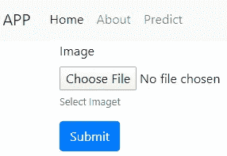

127 . 0 . 0 . 1/预测

我们将选择图像并检查文件是否保存在临时文件夹中。

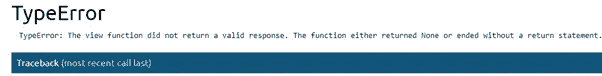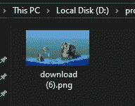

临时文件夹

**我得到错误**(因为，调用后上传函数没有返回任何内容)，但我的文件保存在临时文件夹中，这意味着**表单工作正常**。

# 4.将输入图像传递给模型

创建**新的路由函数‘预测(文件名)’**，以文件名作为其参数。

保存图像后，我们的上传函数将调用该函数。

 [## Hasan-Haider/Deploy-ML-tensor flow-model-using-Flask

### 使用 flask 连接 tensorflow 模型，不使用任何 API 调用。添加任何 ML 原型和展示您的项目。…

github.com](https://github.com/hasan-haider/Deploy-ML-tensorflow-model-using-Flask/blob/8727f2402d2fe8c2a5a8d0e3f588ec0334a8bcc4/app/routes.py#L34) 

**在路线中导入 process.py** 而不是添加整个型号代码。

我修改了 process.py，使它只包含**一个从 route 调用的函数**。

[**点击此处打开 process.py**](https://github.com/hasan-haider/Deploy-ML-tensorflow-model-using-Flask/blob/master/app/process.py) 的 git 链接

process.py 中的 ***predict_img*** 函数将**返回**字典结果，即您的模型的输出。

## 创建将显示结果的新 html 文件。

我创建了 output.html，它通过结果变量在路由中传递。

[**output.html 代码**](https://github.com/hasan-haider/Deploy-ML-tensorflow-model-using-Flask/blob/master/app/templates/output.html)

我们的应用程序已经可以使用了。

让我们试一试

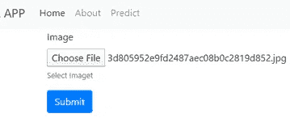

1

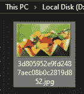

2

1.选择图像

2.图像已上传

3.终端的最后一行显示上传工作正常，图像被传递给预测函数。如果有 tf 信息/警告，请忽略。

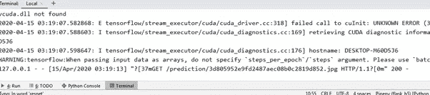

3

> **对于 CPU 用户:要隐藏张量流警告，请在 process.py 中添加代码**
> 
> ***开始时:***
> 
> 导入张量流
> 
> OS . environ[**" TF _ CPP _ MIN _ LOG _ LEVEL "**]=**" 3 "**
> 
> ***在* predict_img *函数中，模型将被加载到:***
> 
> tensor flow . compat . v1 . logging . set _ verbosity(tensor flow . compat . v1 . logging . error)

# 5.预测结果

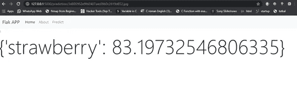

## 总结我们到目前为止所做的工作:

从表单中获取输入，并将其传递给 route 函数。

将表单数据重定向到预测路由函数。

预测路由函数调用存在于另一个文件中实际模型函数。

结果返回给预测路径函数，并作为变量通过 render_template 传递给用户。

# 6.与 heroku 一起部署

在 heroku 的帮助下，可以展开测试**自由**的烧瓶。

Heroku 免费给 **500 Mb 空间**来部署我们的网站。只需从网站下载 heroku 即可部署。关于配置 flask 文件，你可以找到很多关于如何在 heroku 上部署的文章。

 [## 使用 Python 开始使用 Heroku

### 本教程将让你在几分钟内部署一个 Python 应用程序(一个简单的 Django 应用程序)。再坚持几分钟…

devcenter.heroku.com](https://devcenter.heroku.com/articles/getting-started-with-python) 

为了让您大致了解在 heroku 中部署需要做些什么，您将创建一个名为**‘proc file’**的文件，不带任何扩展名。

ProcFile 内部:

> **web: gunicorn 应用:应用**

您将需要 **requirements.txt** 文件，您可以在 flask 虚拟环境中键入命令自动创建该文件:

> **pip 冻结>需求. txt**

您必须**将** app.py 重命名为 application.py。同样在 init 和其他文件中，您必须将 **app** =Flask… **更改为 application** =Flask…

**在使用 app 变量的地方使用“应用程序”来折射 app 变量。**

在主“flask_h5”文件夹中创建名为 **'config.py'** 的文件。它将包含密钥。

**配置文件:**

> 导入操作系统
> 
> 类别配置:
> 
> SECRET _ KEY = OS . environ . get(' SECRET _ KEY ')

删除 __init__.py 中添加的密钥，包含密钥的 config.py 将在 init 中被调用。

**__init__。py:**

> 从配置导入配置
> 
> …
> 
> 应用程序=烧瓶(__name__)
> 
> **应用程序.配置.来自 _ 对象(配置)**
> 
> …

这些是在 heroku 上部署 flask 的要求。

前往 heroku 网站，验证所有修改是否符合他们的要求。

# 6.维持

如果您想更改或修改已部署的 heroku 平台中的代码。

使用 git 提交更新文件，然后使用***‘git push heroku master’***命令在 heroku 中再次部署。

如果您发现任何步骤有困难，请发表评论。

 [## Hasan-Haider/Deploy-ML-tensor flow-model-using-Flask

### 使用 flask 连接 tensorflow 模型，不使用任何 API 调用。添加任何 ML 原型和展示您的项目…

github.com](https://github.com/hasan-haider/Deploy-ML-tensorflow-model-using-Flask) 

觉得这个有用就鼓掌。