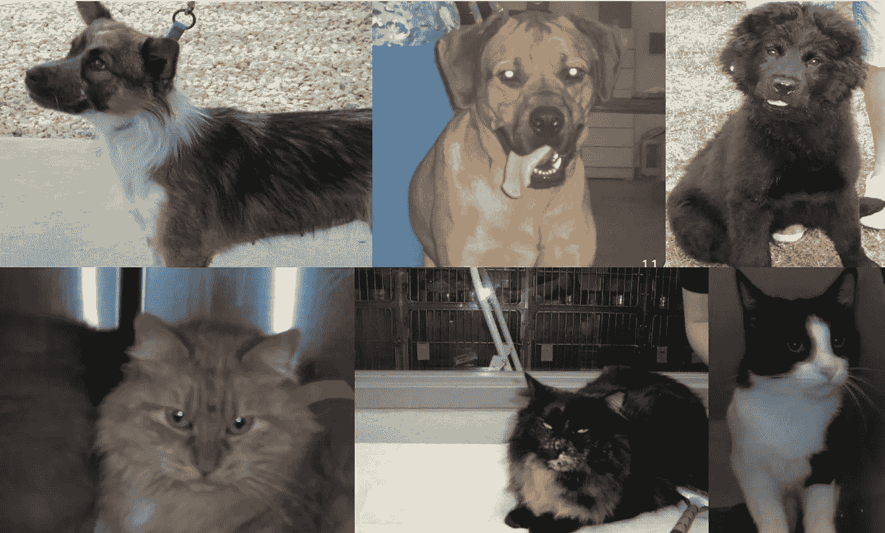
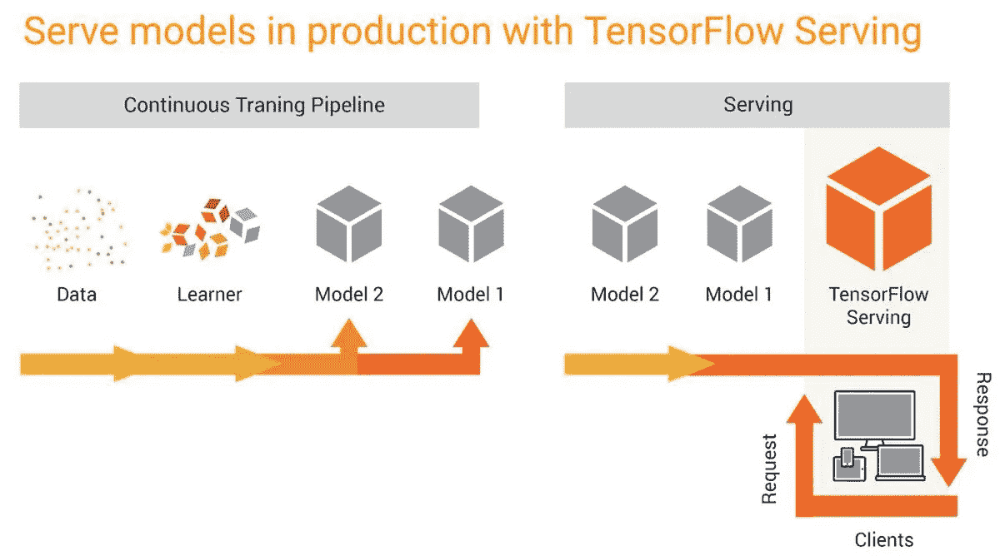

# 使用 TensorFlow 服务和 Docker 部署生产就绪的 Keras 模型

> 原文：<https://medium.com/analytics-vidhya/deploy-production-ready-keras-model-with-tensorflow-serving-and-docker-85615245a9ed?source=collection_archive---------3----------------------->

*从模型原型到生产就绪服务*


# 介绍

作为一名数据科学家，有几次我被要求训练一个模型，其最终用途将是自动化某些任务，或者实时做出决策。在这种情况下，人们对模型背后的数学或准备数据集来训练模型的统计技术不感兴趣。他们希望我们为他们提供一个 URL 端点，在那里他们可以发布一个带有特定值的请求，并从模型中获得结果。

在本文中，我们将首先训练一个 Keras 模型，然后用 TensorFlow Serving 和 Docker 部署它。

对于这个例子，我们将使用 Kaggle 的[数据集](https://www.kaggle.com/c/dogs-vs-cats/data)来训练经典的*狗 vs 猫*分类器。



Kaggle 数据集上的图像示例

# Keras 模型

那么，什么是 [Keras](https://keras.io/) ？

> Keras 是一种高级神经网络 API，用 Python 编写，能够在 TensorFlow、CNTK 或 Theano 之上运行。它的开发重点是支持快速实验。能够以尽可能少的延迟从想法到结果是做好研究的关键。

Keras 让我们能够通过使用它们的 API，以简单而优雅的方式训练深度学习模型。在本文中，我们将使用 TensorFlow 2.x 框架中的 Keras 模块。这是我们将使用的模块和库:

```
from tensorflow.keras.preprocessing.image import ImageDataGenerator, array_to_img, img_to_array, load_img
from tensorflow.keras.models import Sequential, load_model
from tensorflow.keras.layers import Flatten, Dense, Dropout
from tensorflow.keras import optimizers
from tensorflow.keras import backend as K
from tensorflow.keras.applications.vgg16 import VGG16, preprocess_input
import requests
import numpy as np
```

首先下载 Kaggle 数据集，然后创建*训练*、*验证*和*测试*图像集，并参考保存图像的路径。

```
img_height = 256
img_width = 256
channels = 3
batch_size = 8
epochs = 20# Image Data Generators
train_datagen = ImageDataGenerator(
       rotation_range=40,
       width_shift_range=0.2,
       height_shift_range=0.2,
       rescale=1./255,
       shear_range=0.2,
       zoom_range=0.2,
       fill_mode='nearest')test_datagen = ImageDataGenerator(rescale=1./255)# Training, Validation and Test datasets
training_set = train_datagen.flow_from_directory(
    './dogscats/training',
     target_size = (img_height, img_width),
     batch_size = batch_size,
     class_mode = 'binary')validation_set = train_datagen.flow_from_directory(
    './dogscats/validation',
     target_size = (img_height, img_width),
     batch_size = batch_size,
     class_mode = 'binary')test_set = train_datagen.flow_from_directory(
    './dogscats/sample',
     target_size = (img_height, img_width),
     batch_size = 1,
     shuffle = False,
     class_mode = 'binary')
```

此命令将创建这三个数据集，当然会将它们分为以下两类:

```
{'cats': 0, 'dogs': 1}
```

让我们继续训练一个简单的 VGG16，它有一些*密集连接的层*和一个具有 *sigmoid 激活*功能的输出神经元。因此，该模型将返回我们属于*狗*类的概率。

我们将使用带有 *imagenet* 数据集的预训练 VGG16，并且仅重新训练最后 5 层，当然还有我们的*密集连接模型*:

```
# VGG16 Model
model = VGG16(weights = "imagenet", 
              include_top=False, 
              input_shape = (img_width, img_height, channels))for layer in model.layers[:-5]:
    layer.trainable = Falsetop_model = Sequential()
top_model.add(model)
top_model.add(Flatten())
top_model.add(Dense(256, activation='relu'))
top_model.add(Dropout(0.5))
top_model.add(Dense(1, activation='sigmoid'))# Compile the model
top_model.compile(loss='binary_crossentropy',
                  optimizer=optimizers.RMSprop(lr=1e-4, decay=1e-6),
                  metrics=['accuracy'])# Fit the model
history = top_model.fit_generator(
          training_set,
          steps_per_epoch=training_set.n // batch_size,
          epochs=epochs,
          validation_data=validation_set,
          validation_steps=validation_set.n // batch_size)
```

下面是重要的部分，当训练结束时，将模型保存为 *tf* 格式(我也将它保存为 *h5* 格式，这样我们就可以将预测与两个文件进行比较):

```
# Save the model
top_model.save('output/vgg16_cats_vs_dogs.h5', save_format='h5')
top_model.save('output/vgg16_cats_vs_dogs.pb', save_format='tf')
```

这两个命令应该会在*中创建以下文件。/输出*目录:

```
├── vgg16_cats_vs_dogs.h5
├── vgg16_cats_vs_dogs.pb
|         ├── assets
│         ├── saved_model.pb
│         └── variables
│                  ├── variables.data-00000-of-00001
│                  └── variables.index
```

因此，让我们用 *h5* 模型来预测下面一只猫的图像:


来自 Kaggle 数据集的猫图像

使用下面的脚本，我们加载训练好的模型和图像，将图像转换为适当的格式，并通过使用 *predict* 方法将其传递给训练好的模型:

这几行代码返回以下数组:

```
array([[1.5236342e-08]], dtype=float32)
```

如果我们还记得，在之前的模型定义中，我们选择了只有一个输出神经元的模型，因此这个数字是图像属于“1”类(本例中为狗)的概率。因此，属于“猫”类的概率是该数字的补数:0.99999984763658。所以这个模型在这种情况下表现很好。

# 张量流服务

[TensorFlow Serving](https://www.tensorflow.org/tfx/guide/serving) 是一个灵活、高性能的机器学习模型服务系统，专为生产环境而设计。TensorFlow 服务使部署新算法和实验变得容易，支持模型版本化，同时保持相同的服务器架构和 API。TensorFlow 服务提供了与 TensorFlow 模型的现成集成，但可以轻松扩展为服务于其他类型的模型和数据。



张量流服务管道

## 在本地主机上部署我们的 Keras 模型

要启动本地服务器，我们需要在本地机器上安装一个 TensorFlow 服务实例。我们将使用 Docker，而不是下载并安装所有必需的库

我们将生成以下 Dockerfile 文件:

这里有一些我们应该定义的参数:

*   DOCKER_PORT:是 DOCKER 公开端点的端口，您将与您的端口匹配，以便您可以在本地机器上运行它。在我的情况下将是 *8080。*
*   BASE_PATH:是模型所在的绝对路径。我的情况是 */app/models。*
*   MODEL_NAME:是您拥有 *saved_model.pb* 和*变量*目录的目录。在我的情况下将是*猫与狗的对决*。

这就是我的*模型*目录看起来的样子(你的应该是同一个)

```
├── models
|      ├── cats_vs_dogs
|                ├── 1
│                   ├── saved_model.pb
│                   └── variables
│                           ├── variables.data-00000-of-00001
│                           └── variables.index
```

值“1”表示模型版本，因此如果迭代模型，可以生成不同的版本，并使用其他数字作为文件夹名称保存在那里，TensorFlow 服务将始终提供最高的版本号。

要启动本地服务器，您必须执行以下命令(在您保存前一个 docker 文件的目录下):

```
docker build -t tf-serving-cats-dogs .
```

一旦构建完成，就执行以下命令:

```
docker run -p 8080:8080 tf-serving-cats-dogs
```

如果您看到以下消息，是因为模型已正确加载，您可以开始向端点发出请求了:

```
[evhttp_server.cc : 238] NET_LOG: Entering the event loop …
```

因此，当这个 Docker 映像运行时，以下端点可用:

```
[http://localhost:8080/v1/models/cats_vs_dogs:predict](http://localhost:8080/v1/models/cats_vs_dogs:predict)
```

因此，让我们使用之前的 cat 图像向该端点发出 POST 请求(与我们使用 *h5* Keras 模型预测的相同):

端点的响应如下:

```
{'predictions': [[1.5236342e-08]]}
```

我们可以看到, *h5* 模型对象返回的概率完全相同。

## 在 TensorFlow 服务上服务多个模型

在同一个服务上服务多个模型是非常简单的。首先，您应该编写下面的配置文件，其中指出了每个模型的名称和基本路径。

Dockerfile 也非常相似，但是现在我们没有定义*模型名称*和*模型基础路径*参数，而是应该只指出*模型配置文件*参数:

因此，在构建并运行映像之后，我们将有以下两个可用的端点:

```
[http://localhost:8080/v1/models/cats_vs_dogs:predict](http://localhost:8080/v1/models/cats_vs_dogs:predict)
[http://localhost:8080/v1/models/model_2:predict](http://localhost:8080/v1/models/cats_vs_dogs:predict)
```

# 结论

在这篇文章中，我们展示了从使用 Keras API 的深度学习模型原型到生产就绪服务的速度。我们看到了通过使用 Docker 公开一个包含模型的端点来设置 TensorFlow 服务是多么简单。